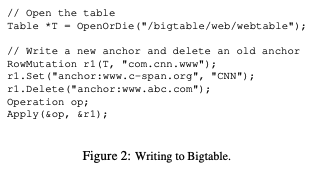
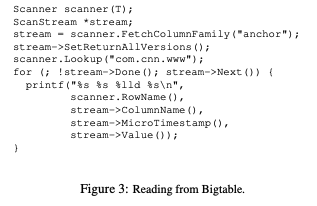
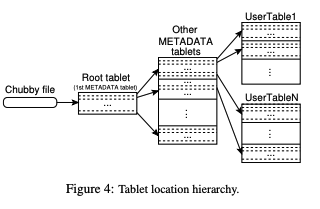
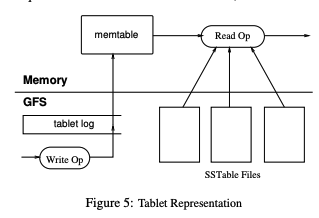
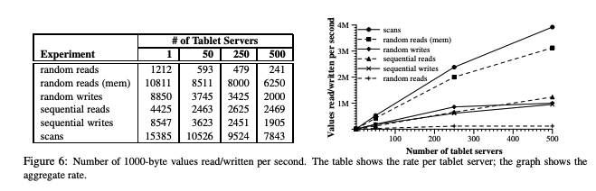
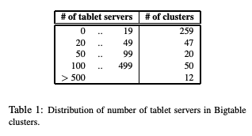
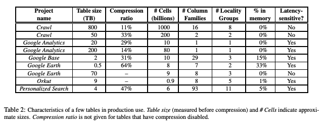

# Bigtable: A Distributed Storage System for Structured Data

> Fay Chang, Jeffrey Dean, Sanjay Ghemawat, Wilson C. Hsieh, Deborah A. Wallach
> Mike Burrows, Tushar Chandra, Andrew Fikes, Robert E. Gruber Google, Inc. 2006

## 目录

- [Abstract](#abstract)
- [1 Introduction](#1-introduction)
- [2 Data Model](#2-data-model)
  - [Rows](#rows)
  - [Column Families](#column-families)
  - [Timestamps](#timestamps)
- [3 API](#3-api)
- [4 Building Blocks](#4-building-blocks)
- [5 Implementation](#5-implementation)
  - [5.1 Tablet Location](#51-tablet-location)
  - [5.2 Tablet Assignment](#52-tablet-assignment)
  - [5.3 Tablet Serving](#53-tablet-serving)
  - [5.4 Compactions](#54-compactions)
- [6 Refinements](#6-refinements)
  - [Locality groups](#locality-groups)
  - [Compression](#compression)
  - [Caching for read performance](#caching-for-read-performance)
  - [Bloom filters](#bloom-filters)
  - [Commit-log implementation](#commit-log-implementation)
  - [Speeding up tablet recovery](#speeding-up-tablet-recovery)
  - [Exploiting immutability](#exploiting-immutability)
- [7 Performance Evaluation](#7-performance-evaluation)
  - [Single tablet-server performance](#single-tablet-server-performance)
  - [Scaling](#scaling)
- [8 Real Applications](#8-real-applications)
  - [8.1 Google Analytics](#81-google-analytics)
  - [8.2 Google Earth](#82-google-earth)
  - [8.3 Personalized Search](#83-personalized-search)
- [9 Lessons](#9-lessons)
- [10 Related Work](#10-related-work)
- [11 Conclusions](#11-conclusions)
- [Acknowledgements](#acknowledgements)

## Abstract

Bigtable 是一个用于管理结构化数据的分布式存储系统，其设计目标是能够扩展到极大规模：在数千台通用服务器上管理 PB 级别的数据。Google 内部的许多项目都将数据存储在 Bigtable 中，包括 Web 索引、Google Earth 以及 Google Finance。这些应用在数据规模（从 URL 到网页再到卫星影像）和时延需求（从后台批量处理到实时数据服务）方面，对 Bigtable 提出了截然不同的要求。尽管需求多样，Bigtable 仍然成功地为这些 Google 产品提供了一个灵活且高性能的解决方案。本文中，我们描述了 Bigtable 所提供的简单数据模型，该模型使客户端能够对数据布局和格式进行动态控制，并介绍了 Bigtable 的设计与实现。

## 1 Introduction

在过去的两年半时间里，我们在 Google 设计、实现并部署了一种用于管理结构化数据的分布式存储系统，称为 Bigtable。Bigtable 的设计目标是能够可靠地扩展到 PB 级别的数据规模以及数千台机器。Bigtable 已经实现了多个目标：广泛的适用性、可扩展性、高性能以及高可用性。Bigtable 被 Google 内部六十多个产品和项目所使用，包括 Google Analytics、Google Finance、Orkut、个性化搜索、Writely 以及 Google Earth。这些产品使用 Bigtable 来支撑多种高要求的工作负载，其范围从以吞吐量为导向的批处理作业，到对时延高度敏感的终端用户数据服务。这些产品所使用的 Bigtable 集群覆盖了非常广泛的配置规模，从少量服务器到数千台服务器不等，所存储的数据量最高可达数百 TB。

在许多方面，Bigtable 与数据库系统相似：它与数据库共享了许多实现策略。并行数据库和内存数据库已经实现了良好的可扩展性和高性能，但 Bigtable 提供的接口与这些系统不同。Bigtable 并不支持完整的关系型数据模型；相反，它为客户端提供了一种简单的数据模型，该模型支持对数据布局和格式的动态控制，并允许客户端理解底层存储中数据的局部性特征。数据通过行名和列名进行索引，这些名称可以是任意字符串。Bigtable 还将数据视为未解释的字符串，尽管客户端通常会将各种结构化或半结构化数据序列化后存储在这些字符串中。客户端可以通过在模式设计上的精心选择来控制数据的局部性。最后，Bigtable 的模式参数还允许客户端动态地控制数据是从内存中提供，还是从磁盘中提供。

第 2 节将更详细地描述数据模型，第 3 节概述客户端 API。第 4 节简要介绍 Bigtable 所依赖的底层 Google 基础设施。第 5 节描述 Bigtable 实现的基本原理，第 6 节介绍我们为提升 Bigtable 性能所做的一些改进。第 7 节给出了 Bigtable 性能的测量结果。第 8 节描述了 Bigtable 在 Google 内部的若干使用示例，第 9 节讨论了我们在设计和支持 Bigtable 过程中获得的一些经验。最后，第 10 节介绍相关工作，第 11 节给出本文的结论。

## 2 Data Model

Bigtable 是一种稀疏的、分布式的、持久化的多维有序映射。该映射通过行键、列键以及时间戳进行索引；映射中的每个值都是一个未解释的字节数组。

```
(row:string, column:string, time:int64) → string
```

我们在考察了 Bigtable 类系统的多种潜在用途之后，确定了这种数据模型。作为一个具体的示例来说明促成部分设计决策的背景，假设我们希望保存一个大型网页集合及其相关信息的副本，以供多个不同项目使用；我们将这个特定的表称为 Webtable。在 Webtable 中，我们使用 URL 作为行键，使用网页的不同属性作为列名，并在 contents: 列下按照网页被抓取时的时间戳存储网页内容，如 Figure 1 所示。

<div align=center></div>

> Figure 1：一个用于存储网页的示例表的一个切片。行名是反转后的 URL。contents 列族包含页面内容，anchor 列族包含引用该页面的所有锚文本。CNN 的主页同时被 Sports Illustrated 和 MY-look 的主页所引用，因此该行包含名为 anchor:cnnsi.com 和 anchor:my.look.ca 的列。每个 anchor 单元只有一个版本；contents 列包含三个版本，其时间戳分别为 $t_3$ $t_5$ 和 $t_6$。

### Rows

表中的行键是任意字符串（目前最大可达 64KB，不过对大多数用户而言，典型大小为 10–100 字节）。对同一行键下的数据进行的每一次读或写操作都是原子的（无论该行中被读写的列数量多少），这一设计决策使得客户端在面对对同一行的并发更新时，更容易推理系统的行为。

Bigtable 按照行键的字典序来维护数据。一个表的行范围会被动态地划分。每一个行范围称为一个 tablet，它是数据分布和负载均衡的基本单元。因此，对较短行范围的读取是高效的，通常只需要与少量机器进行通信。客户端可以通过精心选择行键来利用这一特性，从而在数据访问中获得良好的局部性。例如，在 Webtable 中，通过反转 URL 的主机名组成部分，将同一域名下的页面分组到连续的行中。例如，我们将 maps.google.com/index.html 的数据存储在键 com.google.maps/index.html 下。将同一域名的页面存放在彼此相邻的位置，可以使某些针对主机和域的分析更加高效。

> 注：com.google.maps/... 和 com.google.mail/... 在相邻的位置。

### Column Families

列键被分组为称为列族（column families）的集合，列族构成访问控制的基本单元。存储在同一列族中的所有数据通常具有相同的类型（我们会对同一列族中的数据一起进行压缩）。在某个列族下存储任何列键的数据之前，必须先创建该列族；一旦列族被创建，该列族中的任意列键都可以使用。我们的设计意图是：一个表中不同列族的数量应当很少（最多为数百个），并且在系统运行期间列族很少发生变化。与此相对，一个表中可以包含数量不受限制的列。

列键采用如下语法进行命名：family:qualifier。列族名称必须是可打印的字符串，而限定符（qualifier）可以是任意字符串。Webtable 的一个示例列族是 language，用于存储网页所使用的语言。我们在 language 列族中只使用一个列键，用来存储每个网页的语言 ID。该表中另一个有用的列族是 anchor；该列族中的每一个列键表示一个独立的锚文本，如 Figure 1 所示。限定符是引用该页面的站点名称；单元（cell）内容则是链接文本。

访问控制以及磁盘和内存的计量都是在列族级别上执行的。在我们的 Webtable 示例中，这些控制机制使我们能够管理多种不同类型的应用：一些应用负责添加新的基础数据，一些应用读取基础数据并生成派生的列族，还有一些应用仅被允许查看已有数据（并且出于隐私原因，可能甚至不能查看所有已有的列族）。

### Timestamps

Bigtable 中的每个单元（cell）可以包含同一数据的多个版本；这些版本通过时间戳进行索引。Bigtable 的时间戳是 64 位整数。时间戳可以由 Bigtable 分配，此时表示以微秒为单位的“实时时间”，也可以由客户端应用程序显式指定。需要避免冲突的应用程序必须自行生成唯一时间戳。单元（cell）的不同版本按时间戳递减顺序存储，以便首先读取最新版本。

为了减轻版本化数据管理的负担，Bigtable 支持每个列族（column family）两个设置，用于自动回收（garbage-collect）单元（cell）版本。客户端可以指定只保留单元（cell）的最近 n 个版本，或者只保留足够新的版本（例如，仅保留最近七天内写入的值）。

在我们的 Webtable 示例中，我们将抓取的页面存储在 contents: 列中的时间戳设置为这些页面版本实际抓取的时间。上述的垃圾回收机制让我们只保留每个页面的最近三个版本。

## 3 API

Bigtable API 提供了用于创建和删除表及列族的函数，还提供了用于修改集群、表和列族元数据的函数，例如访问控制权限。

客户端应用程序可以在 Bigtable 中写入或删除值，查询单行的数据，或者迭代表中的某个数据子集。Figure 2 显示了使用 RowMutation 抽象执行一系列更新的 C++ 代码（省略了一些无关细节以保持示例简短）。调用 `Apply` 对 Webtable 执行了原子变更：它向 `www.cnn.com` 添加一个锚点，同时删除了另一个锚点。Figure 3 显示了使用 Scanner 抽象迭代特定行中所有锚点的 C++ 代码。客户端可以迭代多个列族，并提供了多种机制来限制扫描返回的行、列和时间戳。例如，可以将上述扫描限制为仅生成列匹配正则表达式 `anchor:*.cnn.com` 的锚点，或者仅生成时间戳在当前时间十天以内的锚点。

<div align=center></div>

Bigtable 支持若干其他功能，使用户能够以更复杂的方式操作数据。首先，Bigtable 支持单行事务，可用于对单行数据执行原子读-改-写序列。Bigtable 当前不支持跨行键的一般事务，但提供了客户端对多行键批量写入的接口。其次，Bigtable 允许将单元（cell）用作整数计数器。最后，Bigtable 支持在服务器地址空间内执行客户端提供的脚本。这些脚本使用 Google 开发的一种用于数据处理的语言 Sawzall [28] 编写。目前，基于 Sawzall 的 API 不允许客户端脚本写回 Bigtable，但可以进行各种数据转换、基于任意表达式的过滤，以及通过多种操作符进行汇总。

Bigtable 可以与 MapReduce [12] 配合使用，这是一种在 Google 内部开发的大规模并行计算框架。我们编写了一组包装器，使 Bigtable 可以同时作为 MapReduce 任务的输入源和输出目标。

<div align=center></div>

## 4 Building Blocks

Bigtable 构建在 Google 的多个基础设施之上。Bigtable 使用分布式 Google 文件系统（GFS）[17] 来存储日志和数据文件。一个 Bigtable 集群通常在共享机器池中运行，这些机器上还运行着各种其他分布式应用程序，Bigtable 进程经常与其他应用程序的进程共享同一台机器。Bigtable 依赖集群管理系统来调度作业、管理共享机器上的资源、处理机器故障以及监控机器状态。

内部数据存储使用 Google 的 SSTable 文件格式。SSTable 提供了一个持久化、有序、不可变的键值映射，其中键和值都是任意字节字符串。SSTable 提供查找指定键对应的值，以及迭代指定键范围内的所有键值对的操作。内部结构上，每个 SSTable 包含一系列数据块（通常每块 64KB，但可配置）。块索引存储在 SSTable 末尾，用于定位数据块；索引在 SSTable 打开时会加载到内存中。一次查找操作只需一次磁盘寻道：首先在内存中的索引进行二分查找以定位合适的数据块，然后从磁盘读取该块。可选地，整个 SSTable 可以映射到内存中，这样就可以在不访问磁盘的情况下进行查找和扫描。

Bigtable 依赖一个高可用、持久化的分布式锁服务 Chubby [8]。一个 Chubby 服务由五个活跃副本组成，其中一个被选举为 master 并主动提供请求服务。当多数副本正在运行并能相互通信时，服务处于可用状态。Chubby 使用 Paxos 算法 [9, 23] 来在发生故障时保持副本的一致性。Chubby 提供了一个由目录和小文件组成的命名空间。每个目录或文件都可以用作锁，文件的读写操作是原子的。Chubby 客户端库提供对 Chubby 文件的一致性缓存。每个 Chubby 客户端都维护与 Chubby 服务的会话。如果客户端无法在租约过期时间内续约，会话将过期；会话过期时，客户端会失去所有锁和打开的句柄。Chubby 客户端还可以在 Chubby 文件和目录上注册回调，以便在内容更改或会话过期时收到通知。

Bigtable 利用 Chubby 执行多种任务：确保任意时刻最多只有一个活跃的 master；存储 Bigtable 数据的引导位置（参见第 5.1 节）；发现 tablet 服务器并处理 tablet 服务器失效（参见第 5.2 节）；存储 Bigtable 的 schema 信息（每张表的列族信息）；以及存储访问控制列表。如果 Chubby 长时间不可用，Bigtable 将不可用。我们最近在 14 个 Bigtable 集群（覆盖 11 个 Chubby 实例）中测量了这种影响。由于 Chubby 不可用（由 Chubby 故障或网络问题引起），导致部分 Bigtable 数据不可用的服务器时间占比平均为 0.0047%。受 Chubby 不可用影响最大的单个集群占比为 0.0326%。

## 5 Implementation

Bigtable 的实现有三个主要组件：一个链接到每个客户端的库、一个 master 服务器，以及多个 tablet 服务器。Tablet 服务器可以根据工作负载的变化动态地加入或移出集群。

Master 负责将 tablets 分配给 tablet 服务器、检测 tablet 服务器的加入和过期、平衡 tablet 服务器的负载，以及 GFS 文件的垃圾回收。此外，master 还处理 schema 变更，例如表和列族的创建。

每个 tablet 服务器管理一组 tablets（通常每个 tablet 服务器管理大约十到一千个 tablets）。Tablet 服务器处理它所加载的 tablets 的读写请求，并分裂过大的 tablets。

与许多单 master 分布式存储系统 [17, 21] 类似，客户端数据不经过 master：客户端直接与 tablet 服务器通信以进行读写。由于 Bigtable 客户端不依赖 master 获取 tablet 位置信息，大多数客户端几乎不与 master 通信。因此，在实际使用中，master 的负载很轻。

一个 Bigtable 集群存储若干张表。每张表由一组 tablets 组成，每个 tablet 包含与某个行范围相关的所有数据。最初，每张表只有一个 tablet。随着表的增长，它会自动拆分为多个 tablets，默认每个 tablet 大约为 100–200 MB。

### 5.1 Tablet Location

我们使用类似于 B+ 树 [10] 的三层层次结构来存储 tablet 的位置信息（如 Figure 4 所示）。

<div align=center></div>

第一层是存储在 Chubby 中的一个文件，其中包含 root tablet 的位置。Root tablet 包含特殊 METADATA 表中所有 tablets 的位置信息。每个 METADATA tablet 包含一组用户 tablets 的位置。Root tablet 只是 METADATA 表中的第一个 tablet，但被特殊处理——它永远不会被拆分——以确保 tablet 位置信息层次最多只有三层。

METADATA 表使用一个行键来存储 tablet 的位置，该行键是 tablet 的表标识符和结束行的编码。每行 METADATA 大约在内存中占用 1 KB 数据。借助 128 MB METADATA tablet 的适度限制，我们的三层位置方案足以寻址 2^34 个 tablets（或在 128 MB tablets 中的 2^61 字节）。

客户端库缓存 tablet 位置。如果客户端不知道某个 tablet 的位置，或者发现缓存的位置信息不正确，它将递归地沿 tablet 位置层次向上查找。如果客户端缓存为空，定位算法需要三次网络往返，包括一次从 Chubby 的读取。如果客户端缓存过期，定位算法可能需要最多六次往返，因为过期的缓存条目只有在访问失败时才被发现（假设 METADATA tablets 不经常移动）。虽然 tablet 位置存储在内存中，无需访问 GFS，但我们在常见情况下进一步降低了这一成本：客户端库会预取 tablet 位置——每次读取 METADATA 表时，它会读取不止一个 tablet 的元数据。

我们还在 METADATA 表中存储次要信息，包括每个 tablet 的所有事件日志（例如服务器开始提供服务的时间）。这些信息对调试和性能分析非常有用。

### 5.2 Tablet Assignment

每个 tablet 一次只分配给一个 tablet server。Master 会跟踪活动 tablet server 的集合，以及当前 tablet 到 tablet server 的分配情况，包括哪些 tablets 尚未分配。当一个 tablet 尚未分配，且有足够空间的 tablet server 可用时，master 会向该 tablet server 发送 tablet 加载请求，将 tablet 分配给它。

Bigtable 使用 Chubby 跟踪 tablet server。当 tablet server 启动时，它会在特定 Chubby 目录中创建一个唯一命名的文件并获取该文件的独占锁。Master 监控该目录（servers 目录）以发现 tablet server。如果 tablet server 失去独占锁，它将停止提供服务，例如由于网络分区导致 server 失去 Chubby 会话。（Chubby 提供了一种高效机制，允许 tablet server 检查自己是否仍持有锁而不会产生网络流量。）只要文件仍存在，tablet server 会尝试重新获取独占锁。如果文件不再存在，则 tablet server 永远无法再次提供服务，因此它会自我终止。每当 tablet server 终止（例如，集群管理系统将该 server 的机器从集群中移除时），它会尝试释放锁，以便 master 更快地重新分配其 tablets。

Master 负责检测 tablet server 不再提供服务的情况，并尽快重新分配这些 tablets。为了检测 tablet server 是否停止提供服务，master 会定期向每个 tablet server 查询其锁的状态。如果 tablet server 报告其已失去锁，或者 master 在最近几次尝试中无法联系到服务器，master 会尝试获取该 server 文件的独占锁。如果 master 成功获取锁，则说明 Chubby 处于活动状态，而 tablet server 已死或无法访问 Chubby，因此 master 通过删除其服务器文件确保该 tablet server 永远无法再提供服务。一旦删除服务器文件，master 可以将之前分配给该 server 的所有 tablets 移入未分配 tablets 集合。为了确保 Bigtable 集群不易受 master 与 Chubby 之间网络问题的影响，如果 master 的 Chubby 会话过期，它会自我终止。然而，如前所述，master 故障不会改变 tablet 到 tablet server 的分配情况。

当集群管理系统启动一个 master 时，它需要先发现当前的 tablet 分配情况，然后才能修改这些分配。Master 在启动时执行以下步骤：

1. Master 在 Chubby 中获取一个唯一的 master 锁，以防止同时启动多个 master 实例。
2. Master 扫描 Chubby 中的 servers 目录，以发现活动的 tablet server。
3. Master 与每个活动的 tablet server 通信，以确定每个 server 已经分配了哪些 tablets。
4. Master 扫描 METADATA 表，以了解现有的 tablets 集合。每当扫描到一个尚未分配的 tablet 时，master 会将该 tablet 添加到未分配 tablets 集合，使其有资格被分配。

一个复杂之处是，METADATA 表的扫描必须在 METADATA tablets 被分配之后才能进行。因此，在执行第 4 步扫描之前，如果在第 3 步中没有发现 root tablet 的分配，master 会将 root tablet 添加到未分配 tablets 集合中。这保证了 root tablet 会被分配。因为 root tablet 包含所有 METADATA tablets 的名称，所以在扫描完 root tablet 后，master 就知道了所有 METADATA tablets。

现有 tablets 的集合只有在以下情况发生变化时才会改变：创建或删除表、将两个现有 tablets 合并成一个更大的 tablet，或者将现有 tablet 拆分成两个较小的 tablets。Master 能够跟踪这些变化，因为它会发起除最后一种之外的所有操作。Tablet 拆分被特殊处理，因为它由 tablet server 发起。Tablet server 通过在 METADATA 表中记录新 tablet 的信息来提交拆分操作。当拆分提交后，它会通知 master。如果拆分通知丢失（例如 tablet server 或 master 死亡），master 会在请求 tablet server 加载已拆分的 tablet 时检测到新的 tablet。Tablet server 会通知 master 拆分情况，因为它在 METADATA 表中找到的 tablet 条目只包含 master 请求加载的 tablet 的一部分。

### 5.3 Tablet Serving

Tablet 的持久状态存储在 GFS 中，如 Figure 5 所示。更新操作会提交到一个 commit log 中，该日志存储重做记录（redo records）。其中，最近提交的更新会存放在内存中的一个排序缓冲区，称为 memtable；较早的更新则存放在一系列 SSTable 中。要恢复一个 tablet，tablet server 会先从 METADATA 表中读取其元数据。元数据包含组成该 tablet 的 SSTables 列表，以及一组重做点（redo points），这些点是指向可能包含该 tablet 数据的 commit log 的指针。服务器会将 SSTable 的索引读入内存，并通过应用自重做点以来提交的所有更新来重建 memtable。

<div align=center></div>

当写操作到达 tablet server 时，服务器会检查操作是否合法，并确认发送者是否有权限执行该变更。权限验证通过读取 Chubby 文件中允许写入者列表完成（这几乎总是能命中 Chubby 客户端缓存）。合法的变更会写入 commit log。为了提高大量小变更的吞吐量，会使用 group commit。写操作提交后，其内容会插入到 memtable 中。

当读操作到达 tablet server 时，同样会进行合法性和权限检查。合法的读操作会在 SSTables 与 memtable 的合并视图上执行。由于 SSTables 和 memtable 都是按字典序排序的数据结构，合并视图可以高效地形成。

即便在 tablet 拆分或合并过程中，读写操作仍可继续进行。

### 5.4 Compactions

随着写操作的执行，memtable 的大小会不断增加。当 memtable 的大小达到阈值时，当前 memtable 会被冻结，创建一个新的 memtable，而冻结的 memtable 会被转换为 SSTable 并写入 GFS。这一 minor compaction（小型压缩）过程有两个目的：减少 tablet server 的内存使用，以及降低在服务器故障恢复时需要从 commit log 读取的数据量。在压缩过程中，读写操作仍然可以继续进行。

每次 minor compaction 都会生成一个新的 SSTable。如果这种行为不加控制，读操作可能需要合并来自任意数量 SSTable 的更新。为此，Bigtable 定期在后台执行 merging compaction（合并压缩）来限制 SSTable 文件的数量。合并压缩会读取若干 SSTable 和 memtable 的内容，写出一个新的 SSTable，完成后输入的 SSTable 和 memtable 可以丢弃。

将所有 SSTable 重写成一个 SSTable 的合并压缩称为 major compaction（大型压缩）。非 major compaction 生成的 SSTable 可以包含特殊的删除条目，用于屏蔽旧 SSTable 中仍然存在的被删除数据。而 major compaction 生成的 SSTable 不包含删除信息或被删除的数据。Bigtable 会周期性地对所有 tablet 执行 major compaction，这不仅回收被删除数据占用的资源，也保证删除的数据能够及时从系统中消失，这对于存储敏感数据的服务尤为重要。

## 6 Refinements

上一节中描述的实现还需要进行一系列改进，才能满足用户对高性能、高可用性和高可靠性的要求。本节将更为详细地介绍实现中的若干关键部分，以突出这些改进之处。

### Locality groups

客户端可以将多个列族（column family）分组到一个局部性组（locality group）中。对于每个 tablet 中的每个局部性组，系统都会生成一个独立的 SSTable。将通常不会被同时访问的列族隔离到不同的局部性组中，可以显著提高读取效率。例如，在 Webtable 中，页面的元数据（如语言和校验和）可以放在一个局部性组中，而页面内容可以放在另一个局部性组中：这样一来，只需要读取元数据的应用程序就无需扫描整个页面内容。

此外，还可以在局部性组级别指定一些有用的调优参数。例如，可以将某个局部性组声明为驻留内存（in-memory）。对于内存型局部性组，其对应的 SSTable 会按需惰性加载到 tablet server 的内存中。一旦加载完成，属于该局部性组的列族在读取时便无需访问磁盘。该特性非常适合存放体量较小但访问频繁的数据；在内部实现中，我们将 METADATA 表中的 location 列族就放置在这样的内存型局部性组中。

### Compression

客户端可以控制某个局部性组（locality group）的 SSTable 是否启用压缩，以及具体采用哪一种压缩格式。用户指定的压缩格式会作用于每一个 SSTable 块（块大小可通过局部性组级别的调优参数进行控制）。虽然对每个块分别进行压缩会在一定程度上牺牲空间利用率，但其优势在于：读取 SSTable 的一小部分数据时，无需对整个文件进行解压。许多客户端采用一种两阶段的定制压缩方案。第一阶段使用 Bentley 与 McIlroy 提出的算法 [6]，该算法能够在一个较大的窗口范围内对长公共字符串进行压缩；第二阶段则使用一种快速压缩算法，在数据的一个较小窗口（16 KB）内查找重复模式。两次压缩的速度都非常快：在现代机器上，编码速度可达 100–200 MB/s，解码速度可达 400–1000 MB/s。

尽管在选择压缩算法时我们更强调速度而非极致的空间压缩率，这种两阶段压缩方案在实际中仍然表现出乎意料地好。例如，在 Webtable 中，我们使用该压缩方案来存储网页内容。在一次实验中，我们将大量文档存储在一个启用压缩的局部性组中；为实验简化起见，只保留了每个文档的一个版本，而非存储所有可用版本。该方案实现了 10:1 的空间压缩比。这一结果明显优于 HTML 页面通常使用 Gzip 所能达到的 3:1 或 4:1 的压缩比，其原因在于 Webtable 的行布局方式：来自同一主机的页面被存储在彼此相邻的位置。这种布局使得 Bentley–McIlroy 算法能够识别并压缩来自同一主机页面中的大量共享模板内容。不仅是 Webtable，许多应用都会通过精心设计行键，使相似数据在物理存储上聚集，从而获得非常理想的压缩效果。当在 Bigtable 中存储同一值的多个版本时，压缩比还会进一步提高。

### Caching for read performance

为提升读取性能，tablet server 使用了两级缓存机制。Scan Cache 是较高层次的缓存，用于缓存由 SSTable 接口返回给 tablet server 代码的键值对。Block Cache 是较低层次的缓存，用于缓存从 GFS 读取的 SSTable 数据块。Scan Cache 对于那些倾向于反复读取相同数据的应用最为有用；而 Block Cache 则适用于倾向于读取与最近访问数据在物理位置上相近的数据的应用（例如顺序读取，或在同一热点行的同一局部性组内对不同列进行随机读取）。

### Bloom filters

如第 5.3 节所述，一次读操作需要从构成某个 tablet 状态的所有 SSTable 中读取数据。如果这些 SSTable 未驻留在内存中，就可能导致大量磁盘访问。为减少访问次数，我们允许客户端指定在特定局部性组中的 SSTable 上创建 Bloom filter［7］。Bloom filter 使我们能够判断某个 SSTable 是否可能包含指定行/列对的数据。对于某些应用而言，仅使用少量 tablet server 内存来存储 Bloom filter，就可以显著减少读操作所需的磁盘寻道次数。我们对 Bloom filter 的使用还意味着，对不存在的行或列的大多数查找操作都无需访问磁盘。

### Commit-log implementation

如果为每个 tablet 都维护一个独立的提交日志文件，那么在 GFS 中将会并发写入数量极其庞大的文件。根据各个 GFS 服务器底层文件系统实现的不同，这些并发写操作可能会导致大量磁盘寻道，以便向不同的物理日志文件写入数据。此外，为每个 tablet 使用独立的日志文件还会降低组提交（group commit）优化的效果，因为每个提交组往往会变得更小。为了解决这些问题，我们将所有变更追加写入到每个 tablet server 一个提交日志中，在同一个物理日志文件中混合存放来自不同 tablet 的变更记录［18，20］。

使用单一日志在正常运行期间可以带来显著的性能收益，但同时也使恢复过程更加复杂。当某个 tablet server 宕机时，它所服务的 tablet 会被迁移到大量其他 tablet server 上：通常每个新的 server 只会加载原 server 的少量 tablet。为了恢复某个 tablet 的状态，新的 tablet server 需要从原 tablet server 写入的提交日志中重新应用该 tablet 对应的变更。然而，这些 tablet 的变更记录在同一个物理日志文件中是混合在一起的。一种直接的方法是让每个新的 tablet server 读取完整的提交日志文件，并仅应用其中与其需要恢复的 tablet 相关的条目。但在这种方案下，如果有 100 台机器各自从一个故障的 tablet server 接管了一个 tablet，那么该日志文件就会被读取 100 次（每台机器一次）。

我们通过首先按键 ⟨table，row name，log sequence number⟩ 对提交日志条目进行排序来避免重复读取日志。在排序后的输出中，属于同一个 tablet 的所有变更记录都是连续存放的，因此可以通过一次磁盘寻道加顺序读取的方式高效地读取。为了并行化排序过程，我们将日志文件划分为 64 MB 的片段，并在不同的 tablet server 上并行对各个片段进行排序。该排序过程由 master 协调，并在某个 tablet server 表示其需要从某个提交日志文件中恢复变更时触发。

将提交日志写入 GFS 有时会由于多种原因引发性能抖动（例如，参与写入的某个 GFS 服务器机器发生崩溃，或者到达特定三台 GFS 服务器的网络路径出现拥塞，或负载过高）。为了防止 GFS 延迟尖峰影响变更提交，每个 tablet server 实际上维护了两个日志写入线程，每个线程写入各自独立的日志文件；在任意时刻只有其中一个线程处于活动状态。如果当前活动日志文件的写入性能变差，系统会切换到另一个写入线程，由新的活动线程将提交日志队列中的变更写入其对应的日志文件。日志条目中包含序列号，以便在恢复过程中消除由于日志切换而产生的重复条目。

### Speeding up tablet recovery

如果 master 将一个 tablet 从某个 tablet server 迁移到另一个 tablet server，源 tablet server 会首先对该 tablet 执行一次 minor compaction。该 compaction 通过减少 tablet server 提交日志中尚未压缩的状态量，从而缩短后续的恢复时间。在完成这次 compaction 之后，tablet server 将停止为该 tablet 提供服务。在真正卸载该 tablet 之前，tablet server 还会再执行一次（通常非常快速的）minor compaction，用于消除在第一次 minor compaction 执行期间到达并写入提交日志的任何剩余未压缩状态。当第二次 minor compaction 完成后，该 tablet 即可被加载到另一个 tablet server 上，而无需对任何日志条目进行恢复。

### Exploiting immutability

除了 SSTable 缓存之外，Bigtable 系统中的许多其他组件也因我们生成的所有 SSTable 都是不可变（immutable）这一事实而得以简化。例如，在从 SSTable 读取数据时，不需要对文件系统访问进行任何同步。因此，可以非常高效地实现行级并发控制。唯一同时被读操作和写操作访问的可变数据结构是 memtable。为了减少在读取 memtable 时的竞争，我们对 memtable 中的每一行采用写时复制（copy-on-write）策略，从而允许读写操作并行进行。

由于 SSTable 是不可变的，永久删除已删除数据的问题被转化为对过期 SSTable 的垃圾回收问题。每个 tablet 的 SSTable 都会在 METADATA 表中注册。master 通过在 SSTable 集合上执行一次标记-清除（mark-and-sweep）垃圾回收算法 [25] 来移除过期的 SSTable，其中 METADATA 表包含根集合。

最后，SSTable 的不可变性还使得我们能够快速地对 tablet 进行切分。与其为每个子 tablet 生成一组新的 SSTable，不如让子 tablet 共享父 tablet 的 SSTable。

## 7 Performance Evaluation

我们搭建了一个包含 N 个 tablet server 的 Bigtable 集群，用于在改变 N 的情况下评估 Bigtable 的性能与可扩展性。tablet server 被配置为使用 1 GB 内存，并将数据写入一个由 1786 台机器组成的 GFS cell，其中每台机器配备 两块 400 GB 的 IDE 硬盘。本次测试所使用的 Bigtable 负载由 N 台客户端机器生成。（我们使用与 tablet server 数量相同的客户端数量，以确保客户端不会成为性能瓶颈。）每台机器均配备 两颗双核 2 GHz 的 Opteron 处理器，具有足以容纳所有运行进程工作集的物理内存，以及 一条千兆以太网链路。这些机器通过一个两级树形结构的交换网络互连，在根节点处可提供约 100–200 Gbps 的聚合带宽。所有机器均位于同一托管设施内，因此任意两台机器之间的往返时延（RTT）均小于 1 毫秒。

tablet server 与 master、测试客户端以及 GFS server 均运行在同一组机器上。每台机器都运行一个 GFS server。其中部分机器还同时运行 tablet server、客户端进程，或在实验期间与其他作业共享资源池的进程。

$R$ 表示测试中涉及的 Bigtable 行键（row key）的不同数量。$R$ 的选取使得每个基准测试在每个 tablet server 上大约读写 1 GB 数据。

顺序写入（sequential write）基准测试使用了名称从 0 到 R−1 的行键。该行键空间被划分为 10N 个大小相等的区间。这些区间由一个中心调度器分配给 N 个客户端：一旦某个客户端完成了先前分配给它的区间，调度器便立即将下一个可用区间分配给该客户端。这种动态分配策略有助于缓解由于客户端机器上同时运行的其他进程所导致的性能波动影响。在每个行键下，我们写入一个字符串值。该字符串以随机方式生成，因此不可压缩。此外，不同行键下的字符串彼此互不相同，从而不存在跨行压缩（cross-row compression）的可能性。随机写入（random write）基准测试与顺序写入测试基本相同，不同之处在于：在写入之前，先对行键进行一次 对 R 取模的哈希运算。通过这种方式，写入负载在整个基准测试过程中能够被近似均匀地分布到整个行键空间上。

顺序读取基准测试以完全相同的方式生成行键，其方式与顺序写入基准测试一致，但不同之处在于：它不是在该行键下写入数据，而是读取存储在该行键下的字符串（该字符串由先前一次顺序写入基准测试写入）。类似地，随机读取基准测试在操作方式上对应于随机写入基准测试。

扫描基准测试与顺序读取基准测试类似，但使用了 Bigtable API 提供的对行键范围内所有值进行扫描的支持。使用扫描操作可以减少基准测试中执行的 RPC 数量，因为一次 RPC 就可以从一个 tablet server 获取一大批连续的值。

随机读取（mem）基准测试与随机读取基准测试类似，但包含基准测试数据的 locality group 被标记为 in-memory，因此读取请求由 tablet server 的内存直接满足，而不需要进行 GFS 读取。仅在该基准测试中，我们将每个 tablet server 上的数据量从 1 GB 降低到 100 MB，以便其能够轻松地放入 tablet server 可用的内存中。

Figure 6 展示了在 Bigtable 中对 1000 字节大小的值进行读写时，这些基准测试性能的两个视角。表格显示的是每个 tablet server 每秒执行的操作数；图形显示的是系统整体的每秒操作总数。

<div align=center></div>

### Single tablet-server performance

我们首先考虑只有一个 tablet server 时的性能。随机读取的速度比所有其他操作慢一个数量级甚至更多。每一次随机读取都需要通过网络从 GFS 向 tablet server 传输一个 64 KB 的 SSTable 块，而其中实际只使用了一个 1000 字节的值。tablet server 每秒大约执行 1200 次读取操作，这相当于从 GFS 读取大约 75 MB/s 的数据。由于网络协议栈、SSTable 解析以及 Bigtable 代码中的开销，这样的带宽已经足以使 tablet server 的 CPU 达到饱和，同时也几乎足以使系统中使用的网络链路达到饱和。大多数具有此类访问模式的 Bigtable 应用都会将块大小减小到更小的值，通常为 8 KB。

从内存中进行的随机读取要快得多，因为每次 1000 字节的读取都可以直接由 tablet server 的本地内存满足，而无需从 GFS 获取一个较大的 64 KB 块。

随机写入和顺序写入的性能优于随机读取，这是因为每个 tablet server 都会将所有到达的写入追加到一个单一的 commit log 中，并使用 group commit 将这些写入高效地流式写入 GFS。随机写入与顺序写入在性能上没有显著差异；在这两种情况下，所有写入都会被记录到同一个 commit log 中。

顺序读取的性能优于随机读取，因为每一个从 GFS 获取的 64 KB SSTable 块都会被存入 block cache，并被用于服务接下来的 64 次读取请求。

扫描操作的速度更快，因为 tablet server 可以在一次客户端 RPC 的响应中返回大量的值，从而将 RPC 开销摊销到大量的数据值之上。

### Scaling

随着系统中 tablet server 的数量从 1 增加到 500，聚合吞吐量显著提升，增幅超过一百倍。例如，随着 tablet server 数量增加 500 倍，从内存进行的随机读取性能几乎提升了 300 倍。这种现象出现的原因在于，该基准测试的性能瓶颈位于单个 tablet server 的 CPU。

然而，性能并未线性增长。对于大多数基准测试而言，当 tablet server 的数量从 1 增加到 50 时，每个服务器的吞吐量会出现明显下降。这种下降是由多服务器配置下的负载不均衡所导致的，通常是由于其他进程争用 CPU 和网络资源。我们的负载均衡算法尝试处理这种不均衡，但由于两个主要原因，无法做到完全理想：其一，为了减少 tablet 移动的次数，重新平衡操作受到节流限制（当 tablet 被移动时，其在一小段时间内不可用，通常少于一秒）；其二，随着基准测试的推进，测试所产生的负载会不断发生变化。

随机读取基准测试表现出最差的扩展性（当服务器数量增加 500 倍时，聚合吞吐量仅增加约 100 倍）。这是因为（如前所述），每一次 1000 字节的读取都需要通过网络传输一个较大的 64 KB 块。这种传输会使网络中多个共享的 1 Gigabit 链路达到饱和，因此随着机器数量的增加，每台服务器的吞吐量会显著下降。

## 8 Real Applications

截至 2006 年 8 月，在 Google 的各类机器集群中运行着 388 个非测试用途的 Bigtable 集群，总计约 24,500 个 tablet server。Table 1 给出了每个集群中 tablet server 数量的大致分布。许多集群用于开发目的，因此在相当长的时间内处于空闲状态。有一组由 14 个繁忙集群组成的集群群组，共包含 8069 个 tablet server，其聚合请求量超过每秒 120 万次，入站 RPC 流量约为 741 MB/s，出站 RPC 流量约为 16 GB/s。

<div align=center></div>

Table 2 提供了当前正在使用的一些表的相关数据。一些表存储面向用户提供服务的数据，而另一些表则存储用于批处理的数据；这些表在总体规模、平均单元大小、从内存中提供的数据比例以及表模式的复杂性等方面差异很大。在本节的其余部分中，我们将简要介绍三个产品团队如何使用 Bigtable。

<div align=center></div>

### 8.1 Google Analytics

Google Analytics[analytics.google.com]是一项帮助网站管理员分析其网站流量模式的服务。它提供聚合统计信息，例如每日的唯一访问者数量以及按 URL 统计的每日页面浏览量，同时还提供站点跟踪报告，例如在用户此前浏览过某个特定页面的前提下，其完成购买的用户比例。

为启用该服务，网站管理员会在其网页中嵌入一小段 JavaScript 程序。每当页面被访问时，该程序就会被调用，并将有关该请求的各种信息记录到 Google Analytics 中，例如用户标识符以及被获取页面的相关信息。Google Analytics 对这些数据进行汇总，并将结果提供给网站管理员。

下面我们简要描述 Google Analytics 所使用的两张表。原始点击表（约 200 TB）为每一个终端用户会话维护一行记录。行键是一个包含网站名称以及会话创建时间的元组。该模式保证了访问同一网站的会话在存储上是连续的，并且按时间顺序排序。该表压缩后约为原始大小的 14%。

汇总表（约 20 TB）为每个网站包含多种预定义的汇总信息。该表通过周期性调度的 MapReduce 作业从原始点击表生成。每个 MapReduce 作业都会从原始点击表中提取最近的会话数据。整个系统的吞吐量受限于 GFS 的吞吐能力。该表压缩后约为原始大小的 29%。

### 8.2 Google Earth

Google 运营着一系列服务，通过基于 Web 的 Google Maps 界面（maps.google.com）以及 Google Earth（earth.google.com）定制客户端软件，为用户提供对全球地表高分辨率卫星影像的访问。这些产品允许用户在全球地表上进行导航：他们可以在不同分辨率级别下平移、查看并标注卫星影像。该系统使用一张表进行数据预处理，并使用另一组表来为客户端提供数据服务。

预处理流水线使用一张表来存储原始影像数据。在预处理过程中，这些影像会被清洗并整合为最终用于对外服务的数据。该表大约包含 70 TB 的数据，因此以磁盘方式提供服务。由于图像本身已经经过高效压缩，因此禁用了 Bigtable 的压缩功能。

影像表中的每一行对应一个单独的地理区域片段。行键的命名方式保证相邻的地理区域片段在存储上彼此接近。该表包含一个列族，用于记录每个区域片段的数据来源。这个列族包含大量列，基本上每一列对应一幅原始数据影像。由于每个区域片段仅由少数几幅影像构建，因此该列族非常稀疏。

预处理流水线大量依赖于在 Bigtable 之上运行的 MapReduce 来完成数据转换。在某些 MapReduce 作业期间，整个系统在每个 tablet server 上处理的数据量超过 1 MB/秒。

对外服务系统使用一张表来索引存储在 GFS 中的数据。该表规模相对较小（约 500 GB），但必须在每个数据中心以低延迟支撑每秒数万次查询。因此，该表分布在数百个 tablet server 上，并包含驻留在内存中的列族。

### 8.3 Personalized Search

个性化搜索（[www.google.com/psearch）是一项用户自愿加入的服务，用于记录用户在](http://www.google.com/psearch）是一项用户自愿加入的服务，用于记录用户在) Google 多种产品（如网页搜索、图片和新闻）中的查询和点击行为。用户可以浏览自己的搜索历史，以重新访问过去的查询和点击记录，并且可以基于其历史上的 Google 使用模式请求个性化的搜索结果。

个性化搜索将每个用户的数据存储在 Bigtable 中。每个用户都有一个唯一的 userid，并被分配到一行，其行名即为该 userid。所有用户行为都存储在一张表中。每一种行为类型都保留一个独立的列族（例如，有一个列族用于存储所有网页查询）。每个数据元素使用其对应用户行为发生的时间作为 Bigtable 的时间戳。个性化搜索通过在 Bigtable 之上运行的 MapReduce 生成用户画像，这些用户画像被用于对在线搜索结果进行个性化处理。

个性化搜索数据在多个 Bigtable 集群之间进行复制，以提高可用性并减少由于客户端距离带来的访问延迟。个性化搜索团队最初在 Bigtable 之上构建了一个客户端侧复制机制，以保证所有副本的最终一致性。当前系统则使用内建于服务器中的复制子系统。

个性化搜索存储系统的设计允许其他团队在各自的列中添加新的按用户维度的信息，目前该系统已被许多其他 Google 产品使用，用于存储按用户划分的配置选项和设置。在多团队共享一张表的情况下，产生了异常大量的列族。为支持这种共享使用方式，我们在 Bigtable 中增加了一种简单的配额机制，用于限制任一特定客户端在共享表中的存储消耗；该机制在使用该系统进行按用户信息存储的不同产品团队之间提供了一定程度的隔离。

## 9 Lessons

在设计、实现、维护和支持 Bigtable 的过程中，我们获得了宝贵的经验，并学到了一些有趣的教训。

一个教训是，大型分布式系统容易受到多种类型的故障影响，而不仅仅是许多分布式协议中假设的标准网络分区和停机故障。例如，我们遇到过以下各种原因导致的问题：内存和网络损坏、严重的时钟偏差、机器挂起、长期且不对称的网络分区、我们使用的其他系统中的 bug（例如 Chubby）、GFS 配额溢出，以及计划内或计划外的硬件维护。随着对这些问题经验的积累，我们通过修改各种协议来加以应对。例如，我们在 RPC 机制中加入了校验和。同时，我们还通过消除系统中各部分之间的假设来处理部分问题。例如，我们不再假设某个 Chubby 操作只能返回固定集合中的某个错误。

另一个教训是，在明确新特性将如何被使用之前，延迟添加新特性非常重要。例如，我们最初计划在 API 中支持通用事务。然而，由于当时并没有立即的使用需求，我们并未实现它们。随着越来越多的实际应用运行在 Bigtable 上，我们得以分析它们的实际需求，并发现大多数应用只需要单行事务。当用户请求分布式事务时，最重要的用途是维护二级索引，我们计划添加一种专门机制来满足这一需求。该新机制虽然不如分布式事务通用，但在效率上会更高（尤其是针对跨数百行甚至更多的更新），并且与我们的乐观跨数据中心复制方案的交互也会更好。

从支持 Bigtable 的实践中我们学到的另一个经验是，适当的系统级监控非常重要（即同时监控 Bigtable 本身以及使用 Bigtable 的客户端进程）。例如，我们扩展了 RPC 系统，使其对部分 RPC 保留详细的关键操作跟踪。该功能帮助我们发现并解决了许多问题，如对 tablet 数据结构的锁争用、提交 Bigtable 变更时写入 GFS 变慢、以及 METADATA tablet 不可用时对 METADATA 表的访问卡住。另一个有用的监控例子是，每个 Bigtable 集群都会在 Chubby 中注册。这使我们能够追踪所有集群，了解它们的规模、运行的软件版本、接收的流量量，以及是否存在如意外高延迟等问题。

我们学到的最重要的教训是：简单设计的价值。考虑到系统的规模（约 100,000 行非测试代码）以及代码会以意想不到的方式随时间演化，我们发现代码和设计的清晰性在代码维护和调试中极为重要。一个例子是我们的 tablet-server 成员协议。我们最初的协议非常简单：master 定期向 tablet server 发放租约，如果租约过期，tablet server 就自我终止。然而，这一协议在网络问题存在时显著降低了可用性，并且对 master 的恢复时间非常敏感。我们对协议进行了多次重新设计，直到得到了性能良好的协议。然而，最终的协议过于复杂，并依赖于 Chubby 中一些很少被其他应用使用的功能。我们发现自己在调试一些晦涩的边界情况上花费了大量时间，不仅是在 Bigtable 代码中，也包括在 Chubby 代码中。最终，我们放弃了该协议，转而采用一个更简单的新协议，该协议仅依赖广泛使用的 Chubby 功能。

## 10 Related Work

Boxwood 项目 [24] 的组件在某些方面与 Chubby、GFS 和 Bigtable 存在重叠，因为它提供分布式一致性、锁机制、分布式块存储以及分布式 B 树存储。在每一个重叠的情况下，Boxwood 的组件似乎针对的层次略低于相应的 Google 服务。Boxwood 项目的目标是为构建更高层次的服务（如文件系统或数据库）提供基础设施，而 Bigtable 的目标是直接支持希望存储数据的客户端应用程序。

许多近期项目也致力于在广域网环境下提供分布式存储或更高层次的服务，通常面向“互联网规模”。这包括分布式哈希表的研究工作，起始于 CAN [29]、Chord [32]、Tapestry [37] 和 Pastry [30] 等项目。这些系统解决了一些 Bigtable 不涉及的问题，例如高度可变的带宽、不受信任的参与者或频繁的重新配置；去中心化控制和拜占庭容错并非 Bigtable 的目标。

就可以提供给应用开发者的分布式数据存储模型而言，我们认为分布式 B 树或分布式哈希表提供的键值对模型过于局限。键值对是一个有用的构建模块，但不应是唯一提供给开发者的构建模块。我们选择的模型比简单的键值对更丰富，支持稀疏的半结构化数据。然而，该模型仍然足够简单，使其可以高效地以扁平文件表示，并且通过 locality group 机制对用户足够透明，从而允许用户调优系统的重要行为。

若干数据库厂商开发了可存储大量数据的并行数据库。Oracle 的 Real Application Cluster 数据库 [27] 使用共享磁盘存储数据（Bigtable 使用 GFS）并使用分布式锁管理器（Bigtable 使用 Chubby）。IBM 的 DB2 Parallel Edition [4] 基于类似于 Bigtable 的共享无关（shared-nothing）架构。每个 DB2 服务器负责表中一部分行，并将其存储在本地关系数据库中。这两个产品均提供完整的关系模型和事务支持。

Bigtable 的 locality group 实现了与其他使用列式而非行式存储组织磁盘数据的系统类似的压缩和磁盘读取性能优势，包括 C-Store [1, 34] 以及商业产品如 Sybase IQ [15, 36]、SenSage [31]、KDB+ [22] 和 MonetDB/X100 中的 ColumnBM 存储层 [38]。另一种将数据进行纵向和横向划分为扁平文件，并实现良好数据压缩比的系统是 AT&T 的 Daytona 数据库 [19]。locality group 不支持 CPU 缓存级别的优化，例如 Ailamaki [2] 所描述的优化。

Bigtable 使用 memtable 和 SSTable 存储 tablet 更新的方式类似于日志结构合并树（Log-Structured Merge Tree）[26] 存储索引数据更新的方式。在两种系统中，排序数据先缓存在内存中，然后写入磁盘，并且读取时必须合并来自内存和磁盘的数据。

C-Store 和 Bigtable 具有许多共同特性：两者均采用共享无关（shared-nothing）架构，并且都有两种不同的数据结构——一种用于最近写入的数据，另一种用于存储长期数据，并且都有将数据从一种形式移动到另一种形式的机制。两者在 API 上存在显著差异：C-Store 的行为类似关系数据库，而 Bigtable 提供了更底层的读写接口，并设计为支持每个服务器每秒数千次此类操作。C-Store 还是“读优化型关系数据库管理系统”，而 Bigtable 在读密集型和写密集型应用上均能提供良好性能。

Bigtable 的负载均衡器需要解决一些与共享无关数据库（例如 [11, 35]）面临的相似负载和内存平衡问题。我们的情况相对简单一些：(1) 我们不考虑相同数据的多份拷贝（可能因视图或索引以不同形式存在）；(2) 我们允许用户指定哪些数据应存于内存、哪些数据应保留在磁盘，而不是动态决定；(3) 我们没有需要执行或优化的复杂查询。

## 11 Conclusions

我们已经描述了 Bigtable，这是 Google 用于存储结构化数据的分布式系统。Bigtable 集群自 2005 年 4 月起投入生产使用，在此之前我们大约花费了七人年用于设计和实现。截至 2006 年 8 月，已有六十多个项目在使用 Bigtable。我们的用户喜欢 Bigtable 提供的高性能和高可用性，并且能够根据资源需求的变化，通过简单地向系统添加更多机器来扩展集群容量。

鉴于 Bigtable 的非同寻常接口，一个有趣的问题是用户适应使用它的难度如何。新用户有时不确定如何最佳使用 Bigtable 接口，尤其是当他们习惯于使用支持通用事务的关系数据库时。尽管如此，许多 Google 产品能够成功使用 Bigtable，证明了我们的设计在实践中运行良好。

我们正在实现多个额外的 Bigtable 功能，例如对二级索引的支持，以及用于构建具有多个主副本的跨数据中心复制 Bigtable 的基础设施。我们还开始将 Bigtable 作为服务部署给各产品组，使得各组不必维护自己的集群。随着服务集群的扩展，我们需要在 Bigtable 内部处理更多的资源共享问题 [3, 5]。

最后，我们发现，在 Google 内部构建自己的存储解决方案具有显著优势。设计 Bigtable 自身的数据模型为我们提供了相当大的灵活性。此外，我们对 Bigtable 的实现以及其所依赖的其他 Google 基础设施的控制，使我们能够在瓶颈和低效出现时及时消除它们。

## Acknowledgements

我们感谢匿名审稿人、David Nagle 以及我们的 shepherd Brad Calder 对本文的反馈。Bigtable 系统从 Google 内部众多用户的反馈中受益良多。此外，我们还感谢以下人员对 Bigtable 的贡献：Dan Aguayo、Sameer Ajmani、Zhifeng Chen、Bill Coughran、Mike Epstein、Healfdene Goguen、Robert Griesemer、Jeremy Hylton、Josh Hyman、Alex Khesin、Joanna Kulik、Alberto Lerner、Sherry Listgarten、Mike Maloney、Eduardo Pinheiro、Kathy Polizzi、Frank Yellin 以及 Arthur Zwiegincew。

> 总结：

> Bigtable 是 Google 提出的一种分布式、高度可扩展(自动分片)的列式存储系统，用于管理 PB 级别的稀疏表数据，支持单行原子操作、多版本存储，并可与 MapReduce 等大规模计算框架结合进行高效分析。

> 能够支撑百万级别随机读写 IOPS，并且伸缩到上千台服务器，可以随时加减服务器，数据的分片会自动根据负载调整

> [论文链接](https://static.googleusercontent.com/media/research.google.com/zh-CN//archive/bigtable-osdi06.pdf)
