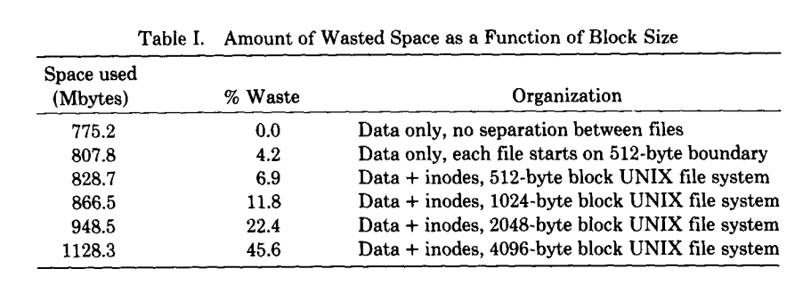
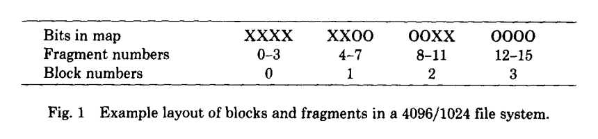
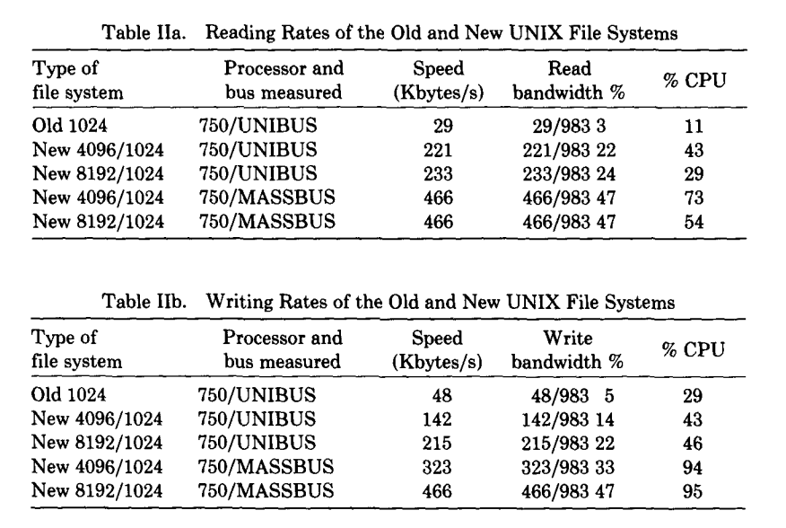

# A Fast File System for UNIX

> MARSHALL K. MCKUSICK, WILLIAM N. JOY, SAMUEL J. LEFFLER, and ROBERT S. FABRY
> Computer Systems Research Group 1984

本文描述了对 UNIX™ 文件系统的一次重新实现。该重新实现通过采用更为灵活的分配策略，在显著提高吞吐率方面取得了效果；这些策略能够改善引用的局部性，并可适配于多种外设与处理器特性。新的文件系统对顺序访问的数据进行聚簇（clustering），并提供两种块大小，从而在**实现对大文件的快速访问的同时，避免为小文件浪费大量存储空间**。实验结果表明，其文件访问速率在某些情况下可达到传统 UNIX 文件系统的十倍。

> 注：聚簇（clustering）策略，物理上将逻辑上相邻的数据块放在一起，以提高顺序访问的性能。

文中还讨论了程序员接口方面若干长期亟需的增强功能，包括：在文件上设置建议性锁（advisory locks）的机制、跨文件系统扩展命名空间的能力、对长文件名的支持，以及用于资源使用的管理性控制机制。

**分类与主题词（Categories and Subject Descriptors）：**
D.4.3［操作系统］：文件系统管理——文件组织；目录结构；访问方法
D.4.2［操作系统］：存储管理——分配/回收策略；二级存储设备
D.4.8［操作系统］：性能——测量；运行分析
H.3.2［信息系统］：信息存储——文件组织

**通用术语（General Terms）：** 测量，性能

**附加关键词与短语（Additional Keywords and Phrases）：**
UNIX，文件系统组织，文件系统性能，文件系统设计，应用程序接口

## 目录
* [1、INTRODUCTION](#1introduction)
* [2、OLD FILE SYSTEM](#2old-file-system)
* [3、NEW FILE SYSTEM ORGANIZATION](#3new-file-system-organization)
    * [3.1、Optimizing Storage Utilization](#31optimizing-storage-utilization)
    * [3.2、File System Parameterization](#32file-system-parameterization)
    * [3.3、Layout Policies](#33layout-policies)
* [4、PERFORMANCE](#4performance)
* [5、FILE SYSTEM FUNCTIONAL ENHANCEMENTS](#5file-system-functional-enhancements)
    * [5.1、Long File Names](#51long-file-names)
    * [5.2、File Locking](#52file-locking)
    * [5.3、Symbolic Links](#53symbolic-links)
    * [5.4、Rename](#54rename)
    * [5.5、Quotas](#55quotas)

## 1、INTRODUCTION 

本文描述了从最初采用 512 字节块的 UNIX¹ 文件系统到随 4.2 Berkeley Software Distribution（BSD）发布的新文件系统之间所发生的变更。文中系统性地阐述了这些变更的动机、为实现这些变更所采用的方法、相关设计决策背后的理论依据，以及新实现方案的具体描述。在此基础上，论文进一步总结了目前已经取得的实验与实践结果，指出了未来可能的研究与改进方向，并介绍了面向程序员所提供的功能扩展及其相应的修改。

> ¹UNIX 是 AT&T 贝尔实验室（AT&T Bell Laboratories）的注册商标。

> 本研究工作得到美国国家科学基金会（National Science Foundation）项目 MCS80-05144 的资助，以及美国国防部高级研究计划局（Defense Advanced Research Projects Agency，DARPA）在 ARPA Order No. 4031 项目下的资助，并由美国海军电子系统司令部（Naval Electronic Systems Command）按照合同号 N00039-82-C-0235 进行监督。

> 作者现任单位如下：M. K. McKusick 与 R. S. Fabry，计算机科学部，电气工程与计算机科学系，加利福尼亚大学伯克利分校（University of California, Berkeley），伯克利，加利福尼亚州 94720；W. N. Joy，Sun Microsystems, Inc.，2550 Garcia Ave.，Mountain View，加利福尼亚州 94043；S. J. Leffler，Lucasfilm Ltd.，P.O. Box 2009，San Rafael，加利福尼亚州 94912。

> 在不收取费用的前提下，允许复制本材料的全部或部分内容，但须满足以下条件：复制件不得用于直接商业利益；必须注明 ACM 的版权声明以及出版物标题和出版日期；并须声明该复制行为已获得美国计算机协会（Association for Computing Machinery，ACM）的许可。任何其他形式的复制或再出版，均需支付费用和/或获得明确许可。

> © 1984 ACM 0734-2071/84/0181-0197 $00.75

最初运行在 PDP-11² 上的 UNIX 系统具有简洁而优雅的文件系统机制。文件系统的 I/O 由内核进行缓冲；数据传输不存在对齐约束，且所有操作在语义上均表现为同步。所有对磁盘的传输均以 512 字节块为单位，这些块可以在文件系统的数据区内任意位置分配。除磁盘可用空间这一限制外，文件的增长几乎不受其他约束 [14, 18]。³

> 注：操作在语义上均表现为同步，表示用户可观察到的操作都是同步的，如：write 后可以 read 到数据，但不表示数据已经持久化硬盘。

> 注： 对齐约束
> 1）硬盘要求扇区大小（512B）对齐读写，不能从扇区中间开始。
> 2）DMA 要求内存地址与长度对齐。DMA（Direct Memory Access）会绕过 CPU，直接在设备与内存之间传输数据，连续的物理内存，对齐的起始地址（现代系统常要求 cache line 或 page 对齐（64B / 4KB）），对齐的传输长度（总线宽度、设备最小传输单元、磁盘扇区（512B / 4KB））。

> 注：“数据传输不存在对齐约束”，接口语义上的无对齐约束，由内核封装对齐约束。

当与其他 UNIX 增强特性一同运行在 VAX-11 上时，原有的 512 字节 UNIX 文件系统已无法提供许多应用所需的数据吞吐率。例如，超大规模集成电路（VLSI）设计和图像处理等应用通常在海量数据上进行少量计算，因此对文件系统提出了高吞吐率的要求。将文件从文件系统映射到大规模虚拟地址空间中的程序同样需要较高的吞吐能力，在此过程中，数据频繁地在文件系统与内存之间换入换出（paging）是很可能发生的 [5]。这就要求文件系统能够提供比原始 512 字节 UNIX 文件系统更高的带宽；**后者仅能提供约为磁盘最大带宽 2% 的吞吐能力**，即每个磁臂约 20 KB/s [21, 16]。

为提升性能，对原有的 UNIX 文件系统进行了若干修改。鉴于 UNIX 文件系统接口已被广泛理解，且其本身并非性能瓶颈，本次改进在保留原有抽象接口的前提下，仅对底层实现进行了调整，以提高系统吞吐率。因此，系统用户无需面对大规模的软件迁移或重写问题。

关于文件系统性能问题，已有大量文献进行了深入研究；综述性讨论可参见文献 [15]。此前针对 UNIX 文件系统性能改进的相关工作包括 Ferrin 的研究 [4]。UNIX 操作系统在设计上借鉴了 Multics 的诸多思想，后者是一个规模较大且具有高性能特征的操作系统 [3]。其他相关研究还包括 Hydra [1]、Spice [19]，以及面向 LISP 环境的文件系统 [17]。关于磁盘物理延迟特性的较好入门性描述见文献 [11]。

## 2、OLD FILE SYSTEM 

在贝尔实验室开发的文件系统（“传统”文件系统）中，每个磁盘驱动器被划分为一个或多个分区。每个磁盘分区可能包含一个文件系统。一个文件系统从不跨越多个分区。⁴ 文件系统由其超级块（superblock）描述，超级块包含文件系统的基本参数。这些参数包括文件系统中的数据块数量、文件最大数量的计数，以及指向空闲块链表（free list）的指针，即文件系统中所有空闲块的链表。

> ²DEC、PDP、VAX、MASSBUS 和 UNIBUS 均为 Digital Equipment Corporation 的商标。

> ³实际上，文件的大小受限于约1G字节以内。

> ⁴此处所称“分区（partition）”是指磁盘驱动器上物理空间的划分。在传统文件系统中，如同在新文件系统中一样，文件系统实际上位于逻辑磁盘分区中，这些分区可能存在重叠。例如，这种重叠的设计允许程序复制包含多个文件系统的整个磁盘驱动器。

在文件系统内部存在文件。某些文件被区分为目录，并包含指向可能自身也是目录的文件的指针。每个文件都有一个与之关联的描述符，称为 inode。inode 包含描述文件所有权的信息、标记文件最后修改和访问时间的时间戳，以及一个索引数组，该数组指向文件的数据块。在本节中，我们假定文件的前 8 个数据块由 inode 本身存储的值直接引用⁵。inode 还可能包含对间接块（indirect block）的引用，这些间接块包含进一步的数据块索引。在一个 512 字节块大小的文件系统中，单重间接块（singly indirect block）包含 128 个进一步的数据块地址，双重间接块（doubly indirect block）包含 128 个单重间接块的地址，三重间接块（triply indirect block）包含 128 个双重间接块的地址。

一个 150 MB 的传统 UNIX 文件系统由 4 MB 的 inode 和随后 146 MB 的数据组成。这种组织方式将 inode 信息与数据分离，因此访问一个文件通常需要从该文件的 inode 到其数据进行一次较长的寻道。在单个目录中的文件通常不会被分配到 4 MB inode 空间的连续位置，这导致在对目录中多个文件的 inode 执行操作时，需要访问许多非连续的 inode 块。

> 注：inode 和数据分离导致较长的寻道时间。

文件的数据块分配同样不尽优化。传统文件系统每次磁盘传输不会超过 512 字节，而且经常发现下一个顺序数据块不在同一柱面上，从而在每次 512 字节传输之间强制进行寻道。小块大小、系统中有限的预读以及频繁的寻道相结合，严重限制了文件系统的吞吐量。

> 注：HDD 访问一个磁盘扇区中 512 个字节的时间主要是寻道时间和旋转延迟。访问扇区的第一个字节用了很长时间，但是访问剩下的字节几乎不用时间。平均寻道时间 3~9ms，旋转延迟 4ms。

伯克利对 UNIX 文件系统的首次改进工作旨在提高可靠性和吞吐量。可靠性通过对关键文件系统信息的修改进行分阶段处理来提高，使得在系统崩溃后，这些修改可以被程序完整地完成或干净地修复 [6]。文件系统性能通过将基本块大小从 512 字节改为 1024 字节而提高了两倍以上。性能提升有两个原因：每次磁盘传输访问的数据量加倍，并且大多数文件可以在不访问间接块的情况下描述，因为直接块包含的数据量加倍。采用这些改动的文件系统将在下文中称为旧文件系统。

这一性能提升强烈表明，增大块大小是提高吞吐量的有效方法。尽管吞吐量已经翻倍，旧文件系统仍然仅使用了**大约 4% 的磁盘带宽**。主要问题在于，虽然空闲链表最初是按最优访问顺序排列的，但随着文件的创建和删除，它很快就变得混乱。最终，空闲链表变得完全随机，导致文件的数据块在磁盘上被随机分配，从而每次访问块之前都必须进行一次寻道。

尽管旧文件系统在刚创建时能够提供高达 175 KB/s 的传输速率，但经过几周中等强度使用后，由于数据块位置的随机化，这一速率降至 30 KB/s。除了将文件系统转储、重建并恢复之外，没有办法恢复旧文件系统的性能。另一种可能性，如 Maruyama [9] 所建议的，是设立一个进程，定期对磁盘上的数据进行重组，以恢复局部性。

> ⁵实际数值可能因系统而异，但通常在 5 到 13 之间。

## 3、NEW FILE SYSTEM ORGANIZATION

在新文件系统组织中（如同旧文件系统组织），每个磁盘驱动器包含一个或多个文件系统。文件系统由其超级块描述，超级块位于文件系统磁盘分区的起始位置。由于超级块包含关键数据，因此会进行复制以防止灾难性丢失。这一操作在创建文件系统时完成；由于超级块数据不发生变化，除非发生磁头崩溃或其他硬盘错误导致默认超级块不可用，否则不需要访问这些副本。

> 注：超级块保存的是文件系统的全局描述信息，包括磁盘布局参数、关键元数据结构的位置以及文件系统类型与版本标识。

为了确保可以仅通过两级间接寻址创建最大可达 2³² 字节的文件，文件系统块的最小大小为 4096 字节。文件系统块的大小可以是大于或等于 4096 的任意 2 的幂。文件系统的块大小记录在文件系统的超级块中，**因此不同块大小的文件系统可以在同一系统上同时访问**。块大小必须在创建文件系统时确定；之后无法更改，除非重建文件系统。

> 注：每个块能存放 1024 个指针；双级间接寻址意味着总可寻址块数为 1024 × 1024 = 2²⁰ 块。每块 4 KB，总容量约 2²⁰ × 4 KB ≈ 4 GB。

新文件系统组织将磁盘分区**划分为一个或多个称为柱面组（cylinder group）的区域**。柱面组由磁盘上的一个或多个连续柱面组成。与每个柱面组相关联的簿记信息包括超级块的冗余副本、inode 空间、描述柱面组可用块的位图，以及描述柱面组内数据块使用情况的汇总信息。柱面组中可用块的位图取代了传统文件系统的空闲链表。在每个柱面组中，在文件系统创建时分配固定数量的 inode。默认策略是在柱面组的每 2048 字节空间分配一个 inode，预计这将远远多于实际所需。

> 注：划分后每个柱面组都是一个“小型文件系统单元”，包含超级块、inode 空间、块位图、数据块。文件 inode 与其数据块物理距离更近，提高了空间局部性；可用块位图可以快速判断空闲块，减少链表遍历开销。

所有柱面组的簿记信息本可以放置在各柱面组的起始位置。然而，如果采用这种方法，所有冗余信息都会集中在顶盘上。一次硬件故障若破坏了顶盘，可能导致超级块的所有冗余副本丢失。因此，柱面组的簿记信息从柱面组起始位置开始有一个可变偏移量。每个连续柱面组的偏移量计算为比前一柱面组起始位置约多一个磁道。通过这种方式，冗余信息沿磁盘堆螺旋下移，使得即便单个磁道、柱面或盘片丢失，也不会丢失超级块的所有副本。除第一个柱面组外，从柱面组起始位置到柱面组簿记信息起始位置之间的空间用于存放数据块⁶。

> ⁶虽然看起来第一个柱面组可以将其超级块放置在“已知”位置，但对于块大小为 16 KB 或更大的文件系统，这种方法行不通。这是因为磁盘的前 8 KB 需要保留给引导程序，同时柱面组簿记信息必须从文件系统块边界开始。为了使柱面组从文件系统块边界开始，对于块大小大于 8 KB 的文件系统，必须在引导块结束与柱面组起始之间留出空闲空间。如果不知道文件系统块的大小，系统将无法确定使用哪种取整函数来找到第一个柱面组的起始位置。

### 3.1、Optimizing Storage Utilization

数据的布局方式使得较大的块可以在单次磁盘传输中被读取，从而大幅提高文件系统吞吐量。例如，考虑新文件系统中由 4096 B 数据块组成的一个文件。在旧文件系统中，该文件由 1024 B 块组成。通过增大块大小，新文件系统中的磁盘访问每次磁盘事务可以传输多达四倍的信息量。在大文件中，若若干 4096 B 块分配在同一柱面上，则在需要寻道之前可以进行更大规模的数据传输。

较大块的主要问题是，大多数 UNIX 文件系统由大量小文件组成。统一使用大块会浪费空间。Table 1 显示了文件系统块大小对文件系统空间浪费的影响。用于获取这些数据的文件位于我们的一台分时系统上，该系统约有 1.2 GB 在线存储。测量基于活动用户文件系统，包含约 920 MB 格式化空间。空间浪费计算为磁盘上不包含用户数据的空间百分比。随着磁盘块大小的增大，浪费迅速上升，当文件系统块为 4096 B 时，浪费高达不可接受的 45.6%。

> 注：更大的块可以减少磁盘寻道次数，提高吞吐量，但带来空间浪费问题。

为了在使用大块的同时避免过多浪费，小文件必须以更高效的方式存储。新文件系统通过允许将单个文件系统块划分为一个或多个碎片来实现这一目标。文件系统碎片大小在创建文件系统时指定；每个文件系统块可以可选地被划分为 2、4 或 8 个可寻址碎片。这些碎片的下限由磁盘扇区大小约束，通常为 512 B。与每个柱面组相关联的块位图记录了柱面组中碎片级别的可用空间；判断一个块是否可用时，检查对齐的碎片。图 1 展示了一个 4096/1024 文件系统块位图的一部分。

位图中的每一位记录一个碎片的状态；“X”表示该碎片已被使用，而“O”表示该碎片可供分配。在此示例中，碎片 0–5、10 和 11 已被使用，而碎片 6–9 及 12–15 可用。相邻块的碎片即使总大小足够，也不能作为完整块使用。在此示例中，碎片 6–9 不能被分配为完整块；只有碎片 12–15 可以合并为一个完整块。

在一个块大小为 4096 B、碎片大小为 1024 B 的文件系统上，文件由零个或多个 4096 B 数据块表示，并可能包含一个被分割的块。如果必须对文件系统块进行分割以容纳少量数据，该块的其余碎片将可供其他文件分配。例如，考虑一个存储在 4096/1024 B 文件系统上的 11,000 B 文件。该文件将使用两个完整块和另一个块的三碎片部分。如果在创建文件时没有可用的三碎片块，则将一个完整块拆分以获得所需碎片，同时产生一个未使用的单个碎片。此剩余碎片可按需分配给其他文件。

当程序执行写系统调用时，空间被分配给文件。每次向文件写入数据时，系统会检查文件的大小是否增加⁷。若文件需要扩展以容纳新数据，则存在以下三种情况之一：

(1) 已分配的块或碎片中有足够空间容纳新数据。新数据将写入该可用空间。

(2) 文件中不存在被分割的块（且文件的最后一个块空间不足以容纳新数据）。如果已分配块中存在空间，则将新数据写入该空间。如果剩余的新数据超过一个完整块的大小，则分配一个完整块，并将新数据的第一个完整块写入其中。该过程重复进行，直到剩余的新数据不足一个完整块。如果待写入的新数据能放入小于完整块的空间，则定位一个包含所需碎片的块；否则定位一个完整块。剩余的新数据写入定位的空间。

(3) 文件包含一个或多个碎片（且碎片中空间不足以容纳新数据）。如果新数据的大小加上碎片中已有数据的大小超过一个完整块，则分配一个新块。将碎片内容复制到块的起始位置，并用新数据填充块的剩余空间。随后按照情况 (2) 继续处理。否则，如果待写入的新数据能放入小于完整块的空间，则定位一个包含所需碎片或完整块的块。现有碎片内容与新数据合并后写入分配的空间。

以单个碎片为单位扩展文件的问题在于，当一个被分割的块扩展为完整块时，数据可能被多次复制。如果用户程序一次写入一个完整块（仅在文件末尾允许部分块），则可以将碎片重新分配的次数降至最低。由于具有不同块大小的文件系统可能同时存在于同一系统上，因此文件系统接口已被扩展，以便为应用程序提供读写操作的最优尺寸。对于文件，最优尺寸为正在访问的文件所在文件系统的块大小。对于其他对象，如管道和套接字，最优尺寸为其底层缓冲区大小。该特性被标准输入/输出库（Standard Input/Output Library）所使用，该库为大多数用户程序提供服务。同时，该特性也被某些系统工具使用，如归档程序和加载程序，这些工具自行管理输入输出并需要尽可能高的文件系统带宽。

> ⁷程序可能会覆盖现有文件中间的数据，在这种情况下，空间已经被分配。

在 4096/1024 字节的新文件系统组织中，观察到的空间浪费量与 1024 字节旧文件系统组织大致相同。具有 4096 字节块和 512 字节碎片的文件系统，其空间浪费量与 512 字节块的 UNIX 文件系统大致相同。对于大文件，新文件系统在索引信息上使用的空间少于 512 字节或 1024 字节文件系统，而对小文件使用的空间则相同。这些节省被用于跟踪可用空闲块所需的额外空间所抵消。总体结果是，当新文件系统的碎片大小等于旧文件系统的块大小时，磁盘利用率大致相同。

为了使布局策略有效，文件系统不能保持完全满载。每个文件系统都有一个参数，称为空闲空间保留（free space reserve），表示文件系统块应保持空闲的最低百分比。如果空闲块数低于此水平，只有系统管理员可以继续分配块。该参数的值可以在任何时候更改，即使文件系统已挂载并处于活动状态。第 4 节中出现的传输速率是在文件系统保持不足 90% 满（保留 10%）的情况下测量的。如果空闲块数降为零，由于文件系统无法将块局部化，文件系统吞吐量往往会减半。如果文件系统因过度填充而导致性能下降，可以通过删除文件恢复，直到空闲空间再次达到最低可接受水平。在空闲空间不足期间创建的文件的访问速率可以在有足够空间后通过移动其数据得到恢复。比较 Table I 中给出的组织结构时，必须将空闲空间保留加入浪费百分比。因此，旧 1024 字节 UNIX 文件系统的浪费百分比大致相当于新 4096/512 字节文件系统在空闲空间保留设置为 5% 时的情况（将旧文件系统 11.8% 的浪费与新文件系统 6.9% 的浪费加上 5% 的保留空间进行比较）。

> 注：FFS 的空闲空间保留参数为 10%，文件系统因过度填充而导致性能下降。

### 3.2、File System Parameterization

除了最初创建空闲列表之外，旧文件系统忽略底层硬件的参数。它既不具备对大容量存储设备的物理特性，也不具备与之交互的硬件信息。新文件系统的目标之一是对处理器能力和大容量存储特性进行参数化，以便能够以最优的、依赖于配置的方式分配块。所使用的参数包括处理器速度、大容量存储传输的硬件支持以及存储设备的特性。磁盘技术不断改进，并且在单处理器系统中可能同时存在多种不同的磁盘技术。每个文件系统都进行参数化，以便适应其所在磁盘的特性。

对于磁盘等大容量存储设备，新文件系统尝试将同一文件中新分配的块放置在与前一个块相同的柱面上。在最优情况下，这些新块在旋转位置上也应处于良好位置。“旋转最优”块之间的距离变化很大；根据系统特性，它可以是连续块，也可以是旋转延迟块。在具有无需处理器干预即可进行大容量存储传输请求的 I/O 通道的处理器上，通常可以在两个连续磁盘块之间进行访问而不会因磁盘旋转干预而浪费时间。对于没有 I/O 通道的处理器，主处理器必须处理中断并为新的磁盘传输做准备。处理该中断并安排新的磁盘传输所需的预计时间取决于主处理器的速度。

每个磁盘的物理特性包括每个磁道上的数据块数以及磁盘旋转速率。分配例程利用这些信息计算跳过一个数据块所需的毫秒数。处理器的特性包括响应中断并安排新磁盘传输所需的时间。给定文件的一个数据块后，分配例程会计算需要跳过的块数，使得文件中的下一个数据块在预期的时间内旋转到磁头下，从而启动新的磁盘传输操作。对于顺序访问大量数据的程序，该策略可最小化磁盘定位所花费的时间。

为简化查找旋转最优块的计算，每个柱面组的汇总信息中包含该柱面组在不同旋转位置上可用数据块的计数。系统区分八个旋转位置，因此以典型 3600 转每分钟的驱动器为例，其分辨率为 2 毫秒。超级块包含一个称为旋转布局表（rotational layout tables）的列表向量。该向量以旋转位置为索引，每个分量列出其旋转位置下每个数据块在块位图中的索引。查找可分配块时，系统首先在汇总计数中查找具有非零块数的旋转位置，然后利用旋转位置索引仅遍历块位图的相关部分以找到空闲块。

定义在同一柱面上完成一次数据传输与启动下一次传输之间的最小毫秒数的参数可以在文件系统挂载时或运行中随时修改。如果一个文件系统被参数化为按 2 毫秒的旋转间隔布局块，而磁盘随后迁移到需要 4 毫秒调度磁盘操作的处理器上，则由于每个块几乎都会浪费磁盘旋转时间，吞吐量将显著下降。如果目标主机已知，则可以在创建文件系统时针对其进行参数化。即使迁移事先未知，也可以在磁盘迁移后重新配置旋转布局延迟，使得所有后续分配均基于新主机的特性进行。

### 3.3、Layout Policies 

文件系统的布局策略分为两个不同的层次。顶层是全局策略，它利用整个文件系统的汇总信息来决定新 inode 和数据块的放置。这些例程负责决定新目录和文件的存放位置，计算旋转最优的数据块布局，并在当前柱面组剩余块不足以进行合理布局时，决定是否强制执行一次长距离寻道以切换到新的柱面组。在全局策略例程之下是局部分配例程，它们采用局部最优方案对数据块进行布局。

提高文件系统性能的两种方法是：如 Trivedi [20] 所述，通过增加引用局部性以最小化寻道延迟；如 Nevalainen [10] 所述，通过改进数据布局以实现更大规模的数据传输。全局布局策略试图通过聚集相关信息来提高性能。它们无法将所有数据引用局部化，同时还必须尝试将无关数据分散到不同的柱面组。如果局部化过度，局部柱面组可能耗尽空间，迫使数据散布到非本地柱面组。极端情况下，完全局部化可能导致形成类似旧文件系统的巨大数据簇。**全局策略试图在同时访问的数据局部化和无关数据分散这两种目标之间取得平衡**。

可分配资源之一是 inode。inode 用于描述文件和目录。同一目录中的文件 inode 通常会被同时访问。例如，“列出目录”命令经常访问目录中每个文件的 inode。布局策略试图将**目录中所有文件的 inode 放置在同一个柱面组中**。为了确保文件在磁盘上均匀分布，目录分配使用不同的策略。新目录会被放置在具有高于平均数空闲 inode 数量且已有目录数最少的柱面组中。该策略的目的是使 inode 聚集策略在大多数情况下能够成功。

在柱面组内的 inode 分配采用"下一个空闲（next-free）"策略。虽然这种方法在柱面组内随机分配 inode，但特定柱面组的所有 inode 只需 8 到 16 次磁盘传输即可读取。（最多需要 16 次磁盘传输，因为一个柱面组的 inode 不超过 2048 个。）这为访问目录中所有文件的 inode 设置了一个小而恒定的上限。相比之下，旧文件系统通常需要对目录中每个文件的 inode 各进行一次磁盘传输。

> 注：旧文件系统 inode 分布在整个磁盘，每次访问需要独立磁盘寻道与传输。柱面组 inode 在柱面组内集中排列，一次磁盘传输可读多个 inode（整个块或整个柱面）。

另一类主要资源是数据块。由于同一文件的数据块通常会被同时访问，策略例程尝试将**文件的所有数据块放置在同一柱面组中**，并优先放置在同一柱面中旋转最优的位置。将所有数据块分配到同一柱面组的问题在于，大文件会很快耗尽柱面组中的可用空间，迫使其溢出到其他区域。此外，使用柱面组的全部空间还会导致该柱面组中未来对任何文件的分配也必须溢出到其他区域。理想情况下，没有任何柱面组应被完全填满。所采用的启发式解决方案是在文件大小超过 48 KB 时⁸，将数据块分配重定向到另一个柱面组，并在此后的每增加 1 MB 数据时重复此操作。新选择的柱面组从那些剩余空闲块数量高于平均值的柱面组中选出。虽然大文件会倾向于在磁盘上分散存储，但通常在执行一次长寻道之前，可访问大约 1 MB 的数据，而且每 1 MB 数据仅需一次长寻道的成本较小。

> ⁸首次溢出点设在 48 KB，这是因为在 4096 字节块的文件系统中，文件在此大小首次需要使用一个单重间接块。这似乎是一个自然的拐点，用于重新定向块的分配。其他溢出点的选择意图是，当文件已使用柱面组中约 25% 的数据块时，迫使块分配被重定向。在日常使用中观察新文件系统时，这些启发式策略在最小化完全填满的柱面组数量方面表现良好。

全局策略例程在需要特定块时，会调用局部分配例程。局部分配例程在请求的块空闲时总是分配该块；否则，它会分配一个大小符合要求、且在旋转上最接近请求块的空闲块。如果全局布局策略拥有完整信息，它们总可以请求未使用的块，从而将分配例程简化为简单的簿记操作。然而，维护完整信息代价很高，因此全局布局策略的实现采用了仅使用部分信息的启发式方法。当请求的块不可用时，局部分配器使用四级分配策略：

（1）使用旋转上最接近请求块的下一个可用块，优先在同一柱面上分配。此处假设磁头切换时间为零。在某些磁盘控制器上，如果情况并非如此，可以在构建旋转布局表时考虑磁盘盘片间切换所需的时间，但这一方法尚未尝试。

（2）如果同一柱面上没有可用块，则在同一柱面组内分配一个块。

（3）若该柱面组已满，则使用柱面组号的二次哈希（quadratic hash）选择另一个柱面组查找空闲块。

（4）最后，如果哈希失败，则对所有柱面组进行穷举搜索。

采用二次哈希是因为它在几乎满的哈希表中快速找到未使用的槽位 [8]。已参数化以维持至少 10% 空闲空间的文件系统很少使用该策略。而不维持任何空闲空间的文件系统通常空闲块极少，几乎所有分配都是随机的；在这种条件下，该策略最重要的特性是执行速度快。

> 注：目录中所有文件的 inode 放置在同一个柱面组中；文件的所有数据块放置在同一柱面组中。

## 4、PERFORMANCE

前一节所述算法的有效性最终体现在新文件系统的长期性能上。我们的实证研究表明，inode 布局策略确实有效。当在包含多个子目录的大型目录上运行“列出目录（list directory）”命令时（迫使系统访问多个柱面组中的 inode），inode 的磁盘访问次数减少约一半。对于仅包含文件的大型目录，这种改进更为显著，在这些情况下 inode 的磁盘访问次数可减少至原来的八分之一。这对于访问大量小文件的程序（如排队守护进程 spooling daemons）尤为鼓舞，因为这些程序在旧文件系统中容易导致磁盘请求队列过载。

Table II 总结了新文件系统的测得吞吐量。在说明这些测试结果之前，需要对测试条件作若干说明。测试程序测量用户程序向文件传输数据或从文件读取数据的速率，且在此过程中不对数据进行任何处理。程序必须读写足够的数据，以确保操作系统缓冲不会影响结果。每项测试至少连续运行三次：第一次用于将系统置于已知状态，第二、第三次用于确保实验结果稳定且可重复。所使用的测试及其结果在 Kridle [7] 中有详细讨论⁹。系统在测试时为多用户运行状态，但其他方面保持静止，CPU 和磁盘臂不存在争用。UNIBUS 和 MASSBUS 测试的唯一区别在于控制器。所有测试均使用 AMPEX Capricorn 330 MB Winchester 磁盘。正如 Table II 所示，所有文件系统测试均在 VAX 11/750 上进行。所有文件系统在测量前至少已投入生产使用一个月。所有测试中系统调用次数相同；基本系统调用开销在测试总运行时间中可忽略不计。

> ⁹类似于我们用于读测试的 UNIX 命令是 cp file /dev/null，其中 file 的大小为 8 MB。

与旧文件系统不同，新文件系统的传输速率随时间变化不大。吞吐量更强烈地依赖于保持的空闲空间量。Table II 的测量基于 10% 空闲空间保留的文件系统。合成工作负载表明，当文件系统满载时，吞吐量会下降到 Table II 所示速率的约一半。

Table II 中所列带宽百分比用于衡量文件系统对磁盘的有效利用率。磁盘传输速率的上限可通过将每道磁道上的字节数乘以磁盘每秒转数计算得出。带宽则通过将文件系统实际能够达到的数据传输速率与此上限速率进行比较得到百分比。根据该指标，**旧文件系统仅能使用约 3%–5% 的磁盘带宽，而新文件系统的利用率可达到 47%**。

在新文件系统中，读写操作都比旧系统更快。这种加速的最大因素是新文件系统使用了更大的块大小。虽然新系统分配块的开销大于旧系统，但由于块更大，需要分配的块数更少，因此每字节分配的成本在两个系统中大致相同。

在新文件系统中，读取速率始终至少与写入速率相当。这是可以预期的，因为在分配块时，内核必须执行更多操作，而读取块时操作较少。需要注意的是，在 8192 字节块的文件系统中，写入速率与读取速率大致相同；而在 4096 字节块的文件系统中，写入速率低于读取速率。这种写入速度较慢的原因在于内核每秒必须进行两倍的磁盘分配，使处理器无法跟上磁盘传输速率。

相比之下，旧文件系统写入文件的速度约比读取快 50%。原因在于写系统调用是异步的，内核能够比磁盘处理请求的速度更快地生成磁盘传输请求，从而磁盘传输排队在磁盘缓冲区缓存中。由于磁盘缓冲区按最小寻道距离排序，计划写入的磁盘之间的平均寻道距离比按生成的随机顺序写入数据块要短得多。然而，当读取文件时，读系统调用是同步处理的，因此必须按照非最优寻道顺序从磁盘中获取数据块，这迫使磁盘调度器进行长距离寻道，从而降低了吞吐率。

在新系统中，文件的磁盘块排列更为优化。尽管读取操作仍然是同步的，但请求已经按更优的顺序发送到磁盘。虽然写操作仍然是异步的，但它们已经按最小寻道顺序提交给磁盘，因此重新排序写请求不会带来性能提升。因此，在旧文件系统中限制性能的磁盘寻道延迟，在新文件系统中几乎没有影响。新系统中写入速度低于读取速度的主要原因是块分配的开销。

当前，新文件系统的性能受限于从系统地址空间的磁盘缓冲区向用户地址空间的数据缓冲区复制所需的内存到内存拷贝操作。这些拷贝操作约占 I/O 操作总时间的 40%。如果两个地址空间中的缓冲区都正确对齐，可以利用 VAX 虚拟内存管理硬件在无需拷贝的情况下完成数据传输。这对于大数据量传输尤其理想。但我们没有实现此功能，因为这会在两个方面改变文件系统的用户接口：用户程序需要在页边界上分配缓冲区，而且写入后缓冲区中的数据将消失。

通过重写磁盘驱动，将内核缓冲区链在一起，可以进一步提高磁盘吞吐率。这将允许在单次磁盘事务中读取连续的磁盘块。许多 UNIX 系统使用的磁盘每道轨道包含 32 或 48 个 512 字节扇区。每道轨道恰好包含两个或三个 8192 字节文件系统块，或四个或六个 4096 字节文件系统块。无法有效使用连续磁盘块会将这些磁盘的性能限制在可用带宽的 50% 以下。如果文件的下一个块不能连续布局，那么在任何盘片上可分配的下一个块与当前块之间的最小间距为六分之一至半圈旋转。这意味着，在无法使用连续块的情况下，最佳布局仅能使用单道轨道的一半带宽。如果每道轨道包含奇数个扇区，可以通过在另一轨道上找到起始于目标旋转位置的块来解决旋转延迟。

块链技术尚未实现的原因是，它需要重写系统中所有的磁盘驱动，而现有处理器速度已成为吞吐率的限制因素。

目前，每次只向文件分配一个块。DEMOS 文件系统在发现文件增长迅速时使用的一种技术是一次性预分配多个块，并在文件关闭时释放未使用的块。通过批量分配，系统可以减少每次写操作的分配开销，并减少为保持磁盘上的块指针与块分配同步所需的磁盘写入次数。然而，本系统未采用该技术，因为块分配在写系统调用中仅占不到 10% 的时间，而且当前吞吐率已受到可用处理器速度的限制。

## 5、FILE SYSTEM FUNCTIONAL ENHANCEMENTS

对 UNIX 文件系统的性能增强并不需要对应用程序可见的语义或数据结构进行任何修改。然而，有若干改进长期以来一直被普遍期望，但一直未引入，原因在于它们会要求用户将所有文件系统进行转储（dump）和恢复（restore）。由于新文件系统在实施时已经要求对现有的所有文件系统进行转储和恢复，因此这些功能性增强在此时得以引入。

### 5.1、Long File Names 

文件名现在可以具有几乎任意长度。只有读取目录的程序会受到此更改的影响。为了促进向未运行新文件系统的 UNIX 系统的移植，引入了一组目录访问例程，以便为旧系统和新系统上的目录提供一致的接口。

目录按 512 字节的单位分配，称为“块（chunk）”。选择该大小是为了使每次分配都能通过单次操作写入磁盘。块被划分为可变长度的记录，称为目录项（directory entry）。目录项包含将文件名映射到其对应 inode 所需的信息。任何目录项都不允许跨越多个块。每个目录项的前三个字段是固定长度，分别包含：inode 号、目录项大小以及包含的文件名长度。目录项的其余部分为可变长度，包含以 null 结尾的文件名，并填充到 4 字节边界。当前目录中单个文件名的最大长度为 255 个字符。

目录中的可用空间通过一个或多个目录项在其“目录项大小”字段中累积空闲空间来记录。这会导致某些目录项的大小大于存放条目名称和固定字段所需的大小。分配给目录的空间应始终通过将其所有目录项的大小累加来完全计算。当目录中删除一个目录项时，其空间会通过增加同一目录块中前一个目录项的大小来归还给前一个目录项。如果目录块的第一个目录项为空，则将该项的 inode 号置为零，以表示其未被分配。

### 5.2、File Locking

旧文件系统没有提供文件锁定机制。需要对文件更新进行同步的进程必须使用一个独立的“锁文件”。进程会尝试创建锁文件：如果创建成功，进程即可继续进行更新；如果创建失败，进程则等待并重试。该机制存在三个缺点：第一，进程在循环尝试创建锁时会消耗 CPU 时间；第二，由于系统崩溃而遗留的锁必须手动清除（通常在系统启动脚本中完成）；第三，以系统管理员身份运行的进程总是被允许创建文件，因此必须使用不同的机制。虽然这些问题都有解决方法，但操作并不直接，因此新增了文件锁定机制。

最通用的方案允许多个进程并发更新同一文件。Peterson [12] 讨论了几种此类技术。一种较简单的方法是通过锁将文件访问序列化。为了达到合理的效率，某些应用需要能够锁定文件的部分内容。Bass [2] 在 Onyx 文件系统中实现了字节级的锁定。然而，对于标准系统应用而言，以文件为粒度的锁定机制已足够。

锁定机制分为两类：硬锁（hard lock）和建议锁（advisory lock）。两者的主要区别在于强制执行的程度：硬锁在程序尝试访问文件时总是被强制执行；而建议锁仅在程序请求时应用。因此，建议锁仅在访问文件的所有程序都使用该锁定机制时才有效。硬锁需要在内核中实现某种覆盖策略；建议锁则将策略留给用户程序。在 UNIX 系统中，具有系统管理员权限的程序可以覆盖任何保护机制。由于许多需要使用锁的程序必须以系统管理员身份运行，因此我们选择实现建议锁，而不是创建一个与 UNIX 哲学不一致或系统管理员程序无法使用的额外保护机制。

文件锁定功能允许协作程序对文件施加建议性的共享锁或独占锁。在同一时间内，文件上只能有一个进程持有独占锁，而可以存在多个共享锁。共享锁与独占锁不能同时存在于同一文件上。如果在另一进程持有独占锁时请求任何锁，或者在另一进程持有任意锁时请求独占锁，该锁请求将被阻塞，直到锁可以被获取。由于共享锁和独占锁都是建议性的，即使某个进程已获得文件锁，其他进程仍然可以访问该文件。

锁仅能在已打开的文件上施加或移除。这意味着可以在不关闭文件的情况下操作锁。例如，当一个进程希望先施加共享锁、读取一些信息并判断是否需要更新，然后再施加独占锁以更新文件时，这种机制非常有用。

如果锁不能立即获取，请求锁的进程将被阻塞。在某些情况下，这种行为是不理想的。例如，一个进程仅希望检查文件是否已有锁，则需要另一种机制来获取该信息。因此，进程可以指定其锁请求在无法立即获得锁时返回错误。条件性请求锁对希望管理缓冲区的“守护进程”非常有用。如果第一个守护进程锁定了执行缓冲操作的目录，后续的守护进程就可以轻松检查是否已有活动的守护进程。由于锁只在锁定进程存在期间有效，因此在进程退出或系统崩溃后，不会留下仍然有效的锁文件。

几乎不进行死锁检测。系统唯一进行的死锁检查是：对文件施加锁时，该文件不能已存在相同类型的锁（即连续两次对同一类型的锁调用，第二次将失败）。

### 5.3、Symbolic Links

传统 UNIX 文件系统允许同一文件系统中的多个目录条目引用同一个文件。每个目录条目通过“链接”将文件名与 inode 及其内容关联起来。链接的概念是基本的；inode 并不存放在目录中，而是独立存在，并通过链接进行引用。当所有指向某个 inode 的链接被移除时，该 inode 被释放。这种引用 inode 的方式不允许跨物理文件系统的引用，也不支持跨机器的链接。为避免这些限制，引入了类似 Multics[3] 的符号链接机制。

符号链接被实现为一个包含路径名的文件。当系统在解释路径名的某个组件时遇到符号链接，符号链接的内容会被添加到路径名的其余部分之前，然后解释该合成路径名以得到最终路径。在 UNIX 中，路径名可以相对于文件系统层次结构的根指定，也可以相对于进程的当前工作目录指定。相对于根指定的路径名称为绝对路径名；相对于当前工作目录指定的路径名称为相对路径名。如果符号链接包含绝对路径名，则使用该绝对路径名，否则符号链接的内容相对于链接在文件层次中的位置进行解析。通常情况下，程序不需要感知它们使用的路径名中存在符号链接。然而，某些系统工具必须能够检测和操作符号链接。三个新的系统调用提供了检测、读取和写入符号链接的能力；七个系统工具也需要修改以使用这些调用。

在未来的 Berkeley 软件发布中，可能实现使用路径名引用位于远程机器上的文件系统。届时，将可以创建跨机器的符号链接。

### 5.4、Rename

创建现有文件新版本的程序通常先将新版本创建为一个临时文件，然后再将该临时文件重命名为目标文件的名称。在旧的 UNIX 文件系统中，重命名操作需要三次系统调用。如果在这三次调用之间程序被中断或系统崩溃，目标文件可能只会保留其临时名称。为消除这种可能性，引入了 `rename` 系统调用。`rename` 调用以保证目标名称存在的方式执行重命名操作。

`rename` 可用于数据文件和目录。在重命名目录时，系统必须执行特殊的验证检查，以确保目录树结构不会因创建循环或不可访问的目录而被破坏。例如，如果父目录被移动到其子孙目录中，就会发生这种破坏。验证检查需要追踪目标目录的子孙目录，以确保其中不包含正在移动的目录。

### 5.5、Quotas 

UNIX 系统历来尝试尽可能地共享所有可用资源。因此，单个用户可以分配文件系统中的全部可用空间。在某些环境中，这是不可接受的。因此，引入了配额（quota）机制，用于限制用户可获取的文件系统资源量。配额机制对用户可分配的 inode 数量和磁盘块数量都设置了限制。

每个用户在每个文件系统上都可以设置单独的配额。资源限制包括硬限制（hard limit）和软限制（soft limit）。当程序超过软限制时，用户终端会显示警告；只有当程序超过硬限制时，才会被终止。其设计理念是：用户在登录会话之间应保持在软限制之下，但在活跃工作期间可以使用更多资源。为了鼓励这种行为，当用户登录时，如果超过任何软限制，会收到警告。如果用户在多次登录后仍未纠正问题，最终其软限制将被强制执行为硬限制。

**ACKNOWLEDGMENTS**

我们感谢 Robert Elz 对新文件系统的持续关注，以及他以合理且高效的方式添加磁盘配额功能。同时感谢 Dennis Ritchie 对用户界面修改提出的建议。我们也感谢 Michael Powell 对 DEMOS 文件系统工作原理的解释，他的许多想法被用于本实现。在早期调试阶段，当文件系统稳定性不如预期时，特别感谢 Peter Kessler 和 Robert Henry 充当真实用户进行测试。审稿人的批评和建议对本文的连贯性贡献显著。

***

> 总结

> 背景：旧文件系统因为其设计（inode和数据分离）导致寻道时间过长，局部性差，磁盘吞吐率低（仅能利用 3%–5% 带宽）。新的应用使用场景对文件系统提出了高吞吐率的要求，旧文件系统无法满足。

> FFS 使用柱面组组织，将磁盘划分为柱面组，inode 与数据块尽量放在同一柱面组内，提高物理局部性，减少寻道和旋转延迟。新目录会被放置在具有高于平均数空闲 inode 数量且已有目录数最少的柱面组中。目录中所有文件的 inode 放置在同一个柱面组中；为防止大文件耗尽柱面组空间，文件超过 48 KB 时，切换到新的柱面组，之后每 1MB 文件切换一次柱面组。

> 使用更大的块可以减少磁盘寻道次数，提高磁盘吞吐量，但同时更大的块也带来空间浪费问题；块与碎片管理，使用大块提高顺序访问吞吐量，碎片机制解决小文件存储的空间浪费。

> 性能提升，相比旧文件系统仅能利用 3%–5% 带宽，新文件系统可实现约 47% 带宽利用率。

> 问题：

> FFS [MJLF84]会执行大量写入，以创建大小为一个块的新文件：一个用于新的 inode，一个用于更新 inode
> 位图，一个用于文件所在的目录数据块，一个用于目录 inode 以更新它，一个用于新数据块，它是新文件的一部分，另一个是数据位图，用于将数据块标记为已分
> 配。因此，尽管 FFS 会将所有这些块放在同一个块组中，但 FFS 会导致许多短寻道和随后的旋转延迟，因此性能远远低于峰值顺序带宽。

> | inode bitmap | data bitmap | file inode | dir inode | dir data block | data block |
