# The Design and Implementation of a Log-Structured File System

> Mendel Rosenblum and John K. Ousterhout

> ACM Transactions on Computer Systems, Vol 10, No. 1, February 1992

## 目录
* [Abstract](#abstract)
* [1 Introduction](#1-introduction)
* [2 Design for file systems of the 1990's](#2-design-for-file-systems-of-the-1990s)
    * [2.1 Technology](#21-technology)
    * [2.2 Workloads](#22-workloads)
    * [2.3 Problems with existing file systems](#23-problems-with-existing-file-systems)
* [3 Log-structured file systems](#3-log-structured-file-systems)
    * [3.1 File location and reading](#31-file-location-and-reading)
    * [3.2 Free space management: segments](#32-free-space-management-segments)
    * [3.3 Segment cleaning mechanism](#33-segment-cleaning-mechanism)
    * [3.4 Segment cleaning policies](#34-segment-cleaning-policies)
    * [3.5 Simulation results](#35-simulation-results)
    * [3.6 Segment usage table](#36-segment-usage-table)
* [4 Crash recovery](#4-crash-recovery)
    * [4.1 Checkpoints](#41-checkpoints)
    * [4.2 Roll-forward](#42-roll-forward)
* [5 Experience with the Sprite LFS](#5-experience-with-the-sprite-lfs)
    * [5.1 Micro-benchmarks](#51-micro-benchmarks)
    * [5.2 Cleaning overheads](#52-cleaning-overheads)
    * [5.3 Crash recovery](#53-crash-recovery)
    * [5.4 Other overheads in Sprite LFS](#54-other-overheads-in-sprite-lfs)
* [6 Related work](#6-related-work)
* [7 Conclusion](#7-conclusion)
* [8 Acknowledgments](#8-acknowledgments)

## Abstract

本文提出了一种新的磁盘存储管理技术，称为日志结构化文件系统（log-structured file system）。日志结构化文件系统将所有修改以顺序方式写入磁盘，形成类似日志的结构，从而显著加速文件写入以及系统崩溃后的恢复过程。日志是磁盘上的唯一结构；其中包含索引信息，使得能够高效地从日志中读取文件。为了在磁盘上维持用于快速写入的大块空闲区域，我们将日志划分为若干段（segments），并使用段清理器（segment cleaner）对高度碎片化段中的存活信息进行压缩。本文给出了一系列模拟实验，表明一种基于成本与收益的简单清理策略具有良好的效率。我们实现了一个名为 Sprite LFS 的日志结构化文件系统原型；在小文件写入方面，其性能比现有 Unix 文件系统高出一个数量级，而在读操作和大文件写入方面，其性能与 Unix 文件系统相当或更优。即使将清理开销计入在内，Sprite LFS 仍可将约 70% 的磁盘带宽用于写入，而 Unix 文件系统通常只能利用 5%–10% 的磁盘带宽。

> 本文所描述的工作部分得到了美国国家科学基金会（National Science Foundation）资助，资助编号为 CCR-8900029；同时还部分得到了美国国家航空航天局（National Aeronautics and Space Administration）和国防高级研究计划局（Defense Advanced Research Projects Agency）在合同 NAG2-591 下的支持。

> 本文将发表于第 13 届 ACM 操作系统原理研讨会（ACM Symposium on Operating Systems Principles）论文集，以及 1992 年 2 月期的《ACM Transactions on Computer Systems》。

## 1. Introduction

在过去十年中，CPU 速度取得了显著提升，而磁盘访问时间的改进却相对缓慢。这一趋势在未来很可能仍将持续，并将导致越来越多的应用程序受限于磁盘性能。为缓解这一问题，我们提出了一种新的磁盘存储管理技术，称为**日志结构化文件系统**（log-structured file system），其磁盘利用效率比现有文件系统高出一个数量级。

日志结构化文件系统基于这样一个假设：文件被缓存于主存中，而不断增长的内存容量将使缓存在满足读请求方面变得愈发有效［1］。因此，磁盘流量将逐渐以写操作为主。日志结构化文件系统将所有新产生的信息以顺序方式写入磁盘中的一种称为日志（log）的结构。通过几乎完全消除寻道操作，这种方法能够显著提升写入性能。日志的顺序性还使系统崩溃后的恢复过程大大加快：当前的 Unix 文件系统在崩溃后通常需要扫描整个磁盘以恢复一致性，而日志结构化文件系统只需检查日志中最近的一部分即可。

日志（logging）的思想并非新概念，近年来已有若干文件系统将日志作为一种辅助结构，用以加速写入和崩溃恢复［2，3］。然而，这些系统仅将日志用于临时存储，信息的永久存放位置仍然是磁盘上采用传统随机访问方式的数据结构。与之形成对比的是，日志结构化文件系统将数据永久存储在日志中：磁盘上不存在其他结构。日志中包含索引信息，使得文件能够以与现有文件系统相当的效率被读取。

为了使日志结构化文件系统能够高效运行，必须确保始终存在用于写入新数据的大块连续空闲空间。这是日志结构化文件系统设计中最为困难的挑战。本文提出了一种基于大范围连续空间（称为**段**，segments）的解决方案，其中一个**段清理器**（segment cleaner）进程通过压缩高度碎片化段中的存活数据，持续地重新生成空段。我们使用模拟器研究了不同的清理策略，并发现了一种基于**成本—收益**（cost and benefit）的简单而有效的算法：该算法将较老、变化缓慢的数据与较新、变化迅速的数据进行区分，并在清理过程中对它们采取不同的处理方式。

我们构建了一个名为 **Sprite LFS** 的日志结构化文件系统原型，目前已作为 Sprite 网络操作系统的一部分投入实际使用［4］。基准测试程序表明，在小文件写入方面，Sprite LFS 的原始写入速度比 Unix 高出一个数量级以上。即便在包含读操作和大文件访问的其他工作负载下，除一种情况外（即随机写入后进行顺序读取的文件），Sprite LFS 在所有情况下的性能至少与 Unix 相当。我们还测量了生产系统中长期运行条件下的清理开销。总体而言，Sprite LFS 能够将磁盘原始带宽的约 65%–75% 用于写入新数据（其余带宽用于清理）。相比之下，Unix 系统只能利用磁盘原始带宽的 5%–10% 用于写入新数据，其余时间大多消耗在寻道操作上。

本文其余部分共分为六个章节。第 2 节回顾了为 20 世纪 90 年代计算机设计文件系统时所面临的问题。第 3 节讨论了日志结构化文件系统的设计备选方案，并推导出 Sprite LFS 的整体结构，重点关注其清理机制。第 4 节描述了 Sprite LFS 的崩溃恢复系统。第 5 节通过基准程序以及对清理开销的长期测量对 Sprite LFS 进行评估。第 6 节将 Sprite LFS 与其他文件系统进行比较，第 7 节给出全文总结。

## 2. Design for file systems of the 1990’s

文件系统的设计受两种总体力量的支配：技术，它提供了一组基本的构建模块；以及工作负载，它决定了必须被高效执行的一组操作。本节总结了正在发生的技术变化，并阐述这些变化对文件系统设计所产生的影响。同时，还描述了影响 Sprite LFS 设计的工作负载特征，并说明现有文件系统为何难以有效应对这些工作负载以及相关的技术变迁。

### 2.1. Technology

在文件系统设计中，有三个技术组成部分尤为关键：**处理器**、**磁盘**以及**主存**。处理器之所以重要，是因为其速度几乎以指数级的速率增长，而且这种提升趋势在 20 世纪 90 年代的大部分时间内似乎仍将持续。这对计算机系统中其他各个组成部分提出了加速要求，以避免系统整体出现失衡。

磁盘技术同样在快速发展，但其改进主要集中在**成本**和**容量**方面，而非性能。磁盘性能由两个方面构成：**传输带宽**和**访问时间**。尽管这两个因素都在改善，但其提升速度远慢于 CPU 速度。通过采用磁盘阵列以及并行磁头磁盘［5］，磁盘传输带宽可以得到显著提升；然而，在访问时间方面似乎不太可能出现重大改进，因为它受限于难以改进的机械运动。如果某个应用程序引发了一系列由寻道操作分隔的小规模磁盘传输，那么即使处理器速度不断提高，在未来十年内该应用程序也不太可能获得显著的性能提升。

> 注：相比与CPU和内存大的提升，磁盘性能提升有限；文件系统的性能主要受限于磁盘难以改进的机械运动，传输带宽无法显著提升。

第三个技术组成部分是**主存**，其容量正以指数级速度增长。现代文件系统将最近使用的文件数据缓存在主存中，而更大的主存容量使得构建更大的文件缓存成为可能。这一变化对文件系统行为产生了两方面的影响。首先，更大的文件缓存通过吸收更大比例的读请求［1，6］，改变了磁盘所承受的工作负载。由于出于安全性的考虑，大多数写请求最终必须反映到磁盘上，因此磁盘流量（以及磁盘性能）将愈发以写操作为主。

大文件缓存带来的第二个影响在于，它们可以充当写缓冲区，在将数据写入磁盘之前收集大量已修改的数据块。缓冲机制可能使写入操作更加高效，例如通过一次顺序传输、仅需一次寻道即可写入所有数据块。当然，写缓冲的缺点在于会增加系统崩溃时丢失的数据量。本文假定系统崩溃发生的频率较低，并且在每次崩溃中丢失几秒钟或几分钟的工作是可以接受的；对于需要更高崩溃恢复能力的应用，可以使用**非易失性 RAM**（non-volatile RAM）作为写缓冲区。

> 注：内存容量的提升，缓存降低了读请求比例，导致磁盘性能愈发以写操作为主。

### 2.2. Workloads

计算机应用中普遍存在多种不同的文件系统工作负载。其中，对文件系统设计而言最难以高效处理的一类工作负载出现在**办公**和**工程**环境中。办公与工程类应用通常以对**小文件**的访问为主；多项研究测得的平均文件大小仅为数千字节［1，6–8］。小文件通常会导致规模较小且随机的磁盘 I/O，而此类文件的创建与删除时间往往主要消耗在对文件系统**元数据**（即用于定位文件属性和数据块的数据结构）的更新上。

以对**大文件的顺序访问**为主的工作负载（例如在超级计算环境中常见的情形）同样会带来一些有趣的问题，但这些问题并非主要由文件系统软件所致。已有多种技术可以保证此类文件在磁盘上按顺序布局，因此其 I/O 性能通常受限于 I/O 子系统和内存子系统的带宽，而非文件分配策略本身。

在设计日志结构化文件系统时，我们决定将重点放在**小文件访问效率**上，而将大文件访问带宽的提升留给硬件设计者来解决。幸运的是，Sprite LFS 所采用的技术不仅对小文件有效，对大文件同样表现良好。

### 2.3. Problems with existing file systems

当前文件系统存在两类普遍问题，这使得它们难以应对 20 世纪 90 年代的技术发展和工作负载。首先，它们将信息分散存储在磁盘上，从而导致过多的小规模访问。例如，伯克利 Unix 快速文件系统（Berkeley Unix fast file system, Unix FFS）［9］在将每个文件顺序布局于磁盘方面相当有效，但不同文件在物理上彼此分离。此外，文件的属性（“inode”）与文件内容分开存放，包含文件名的目录条目也与文件分离。在 Unix FFS 中创建新文件至少需要五次独立的磁盘 I/O，每次 I/O 前都需进行寻道：两次访问文件属性，加上文件数据、目录数据和目录属性各一次。对于小文件写入而言，此类系统在写入新数据时，仅能利用磁盘潜在带宽的不到 5%；其余时间几乎全部耗费在寻道操作上。

当前文件系统的第二个问题是倾向于**同步写入**：应用程序必须等待写操作完成，无法在写入后台处理时继续执行。例如，尽管 Unix FFS 对文件数据块采用异步写入，但文件系统的元数据结构（如目录和 inode）仍为同步写入。在包含大量小文件的工作负载中，磁盘流量主要由同步元数据写入主导。同步写入将应用程序性能与磁盘性能紧密耦合，使得应用程序难以从更快的 CPU 中获益，同时也削弱了将文件缓存用作写缓冲区的潜力。不幸的是，诸如 NFS［10］之类的网络文件系统引入了额外的同步行为，而这些行为在过去并不存在。这简化了崩溃恢复，但却降低了写入性能。

在本文中，我们以伯克利 Unix 快速文件系统（Unix FFS）为当前文件系统设计的示例，并将其与日志结构化文件系统进行比较。之所以选用 Unix FFS，是因为其在文献中有详尽描述，并被若干流行的 Unix 操作系统采用。本节所述问题并非 Unix FFS 所独有，在大多数其他文件系统中同样存在。

## 3. Log-structured file systems

日志结构化文件系统（log-structured file system）的基本思想是，通过在文件缓存中缓冲一系列文件系统变更，然后将所有变更以顺序方式一次性写入磁盘，从而提升写入性能。写入操作中记录到磁盘的信息包括文件数据块、属性、索引块、目录，以及几乎所有用于管理文件系统的其他信息。对于包含大量小文件的工作负载，日志结构化文件系统能够将传统文件系统中大量的小规模同步随机写操作，转化为大规模的异步顺序传输，从而几乎可以利用 100% 的磁盘原始带宽。

尽管日志结构化文件系统的基本思想较为简单，但要实现日志方法的潜在优势，需要解决两个关键问题。第一个问题是如何从日志中检索信息；这一问题将在下文第 3.1 节中讨论。第二个问题是如何管理磁盘上的空闲空间，以确保始终存在用于写入新数据的大块连续空闲区域。这一问题复杂得多，是第 3.2–3.6 节的讨论主题。table 1 总结了 Sprite LFS 用于解决上述问题的磁盘上数据结构；这些数据结构将在本文后续章节中详细讨论。

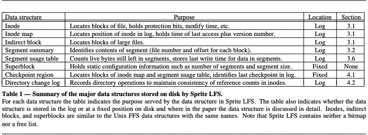

### 3.1. File location and reading

尽管“日志结构化”（log-structured）这一术语可能会让人认为必须通过顺序扫描才能从日志中检索信息，但在 Sprite LFS 中并非如此。我们的目标是实现与 Unix FFS 相当或更优的读性能。为达到这一目标，Sprite LFS 在日志中输出索引结构，以支持随机访问检索。Sprite LFS 使用的基本结构与 Unix FFS 相同：每个文件对应一个称为 **inode** 的数据结构，其中包含文件的属性（类型、所有者、权限等）以及文件前十个数据块的磁盘地址；对于超过十个块的文件，inode 还包含一个或多个**间接块**（indirect blocks）的磁盘地址，每个间接块中存放更多数据块或间接块的地址。一旦找到文件的 inode，读取该文件所需的磁盘 I/O 次数在 Sprite LFS 与 Unix FFS 中是相同的。

在 Unix FFS 中，每个 inode 位于磁盘上的固定位置；给定文件的标识号，通过简单计算即可得到该文件 inode 的磁盘地址。相比之下，Sprite LFS 并不将 inode 放置在固定位置，而是写入日志中。Sprite LFS 使用一种称为 **inode 映射**（inode map）的数据结构来维护每个 inode 的当前位置。给定文件标识号，需要通过索引 inode 映射来确定 inode 的磁盘地址。inode 映射被划分为多个块并写入日志；每块磁盘上的固定检查点区域记录所有 inode 映射块的位置。值得庆幸的是，inode 映射足够紧凑，可以将活跃部分缓存于主存中：因此对 inode 映射的查找很少需要访问磁盘。

> 注：一个文件的数据结构包含 dir inode、file inode、dir、inode map、file。

Figure 1 显示了在不同目录中创建两个新文件后，Sprite LFS 与 Unix FFS 的磁盘布局。尽管两种布局在逻辑结构上相同，日志结构化文件系统的布局显得更加紧凑。因此，Sprite LFS 的写入性能远优于 Unix FFS，同时其读取性能与 Unix FFS 同样出色。

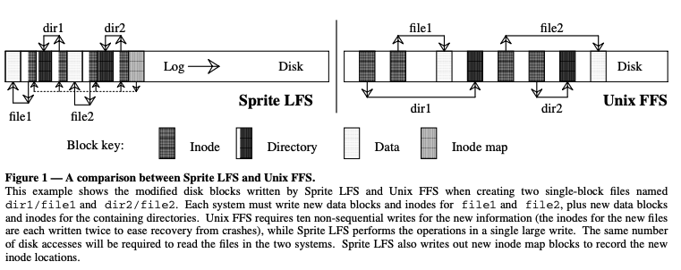

### 3.2. Free space management: segments

日志结构化文件系统中最困难的设计问题是**空闲空间管理**。其目标是为写入新数据保持大块连续空闲区域。最初，磁盘上的所有空闲空间都集中在单一连续区块中，但当日志写入到磁盘末端时，空闲空间会因已删除或被覆盖的文件而碎片化为多个小区块。

从此时起，文件系统面临两种选择：**穿插写入**（threading）和**复制**（copying），如 Figure 2 所示。第一种方案是将存活数据保持原位，同时在空闲区块中穿插日志。然而，穿插写入会导致空闲空间严重碎片化，从而无法进行大规模连续写入，使得日志结构化文件系统的写入性能不优于传统文件系统。第二种方案是将存活数据从日志中复制出来，以腾出大块连续空闲区块用于写入新数据。在本文中，我们假设存活数据以压缩后的形式写回日志头部；也可以将其移动到另一日志结构化文件系统以形成日志层级，或移动到完全不同的文件系统或归档中。复制的缺点在于其成本，尤其对于长寿命文件而言；在最简单的情形下，如果日志在磁盘上循环工作且存活数据被复制回日志，那么每次日志循环都会对所有长寿命文件进行复制。

Sprite LFS 采用了**穿插写入**与**复制**相结合的策略。磁盘被划分为称为**段**（segments）的固定大块区块。每个段总是从起始位置顺序写入至结束位置，且在重新写入段之前，段内的所有存活数据必须被复制出去。然而，日志在段的粒度上是穿插写入的；如果系统能够将长寿命数据集中存放于若干段中，则可以跳过这些段，从而避免对数据进行重复复制。段的大小被设定得足够大，以至于读取或写入整个段所需的传输时间远大于寻道至段起始位置的开销。这使得整段操作几乎可以以磁盘的全带宽运行，而不受段访问顺序的影响。Sprite LFS 当前使用的段大小为 512 千字节或 1 兆字节。

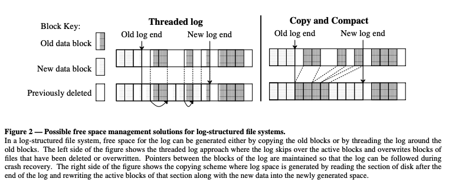

### 3.3. Segment cleaning mechanism

将存活数据从段中复制出来的过程称为**段清理**（segment cleaning）。在 Sprite LFS 中，这一过程是一个简单的三步操作：首先将若干段读入内存；其次识别存活数据；最后将存活数据写回到更少数量的干净段中。该操作完成后，被读取的段会被标记为“干净”，可用于存放新数据或进行进一步的清理。

在段清理过程中，必须能够识别每个段中哪些块是存活的，以便再次写出。同时，还必须能够识别每个块所属的文件以及块在文件中的位置；这些信息用于更新文件的 inode，使其指向块的新位置。Sprite LFS 通过在每个段中写入一个**段摘要块**（segment summary block）来解决这两个问题。摘要块标识段中写入的每条信息；例如，对于每个文件数据块，摘要块包含该块的文件号和块号。当一个段需要多次日志写入才能填满时，段中可以包含多个段摘要块。（当文件缓存中缓冲的脏块数量不足以填满整个段时，会发生**部分段写入**。）段摘要块在写入时开销很小，并且在崩溃恢复（见第 4 节）以及清理过程中都十分有用。

> 注：段摘要块用来记录块所属文件和文件位置，判断块是否存活。

Sprite LFS 还利用段摘要信息来区分存活块与已被覆盖或删除的块。一旦确定块的身份，其存活状态可以通过检查文件的 inode 或间接块中相应的块指针是否仍指向该块来判断：若指针仍指向该块，则块为存活；若不指向，则块为失效。Sprite LFS 对此检查进行了轻微优化：在 inode 映射中为每个文件维护一个**版本号**，每当文件被删除或截断为长度为零时，该版本号递增。版本号与 inode 号组合构成文件内容的**唯一标识符**（uid）。段摘要块记录段中每个块的 uid；当清理段时，如果块的 uid 与 inode 映射中当前存储的 uid 不匹配，则该块可立即丢弃，无需进一步检查文件的 inode。

这种清理方法意味着 Sprite 中不存在**空闲块列表**或**位图**。除了节省内存和磁盘空间之外，取消这些数据结构还简化了崩溃恢复的过程。如果保留这些数据结构，则需要额外的代码来记录其变更，并在系统崩溃后恢复一致性。

### 3.4. Segment cleaning policies

在上述基本机制的基础上，需要解决四个策略性问题：

(1) **段清理器何时执行**？可能的选择包括以低优先级在后台持续运行，仅在夜间运行，或仅在磁盘空间接近耗尽时运行。

(2) **一次应清理多少段**？段清理提供了对磁盘数据进行重组的机会；一次清理的段越多，重排数据的机会就越多。

(3) **应清理哪些段**？一个显而易见的选择是清理碎片最严重的段，但事实证明，这并非最佳策略。

(4) **在写出存活块时应如何分组**？一种可能是增强未来读取的局部性，例如将同一目录下的文件分组到同一输出段中。另一种可能是按最后修改时间对块进行排序，并将具有相似“年龄”的块分组到新段中；我们将这种方法称为**按年龄排序**（age sort）。

到目前为止，我们尚未系统地解决上述策略中的前两项。Sprite LFS 在干净段数量降至阈值以下（通常为几十个段）时开始执行段清理，每次清理几十个段，直到干净段数量超过另一个阈值（通常为 50–100 个干净段）。Sprite LFS 的整体性能对阈值的具体选择似乎并不敏感。相比之下，第三和第四项策略决策至关重要：根据我们的经验，它们是决定日志结构化文件系统性能的主要因素。第 3 节剩余部分将讨论我们对应清理哪些段以及如何分组存活数据的分析。

我们使用一个称为**写入成本**（write cost）的指标来比较不同清理策略。写入成本指的是每写入一个字节新数据时磁盘忙碌的平均时间，包括所有清理开销。写入成本以若无清理开销且数据可在无寻道延迟和旋转延迟情况下以全带宽写入所需时间的倍数表示。写入成本为 1.0 为理想情况：表示新数据可以以磁盘全带宽写入且没有清理开销。写入成本为 10 表示实际上仅使用磁盘最大带宽的十分之一用于写入新数据，其余时间消耗在寻道、旋转延迟或清理操作上。

对于具有大段的日志结构化文件系统而言，无论是写入还是清理，寻道延迟和旋转延迟都可以忽略不计，因此写入成本可以定义为**磁盘移动的总字节数与其中表示新数据的字节数之比**。该成本取决于被清理段中的**利用率**（即段中仍为存活数据的比例）。

在稳定状态下，清理器必须为每写入一个新段生成一个干净段。为此，它会完整读取 ($N$) 个段，并写出 ($N \cdot u$) 个段的存活数据（其中 ($u$) 为段的利用率，且 ($0 \le u < 1$)）。这样就会产生 ($N$ $\cdot$ ($1-u$)) 个连续空闲段，用于存放新数据。因此写入成本为：

$$\begin{align*}
\text{write cost} &= \frac{\text{total bytes read and written}}{\text{new data written}} \\
&= \frac{\text{read segs} + \text{write live} + \text{write new}}{\text{new data written}} \\
&= \frac{N + N \cdot u + N \cdot (1-u)}{N \cdot (1-u)} = \frac{2}{1-u} \
\end{align*}$$

在上述公式中，我们做了一个保守假设，即为了恢复存活块，必须完整读取整个段；实际上，如果段的利用率非常低，只读取存活块可能会更快（在 Sprite LFS 中我们尚未尝试过）。如果待清理的段没有存活块（($u = 0$)），则完全无需读取，写入成本为 1.0。

Figure 3 将写入成本作为利用率 ($u$) 的函数绘出。作为参考，在小文件工作负载下，Unix FFS 最多利用磁盘带宽的 5–10%，对应写入成本为 10–20（具体测量见［11］及第 5.1 节的 Figure 8）。通过采用日志、延迟写入和磁盘请求排序，这一利用率可能提高到约 25%［12］，对应写入成本约为 4。Figure 3 表明，为使日志结构化文件系统的性能优于当前 Unix FFS，被清理的段利用率必须低于 0.8；要优于改进后的 Unix FFS，则利用率必须低于 0.5。

需要注意的是，上述利用率并非整个磁盘中存活数据的总体比例；它仅指被清理段中存活块的比例。文件使用的差异会导致某些段的利用率低于其他段，而清理器可以选择利用率最低的段进行清理；这些段的利用率将低于磁盘的整体平均水平。

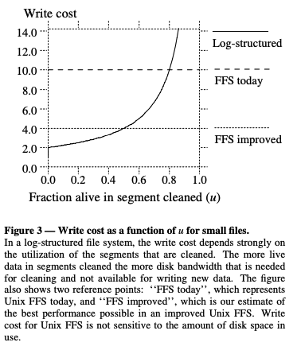

即便如此，通过降低磁盘空间的总体利用率，也可以提升日志结构化文件系统的性能。当磁盘使用较少时，被清理的段中存活块数量较少，从而降低写入成本。日志结构化文件系统呈现出一种**成本—性能权衡**：如果磁盘空间未被充分利用，可以获得更高的性能，但每可用字节的成本较高；如果提高磁盘容量利用率，则存储成本降低，但性能也随之下降。这种性能与空间利用率之间的权衡并非日志结构化文件系统独有。例如，Unix FFS 仅允许 90% 的磁盘空间被文件占用，其余 10% 保持空闲，以便空间分配算法能够高效运行。

> 注：成本和性能权衡，降低磁盘空间利用率可以提高性能，但每可用字节的成本较高；提高磁盘空间利用率可以降低存储成本，但性能也随之下降。

在日志结构化文件系统中以低成本实现高性能的关键，是将磁盘迫使形成**双峰段分布**（bimodal segment distribution）：大多数段接近满载，少数段为空或接近空闲，清理器几乎总能利用这些空段工作。这既保证了整体磁盘容量的高利用率，又实现了低写入成本。下一节将描述我们如何在 Sprite LFS 中实现这种双峰分布。

### 3.5. Simulation results

我们构建了一个简单的文件系统模拟器，以便在可控条件下分析不同的清理策略。该模拟器的模型并不反映实际的文件系统使用模式（其模型比现实更苛刻），但它有助于我们理解随机访问模式和局部性对清理成本的影响，这两者都可以被利用以降低清理开销。

模拟器将文件系统建模为固定数量的 4 KB 文件，该数量根据需要产生特定的总体磁盘容量利用率。在每一步中，模拟器会使用两种伪随机访问模式之一覆盖其中一个文件的新数据：

* 均匀（Uniform）：每个文件在每一步被选择的概率相等。
* 冷热（Hot-and-cold）：文件被划分为两组。一组包含 10% 的文件，被称为“热”文件，因为其文件被选择的概率为 90%；另一组包含 90% 的文件，被称为“冷”文件，其文件被选择的概率仅为 10%。组内每个文件被选择的概率相等。该访问模式模拟了一种简单的**局部性**。

在这种方法中，总体磁盘容量利用率保持不变，并且不对读操作进行建模。模拟器运行直到所有干净段被用尽，然后模拟清理器的操作，直到干净段数量再次达到阈值。在每次运行中，模拟器都允许运行直到写入成本稳定，并消除所有冷启动带来的方差。

Figure 4 将两组模拟结果叠加在 Figure 3 的曲线上。在 "LFS uniform" 模拟中，使用了均匀访问模式。清理器采用简单的贪心策略，总是选择利用率最低的段进行清理。在写出存活数据时，清理器并未尝试重新组织数据：存活块按照被清理段中出现的顺序写出（对于均匀访问模式，重新组织数据不太可能带来性能改善）。

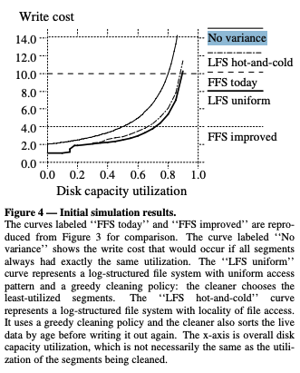

即便在均匀随机访问模式下，段利用率的方差也能使写入成本明显低于根据总体磁盘容量利用率和公式 (1) 预测的值。例如，当总体磁盘容量利用率为 75% 时，被清理段的平均利用率仅为 55%。当总体磁盘容量利用率低于 20% 时，写入成本降至 2.0 以下；这意味着部分被清理段根本没有存活块，因此无需读取。

"LFS hot-and-cold" 曲线显示了在访问模式具有局部性（如上所述）时的写入成本。该曲线对应的清理策略与"LFS uniform" 相同，但在再次写出存活块之前，将其按**年龄**排序。这意味着长寿命（冷）数据倾向于与短寿命（热）数据分隔存放在不同段中；我们认为这种方法有助于实现期望的**段利用率双峰分布**。

Figure 4 显示了一个令人意外的结果：局部性和“更好的”分组反而导致性能比没有局部性的系统更差！我们尝试改变局部性的程度（例如 95% 的访问集中在 5% 的数据上），结果发现随着局部性增强，性能反而越来越差。Figure 5 展示了这一反直觉结果的原因。在贪心策略下，一个段只有在其利用率成为所有段中最低时才会被清理。因此，每个段的利用率最终都会下降到清理阈值，包括冷段。不幸的是，冷段的利用率下降非常缓慢，因此这些段往往在清理点附近停留很长时间。Figure 5 显示，在具有局部性的模拟中，更多的段聚集在清理点附近，而在无局部性的模拟中则不然。整体结果是，冷段倾向于长时间占用大量空闲块。

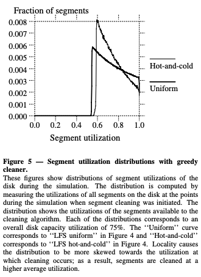

> 注：这些图展示了模拟过程中磁盘上各段利用率的分布情况。该分布通过在模拟中每次启动段清理时，测量磁盘上所有段的利用率而得到。该分布反映了清理算法可用段的利用率情况。每一种分布均对应于整体磁盘容量利用率为 75% 的情形。“Uniform”曲线对应于图 4 中的“LFS uniform”，“Hot-and-cold”曲线对应于图 4 中的“LFS hot-and-cold”。局部性使得分布在发生清理的利用率附近更加偏斜；因此，段是在更高的平均利用率下被清理的。

通过研究这些图，我们意识到清理器必须对热段和冷段采取不同的处理策略。冷段中的空闲空间比热段更有价值，因为一旦冷段被清理，它需要很长时间才会重新累积不可用的空闲空间。换句话说，一旦系统从包含冷数据的段中回收了空闲块，就可以“长期保留”这些空闲块，直到冷数据碎片化并“重新占用”为止。相比之下，清理热段的收益较低，因为其数据很可能很快失效，空闲空间会迅速重新累积；系统不妨延迟一段时间再清理，让当前段中更多块自然失效。段中空闲空间的价值取决于段中数据的稳定性。不幸的是，如果不了解未来的访问模式，就无法准确预测稳定性。基于一个假设——段中数据越旧，其保持不变的时间可能越长——可以通过数据的**年龄**来估计稳定性。

为了验证这一理论，我们模拟了一种新的段清理选择策略。该策略根据**清理段的收益**与**清理段的成本**对每个段进行评分，并选择收益与成本比率最高的段进行清理。

清理收益由两个部分组成：可回收空闲空间的数量以及该空间可能保持空闲的时间。空闲空间量为 ($1-u$)，其中 ($u$) 为段的利用率。我们使用段中最近被修改的块的时间（即最年轻块的年龄）来估计该空间可能保持空闲的时间。清理收益定义为这两个因素的乘积，即**空间—时间乘积**。

段的清理成本为 ($1+u$)（其中 $1$ 单位用于读取整个段，($u$) 单位用于写回存活数据）。综合这些因素，可得：

$$
\begin{align*}
\frac{\text{benefit}}{\text{cost}} &= \frac{\text{free space generated} \cdot \text{age of data}}{\text{cost}} \\
&= \frac{(1-u) \cdot \text{age}}{1+u}
\end{align*}
$$

我们将该策略称为**成本—收益策略（cost-benefit policy）**；它允许冷段在比热段更高的利用率下被清理。

我们在热—冷（hot-and-cold）访问模式下重新运行了模拟，采用成本—收益策略并对存活数据进行按年龄排序。如 Figure 6 所示，成本—收益策略成功产生了我们期望的段双峰分布。该清理策略在冷段利用率约为 75% 时进行清理，而热段则要等到利用率降至约 15% 才清理。由于 90% 的写操作集中在热文件上，因此大多数被清理的段都是热段。Figure 7 显示，成本—收益策略相比贪心策略将写入成本降低了最多 50%，即使在相对较高的磁盘容量利用率下，日志结构化文件系统也能够优于最佳可能的 Unix FFS。我们还模拟了多种不同程度和类型的局部性，结果表明，随着局部性增强，成本—收益策略的效果进一步提升。

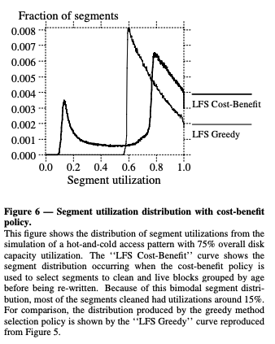

> 注：该图展示了在总体磁盘容量利用率为 75%、具有冷热访问模式的模拟条件下，段利用率的分布情况。“LFS Cost-Benefit”曲线表示在采用成本—收益策略选择待清理段，并在重新写出之前按年龄对存活块进行分组时得到的段分布。由于这种双峰型的段分布特征，被清理的大多数段的利用率集中在约 15% 左右。作为对比，“LFS Greedy”曲线给出了由贪心选择策略产生的分布结果，该曲线复现自图 5。

这些模拟实验促使我们在 Sprite LFS 中实现了成本—收益方法。如第 5.2 节所示，Sprite LFS 中实际文件系统的表现甚至优于 Figure 7 中预测的结果。

### 3.6. Segment usage table

为了支持成本—收益清理策略，Sprite LFS 维护了一个称为段使用表（segment usage table）的数据结构。对于每个段，该表记录段中存活字节的数量以及段内任意块的最近修改时间。这两个值在段清理器选择要清理的段时使用。初始时，这些值在段写入时设置，当文件被删除或块被覆盖时，存活字节计数会递减。如果计数降为零，则该段可在无需清理的情况下被重复使用。段使用表的块被写入日志，块的地址存储在检查点区域中（详见第 4 节）。

为了按年龄对存活块进行排序，段摘要信息记录了写入段的最年轻块的年龄。目前，Sprite LFS 并未为文件中的每个块保存修改时间，而是为整个文件保存一个单一的修改时间。对于未被完整修改的文件，该估计值将不准确。我们计划修改段摘要信息，使其包含每个块的修改时间。

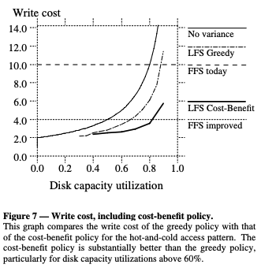

## 4. Crash recovery

当系统发生崩溃时，磁盘上最近执行的若干操作可能使其处于不一致状态（例如，新文件已写入，但包含该文件的目录尚未写入）；在重启过程中，操作系统必须检查这些操作以纠正任何不一致。在没有日志的传统 Unix 文件系统中，系统无法确定最后一次修改的位置，因此必须扫描磁盘上所有元数据结构以恢复一致性。这类扫描的成本已经很高（在典型配置下可能需要几十分钟），且随着存储系统规模的扩大，成本还在增加。

在日志结构化文件系统中，最后一次磁盘操作的位置容易确定：它们位于日志的末端。因此，崩溃后的恢复速度应当非常快。这一日志优势在数据库系统[13]以及其他文件系统[2, 3, 14]中已有充分应用。与许多其他日志系统类似，Sprite LFS 的恢复采用双重策略：检查点（checkpoints），用于定义文件系统的一致状态；前滚（roll-forward），用于恢复自上一次检查点以来写入的信息。

### 4.1. Checkpoints

检查点（checkpoint）是日志中的一个位置，此时所有文件系统结构都是一致且完整的。Sprite LFS 使用一个两阶段过程来创建检查点。首先，它将所有修改过的信息写入日志，包括文件数据块、间接块、inode，以及 inode 映射块和段使用表块。其次，它将检查点区域写入磁盘上的一个固定特殊位置。检查点区域包含 inode 映射和段使用表中所有块的地址，以及当前时间和指向最后写入段的指针。

在重启过程中，Sprite LFS 读取检查点区域，并利用这些信息初始化其主存数据结构。为了处理在检查点操作中发生的崩溃，实际上存在两个检查点区域，检查点操作在它们之间交替进行。检查点时间记录在检查点区域的最后一个块中，因此如果检查点失败，时间不会更新。重启时，系统会读取两个检查点区域，并使用时间较新的那个。

Sprite LFS 会在周期性时间间隔内进行检查点操作，也会在文件系统卸载或系统关机时进行。检查点间隔过长可以减少写入检查点的开销，但会增加恢复过程中前滚所需的时间；检查点间隔过短可以改善恢复时间，但会增加正常操作的成本。Sprite LFS 当前使用的检查点间隔为三十秒，这可能过短。周期性检查点的替代方案是，在写入日志达到一定新数据量后执行检查点，这样可以限制恢复时间，同时在文件系统未达到最大吞吐量时减少检查点开销。

### 4.2. Roll-forward

原则上，仅通过读取最新的检查点区域并丢弃该检查点之后日志中的所有数据，也可以安全地在崩溃后重新启动系统。这将实现即时恢复，但自上次检查点以来写入的任何数据都会丢失。为了尽可能多地恢复信息，Sprite LFS 会扫描自上次检查点以来写入的日志段，该操作称为**前滚（roll-forward）**。

在前滚过程中，Sprite LFS 利用段摘要块中的信息恢复最近写入的文件数据。当摘要块指示存在新的 inode 时，Sprite LFS 会更新从检查点读取的 inode 映射，使其指向 inode 的新副本。这会自动将文件的新数据块纳入恢复后的文件系统。如果发现某文件的数据块但没有该文件 inode 的新副本，前滚代码会假定磁盘上的该文件新版本不完整，并忽略这些新数据块。

前滚代码还会调整从检查点读取的段使用表中的利用率。自检查点以来写入的段的利用率初始为零，需要根据前滚后的实际存活数据进行调整。较旧段的利用率也必须调整，以反映文件的删除和覆盖情况（这两者都可以通过日志中出现的新 inode 来识别）。

前滚（roll-forward）中的最后一个问题是如何恢复目录条目与 inode 之间的一致性。每个 inode 包含一个引用计数，表示有多少目录条目指向该 inode；当计数降为零时，文件即被删除。不幸的是，崩溃可能发生在这样的时刻：inode 已经写入日志并更新了引用计数，而包含相应目录条目的块尚未写入，或者反之亦然。

为恢复目录与 inode 之间的一致性，Sprite LFS 为每次目录修改在日志中输出一条特殊记录。该记录包括操作码（创建、链接、重命名或删除）、目录条目的位置（目录的 i-number 及其在目录中的位置）、目录条目的内容（名称和 i-number）、以及条目中 inode 的新引用计数。这些记录统称为**目录操作日志（directory operation log）**；Sprite LFS 保证每条目录操作日志记录在对应的目录块或 inode 写入日志之前出现。

在前滚（roll-forward）过程中，目录操作日志用于确保目录条目与 inode 之间的一致性：如果日志中存在一条操作记录，但对应的 inode 和目录块尚未同时写入，前滚会更新目录和/或 inode 以完成该操作。前滚操作可能导致目录条目的增加或删除，以及 inode 引用计数的更新。恢复程序会将修改后的目录、inode、inode 映射块（inode map）和段使用表块（segment usage table blocks）附加到日志中，并写入新的检查点区域以包括这些修改。唯一无法完成的操作是创建一个 inode 从未写入的新文件；在这种情况下，目录条目将被删除。除了其他功能外，目录日志还使得提供原子重命名（atomic rename）操作成为可能。

目录操作日志与检查点（checkpoint）之间的交互引入了额外的同步问题。具体而言，每个检查点必须表示目录操作日志与日志中 inode 和目录块一致的状态。这就需要额外的同步机制，以防止在检查点写入期间对目录进行修改。

## 5. Experience with the Sprite LFS

我们在 1989 年末开始实现 Sprite LFS，并在 1990 年中期将其作为 Sprite 网络操作系统的一部分投入使用。从 1990 年秋季开始，它已经用于管理五个不同的磁盘分区，这些分区为大约三十名用户提供日常计算服务。本文描述的所有功能都已在 Sprite LFS 中实现，但前滚（roll-forward）尚未在生产系统中安装。生产系统的磁盘使用较短的检查点间隔（30 秒），在重启时会丢弃最后一个检查点之后的所有信息。

在项目启动时，我们曾担心日志结构文件系统的实现会比传统文件系统复杂得多。然而实际上，Sprite LFS 的实现复杂度并不高于 Unix FFS[9]：Sprite LFS 的段清理器（segment cleaner）确实增加了一些复杂性，但 Unix FFS 所需的位图和布局策略的消除在一定程度上抵消了这一点；此外，Sprite LFS 中的检查点与前滚代码（checkpointing and roll-forward）也不比扫描 Unix FFS 磁盘以恢复一致性的 fsck 代码[15] 更复杂。像 Episode[2] 或 Cedar[3] 这样的日志文件系统可能会比 Unix FFS 或 Sprite LFS 更复杂，因为它们同时包含日志和布局管理代码。

在日常使用中，Sprite LFS 给用户的感受与 Sprite 中的 Unix FFS 类似。原因在于，目前使用的计算机在现有工作负载下还不足以受到磁盘瓶颈的限制。例如，在修改后的 Andrew 基准测试[11] 中，Sprite LFS 仅比 SunOS 快约 20%，使用的是第 5.1 节中描述的配置。大部分速度提升归功于 Sprite LFS 消除了同步写操作。即使在 Unix FFS 的同步写操作下，该基准测试的 CPU 利用率仍超过 80%，限制了通过改进磁盘存储管理实现的加速空间。

### 5.1. Micro-benchmarks

我们使用了一组小型基准程序来测量 Sprite LFS 的最佳性能，并与 SunOS 4.0.3（其文件系统基于 Unix FFS）进行比较。这些基准是合成的，因此并不代表真实工作负载，但它们可以很好地展示两种文件系统的优劣。测试所用机器为 Sun-4/260（整数性能 8.7 SPECmarks），配备 32 MB 内存、Sun SCSI3 HBA 和 Wren IV 磁盘（最大传输带宽 1.3 MB/s，平均寻道时间 17.5 毫秒）。对于 LFS 和 SunOS，磁盘均格式化为大约 300 MB 可用存储空间的文件系统。SunOS 使用 8 KB 块大小，而 Sprite LFS 使用 4 KB 块和 1 MB 段大小。在每次测试中，系统处于多用户模式但其他操作静止。Sprite LFS 在基准测试期间没有进行段清理，因此测量结果代表最佳性能；关于清理开销的测量见下文第 5.2 节。

Figure 8 显示了一个创建、读取并删除大量小文件的基准测试结果。在基准的创建和删除阶段，Sprite LFS 的速度几乎是 SunOS 的十倍。读取这些文件时，Sprite LFS 也更快，因为文件按创建顺序读取，而日志结构文件系统将文件紧密地打包在日志中。此外，Sprite LFS 在创建阶段仅使磁盘 17% 忙，而 CPU 已达到饱和状态。相比之下，SunOS 在创建阶段磁盘忙碌率高达 85%，但仅约 1.2% 的磁盘带宽用于新数据写入。这意味着，随着 CPU 速度提升，Sprite LFS 的性能还可进一步提高 4-6 倍（见Figure 8(b)），而 SunOS 几乎无法获得性能提升。

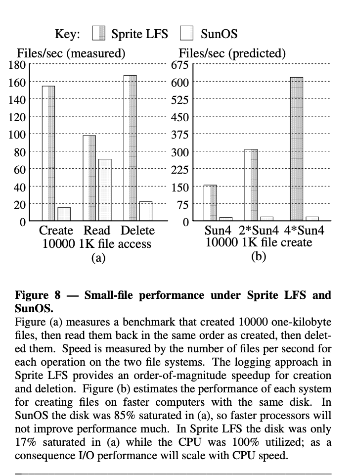

虽然 Sprite 的设计重点是优化大量小文件访问的工作负载，但图 9 显示，它在大文件处理方面同样具有竞争力。在所有测试情况下，Sprite LFS 的写入带宽都高于 SunOS。对于随机写入，它显著更快，因为将随机写转化为日志的顺序写入；对于顺序写入，它也更快，因为可以将多个块合并成一次大的 I/O，而 SunOS 对每个块执行单独的磁盘操作（较新的 SunOS 版本通过合并写入操作[16]，其性能应与 Sprite LFS 相当）。在读取性能上，两种系统相差不大，除了在文件随机写入后顺序读取的情况下，此时 Sprite LFS 的读取需要寻道，因此性能明显低于 SunOS。

Figure 9 还说明了日志结构文件系统在磁盘上形成的局部性与传统文件系统不同。传统文件系统通过假设某些访问模式（如顺序读取文件、倾向于在同一目录使用多个文件等）来实现逻辑局部性；在必要时，它会为写入付出额外开销，以便根据假设的读取模式优化磁盘上的信息布局。相比之下，日志结构文件系统实现的是时间局部性：同一时间创建或修改的信息在磁盘上会紧密排列。如果时间局部性与逻辑局部性匹配，例如文件顺序写入后顺序读取，则日志结构文件系统在大文件上的性能应与传统文件系统相当；如果两者不匹配，性能就会不同。Sprite LFS 能更高效地处理随机写入，因为它将其顺序写入磁盘；而 SunOS 为了实现逻辑局部性，对随机写入付出了更多代价，但在顺序重读时处理得更高效。随机读取在两种系统中性能相近，即使块布局差异很大；然而，如果非顺序读取的顺序与非顺序写入的顺序一致，Sprite 的性能将大幅提升。

### 5.2. Cleaning overheads

上一节的微基准测试结果给出了 Sprite LFS 性能的乐观视图，因为这些测试未包含任何清理开销（基准测试运行期间的写入成本为 1.0）。为了评估清理的代价以及成本-效益清理策略的有效性，作者对生产环境中的日志结构文件系统进行了数月的统计记录。被测量的五个系统如下：

1. **/user6**：Sprite 开发者的个人主目录。工作负载包括程序开发、文本处理、电子通信和模拟任务。
2. **/pcs**：用于并行处理和 VLSI 电路设计研究的主目录和项目区域。
3. **/src/kernel**：Sprite 内核的源代码和二进制文件。
4. **/swap2**：Sprite 客户端工作站的交换文件区域。工作负载包括 40 台无盘 Sprite 工作站的虚拟内存后备存储。文件通常较大、稀疏且访问非顺序。
5. **/tmp**：40 台 Sprite 工作站的临时文件存储区域。

Table 2 显示了在四个月期间清理过程中收集的统计数据。为了消除启动效应，我们在将文件系统投入使用几个月后才开始测量。生产环境中文件系统的表现明显优于第 3 节中模拟预测的结果。尽管整体磁盘容量利用率在 11% 到 75% 之间，但被清理的段中有一半以上是完全空的。即使是非空段，其利用率也远低于磁盘的平均利用率。整体写入成本在 1.2 到 1.6 之间，相应模拟中的写入成本为 2.5 到 3。Figure 10 显示了在 /user6 磁盘最近快照中收集的段利用率分布。

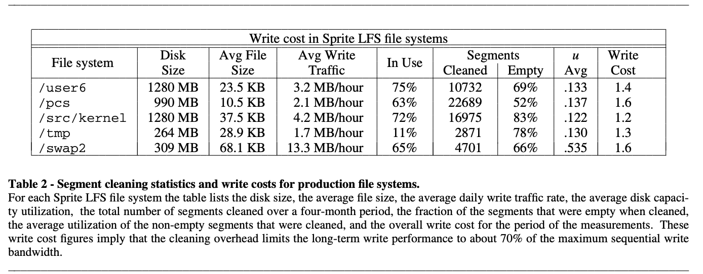

我们认为 Sprite LFS 中清理成本低于模拟的原因有两个。首先，模拟中的所有文件都只有一个块长。而在实际情况中，有大量较长的文件，并且它们通常是整体写入和删除的。这导致单个段内的局部性更强。在最理想的情况下，如果文件远大于段长度，删除该文件将产生一个或多个完全空的段。第二个区别在于模拟中的访问模式在热文件组和冷文件组内是均匀分布的。而在实际情况中，有大量几乎不被写入的文件（现实中的冷段比模拟中的冷段更冷）。日志结构文件系统会将这些非常冷的文件隔离在独立的段中，并且从不清理它们。在模拟中，每个段最终都会被修改，因此必须进行清理。

如果第 5.1 节中对 Sprite LFS 的测量有些过于乐观，那么本节中的测量如果说有偏差，也可能是偏悲观的。实际上，可以在夜间或其他空闲时间执行大部分清理操作，以便在活动高峰期仍然有可用的空段。我们对 Sprite LFS 的经验尚不足以确定这是否可行。此外，我们预计随着经验的积累和算法的优化，Sprite LFS 的性能还会进一步提升。例如，我们尚未仔细分析一次应清理多少段的策略问题，但我们认为这一点可能会影响系统将热数据与冷数据分离的能力。

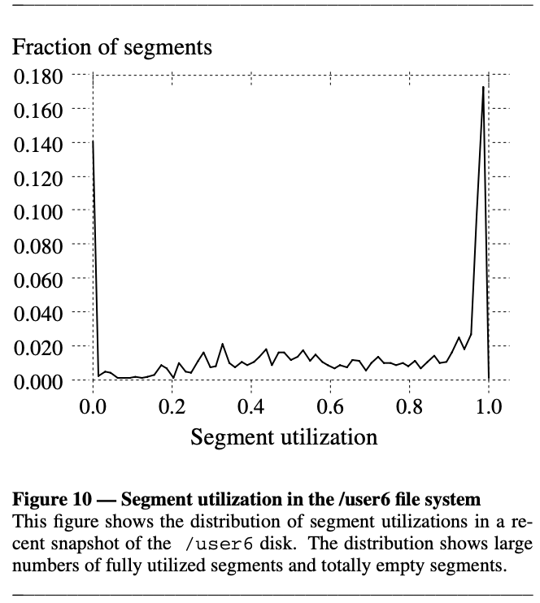

### 5.3. Crash recovery

尽管生产系统尚未安装崩溃恢复代码，但该代码足够可靠，可以用来测量各种崩溃场景下的恢复时间。恢复时间取决于检查点间隔以及正在执行的操作类型和速率。Table 3 显示了不同文件大小和恢复文件数据量的恢复时间。不同的崩溃配置是通过运行一个程序生成的，该程序在系统崩溃前创建了 1、10 或 50 兆字节的固定大小文件。使用了一个特殊版本的 Sprite LFS，该版本具有无限检查点间隔，并且从不将目录更改写入磁盘。在恢复的回滚过程中，创建的文件必须被加入 inode 映射、创建目录条目，并更新段使用表。

Table 3 显示，恢复时间随最后一次检查点与崩溃之间写入的文件数量和大小而变化。通过限制检查点之间写入的数据量，可以对恢复时间进行约束。根据表 2 中的平均文件大小和每日写入流量，即使检查点间隔长达一小时，平均恢复时间也约为一秒。按最大观测写入速率 150 兆字节/小时计算，每增加 70 秒的检查点间隔，最大恢复时间将增加一秒。

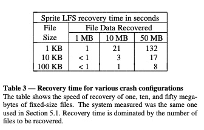

### 5.4. Other overheads in Sprite LFS

Table 4 显示了写入磁盘的各种数据类型的相对重要性，既包括它们在磁盘上占用的活跃块比例，也包括它们在写入日志的数据中所占的比例。磁盘上超过 99% 的活跃数据由文件数据块和间接块组成。然而，大约 13% 的日志写入信息由 inode、inode 映射块和段映射块组成，这些数据通常会被快速覆盖。仅 inode 映射就占据了日志写入数据的 7% 以上。我们怀疑这是由于 Sprite LFS 当前使用的短检查点间隔，使得元数据比实际需要更频繁地写入磁盘。我们预计，在安装回滚恢复（roll-forward recovery）并增加检查点间隔后，元数据的日志带宽开销将显著下降。

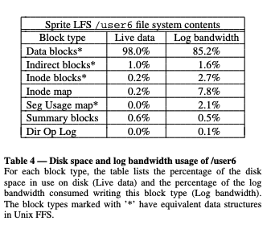

## 6. Related work

日志结构文件系统的概念以及 Sprite LFS 的设计借鉴了许多不同存储管理系统的思想。在若干针对一次性写入介质构建文件系统的提案中，已经出现了类似日志结构的文件系统[17, 18]。除了以追加的方式写入所有更改外，这些系统还维护类似于 Sprite LFS 的 inode 映射和 inode 的索引信息，以便快速定位和读取文件。它们与 Sprite LFS 的区别在于，由于介质是一次性写入的，这些文件系统无需回收日志空间。

Sprite LFS 中使用的段清理方法类似于为编程语言开发的垃圾回收器中的回收机制[19]。Sprite LFS 中的成本-收益段选择策略以及段清理过程中对块的按年龄排序，将文件划分为不同的“代”，这与分代垃圾回收方案类似[20]。这些垃圾回收方案与 Sprite LFS 的一个显著区别在于，分代垃圾回收器可以高效地进行随机访问，而在文件系统中为了实现高性能则必须进行顺序访问。此外，Sprite LFS 可以利用每个块最多只能属于一个文件的特点，使用比编程语言系统中更简单的算法来识别垃圾数据。

Sprite LFS 中使用的日志方案类似于数据库系统中开创性的方案。几乎所有数据库系统都使用预写日志（write-ahead logging）以实现崩溃恢复和高性能[13]，但它们与 Sprite LFS 在日志使用方式上有所不同。Sprite LFS 和数据库系统都将日志视为磁盘上数据状态的最新“真实来源”。主要区别在于，数据库系统不将日志作为数据的最终存储位置：它们为此保留了单独的数据区域。数据库系统的独立数据区域意味着它们不需要 Sprite LFS 的段清理机制来回收日志空间。当已记录的更改被写入最终位置后，日志占用的空间即可被回收。由于所有读取请求都从数据区域处理，因此日志可以大幅压缩而不会影响读取性能。通常数据库日志只写入已更改的字节，而不像 Sprite LFS 那样写入整个块。

Sprite LFS 的崩溃恢复机制采用检查点和使用“重做日志（redo log）”的前滚（roll-forward）方法，这与数据库系统和对象存储库中使用的技术类似[21]。由于日志就是数据的最终存储位置，Sprite LFS 的实现得以简化。Sprite LFS 恢复时，不需要将操作重做到单独的数据副本上，而是确保索引指向日志中数据的最新副本。

在文件缓存中收集数据并以大块写入磁盘的做法类似于数据库系统中的分组提交（group commit）概念[22]，以及在内存数据库系统中使用的技术[23, 24]。

## 7. Conclusion

日志结构文件系统的基本原理很简单：在主存中的文件缓存里收集大量新数据，然后通过一次大的 I/O 将数据写入磁盘，以充分利用磁盘的全部带宽。实现这一想法的复杂性在于必须维护磁盘上的大块空闲区域，但我们的仿真分析和 Sprite LFS 的实践经验表明，通过基于成本与收益的简单策略可以实现较低的清理开销。尽管我们开发日志结构文件系统是为了支持大量小文件的工作负载，这种方法对大文件访问同样非常有效。特别地，对于那些整体创建并删除的非常大文件，几乎没有清理开销。

总结而言，日志结构文件系统可以比现有文件系统更高效地利用磁盘，效率提升可达一个数量级。这将使计算机系统在 I/O 限制再次成为可扩展性瓶颈之前，能够利用几代更快速的处理器。

## 8. Acknowledgments

Diane Greene、Mary Baker、John Hartman、Mike Kupfer、Ken Shirriff 和 Jim Mott-Smith 对本文稿的撰写提供了有益的意见。

> 磁盘利用效率比现有文件系统高出一个数量级；系统崩溃后无需扫描整个磁盘以恢复一致性；增加索引提高读取效率。

> [论文链接](https://people.eecs.berkeley.edu/~brewer/cs262/LFS.pdf)
