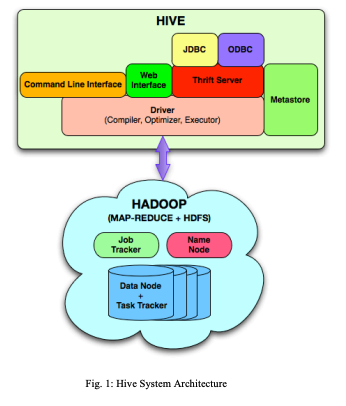
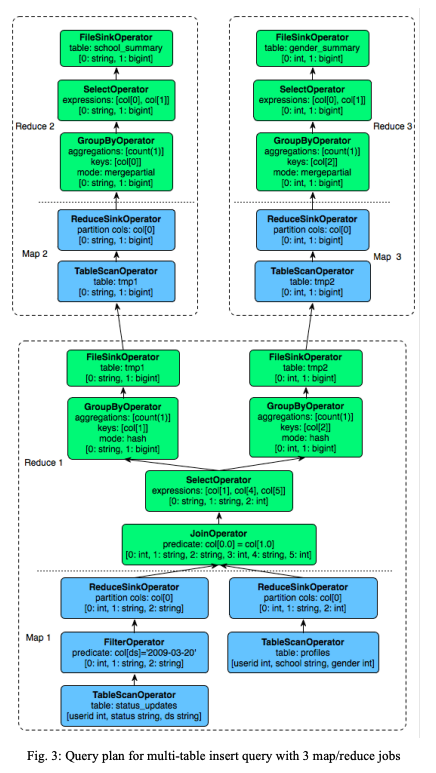

# Hive – A Petabyte Scale Data Warehouse Using Hadoop

> Ashish Thusoo, Joydeep Sen Sarma, Namit Jain, Zheng Shao, Prasad Chakka, Ning Zhang, Suresh Antony, Hao Liu and Raghotham Murthy, Facebook Data Infrastructure Team，2010

## 目录

- [Abstract](#abstract)
- [I. INTRODUCTION](#i-introduction)
- [II. DATA MODEL, TYPE SYSTEM AND QUERY LANGUAGE](#ii-data-model-type-system-and-query-language)
  - [A. Data Model and Type System](#a-data-model-and-type-system)
  - [B. Query Language](#b-query-language)
- [III. DATA STORAGE, SERDE AND FILE FORMATS](#iii-data-storage-serde-and-file-formats)
  - [A. Data Storage](#a-data-storage)
  - [B. Serialization/Deserialization (SerDe)](#b-serializationdeserialization-serde)
  - [C. File Formats](#c-file-formats)
- [IV. SYSTEM ARCHITECTURE AND COMPONENTS](#iv-system-architecture-and-components)
  - [A. Metastore](#a-metastore)
  - [B. Query Compiler](#b-query-compiler)
  - [C. Execution Engine](#c-execution-engine)
- [V. HIVE USAGE IN FACEBOOK](#v-hive-usage-in-facebook)
- [VI.RELATED WORK](#virelated-work)
- [VII. CONCLUSIONS AND FUTURE WORK](#vii-conclusions-and-future-work)
- [ACKNOWLEDGMENT](#acknowledgment)


## Abstract

在工业界，用于商业智能的数据集收集与分析规模正在迅速增长，使得传统的数据仓库解决方案成本高昂且难以承受。Hadoop[1] 是一个流行的开源 MapReduce 实现，目前被 Yahoo、Facebook 等公司用于在通用硬件上存储和处理极大规模的数据集。然而，MapReduce 编程模型属于较低层次的模型，开发者需要编写难以维护和重用的自定义程序。

本文提出 Hive，一种构建在 Hadoop 之上的开源数据仓库解决方案。Hive 支持以类 SQL 的声明式语言 HiveQL 表达的查询，这些查询会被编译为 MapReduce 作业，并使用 Hadoop 执行。此外，HiveQL 允许用户将自定义 MapReduce 脚本嵌入查询中。该语言包含一个类型系统，支持包含原始类型的表、数组和映射等集合，以及这些类型的嵌套组合。底层 IO 库可以扩展，以查询自定义格式的数据。

Hive 还包括一个系统目录——Metastore——其中包含模式（schema）和统计信息，这些信息在数据探索、查询优化和查询编译中非常有用。在 Facebook 中，Hive 仓库包含数万个表，存储超过 700TB 的数据，并被每月超过 200 名用户广泛用于报告和临时分析。

## I. INTRODUCTION

在 Facebook，针对大规模数据集的可扩展分析一直是多个团队（包括工程团队和非工程团队）核心功能的一部分。除了公司分析师使用的临时分析和商业智能应用之外，Facebook 的许多产品也基于数据分析。这些产品范围从简单的报告类应用（如 Facebook 广告网络的 Insights）到更高级的产品，例如 Facebook 的 Lexicon 产品[2]。因此，构建一个灵活的基础设施以满足这些多样化应用和用户的需求，并能够随着 Facebook 上不断增长的数据量以经济高效的方式扩展，是至关重要的。Hive 与 Hadoop 正是我们在 Facebook 用来满足这些需求的技术。

在 2008 年之前，Facebook 的整个数据处理基础设施是围绕使用商用关系型数据库系统（RDBMS）构建的数据仓库建立的。当时我们生成的数据增长非常快——例如，2007 年我们拥有 15TB 数据集，而今天已经增长到 700TB。彼时的基础设施远不能满足需求，一些日常数据处理作业需要超过一天才能完成，并且随着时间推移情况只会越来越糟。我们迫切需要一种能够随数据规模扩展的基础设施。因此，我们开始探索 Hadoop 以满足扩展需求。Hadoop 已经作为开源项目在 PB 级规模上被使用，并能够利用通用硬件提供可扩展性，这对我们来说极具吸引力。此前需要一天以上完成的作业，现在使用 Hadoop 可以在数小时内完成。

然而，对于终端用户而言，使用 Hadoop 并不容易，尤其是对那些不熟悉 MapReduce 的用户。用户需要为简单任务（如获取原始计数或平均值）编写 MapReduce 程序。Hadoop 缺乏类似 SQL 等流行查询语言的表达能力，因此用户往往需要花费数小时（甚至数天）来为简单分析编写程序。我们清楚地认识到，要真正提升公司分析数据的效率，就必须改善 Hadoop 的查询能力。将数据更贴近用户的需求正是促使我们在 2007 年 1 月开发 Hive 的动机。我们的愿景是将表、列、分区以及 SQL 的一个子集等熟悉概念引入 Hadoop 的非结构化世界，同时仍保持 Hadoop 所具有的可扩展性和灵活性。Hive 于 2008 年 8 月开源，自此之后被众多 Hadoop 用户用于其数据处理需求和探索。

从一开始，Hive 就在 Facebook 内部的所有用户中非常受欢迎。如今，我们在 Hadoop/Hive 集群上定期运行数千个作业，用户数以百计，应用范围广泛，从简单的数据汇总作业，到商业智能、机器学习应用，乃至支持 Facebook 产品功能。

在接下来的章节中，我们将详细介绍 Hive 的架构与功能。第二节介绍数据模型、类型系统以及 HiveQL。第三节详细说明 Hive 表中的数据如何存储在底层分布式文件系统——HDFS（Hadoop 文件系统）中。第四节描述系统架构及 Hive 的各个组件。第五节重点展示 Hive 在 Facebook 的使用统计，第六节介绍相关工作。第七节总结全文并提出未来工作方向。

## II. DATA MODEL, TYPE SYSTEM AND QUERY LANGUAGE

Hive 将数据组织为数据库中广为理解的概念，如表（tables）、列（columns）、行（rows）和分区（partitions）。它支持所有主要的原始类型——整数（integers）、浮点数（floats）、双精度数（doubles）和字符串（strings）——以及复杂类型（complex types），如映射（maps）、列表（lists）和结构体（structs）。复杂类型可以任意嵌套，以构建更为复杂的类型。此外，Hive 允许用户通过自定义类型和函数来扩展系统。Hive 的查询语言与 SQL 非常相似，因此任何熟悉 SQL 的用户都能轻松理解。然而，在数据模型、类型系统和 HiveQL 中存在一些细微差别，这些差别不同于传统数据库，其设计灵感来源于 Facebook 的实际经验。在本节中，我们将重点介绍这些差异及其他相关细节。

### A. Data Model and Type System

与传统数据库类似，Hive 将数据存储在表（table）中。每个表由若干行（row）组成，而每一行又包含指定数量的列（column）。每一列都关联一个类型，该类型可以是原始类型（primitive type）或复杂类型（complex type）。目前，Hive 支持如下原始类型：

* 整数类型（Integers）：bigint（8 字节）、int（4 字节）、smallint（2 字节）、tinyint（1 字节）。所有整数类型均为有符号类型。
* 浮点数类型（Floating point numbers）：float（单精度）、double（双精度）。
* 字符串（String）。

Hive 还原生支持以下复杂类型：

* 关联数组（Associative arrays）：map<key-type, value-type>
* 列表（Lists）：list<element-type>
* 结构体（Structs）：struct<field-name: field-type, ...>

这些复杂类型是模板化（templated）的，并且可以通过组合生成任意复杂度的类型。例如，`list<map<string, struct<p1:int, p2:int>>>` 表示一个列表（list），其元素为关联数组（map），该关联数组将字符串映射到结构体（struct），而该结构体又包含两个名为 p1 和 p2 的整数字段。这些类型都可以在 `CREATE TABLE` 语句中组合使用，以创建具有所需模式（schema）的表。例如，下面的语句创建了一个名为 `t1`、具有复杂模式的表：

```sql
CREATE TABLE t1(
  st string,
  fl float,
  li list<map<string, struct<p1:int, p2:int>>>
);
```

查询表达式可以使用 `.` 运算符访问结构体中的字段；关联数组和列表中的值可以使用 `[]` 运算符进行访问。在上述示例中，`t1.li[0]` 返回列表中的第一个元素，而 `t1.li[0]['key']` 返回该关联数组中键为 `'key'` 所对应的结构体。最后，可以通过 `t1.li[0]['key'].p2` 访问该结构体中的 `p2` 字段。通过这些构造，Hive 能够支持任意复杂度的数据结构。

以上述方式创建的表，默认会使用 Hive 中已存在的序列化器与反序列化器（serializers / deserializers）进行序列化和反序列化。然而，在某些情况下，表中的数据可能由其他程序预先生成，甚至可能是遗留数据（legacy data）。Hive 提供了在无需对数据进行转换的情况下，将这些数据纳入表中的灵活性，这对于大规模数据集而言可以节省大量时间。
正如我们将在后续章节中介绍的那样，这一目标可以通过向 Hive 提供一个实现了 SerDe Java 接口的 jar 包来实现。在这种情况下，类型信息也可以由该 jar 提供，具体方式是实现相应的 ObjectInspector Java 接口，并通过 SerDe 接口中提供的 `getObjectInspector` 方法暴露该实现。关于这些接口的更多细节可以在 Hive wiki [3] 中找到，但这里需要强调的核心要点是：只要提供一个包含 SerDe 和 ObjectInspector 接口实现的 jar，任何任意的数据格式及其内部编码的类型都可以被接入 Hive。
Hive 中支持的所有原生 SerDe 以及复杂类型，实际上也都是这些接口的实现。因此，一旦在表与对应的 jar 之间建立了正确的关联，查询层就会将这些自定义类型和格式与原生类型和格式一视同仁地对待。
例如，下面的语句将一个包含 SerDe 和 `ObjectInspector` 实现的 jar 添加到分布式缓存（distributed cache）中（[4]），使其对 Hadoop 可用，然后继续创建一个使用自定义 SerDe 的表：

```sql
add jar /jars/myformat.jar;

CREATE TABLE t2
ROW FORMAT SERDE 'com.myformat.MySerDe';
```

需要注意的是，如果条件允许，表的模式（schema）也可以通过组合复杂类型和原始类型来提供。

### B. Query Language

Hive 查询语言（HiveQL）由 SQL 的一个子集以及一些我们在实际环境中发现十分有用的扩展组成。传统 SQL 中的诸多特性均被支持，例如 `FROM` 子句中的子查询、多种类型的连接（包括内连接、左外连接、右外连接和全外连接）、笛卡尔积、`GROUP BY` 与聚合操作、`UNION ALL`、`CREATE TABLE AS SELECT`，以及大量适用于原始类型和复杂类型的实用函数，这使得该语言在整体上非常接近 SQL。事实上，对于前述许多结构，其语义与 SQL 完全一致。这使得任何熟悉 SQL 的用户都可以直接启动 Hive CLI（命令行接口），并立即开始对系统进行查询。Hive 还提供了诸如 `SHOW TABLES`、`DESCRIBE` 等有用的元数据浏览功能，同时也支持通过 `EXPLAIN` 来检查查询执行计划（尽管这些执行计划在形式上与传统 RDBMS 中看到的计划有很大不同）。HiveQL 也存在一些限制。例如，在连接谓词（join predicate）中仅支持等值条件（equality predicates），并且连接必须使用 ANSI SQL 连接语法进行显式声明，例如：

```sql
SELECT t1.a1 AS c1, t2.b1 AS c2
FROM t1 JOIN t2
ON (t1.a2 = t2.b2);
```

而不能使用更为传统的隐式连接写法：

```sql
SELECT t1.a1 AS c1, t2.b1 AS c2
FROM t1, t2
WHERE t1.a2 = t2.b2;
```

另一个限制体现在插入（insert）操作的方式上。Hive 当前不支持向已有表或数据分区中追加插入数据，所有插入操作都会覆盖（overwrite）已有数据。因此，我们在语法层面对此进行了明确区分，示例如下：

```sql
INSERT OVERWRITE TABLE t1
SELECT * FROM t2;
```

在实际使用中，这些限制并未构成严重问题。我们很少遇到无法用等值连接（equi-join）来表达的查询；同时，由于大多数数据是按天或按小时加载到数据仓库中的，我们通常只需将数据加载到该天或该小时对应的新分区中即可。然而，我们也意识到，随着数据加载频率的不断提高，分区数量可能会变得非常庞大，这在未来可能需要我们引入 `INSERT INTO` 语义。另一方面，Hive 缺乏 `INSERT INTO`、`UPDATE` 和 `DELETE` 操作，也使我们能够在不实现复杂锁协议的情况下，采用非常简单的机制来处理读写并发问题。

除了上述限制之外，HiveQL 还提供了扩展，用于支持用户以 MapReduce 程序的形式表达分析逻辑，并且可以使用用户选择的任意编程语言来实现。这使得高级用户能够将复杂逻辑以 MapReduce 程序的方式无缝嵌入到 HiveQL 查询中。在某些情况下，这甚至是唯一合理的解决方案，例如当用户希望在数据转换过程中复用 Python、PHP 或其他语言中已有的库时。例如，在一个文档表上实现经典的词频统计（word count）示例，可以通过 MapReduce 的方式在 HiveQL 中表达，如下所示：

```sql
FROM (
  MAP doctext USING 'python wc_mapper.py' AS (word, cnt)
  FROM docs
  CLUSTER BY word
) a
REDUCE word, cnt USING 'python wc_reduce.py';
```

如该示例所示，`MAP` 子句用于指明如何使用用户程序（此处为 `python wc_mapper.py`）将输入列（本例中为 `doctext`）转换为输出列（`word` 和 `cnt`）。子查询中的 `CLUSTER BY` 子句指定了用于对输出列进行哈希分区的列，从而将数据分发到各个 reducer；最后，`REDUCE` 子句指定了要在子查询输出列上调用的用户程序（本例中为 `python wc_reduce.py`）。

在某些情况下，mapper 与 reducer 之间的数据分发准则需要保证传递给 reducer 的数据不仅按某些列进行分区，还要按照另一组不同的列进行排序。例如，在需要对同一会话（session）中的所有操作按时间顺序进行处理的场景下，就需要这样的能力。为此，Hive 提供了 `DISTRIBUTE BY` 和 `SORT BY` 子句来实现这一需求，如下例所示：

```sql
FROM (
  FROM session_table
  SELECT sessionid, tstamp, data
  DISTRIBUTE BY sessionid SORT BY tstamp
) a
REDUCE sessionid, tstamp, data USING 'session_reducer.sh';
```

需要注意的是，在上述示例中并未出现 `MAP` 子句，这表明输入列并未进行任何转换。类似地，在 reduce 阶段不对数据进行转换的情况下，也可以只包含 `MAP` 子句而不包含 `REDUCE` 子句。此外，在前面的示例中，`FROM` 子句出现在 `SELECT` 子句之前，这也是对标准 SQL 语法的一种偏离。Hive 允许用户在同一个子查询中交换 `FROM` 与 `SELECT` / `MAP` / `REDUCE` 子句的顺序。这一特性在处理多重插入（multi inserts）时尤为直观且有用。HiveQL 支持在同一条查询中，将不同转换结果分别插入到不同的表、分区、HDFS 目录或本地目录中。该能力有助于减少对输入数据的扫描次数，如下例所示：

```sql
FROM t1
 INSERT OVERWRITE TABLE t2
 SELECT t3.c2, count(1)
 FROM t3
 WHERE t3.c1 <= 20
 GROUP BY t3.c2

 INSERT OVERWRITE DIRECTORY '/output_dir'
 SELECT t3.c2, avg(t3.c1)
 FROM t3
 WHERE t3.c1 > 20 AND t3.c1 <= 30
 GROUP BY t3.c2

 INSERT OVERWRITE LOCAL DIRECTORY '/home/dir'
 SELECT t3.c2, sum(t3.c1)
 FROM t3
 WHERE t3.c1 > 30
 GROUP BY t3.c2;
```

在该示例中，表 t1 的不同部分被分别聚合，用于生成表 t2、一个 HDFS 目录（`/output_dir`）以及一个本地目录（用户机器上的 `/home/dir`）。

## III. DATA STORAGE, SERDE AND FILE FORMATS

### A. Data Storage

尽管表（table）是 Hive 中的逻辑数据单元，但表的元数据会将表中的数据关联到 HDFS 目录中。HDFS 命名空间中主要的数据单元及其映射关系如下：

* 表（Tables）：一个表存储在 HDFS 中的一个目录下。
* 分区（Partitions）：表的一个分区存储在该表目录下的一个子目录中。
* 桶（Buckets）：一个桶存储为一个文件，具体位于分区目录或表目录中，取决于该表是否为分区表。

例如，表 `test_table` 会被映射到 HDFS 中的
`<warehouse_root_directory>/test_table`。其中，`warehouse_root_directory` 由 `hive-site.xml` 中的配置参数 `hive.metastore.warehouse.dir` 指定。该参数的默认值为 `/user/hive/warehouse`。

一个表可以是分区表（partitioned）或非分区表（non-partitioned）。分区表可以通过在 `CREATE TABLE` 语句中指定 `PARTITIONED BY` 子句来创建，如下所示：

```sql
CREATE TABLE test_part(c1 string, c2 int)
PARTITIONED BY (ds string, hr int);
```

在上述示例中，表的分区将存储在 HDFS 中的 `/user/hive/warehouse/test_part` 目录下。对于用户指定的每一组不同的 `ds` 和 `hr` 值，都会创建一个分区。需要注意的是，分区列并不属于表数据，分区列的值会编码在该分区的目录路径中（同时也存储在表的元数据中）。可以通过 `INSERT` 语句或通过 `ALTER TABLE` 语句向表添加新分区。例如，以下两个语句都会向 `test_part` 表添加一个新分区：

```sql
INSERT OVERWRITE TABLE test_part 
PARTITION(ds='2009-01-01', hr=12)
SELECT * FROM t;

ALTER TABLE test_part
ADD PARTITION(ds='2009-02-02', hr=11);
```

其中，`INSERT` 语句会将表 `t` 中的数据填充到新分区中，而 `ALTER TABLE` 则创建一个空分区。两条语句最终都会在表的 HDFS 目录下创建对应的子目录：

```
/user/hive/warehouse/test_part/ds=2009-01-01/hr=12
/user/hive/warehouse/test_part/ds=2009-02-02/hr=11
```

这种做法在分区值中包含诸如 `/` 或 `:` 等 HDFS 用于表示目录结构的字符时，可能会带来一些复杂性，但通过对这些字符进行适当的转义（escaping），即可生成与 HDFS 兼容的目录名称。

Hive 编译器能够利用这些信息，对需要扫描的目录进行裁剪（prune），从而在执行查询时只处理相关数据。以 `test_part` 表为例，查询

```sql
SELECT * FROM test_part WHERE ds='2009-01-01';
```

仅会扫描 `/user/hive/warehouse/test_part/ds=2009-01-01` 目录下的所有文件；而查询

```sql
SELECT * FROM test_part
WHERE ds='2009-02-02' AND hr=11;
```

则仅会扫描 `/user/hive/warehouse/test_part/ds=2009-02-02/hr=11` 目录下的所有文件。这种数据裁剪显著缩短了查询处理所需时间。在很多方面，这种分区方案与许多数据库厂商所称的“列表分区（list partitioning）”[6] 类似，但也存在差异：Hive 中分区键的值存储在元数据中，而非表数据本身。

Hive 使用的最后一个存储单元概念是桶（Buckets）。桶是表或分区叶子目录中的一个文件。在创建表时，用户可以指定所需的桶数量以及用于分桶的列。在当前实现中，这些信息主要用于在用户对数据进行采样查询时裁剪数据，例如，一个被分为 32 个桶的表，可以通过选择查看第一个桶的数据快速生成 1/32 的样本。同样，语句

```sql
SELECT * FROM t TABLESAMPLE(2 OUT OF 32);
```

将扫描第二个桶中的数据。需要注意的是，确保桶文件正确创建和命名的责任在于应用程序，HiveQL 的 DDL 语句目前并不会自动分桶以保证与表属性兼容。因此，分桶信息在使用时应谨慎。尽管表的数据通常存储在 HDFS 中的 `<warehouse_root_directory>/test_table` 位置，Hive 也允许用户查询存储在 HDFS 其他位置的数据。这可以通过 `EXTERNAL TABLE` 子句实现，如下所示：

```sql
CREATE EXTERNAL TABLE test_extern(c1 string, c2 int)
LOCATION '/user/mytables/mydata';
```

通过该语句，用户可以指定 `test_extern` 为一个外部表（external table），每行包含两个列——`c1` 和 `c2`。同时，数据文件存储在 HDFS 的 `/user/mytables/mydata` 位置。需要注意的是，由于未定义自定义 SerDe，默认假设数据采用 Hive 的内部格式。外部表与普通表的区别在于：对外部表执行 `DROP TABLE` 命令只会删除表的元数据，而不会删除任何数据；而对普通表执行 `DROP TABLE` 命令则会同时删除与表关联的数据。

### B. Serialization/Deserialization (SerDe)

如前所述，Hive 可以使用用户提供的 SerDe Java 接口实现并将其与表或分区关联，从而能够解析和查询自定义数据格式。Hive 中默认的 SerDe 实现称为 LazySerDe——它惰性地将行反序列化为内部对象，只有在查询表达式中确实需要某列时，才对该列进行反序列化。LazySerDe 假设数据文件中的行以换行符（ASCII 代码 13）分隔，行内列以 Ctrl-A（ASCII 代码 1）分隔。该 SerDe 也可以用于读取列之间使用其他分隔符的数据。

例如，语句：

```sql
CREATE TABLE test_delimited(c1 string, c2 int)
ROW FORMAT DELIMITED
FIELDS TERMINATED BY '\002'
LINES TERMINATED BY '\012';
```

该语句指定表 `test_delimited` 的数据以 Ctrl-B（ASCII 代码 2）作为列分隔符，以 Ctrl-L（ASCII 代码 12）作为行分隔符。此外，可以指定分隔符来分隔 map 的序列化键值，也可以为列表（collection）的各元素指定不同的分隔符。示例如下：

```sql
CREATE TABLE test_delimited2(
  c1 string,
  c2 list<map<string, int>>
)
ROW FORMAT DELIMITED
FIELDS TERMINATED BY '\002'
COLLECTION ITEMS TERMINATED BY '\003'
MAP KEYS TERMINATED BY '\004';
```

除了 LazySerDe 外，`hive_contrib.jar` 中还提供了一些其他有趣的 SerDe。在这些 SerDe 中，一个特别有用的是 **RegexSerDe**，它允许用户指定正则表达式，从行中解析出各列。例如，以下语句可用于解析 Apache 日志：

```sql
add jar 'hive_contrib.jar';

CREATE TABLE apachelog(
  host string,
  identity string,
  user string,
  time string,
  request string,
  status string,
  size string,
  referer string,
  agent string
)
ROW FORMAT SERDE
  'org.apache.hadoop.hive.contrib.serde2.RegexSerDe'
WITH SERDEPROPERTIES(
  'input.regex' = '([^ ]*) ([^ ]*) ([^ ]*) (-|\\[[^\\]]*\\]) ([^"]*|"[^"]*") (-|[0-9]*) (-|[0-9]*)(?: ([^"]*|"[^"]*") ([^"]*|"[^"]*"))?',
  'output.format.string' = '%1$s %2$s %3$s %4$s %5$s %6$s %7$s %8$s %9$s'
);
```

`input.regex` 属性是应用于每条记录的正则表达式，`output.format.string` 指定如何根据正则表达式的分组匹配构造列字段。该示例还展示了如何使用 `WITH SERDEPROPERTIES` 子句向 SerDe 传递任意键值对，这一功能在向自定义 SerDe 传递任意参数时非常有用。

### C. File Formats

Hadoop 文件可以以不同格式存储。Hadoop 中的文件格式指定了记录在文件中的存储方式。例如，文本文件存储在 `TextInputFormat` 中，而二进制文件可以存储为 `SequenceFileInputFormat`。用户也可以实现自己的文件格式。Hive 对数据存储的文件输入格式类型没有限制，可以在创建表时指定文件格式。除了上述两种格式外，Hive 还提供了 `RCFileInputFormat`，以列式（column-oriented）的方式存储数据。这种组织方式在查询不访问表中所有列时可以显著提高性能。用户可以添加自己的文件格式并将其与表关联，如下所示：

```sql
CREATE TABLE dest1(key INT, value STRING)
STORED AS
  INPUTFORMAT 'org.apache.hadoop.mapred.SequenceFileInputFormat'
  OUTPUTFORMAT 'org.apache.hadoop.mapred.SequenceFileOutputFormat';
```

`STORED AS` 子句指定了用于确定表或分区目录中文件输入和输出格式的类。该类可以是任何实现了 `FileInputFormat` 和 `FileOutputFormat` Java 接口的类。这些类可以通过 JAR 提供给 Hadoop，方式与前面添加自定义 SerDe 的示例类似。

## IV. SYSTEM ARCHITECTURE AND COMPONENTS

以下组件是 Hive 的主要构建模块：

* **Metastore** —— 存储系统目录以及表、列、分区等元数据的组件。
* **Driver** —— 管理 HiveQL 语句在 Hive 中生命周期的组件。Driver 还维护会话句柄和会话统计信息。
* **Query Compiler** —— 将 HiveQL 编译为有向无环图（DAG）的 Map/Reduce 任务的组件。
* **Execution Engine** —— 按依赖顺序执行编译器生成的任务的组件。Execution Engine 与底层的 Hadoop 实例进行交互。
* **HiveServer** —— 提供 Thrift 接口以及 JDBC/ODBC 服务的组件，为 Hive 与其他应用集成提供方式。
* **客户端组件** —— 包括命令行界面（CLI）、Web UI 以及 JDBC/ODBC 驱动。
* **可扩展接口（Extensibility Interfaces）** —— 包括前文描述的 SerDe 和 ObjectInspector 接口，以及 UDF（用户自定义函数）和 UDAF（用户自定义聚合函数）接口，允许用户定义自定义函数。

HiveQL 语句可以通过 CLI、Web UI 或使用 Thrift、ODBC 或 JDBC 接口的外部客户端提交。Driver 首先将查询传递给编译器，查询在编译器中经过解析（parse）、类型检查（type check）和语义分析（semantic analysis）阶段，使用存储在 Metastore 中的元数据。编译器生成逻辑计划，并通过简单的基于规则的优化器进行优化。最终生成的优化计划以 Map-Reduce 任务和 HDFS 任务构成的 DAG 形式输出。Execution Engine 然后按照任务依赖顺序使用 Hadoop 执行这些任务。

本节将提供关于 Metastore、Query Compiler 和 Execution Engine 的更多细节。

<div align=center></div>

### A. Metastore

Metastore 作为 Hive 的系统目录。它存储关于表、表分区、模式（schemas）、列及其类型、表位置等的所有信息。该信息可以通过 Thrift ([7]) 接口进行查询或修改，因此可以被不同编程语言的客户端调用。由于这些信息需要快速提供给编译器，我们选择将其存储在传统的关系型数据库（RDBMS）中。Metastore 因此成为运行在 RDBMS 上的应用程序，并使用一个开源 ORM 层 **DataNucleus** ([8])，将对象表示转换为关系模式，反之亦然。我们采用这种方法，而不是将信息存储在 HDFS 中，是因为 Metastore 需要具有非常低的延迟。DataNucleus 层允许我们插件多种 RDBMS 技术。在 Facebook 的部署中，我们使用 MySQL 存储这些信息。

Metastore 对 Hive 非常关键。没有系统目录，就无法对 Hadoop 文件施加结构。因此，存储在 Metastore 中的信息需要定期备份。理想情况下，还应部署一个复制服务器，以提供许多生产环境所需的高可用性。同时，需要确保该服务器能够随着用户提交的查询数量进行扩展。Hive 通过保证作业的 Mapper 或 Reducer 不直接调用 Metastore 来解决这一问题。Mapper 或 Reducer 所需的任何元数据，都通过编译器生成的 XML 计划文件传递，这些文件包含运行时所需的所有信息。

Metastore 中的 ORM 逻辑可以部署在客户端库中，使其在客户端运行并直接调用 RDBMS。这种部署易于启动，如果与 Hive 交互的客户端仅有 CLI 或 Web UI，则非常合适。然而，一旦 Hive 元数据需要被 Python、PHP 等非 Java 语言的程序操作和查询，就必须部署一个独立的 Metastore 服务器。

### B. Query Compiler

存储在 Metastore 中的元数据被查询编译器用于生成执行计划。类似于传统数据库中的编译器，Hive 编译器按以下步骤处理 HiveQL 语句：

* **解析（Parse）** —— Hive 使用 Antlr 为查询生成抽象语法树（AST）。
* **类型检查和语义分析（Type checking and Semantic Analysis）** —— 在此阶段，编译器从 Metastore 获取所有输入和输出表的信息，并利用这些信息构建逻辑计划。编译器检查表达式中的类型兼容性，并在此阶段标记任何编译时语义错误。AST 转换为操作符 DAG 的过程经过一个称为查询块（Query Block, QB）树的中间表示。编译器将嵌套查询转换为 QB 树中的父子关系。同时，QB 树表示还有助于将 AST 中的相关部分组织为比原始 AST 更适合转换为操作符 DAG 的形式。
* **优化（Optimization）** —— 优化逻辑由一系列转换组成，其中一个转换生成的操作符 DAG 被传递作为下一转换的输入。任何希望修改编译器或添加新的优化逻辑的人，都可以通过将转换实现为 `Transform` 接口的扩展，并将其添加到优化器的转换链中来实现。

转换逻辑通常包括对操作符 DAG 的遍历，当满足相关条件或规则时，对操作符 DAG 执行特定处理动作。参与转换的五个主要接口为 `Node`、`GraphWalker`、`Dispatcher`、`Rule` 和 `Processor`。操作符 DAG 中的节点实现 `Node` 接口，使得操作符 DAG 可以使用上述其他接口进行操作。典型的转换包括遍历 DAG，对每个访问的节点检查规则是否满足，如果满足则调用该规则对应的 `Processor`。`Dispatcher` 维护规则到处理器的映射并执行规则匹配。`Dispatcher` 被传递给 `GraphWalker`，以便在遍历节点时调度适当的 `Processor`。Figure 2 展示了典型转换的结构。

<div align=center></div>

Hive 在优化阶段目前执行的转换包括：

i. 列裁剪（Column pruning） —— 此优化步骤确保仅将查询处理中所需的列从行中投影出来。

ii. 谓词下推（Predicate pushdown） —— 若可能，将谓词下推至扫描阶段，以便在处理早期对行进行过滤。

iii. 分区裁剪（Partition pruning） —— 对分区列的谓词用于裁剪不满足谓词条件的分区文件。

iv. Map 端连接（Map side joins） —— 当连接中的部分表非常小时，小表会在所有 Mapper 中复制，并与其他表进行连接。此行为由查询中的提示触发，例如：

```sql
SELECT /*+ MAPJOIN(t2) */ t1.c1, t2.c1
FROM t1 JOIN t2 ON (t1.c2 = t2.c2);
```

多个参数控制用于在 Mapper 中保存复制表内容的内存量，包括 `hive.mapjoin.size.key` 和 `hive.mapjoin.cache.numrows`，它们控制表中保留在内存中的行数，同时提供连接键的大小信息。

v. 连接重排序（Join reordering） —— 大表以流式方式处理，而不在 Reducer 中驻留在内存中，小表则保持在内存中。这保证了连接操作不会超过 Reducer 端的内存限制。

除了 `MAPJOIN` 提示外，用户还可以提供提示或设置参数以实现以下功能：

i. 数据重分区以处理 GROUP BY 处理中的倾斜 —— 许多实际数据集在用于常见查询的 GROUP BY 列上具有幂律分布。在此情况下，将数据按 GROUP BY 列分发后在 Reducer 中进行聚合的常规计划效果不佳，因为大部分数据会发送到极少数 Reducer。更好的方案是在两个 Map/Reduce 阶段计算聚合。在第一阶段，数据随机分发（或在 DISTINCT 聚合情况下按 DISTINCT 列分发）到 Reducer，并计算部分聚合。然后将这些部分聚合按 GROUP BY 列分发到第二阶段 Map/Reduce 的 Reducer。由于部分聚合元组数量远小于基础数据集，这种方法通常能获得更好的性能。在 Hive 中，此行为可通过设置参数触发，如：

```sql
set hive.groupby.skewindata=true;
SELECT t1.c1, sum(t1.c2)
FROM t1
GROUP BY t1.c1;
```

ii. Mapper 中基于哈希的部分聚合 —— 基于哈希的部分聚合可以减少 Mapper 发送给 Reducer 的数据量，从而减少对这些数据进行排序和合并所花费的时间。因此，使用该策略可以获得显著的性能提升。Hive 允许用户控制 Mapper 中用于在哈希表中保存行的内存量。参数 `hive.map.aggr.hash.percentmemory` 指定 Mapper 内存中可用于保存哈希表的比例，例如 0.5 表示当哈希表大小超过 Mapper 最大内存的一半时，存储的部分聚合会发送至 Reducer。参数 `hive.map.aggr.hash.min.reduction` 也用于控制 Mapper 中使用的内存量。

物理计划生成（Generation of the physical plan）—— 优化阶段结束时生成的逻辑计划随后被拆分为多个 Map/Reduce 和 HDFS 任务。例如，对倾斜数据的 GROUP BY 操作可以生成两个 Map/Reduce 任务，随后是一个最终的 HDFS 任务，将结果移动到 HDFS 中的正确位置。在此阶段结束时，物理计划呈现为任务的有向无环图（DAG），每个任务封装计划的一部分。

下文展示一个多表插入查询及其经过所有优化后的对应物理计划示例：

```sql
FROM (
  SELECT a.status, b.school, b.gender
  FROM status_updates a 
  JOIN profiles b
  ON (a.userid = b.userid AND a.ds='2009-03-20')
) subq1
INSERT OVERWRITE TABLE gender_summary
  PARTITION(ds='2009-03-20')
SELECT subq1.gender, COUNT(1)
GROUP BY subq1.gender
INSERT OVERWRITE TABLE school_summary
  PARTITION(ds='2009-03-20')
SELECT subq1.school, COUNT(1)
GROUP BY subq1.school;
```

该查询包含一次连接操作，随后执行两个不同的聚合。通过将查询编写为多表插入（multi-table-insert），确保连接操作只执行一次。查询的计划如 Figure 3 所示。

计划中的节点表示物理操作符，边表示操作符之间的数据流。每个节点的最后一行表示该操作符的输出模式。由于篇幅限制，不描述每个操作符节点中指定的参数。该计划包含三个 Map-Reduce 作业。

<div align=center></div>

在同一 Map-Reduce 作业中，重分区操作符（ReduceSinkOperator）以下的操作树由 Mapper 执行，以上部分由 Reducer 执行。重分区本身由执行引擎完成。

注意，第一个 Map-Reduce 作业将数据写入 HDFS 的两个临时文件 tmp1 和 tmp2，分别被第二个和第三个 Map-Reduce 作业使用。因此，第二个和第三个 Map-Reduce 作业必须等待第一个作业完成。

### C. Execution Engine

最终，任务按照依赖关系的顺序执行。每个依赖任务仅在其所有前置任务完成后才会执行。Map/Reduce 任务首先将其计划部分序列化为 `plan.xml` 文件。该文件随后被加入到任务的作业缓存中，并通过 Hadoop 启动 `ExecMapper` 和 `ExecReducer` 的实例。

这些类各自反序列化 `plan.xml` 并执行操作 DAG 的相关部分。最终结果存储在临时位置。在整个查询结束时，对于 DML 操作，最终数据被移动到目标位置；对于查询操作，数据直接从临时位置提供。

## V. HIVE USAGE IN FACEBOOK

Hive 和 Hadoop 在 Facebook 被广泛用于各种数据处理。目前，我们的数据仓库中存储有 700TB 数据（在考虑三副本机制后，在 Hadoop 上占用原始空间约 2.1PB）。每天新增 5TB（复制后 15TB）的压缩数据。典型的压缩比为 1:7，有时更高。在任何特定一天，集群上提交的作业超过 7500 个，每天处理的压缩数据量超过 75TB。随着 Facebook 网络的持续增长，数据量也在持续增加。与此同时，随着公司规模的扩大，集群也必须随用户数量增长而扩展。

超过一半的工作负载来自临时查询，其余用于报表仪表盘。Hive 使在 Facebook 的 Hadoop 集群上运行此类工作负载成为可能，因为临时分析可以以简单的方式完成。然而，临时用户和报表用户共享同一资源带来了显著的运维挑战，因为临时作业不可预测。许多作业未进行适当调优，从而消耗了宝贵的集群资源，可能导致报表查询性能下降，而这些查询往往具有时间敏感性。目前 Hadoop 的资源调度能力较弱，唯一可行的解决方案似乎是为临时查询和报表查询维护独立的集群。

每天运行的 Hive 作业种类繁多，从生成各种汇总和多维数据的简单汇总作业，到更高级的机器学习算法。系统既被初学者使用，也被高级用户使用，新用户可在短时间培训后立即使用系统。

频繁使用还导致仓库中生成大量表，从而极大增加了对数据发现工具的需求，尤其是对新用户而言。总体而言，该系统使我们能够以传统仓储基础设施成本的一小部分向工程师和分析师提供数据处理服务。此外，Hadoop 可扩展至数千台普通节点，这使我们有信心在未来继续扩展该基础设施。

## VI.RELATED WORK

近期关于 PB 级数据处理系统的研究很多，包括开源系统和商业系统。Scope[14] 是构建在微软专有 Cosmos map/reduce 和分布式文件系统之上的类 SQL 语言。Pig[13] 允许用户编写声明式脚本处理数据。Hive 与这些系统不同，因为它提供了一个系统目录，用于在系统中持久化表的元数据。这使得 Hive 可以作为传统数据仓库使用，并可与标准报表工具如 MicroStrategy[16] 进行接口集成。HadoopDB[15] 重用 Hive 系统的大部分组件，但在每个节点上使用传统数据库实例存储数据，而非使用分布式文件系统。

## VII. CONCLUSIONS AND FUTURE WORK

Hive 仍在开发中。它是一个开源项目，由 Facebook 及若干外部贡献者积极维护。

HiveQL 当前仅接受 SQL 的一个子集作为有效查询。我们正在努力使 HiveQL 包含完整 SQL 语法。Hive 目前使用基于规则的初级优化器，规则数量有限且简单。我们计划构建基于成本的优化器，并采用自适应优化技术以生成更高效的执行计划。我们正在探索列存储和更智能的数据布局以提高扫描性能。我们基于 [9] 进行性能基准测试以评估进展，并与其他系统进行比较。在初步实验中，我们已将 Hadoop 本身的性能提高约 20%，改进包括使用更快的 Hadoop 数据结构处理数据，例如使用 Text 替代 String。同样的查询在 HiveQL 中执行时相比优化后的 Hadoop 实现有约 20% 的开销，即 Hive 的性能与 [9] 中的 Hadoop 代码相当。我们还运行了行业标准决策支持基准测试 TPC-H[11]。基于这些实验，我们已识别出若干性能改进领域并开始着手优化。更多细节可见 [10] 和 [12]。

我们正在增强 Hive 的 JDBC 和 ODBC 驱动，以便与仅支持传统关系型仓库的商业 BI 工具集成。我们还在探索多查询优化方法，并尝试在单个 map-reduce 作业中执行通用的 n 路连接。

## ACKNOWLEDGMENT

We would like to thank our user and developer community for
their contributions, with special thanks to Eric Hwang, Yuntao
Jia, Yongqiang He, Edward Capriolo, and Dhruba Borthakur.


> [论文链接](http://infolab.stanford.edu/~ragho/hive-icde2010.pdf)
