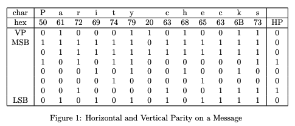
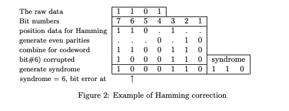
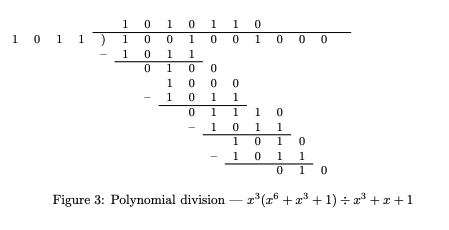

# Checksums and error control
Chen Luo · Michael J. Carey    19 Jul 2019

## 目录

* [1 Error Control Codes](#1-error-control-codes)
* [2 More on Parity](#2-more-on-parity)
* [3 Hamming Codes](#3-hamming-codes)
* [4 Modular Checkdigits and checksums](#4-modular-checkdigits-and-checksums)
	* [4.1 Modular Arithmetic](#41-modular-arithmetic)
	* [4.2 Parity and Arithmetic Checksums](#42-parity-and-arithmetic-checksums)
	* [4.3 Digit Checksums](#43-digit-checksums)
* [5 Modular checkdigits](#5-modular-checkdigits)
	* [5.2 Fletcher Checksum](#52-fletcher-checksum)
	* [5.3 Cyclic Redundancy Checks](#53-cyclic-redundancy-checks)


## 1 Error Control Codes

计算机技术始终不得不与错误共存，尤其是在数据传输和数据记录过程中。有时，这些错误仅仅造成一些困扰，通过一次简单的重试即可获得令人满意且准确的数据。然而，在某些情况下，错误可能十分严重；若无法获取准确的原始副本，其后果甚至可能是灾难性的。

为应对错误数据的处理问题，逐渐发展出了两门相互关联但在一定程度上并行的学科。它们同属于“编码理论”（Coding Theory）的总体范畴，并统一归纳在“差错控制”（Error Control）这一通用名称之下。

差错检测（Error Detection）- 差错检测是在奇偶校验思想的基础上发展而来的，通过在数据后附加一个 8、16 或 32 位的“校验和”（checksum），以实现对错误的强大而可靠的检测。该校验和经过精心设计，使其对可能出现的错误具有高度敏感性：用于人工数据录入的校验和必须能够检测数字的换位和重复，而用于数据传输的校验和则必须能够检测长突发错误。
一旦检测到错误，必然会触发某种形式的告警，并请求重新输入数据或重新传输数据。

差错纠正（Error Correction）- 当原始数据在空间上相距遥远（如遥测系统），或在时间上相隔较久（如数据记录）而无法直接获取时，就需要采用差错纠正。在这两种情况下，数据都必须携带足够的冗余信息，以便在存在错误的情况下重构原始数据。针对单比特错误的处理方法早已为人所知，而对仅涉及少数比特错误的处理方法也出现已久；然而，实际中的数据错误很少如此简单。由于在物理传输介质或记录介质上采用的编码方式，物理层面的许多单个错误在数据层面往往会表现为突发错误。因此，突发差错纠正显得尤为重要，但遗憾的是，这一问题在技术上极为困难。

尽管差错控制被划分为两个领域，但其中许多技术在两者之间是可以相互应用的。尤其是，较为优秀的差错检测码通常基于多项式生成元和伽罗瓦域算术。完全相同的技术也可以应用于某些较为简单的差错纠正码，或许仅需选择不同的生成多项式即可。这种趋同带来的一个结果是：对于较短的消息，一个足够长的校验和往往能够提供一定程度的差错纠正能力。一个典型例子是 ATM 信元首部，其采用一个 8 位校验和（或称“首部差错控制”字段，HEC）进行保护，这一长度对于仅有 32 位的首部而言通常远超差错检测所需。尽管 HEC 的设计目标是差错检测，但它同样能够提供一定的差错纠正功能。

> 注：HEC（Header Error Control）基于 CRC 的校验码，使用 8 位 CRC 多项式，可以检查所有单比特错误，长度 ≤ 8 的突发错误，绝大多数多比特错误。此外还可以提供一定的纠错能力，主要是单比特纠错，40 位的数据用 256 个校验结果向量来表示是非常稀疏，可以建立对应关系。

本章重点讨论在可以重复输入或重新传输的场景下所使用的差错检测码。对于差错纠正码仅作简要涉及，主要介绍汉明码（Hamming codes）这一较早且较为简单的差错纠正码。对差错纠正码的全面讨论远远超出了本书的预期范围。


## 2 More on Parity

最简单的一种差错控制形式是在一个字节(bytes)、字(word)或其他简单数据单元上附加一个单一的奇偶校验位。简单奇偶校验对于检测极少发生的错误是可行的，但当错误概率较高或数据长度较长时，其效果就不再令人满意。

在比特差错概率为 $p$，并假设各比特差错相互独立的情况下，一个 $n$-bit 消息中恰有 $k$ 个错误的概率 $P_k$ 为：

$$
\begin{align*}
P_0 &= (1-p)^n \\
P_1 &= n(1-p)^{n-1}p \\
P_2 &= \frac{n(n-1)}{2}(1-p)^{n-2}p^2 \\
&\vdots \\
P_k &= \frac{n(n-1)\dots(n-k+1)}{k!}(1-p)^{n-k}p^k
\end{align*}
$$

$\text{if } p \approx 0, \text{ then } P_2 \approx \frac{(np)^2}{2}$ — 即未被检测到的错误发生的概率

> 发生两个比特错误的概率 $\frac{n(n-1)}{2}(1-p)^{n-2}p^2$，当 $p$ 很小时 $(1-p)^{n-2} \approx 1$，概率 $\frac{n(n-1)}{2} p^2$ 可以近似为 $\frac{(np)^2}{2}$

不幸的是，单一奇偶校验位只能检测奇数个错误，而无法检测偶数个错误。对于一个 12500 字节（n = 100000 bits）的消息，且比特差错概率为 $p = 10^{-6}$，各概率为：

|              |         |                                            |
|--------------|---------|--------------------------------------------|
| $P_0$        | 90.5%   | 没有错误的概率                               | 
| $P_1$        | 9.05%   | 恰好有一个错误的概率                          |
| $P_2$        | 0.45%   | 恰好有两个错误的概率（未被检测到）               |
| $P_{k>0}$    | 10.5%   | 至少有一个错误的概率                          |
| $P_{\text{odd}}$ | 10.0%   | 任意奇数个错误的概率（被检测到）             |
| $P_{\text{even}}$ | 0.50%   | 任意偶数个错误的概率（未被检测到）          |

因此，尽管有 10.5% 的消息被检测出错误并应重新传输，但仍有 0.5% 的错误未被检测到，却被错误地报告为“正确”。

除非错误极为罕见，否则实际的差错控制会使用更强大、更复杂的校验函数，并将校验分布在多个相互关联的校验位上，这样即使是单个错误也会影响多个奇偶校验位，而多个错误不太可能互相抵消从而产生“假阳性”结果。

这里描述的许多校验方法适用于十进制数字串，而另一些则适用于字节或八位字节序列。

作为奇偶校验的一种简单扩展，Figure 1 展示了一个 ASCII 消息同时采用字符（纵向）奇偶校验和消息（横向）奇偶校验的例子，这种方式曾用于一些早期支持块模式传输的 ASCII 终端。最上方一行显示消息的字符，下一行显示它们的（7 位）ASCII 编码。在该行下方，标记为 VP 的行显示每个字符的偶数纵向奇偶校验（vertical parity），基于其余行所示的比特计算而得。在最右侧，标记为 HP 的列显示整个消息的横向奇偶校验（horizontal parity），每个位是该行（或字符中对应比特位置）之前所有比特的异或（Exclusive-OR）结果。同样是偶数奇偶校验，但如有需要也可以使用奇数奇偶校验。若任何字符的纵向奇偶校验失败，或整体横向奇偶校验失败，则通常会发出错误信号。

二维奇偶校验在检测错误方面远优于简单的一维奇偶校验；只有在矩形角落位置出现的四个错误才可能未被检测到。（如果已知仅发生了一个错误，则可以通过纵向和横向奇偶校验失败的交点进行纠正。）该方法很快被更强大的 CRC-16 校验取代，相关内容见第 5.3 节。

<div align=center></div>


## 3 Hamming Codes

汉明码（Hamming code）[8] 是最早且最简单的差错纠正码之一，是单比特纠错（Single Error Correcting，SEC）码的典型示例。对于最简单的非平凡情况（也是通常的示例），取 4 个数据位和 3 个奇偶校验位，将它们排列成一个 7 位字，如 $d_7 d_6 d_5 p_4 d_3 p_2 p_1$，位编号从左至右为 7 到 1。编号为 $2^k$ 形式的位作为奇偶校验位，其余位作为数据位。

在传输时，按照下面的方法设置奇偶校验位，并将整个 7 位字作为码字进行传输。

$$
\begin{align*}
p_1 &= d_3 \oplus d_5 \oplus d_7 \quad \text{(the bits with a "1" in the bit number)} \\
p_2 &= d_3 \oplus d_6 \oplus d_7 \quad \text{(the bits with a "2" in the bit number)} \\
p_4 &= d_5 \oplus d_6 \oplus d_7 \quad \text{(the bits with a "4" in the bit number)}
\end{align*}
$$

在接收端，通过以下方程计算校验子（syndrome） 如 $S = \{s_4, s_2, s_1\}$。

$$
\begin{align*}
s_1 &= p_1 \oplus d_3 \oplus d_5 \oplus d_7 \\
s_2 &= p_2 \oplus d_3 \oplus d_6 \oplus d_7 \\
s_4 &= p_4 \oplus d_5 \oplus d_6 \oplus d_7
\end{align*}
$$

若 $S = 0$，则所有比特均正确；若 $S \neq 0$，则校验子指示出错误比特的编号（假设仅发生一个错误）。

汉明码的操作如 Figure 2 所示。

<div align=center></div>

汉明码可以轻松扩展到更长的码字，只需将每个编号为 $2^k$ 的比特作为奇偶校验位，但无法扩展以纠正多个错误。这里使用的示例通常记作 $(7,4)$ 码：每个码字有 7 位，其中 4 位用于用户数据。一般的单比特纠错（SEC）汉明码可表示为 $(2^k - 1, 2^k - 1 - k)$ 码。例如 $(15,11)$ 码和 $(31,26)$ 码。

如果再增加一个整体奇偶校验位，则可形成一种能够在内部奇偶校验失败但整体奇偶校验仍正确时检测到双比特错误的码，即单比特纠错、双比特检测（Single Error Correcting, Double Error Detecting，SEC-DED）码。

> 注：Hamming (7,4)其参数为 $(n, k, d_{\min}) = (7, 4, 3)$，最小汉明距离为 3，最多可纠正的错误位数 $t = \left\lfloor \frac{d_{\min} - 1}{2} \right\rfloor$ 代入 $t = \left\lfloor \frac{3-1}{2} \right\rfloor = 1$。差错检测能力 $d_{\min} - 1 = 2$，可检测 2 bit 位错误。


## 4 Modular Checkdigits and checksums

这里所描述的大多数校验方法都采用某种形式的模运算：先从数据中导出一个相对较大的数值，再通过对某个模数取余，将该数值缩减为一个较小的值。在最简单的情况下，可以仅使用模 10（得到十进制的个位数字），或模 256（得到最低有效的 8 位）。通常，模数的选择基于一些不那么直观的准则，其目标是最大化错误检测能力。

较为简单的技术采用普通的数值除法，更适合通过软件实现；而另一些方法则使用多项式除法，更适合硬件实现。例如，许多校验算法在模数为素数时效果最佳。普通奇偶校验就是模运算的最简单例子，它对比特之和取模 2。

### 4.1 Modular Arithmetic

在进行模 $p$ 的加法或减法时，只需将每个数值除以 $p$ 并取其正余数即可。而模运算下的乘法和除法则需要更加谨慎的处理。

如果一个数 $a$ 与 $a'$ 在除以 $m$ 后得到相同的余数，则称“数 $a$ 模 $m$ 同余于 $a'$”。该关系记作：

$$
\begin{align*}
a &\equiv a' \pmod{m} \\
b &\equiv b' \pmod{m}
\end{align*}
$$

考虑特定情况 $m = 12$ 和 $a = 21$ 和 $b = 20$。则有：

$$
a' = 9 \text{ and } b' = 8
$$

和

$$
ab \equiv a'b' \equiv 0 \pmod{12}
$$

尽管 $a$ 和 $b$ 都不与 12 模同余于零，但只有在模数为素数时，若积为零，才可以保证至少有一个因子为零。鉴于许多校验和通过使整体值同余于零来工作，这一性质是一个非常重要的要求。

> 注：只有当模数 $m$ 是素数时，才能保证：若 ab≡0(mod m),则 a≡0(mod m) 或 b≡0(mod m)

> 注：素数（也叫质数）是大于 1 的自然数，且它的正因数只有 1 和它本身，没有其他正整数能整除它。

### 4.2 Parity and Arithmetic Checksums

在下面的描述中，我们将使用“数字”（digit）这一通用术语来表示基本数据单元。根据具体语境，它可以是一个十进制数字（取值范围 $0…9$）、一个字节（取值范围 $0…255$）、一个 32 位字（取值范围 $0…(2^{31}-1)$	）等。在许多方面，这些算法在各种情况下都是相似的。

为简化表述，本文中“校验和”（checksum）一词将涵盖奇偶校验和校验位（check digit）等概念。“数字”（digit）则包括字节、字符和字等，具体取决于参与计算的主要数据单元。更常见的用法是，当被校验的对象是十进制数字（人类可读）且校验本身也是一个十进制数字（或通常为十进制）时，使用“校验位”（check digit）这一术语。

逻辑和（Logical Sum）- 校验和通过对消息中的所有字节或字逐位进行异或（Exclusive-OR）运算而形成。

$$
\{0010, 1010, 1001, 0001, 0110\} \to 0110
$$

校验和中的每一位都是各个数据字中对应位的异或（Exclusive-OR）结果，这与 Figure 1 所示的横向奇偶校验相同。该方法的问题在于，错误对校验和的影响有限，而且它无法检测换位错误（这一点在数据传输中并不重要，但在数据录入中却至关重要）。

> 注：数据传输出错形式主要是比特翻转、突发错误，几乎不会发生“两个字节交换位置”的错误，概率很低。

算术和（Arithmetic Sum）- 该方法与逻辑和类似，不同之处在于将异或（Exclusive-OR）运算替换为常规的算术加法。由于引入了进位，校验和各比特之间产生了一定程度的相互依赖，但它仍然对数据的换位错误不敏感。

在大多数计算机中，直接进行的加法采用二进制补码表示，其结果是对一个 $N$ 位字按模 $2^N$ 进行求和。然而，由于进位从最低有效位向最高有效位传播，校验和中高位对错误的敏感性远高于低位。若改用一补码加法（即按模 $2^N - 1$ 而非模 $2^N$ 进行加法），则通过“回绕进位”（end-around carry）可使运算具有整体对称性，使得校验和的低位也会受到数据高位变化的影响。

这正是 TCP/IP 所采用的校验和。尽管该方法在计算上较为简单，且优于单纯的异或校验，但其性能仍不及后文所述的 Fletcher 校验和或 Adler 校验和。

Stone 等人[12]对真实数据进行的测试表明，TCP/IP 校验和对于多种现实世界中的数据类型并不理想，例如字符字符串，甚至是相邻字之间存在高度相关性的实数数据。他们指出，校验和值的分布远非均匀，且 16 位的 TCP/IP 算术校验和在性能上可能并不优于一个 10 位的 CRC。

### 4.3 Digit Checksums

本节介绍的校验和均用于校验十进制数，尤其适用于人工输入的数据。在人工数据录入过程中，常见的错误包括数字的重复或遗漏、相邻数字的换位，以及诸如将“677”误输入为“667”这样的替换错误。简单的奇偶校验和算术求和的缺点在于对所有数字一视同仁；为了处理换位错误，必须对不同位置的数字加以区分，使校验和在某种程度上依赖于各数字的位置。因此，大多数数字校验和的示例都对连续数字使用系统变化的权重。Wagner 和 Putter 曾讨论过在特定应用中使用十进制校验位的方法［13］。

以下示例均假定处理对象为一个十进制数字串。

$$
\ldots d_6 d_5 d_4 d_3 d_2 d_1 d_0
$$

其中下标对应 10 的幂次。数字 $d_6 \dots d_1$ 为输入数据，而 $d_0$ 为校验位。

#### 4.3.1 IBM Check

这一校验方法在文献[4，第49页]中有简要讨论，作为一个非常简单的校验和示例，其计算量极小，适用于机电设备，例如 IBM 026 打孔机。该方法可以检测相邻数字的换位（但无法检测 “09 ↔ 90”），但由于权重采用简单的重复模式，对于其他许多错误则不敏感。

具体做法为：将偶数位数字求和，再加上奇数位数字的两倍。

$$
s = \sum d_{2i} + 2 \times \sum d_{2i+1}
$$

校验位为和 $s$ 的末位数字的 10 补数。因此，校验位 $c$ 为：

$$
c = 10 - \left( \sum d_{2i} + 2 \times \sum d_{2i+1} \right) \bmod 10
$$

Wagner 和 Putter[13]描述了一个类似的算法（可能与前述算法相同，只是提供了更多细节），该算法用于某些账户号码，被称为 IBM 校验。其可能的区别在于：当某个数字被加倍后超过 10 时，将其和的两位数字相加。例如 $2 \times 3 \rightarrow 6$，而 $2 \times 7 \rightarrow 14 \rightarrow 5$。


## 5 Modular checkdigits

该方法由 Hamming［9，第28页及以下］描述，但在许多其他场合也被广泛使用。所有数字都根据其在输入数中的位置赋予权重。虽然看起来让权重从左到右递增似乎更自然，但通常使用的“和的和”算法是从右到左递增权重。

要求生成的值（包括校验位）满足 $\sum (i+1) d_i \bmod m \equiv 0$。

为了在不使用乘法（甚至在不事先知道数字位数的情况下）生成校验和，可以按顺序从左至右逐步形成各位数字的累加和，并在每一步将当前累加和加入到“累积的和”的总和中。以连续数字 $p, q, r, s, t$ 为例进行说明。

| Message | Sum                  | Sum of Sums                     |
|---------|----------------------|---------------------------------|
| $p$     | $p$                  | $p$                            |
| $q$     | $p + q$              | $2p + q$                        |
| $r$     | $p + q + r$          | $3p + 2q + r$                   |
| $s$     | $p + q + r + s$      | $4p + 3q + 2r + s$              |
| $t$     | $p + q + r + s + t$  | $5p + 4q + 3r + 2s + t$         |

Hamming［9］给出了一个校验示例，处理的字符包括字母 “A” … “Z”、数字 “0” … “9” 以及空格 “ ”。这样形成了一个包含 37 个符号的字母表，恰好是一个素数。

一个更好的示例是 ISBN（国际标准图书编号）。ISBN 是由 9 个十进制数字组成的序列，用于表示国家、出版社以及图书的序列号。将这些数字按上述“和的和”方法组合，并对 11 取模，即可得到校验位，该校验位作为 ISBN 的第 10 位。由于模数为 11，校验位的取值范围为 0 到 10。虽然可以直接忽略校验位为 10 的情况，但那会浪费 1/11 的可用编号。因此，将校验位为 10 用 “X” 表示，例如 ISBN 为 0 7112 0232 X。

要计算校验位，先计算 $\ldots 8d_7 + 7d_6 + 6d_5 + 5d_4 + 4d_3 + 3d_2 + 2d_1$，然后对该和取模 11，再取 11 的补数作为校验位。

$$
c = 11 - \left( \sum (i+1) d_i \right) \bmod 11
$$

为了说明 ISBN 的校验方法，仍以前述示例为例进行验证。

| digit | sum                | sum of sums                     |
|-------|--------------------|---------------------------------|
| 0     | $0 + 0 = 0$       | $0 + 0 = 0$                     |
| 7     | $0 + 7 = 7$       | $0 + 7 = 7$                     |
| 1     | $7 + 1 = 8$       | $7 + 8 = 15$                    |
| 8     | $8 + 1 = 9$       | $15 + 9 = 24$                   |
| 2     | $9 + 2 = 11$      | $24 + 11 = 35$                  |
| 0     | $11 + 0 = 11$     | $35 + 11 = 46$                  |
| 2     | $11 + 2 = 13$     | $46 + 13 = 59$                  |
| 3     | $13 + 3 = 16$     | $59 + 16 = 75$                  |
| 2     | $16 + 2 = 18$     | $75 + 18 = 93$                  |
| X     | $18 + 10 = 28$    | $93 + 28 = 121 \equiv 0 \pmod{11}$ |

最终的“和的和”结果是 11 的倍数，这表明该 ISBN 是有效的。

### 5.2 Fletcher Checksum

Fletcher 校验和（Fletcher checksum）［6］［11］最初是为 OSI 通信模型的传输层（第 4 层）而设计的。该方法在本质上是一种“和的和（sum of sums）”的计算技术，所有加法运算均在模 255 的意义下进行。（但需要注意的是，255 并不是一个素数！）因此，我们计算如下过程。

$$
\begin{align*}
s1 &= (s1 + d_i) \bmod 255 \\
s2 &= (s2 + s1) \bmod 255
\end{align*}
$$

如果校验和位于消息末尾（这是通常的情况），则将两个校验字节设置为
$B_1 = s1 - s2$ 和 $B\_2 = -2s\_1 + s\_2$，
从而使包括这两个校验字节在内的整体校验和为零。与许多校验和方法不同，对正确传输的检测方式略有差异：当 $s1 = 0 \text{ or } s2 = 0$ 中任意一个成立时，结果即被认为是正确的；只有在两个累加和均非零的情况下，才会报告发生错误。

> 注："包括这两个校验字节在内的整体校验和为零"表示包含校验数据在内最终 $s1$ 或 $s2$ 任意一个为 0。

> $n_1 s_1 = (s_1 + B_1) = 2s_1 - s_2$, $n_1 s_2 = (s_2 + n_1 s_1) = 2s_1 \implies n_2 s_1 = (n_1 s_1 + B_2) = (2s_1 - s_2 - (-2s_1 + s_2)) = 0$, $n_2 s_2 = (n_1 s_2 + n_2 s_1) = (2s_1 + 0) = 2s_1$


如果校验和字节位于一个长度为 $L$ 个八位字节（octet）的消息中的第 $n$ 和第 $n+1$ 个位置（消息位置编号为$0$ ... $L-1$），则

$$
\begin{align*}
b_n &= (L - n) \times s1 - s2 \\
b_{n+1} &= s2 - (L - n + 1) \times s1
\end{align*}
$$

> 注：上面公式最终计算结果 $s2 = 0$, $s2$ 是“带位置权重”的和。

下面给出了一个 Java 代码片段，用于根据包含 $nChar$ 个字符的数组 `c[]` 计算校验和。需要注意的是，这些字符应当限制为 ASCII 字符，或者至少其取值应 `< 256`。其中使用的 `while` 循环在功能上等价于带余除法（division with remainder），但在本场景下通常只需进行极少次数的修正，因此这种实现方式在性能上更为高效。

```java
int s1 = 0, s2 = 0; // initialise checksums
for (int i = 0; i < nChars; i++) // scan the characters
  {
  s1 += c[i]; // add in the character
  while (s1 >= 255) // reduce modulo 255
    s1 -= 255;
  s2 += s1; // get the sum of sums
  while (s2 >= 255) // modulo 255
    s2 -= 255;
  }
```

Fletcher 校验和被认为其差错检测能力几乎与下文所描述的 CRC-16 校验和同样强大，能够检测到：

* 所有单比特错误，
* 所有双比特错误，
* 长度不超过 16 的突发错误中除 `0.000019%` 之外的全部错误，以及长度更长的突发错误中除 `0.0015%` 之外的全部错误。

### 5.3 Cyclic Redundancy Checks

CRC 编码是最重要且应用最为广泛的差错检测码。它们特别适合在极高工作速度下以硬件方式实现，因此被用于大多数数据通信系统中。它们同样建立在模运算（modular arithmetic）的基础之上，但与前述示例相比，在方法和原理上引入了若干重要的变化。

1、“数系”从传统且熟悉的整数体系转变为**有限域（finite fields）**，具体而言是 **GF(2)**。所有算术运算均在 模 2 的意义下进行，如下文第 3 点所述。

2、比特被视为多项式中的系数。这使得有限域与多项式域中高度发展且功能强大的数学理论能够应用于差错控制编码理论，包括差错检测与差错纠正。

将比特向量表示为多项式的形式，还为那些通常包含大量零元素的比特向量提供了一种便捷的表示方法。在多项式中，仅对应于取值为 1 的项会出现，并且通过指数形式直观地给出了比特的位置。因此，这两种表示方式是等价的。

$$
100101 \Leftrightarrow x^5 + x^2 + 1
$$

同样

$$
100000111 \Leftrightarrow x^8 + x^2 + x + 1
$$

多项式变量在编码过程的大多数情况下实际上只是一个虚变量，并无太多实际意义。它可以被视为指数的一个“载体”。

整数中的数值算术运算被 GF(2) 有限域上的比特逻辑运算所取代。此时，加法与减法均等价于异或（Exclusive-OR, $\oplus$），而乘法等价于逻辑与（AND，∧）。（在这两种情况下，将比特视为数值，执行相应运算，并对结果取模 2）由于比特之间不存在进位传播，这一点立即消除了快速加法实现中的一个主要障碍。

实际上，这一变化意味着算术运算可以通过简单的逻辑操作非常容易且快速地完成。尽管在此并未进行深入展开，但这为在高速硬件中采用这些方法提供了强大的动机。

> 注：GF(2) 加法等价于异或（XOR），示例：0+0=0，0+1=1，1+0=1，1+1=0;

> 注：GF(2) 减法等价于加法（XOR），示例：1-1=0，1-0=1，0-1=1，0-0=0;

> 注：GF(2) 乘法等价于逻辑与（AND），示例：0×0=0，0×1=0，1×0=0，1×1=1

循环冗余校验（CRC）中最直观的操作是 **多项式除法**，如 Figure 3 所示。除去略有改变的减法规则外，其整体方法与传统的长除法完全相同。除数是一个固定不变的多项式，并且被归一化，保证其最高有效位（最高次项系数）为 1。（在实际中，它的最低有效位（常数项）也为 1，因此得到的多项式形式为 $x^N + \dots + 1$。从技术上讲，除数多项式 $g(x)$ 是首一（monic）多项式。）由于减法中不存在进位传播，当余数的最高位为 1 时，即可从部分余数中减去除数；不需要像整数除法中那样进行“试减”或对溢出进行补偿。此示例中被除数的形式及其书写方式是经过刻意选择的，以便与 CRC 计算中多项式除法的使用相匹配 $\text{CRCs}(i(x) = x^6 + x^3 + 1$ 且 $g(x) = x^3 + x + 1$)

<div align=center></div>

> 注：首一多项式基础定义，一个多项式中，次数最高的项（最高次项）的系数为 1，这样的多项式就是首一多项式。

当将多项式用于校验和生成时，发送的数据构成一维比特流，其中较早出现的比特对应于多项式中的高次幂。在数据传输及其正确性校验过程中，会涉及多个多项式。

**信息多项式 $i(x)$**：信息多项式表示由用户提供并发送的数据（通常包括首部、地址以及其他传输控制信息）。信息多项式通常在不作任何修改的情况下直接传输。

**生成多项式 $g(x)$**：将信息多项式除以生成多项式，并将该除法所得的余数作为校验和附加到数据中。通常在进行除法之前，先在 $i(x)$ 后附加与 $g(x)$ 次数相对应数量的零。

**码字多项式 $c(x)$**：将除法得到的校验和附加到信息多项式之后，形成码字多项式，该多项式即为实际传输的内容。

**差错多项式 $e(x)$**：在传输过程中，码字多项式 $c(x)$ 中的一个或多个比特可能被破坏。这些发生错误的位置可以表示为一个多项式，即差错多项式 $e(x)$。

**接收码字 $v(x)$**：这是在传输过程中发生破坏之后所接收到的数据。由于 $e(x)$ 标记了传输数据中被破坏的比特，因此显然有 $v = c \oplus e$（假定按项进行异或运算），或等价地 $v(x) = c(x) + e(x)$。

更具体地说，若 $r$ 为 $g(x)$ 的次数

1、在 $i(x)$ 的低阶端附加 $r$ 个零，形成 $x^r i(x)$。

2、计算 $x^r i(x)$ mod $g(x)$，即将 $x^r i(x)$ 除以 $g(x)$ 所得到的余数。

3、将该余数附加到 $i(x)$ 后，形成 $c(x)$，即实际传输的码字。因此，传输的码字为：

$$
c(x) = x^r i(x) - \left(x^r i(x) \mod g(x)\right)
$$

始终是 $g(x)$ 的倍数。（步骤 1 确保了 $i(x)$ 的全部内容都能被 $g(x)$ 处理，同时也为余数的写入预留了空间）

4、接收时，计算

$$
\begin{align*}
r(x) &= v(x) \mod g(x) \\
&= e(x) \mod g(x) + c(x) \mod g(x) \\
&= e(x) \mod g(x) \text{, as } c(x) \mod g(x) \equiv 0 \text{ by construction}
\end{align*}
$$

只有当且仅当 $e(x)$ 是 $g(x)$ 的倍数时，错误才不会被检测到。因此，生成多项式 $g(x)$ 的设计决定了差错检测的能力，而其设计又取决于 $g(x)$ 与 $e(x)$ 的关系。

* 如果发生单比特错误，则差错多项式为 $e(x) = x^i$，其中 $i$ 表示出错的比特位置。若 $g(x)$ 包含两个或更多项，它将永远无法整除 $e(x)$，因此所有单比特错误都能够被检测到。

* 如果存在两个孤立的单比特错误，则差错多项式为 $e(x) = x^i + x^j$，或者当 $i > j$ 时，可写作 $e(x) = x^j (x^{i-j} + 1)$。若 $g(x)$ 不可被 $x$ 整除，则若 $g(x)$ 不整除 $x^k + 1$（对于所有 $k$ 直到最大消息长度），所有双比特错误都将被检测到。可以通过计算机搜索找到合适的 $g(x)$；例如 $x^{15} + x^{14} + 1$ 不整除任何 $k < 32768$ 的 $x^k + 1$。

* 如果发生奇数个比特错误，则差错多项式 $e(x)$ 中也含有奇数个项。由于没有含奇数项的多项式可以被 $(x+1)$ 整除，因此我们令 $g(x)$ 包含 $(x+1)$ 作为因子，以便检测所有奇数个错误。

* 具有 $r$ 个校验比特的多项式码能够检测长度 ≤ $r$ 的突发错误。长度为 $k$ 的突发错误可以表示为 $x^i (x^{k-1} + \dots + 1)$。如果 $g(x)$ 含有常数项，则其不含 $x^i$ 项，因此当 $x^{k-1} + \dots + 1$ 的次数小于 $g(x)$ 的次数时，余数不可能为零。

* 当突发错误长度为 $r+1$ 时，余数 $r(x)$ 仅在突发错误与 $g(x)$ 完全相同时才为零。如果所有比特组合出现的概率相等，则中间的 $r-1$ 个比特全部匹配的概率为 $1/2^{r-1}$。

* 对于更长的突发错误，未检测到错误的概率为 $1/2^r$。

在 CRC 码的描述中，许多内容实际上源于在差错纠正中使用多项式技术，这些技术在 Hamming 码的基础上得到了发展和改进。块差错纠正码的关键区别在于，将 $v(x)$ 除以 $g(x)$ 所得到的余数被称为综合值（syndrome） $s(x)$，可用于确定差错向量 $e(x)$，从而纠正任何错误。尽管操作机制类似，但 $g(x)$ 的设计与前述用于差错检测的设计有很大不同。


## 5.4 Examples of CRC polynomials

作为一个初步观察，多项式 (x^8 + 1) 在由 8 位字符组成的消息上生成了一种简单的纵向奇偶校验，对其他字符长度的情况亦然。（在 (g(x)) 中包含两个比特，它们在数据流中对应于相邻两个数据字符中的相同位。这种“窗口”效应的结果是：将每个数据字符中的各个位通过异或运算（Exclusive-OR）累积到一个整体奇偶校验字符中的对应位上。）

一些标准的差错检测多项式包括：

|               |                                                                                         |
|---------------|-----------------------------------------------------------------------------------------|
| CRC-12        | $x^{12} + x^{11} + x^3 + x + 1$                                                         |
| CRC-16        | $x^{16} + x^{15} + x^2 + 1$                                                             |
| CRC-CCITT     | $x^{16} + x^{12} + x^5 + 1$                                                             |
| IEEE 802      | $x^{32} + x^{26} + x^{23} + x^{22} + x^{16} + x^{12} + x^{11} + x^{10} + x^8 + x^7 + x^5 + x^4 + x^2 + x + 1$ |
| ATM HEC       | $x^8 + x^2 + x + 1$                                                                     |
| ATM AAL3/4    | $x^{10} + x^9 + x^5 + x^4 + x + 1$                                                      |


CRC-12 在一些较早的银行系统和航班预订系统中用于 6 位字符编码。

16 位 CRC（在北美主要使用 CRC-16，在欧洲使用 CRC-CCITT）能够检测所有长度不超过 16 位的突发错误、所有包含奇数个比特的错误，以及 99.998% 的长度为 18 位或以上的突发错误。

> 注：r 位 CRC（常数项为 1）能 100% 检测长度≤r 的突发错误，因此 16 位 CRC 对长度 1~16 位的突发错误实现无漏检。

“ATM HEC” 是用于 ATM（异步传输模式，Asynchronous Transfer Mode）信元的首部差错控制码。它覆盖前面的 4 个字节，能够纠正所有单比特错误，并检测多种多比特错误。

“ATM AAL3/4” 用于在 ATM 适配层 3 和 4 中验证每个 ATM 信元的用户数据。

“IEEE 802” 校验和除 IEEE 802.x 标准之外，还被许多通信系统采用，包括光纤通道（Fibre Channel）和 ATM AAL-5。

在某些情况下，校验的具体细节会有所变化。例如，在 X.25 帧中使用的是 CRC-CCITT 多项式。

* 移位寄存器初始时被预置为全 1；

* 校验位在随信息比特移出时被取反；

* 接收端在计算时将校验字段一并包含在内；

* 计算结果必须为 1111 0000 1011 1000。

尽管 IEEE 802 生成多项式在许多通信系统中得到了非常广泛的应用，但其具体使用方式存在若干变体。
在 802.3 竞争总线（以太网，Ethernet）中，

* 数据的前 32 位先进行取反；

* 将包括首部和用户数据在内的整个帧除以生成多项式；

* 帧校验序列（FCS）比特在随信息比特移出时被取反；

* 接收端检查由此前接收数据生成的 FCS 是否与接收到的 FCS 相一致。

而在 802.5 令牌总线（Token Bus）中，

* 用于校验和的 32 位寄存器初始化为全 1；

* 将包括首部和用户数据在内的整个帧除以生成多项式；

* 校验比特在随信息比特移出时被取反；

* 接收端在计算时将校验字段一并包含在内；

* 计算结果（包括接收到的校验和）必须为 $x^{31} + x^{30} + x^{26} + x^{25} + x^{24} + x^{18} + x^{15} + x^{14} + x^{12} + x^{11} + x^{10} + x^8 + x^6 + x^5 + x^4 + x^3 + x + 1$ ，
  或以二进制表示为：1100 0111 0000 0100 1101 1101 0111 1011。

实现代码示例：

```golang
package main

import (
	"fmt"
)

// crc16CCITT 计算 CRC-16/CCITT（多项式 x^16 + x^12 + x^5 + 1）
func crc16CCITT(data []byte) uint16 {
	var crc uint16 = 0xFFFF // 初始值
	const poly uint16 = 0x1021

	for _, b := range data {
		crc ^= uint16(b) << 8
		for i := 0; i < 8; i++ {
			if crc&0x8000 != 0 {
				crc = (crc << 1) ^ poly
			} else {
				crc <<= 1
			}
		}
	}
	return crc
}

func main() {
	data := []byte("HELLO")
	crc := crc16CCITT(data)
	fmt.Printf("CRC-16/CCITT of %q: 0x%04X\n", data, crc)
}
```

## References

[Checksums and error control](https://pages.cs.wisc.edu/~remzi/OSTEP/Citations/checksums-03.pdf)