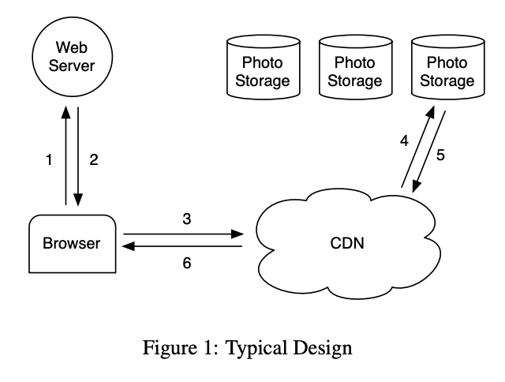
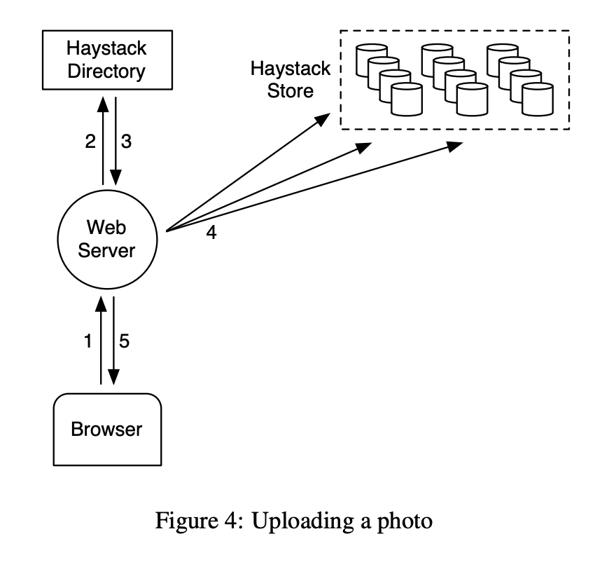
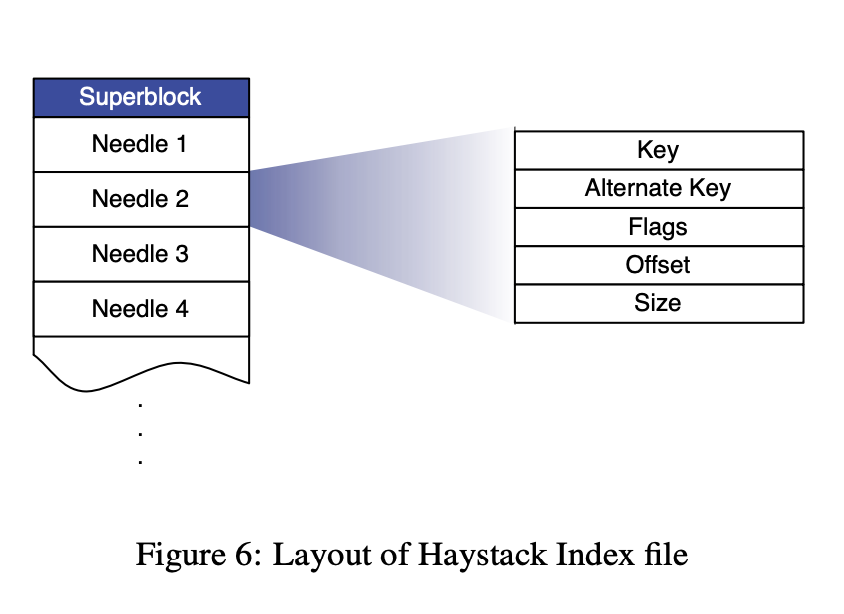
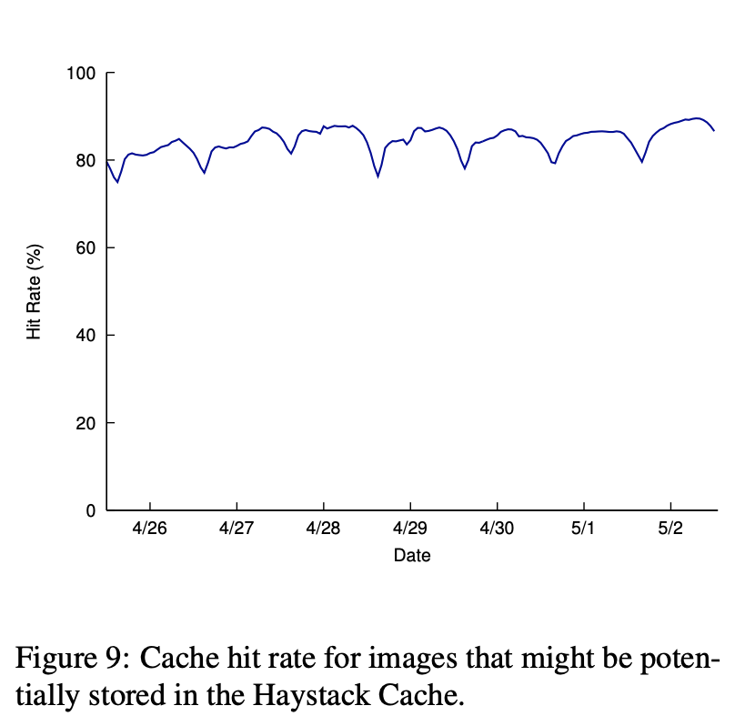
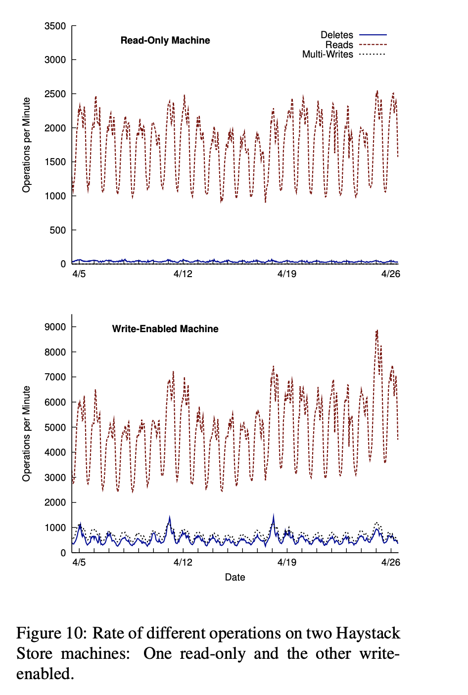

# Finding a needle in Haystack: Facebook’s photo storage
Doug Beaver, Sanjeev Kumar, Harry C. Li, Jason Sobel, Peter Vajgel, Facebook Inc. {doug, skumar, hcli, jsobel, pv}@facebook.com

> The 9th USENIX Symposium on Operating Systems Design and Implementation, 2010

## 目录
* [Abstract](#abstract)
* [1、Introduction](#1introduction)
* [2、Background & Previous Design](#2background--previous-design)
* [3 Design & Implementation](#3-design--implementation)
    * [3.1 Overview](#31-overview)
    * [3.2 Haystack Directory](#32-haystack-directory)
    * [3.3 Haystack Cache](#33-haystack-cache)
    * [3.4 Haystack Store](#34-haystack-store)
        * [3.4.1 Photo Read](#341-photo-read)
        * [3.4.2 Photo Write](#342-photo-write)
        * [3.4.3 Photo Delete](#343-photo-delete)
        * [3.4.4 The Index File](#344-the-index-file)
        * [3.4.5 Filesystem](#345-filesystem)
    * [3.5 Recovery from failures](#35-recovery-from-failures)
    * [3.6 Optimizations](#36-optimizations)
        * [3.6.1 Compaction](#361-compaction)
        * [3.6.2 Saving more memory](#362-saving-more-memory)
        * [3.6.3 Batch upload](#363-batch-upload)
* [4 Evaluation](#4-evaluation)
    * [4.1 Characterizing photo requests](#41-characterizing-photo-requests)
        * [4.1.1 Traffic Volume](#411-traffic-volume)
    * [4.2 Haystack Directory](#42-haystack-directory)
    * [4.3 Haystack Cache](#43-haystack-cache)
    * [4.4 Haystack Store](#44-haystack-store)
        * [4.4.1 Experimental setup](#441-experimental-setup)
        * [4.4.2 Benchmark performance](#442-benchmark-performance)
        * [4.4.3 Production workload](#443-production-workload)
* [5、Related Work](#5related-work)
* [6、Conclusion](#6conclusion)

## Abstract

本文介绍了 Haystack——一个为 Facebook 的 Photos 应用优化的对象存储系统。Facebook 目前存储了超过 2600 亿张图片，总数据量超过 20 PB。用户每周上传 10 亿张新照片（约 60 TB），在峰值时 Facebook 每秒要提供超过 100 万张图片。与之前基于通过 NFS 挂载的网络附加存储设备（NAS）的方案相比，Haystack 提供了一种成本更低、性能更高的解决方案。我们的关键观察是，传统设计由于元数据查找会导致过多的磁盘操作。我们通过精心减少每张照片的元数据，使 Haystack 存储机器能够在主内存中完成所有元数据查找。这样就将磁盘操作保留用于读取实际数据，从而提高整体吞吐量。

## 1、Introduction

在 Facebook 上分享照片是最受欢迎的功能之一。截至目前，用户已上传超过 650 亿张照片，使 Facebook 成为全球最大的照片分享网站。对于每张上传的照片，Facebook 会生成并存储四种不同尺寸的图像，这意味着总共超过 2600 亿张图片、超过 20 PB 的数据。用户每周上传 10 亿张新照片（约 60 TB），在峰值时 Facebook 每秒需提供超过 100 万张图片。随着这些数字在未来预计会继续增长，照片存储对 Facebook 的基础设施提出了重大挑战。

本文介绍了 Haystack 的设计与实现，这是 Facebook 的照片存储系统，已在生产环境中运行了 24 个月。Haystack 是一种对象存储系统 [7, 10, 12, 13, 25, 26]，我们专门为 Facebook 上的照片分享场景设计：数据一次写入、多次读取、从不修改、也很少删除。我们自行构建了照片存储系统，因为传统文件系统在我们的工作负载下表现不佳。

> 注：存储场景为一次写入、多次读取、从不修改、也很少删除。

根据我们的经验，基于传统 POSIX [21] 文件系统的缺点主要在于目录和每个文件的元数据。对于 Photos 应用而言，大部分元数据（例如权限信息）根本不会被使用，从而浪费了存储容量。但更重要的成本在于，必须先从磁盘读取文件的元数据到内存中，才能找到实际的文件。在小规模下这不算什么，但当规模扩大到数百亿张照片、数 PB 的数据时，访问元数据就成为吞吐量的瓶颈。我们发现在使用通过 NFS 挂载的网络附加存储（NAS）设备时，这正是我们的主要问题。读取一张照片需要执行多次磁盘操作：一次（或通常更多）将文件名转换为 inode 编号，另一次从磁盘读取 inode，最后再从磁盘读取文件本身。简而言之，磁盘 IO 花在元数据上的成本成为限制读取吞吐量的关键因素。需要注意的是，在实际系统中，这个问题还带来了额外成本：我们必须依赖内容分发网络（CDN），如 Akamai [2]，来承担大部分读取流量。

> 注：POSIX 文件系统中文件元数据会存储在 inode table 中，inode 会固定占用 256 bytes（不同文件系统不同），文件数据至少占用 block（4KB）。

鉴于传统方法的缺点，我们设计了 Haystack，以实现四个主要目标：

**High throughput and low latency.** 我们的照片存储系统必须能够跟上用户请求的速度。超过处理能力的请求要么被忽略 —— 这对用户体验是不可接受的；要么由 CDN 处理 —— 这既昂贵，又会在某个点之后收益递减。此外，照片还必须被快速提供，以保证良好的用户体验。Haystack 通过在每次读取中最多只需要一次磁盘操作，来实现高吞吐量和低延迟。我们通过把所有元数据保存在主内存中实现这一点，而这之所以可行，是因为我们大幅减少了定位一张照片在磁盘上位置所需的元数据量。

> 注：减少元数据量，减少磁盘 IO 操作。

**Fault-tolerant.** 在大规模系统中，故障每天都会发生。用户依赖他们的照片始终可用，即使服务器崩溃或硬盘故障不可避免，他们也不应该遇到错误。甚至有可能整个数据中心断电，或跨洲链路被切断。Haystack 会将每张照片复制到地理位置不同的多个地点。如果某台机器故障，我们会加入一台新的机器替代它，并在必要时复制数据以恢复冗余。

**Cost-effective.** 与我们之前基于 NFS 的方案相比，Haystack 具有更高的性能和更低的成本。我们从两个维度量化了节省的效果：一是 Haystack 每可用 TB 存储的成本，二是按每可用 TB 存储归一化后的 Haystack 读取速率¹。在 Haystack 中，每一可用 TB 的成本大约降低了 ∼28%，并且每秒能够处理的读取请求数量约为等容量 NAS 设备的 ∼4 倍。

> 注：通过减少元数据、小文件合并到一个文件的方式实现存储成本降低。

**Simple.** 在生产环境中，一个易于实现、易于维护的设计的重要性再怎么强调都不为过。由于 Haystack 是一个全新的系统，缺乏多年生产级别的验证，我们在设计时特别注重保持系统的简单性。这种简洁性使我们能够在短短几个月内，而不是几年内，构建并部署一个可用的系统。

本文总结了我们从构思到实现 Haystack 的全过程经验，这是一个每天为数十亿张图片提供服务的生产级系统。我们的三项主要贡献是：

* Haystack：一种为数十亿张照片的高效存储与检索而优化的对象存储系统。
* 经验总结：在构建和扩展一个低成本、可靠且高可用的照片存储系统过程中获得的经验教训。
* 请求特征分析：对 Facebook 照片分享应用所接收请求的特性进行刻画与分析。

本文其余部分的组织结构如下：第 2 节介绍相关背景并重点分析我们此前架构中面临的挑战；第 3 节描述 Haystack 的设计与实现；第 4 节对照片的读写工作负载进行特征分析，并证明 Haystack 满足我们的设计目标；第 5 节将 Haystack 与相关工作进行比较；第 6 节对全文进行总结。

## 2、Background & Previous Design

在本节中，我们将描述 Haystack 出现之前的架构，并强调我们从中获得的主要经验教训。由于篇幅限制，对该此前设计的讨论省略了若干生产级部署的细节。

### 2.1 Background

我们首先简要概述一个典型设计，即 Web 服务器、内容分发网络（CDN）和存储系统如何协作以在热门网站上提供照片服务。Figure 1 描绘了从用户访问包含图片的页面，到从磁盘上的存储位置下载该图片的全过程。当用户访问页面时，浏览器首先向 Web 服务器发送 HTTP 请求，Web 服务器负责生成供浏览器渲染的页面标记（markup）。对于每张图片，Web 服务器构建一个 URL，指示浏览器从哪个位置下载数据。对于热门网站，这个 URL 通常指向 CDN。如果 CDN 已经缓存了该图片，则立即返回数据；否则，CDN 会解析 URL，其中包含足够的信息从网站的存储系统中获取照片。随后，CDN 更新其缓存数据，并将图片发送到用户的浏览器。

### 2.2 NFS-based Design

在我们的首次设计中，我们使用基于 NFS 的方法实现了 photo storage 系统。虽然本小节后续会对该设计提供更多细节，但我们学到的主要经验是：仅依靠 CDN 并不能为社交网络网站提供实用的照片服务解决方案。CDN 确实能够有效地提供最热门的照片——如头像或最近上传的照片——但像 Facebook 这样的社交网络网站同样会产生大量针对不太热门（通常较旧）内容的请求，我们称之为“长尾”请求。长尾请求占据了我们相当大比例的流量，其中几乎所有请求都要访问后台的 photo storage 主机，因为这些请求通常在 CDN 中未命中。虽然将所有长尾照片都缓存起来会非常方便，但由于所需缓存容量巨大，这种做法在成本上并不划算。

我们的基于 NFS 的设计将每张照片存储为单独的文件，保存在一组商业 NAS 设备上。一组机器（Photo Store 服务器）通过 NFS 挂载这些 NAS 设备导出的所有卷。Figure 2 展示了该架构，并显示了 Photo Store 服务器处理图片的 HTTP 请求的流程。Photo Store 服务器从图片的 URL 中提取卷号和文件的完整路径，通过 NFS 读取数据，并将结果返回给 CDN。

我们最初在每个 NFS 卷的目录中存储数千个文件，这导致即便读取单张图片也需要过多的磁盘操作。由于 NAS 设备管理目录元数据的方式，将数千个文件放在同一目录中效率极低，因为该目录的 blockmap 太大，无法被设备有效缓存。因此，获取单张图片通常需要超过 10 次磁盘操作。在将目录大小减少到每目录数百张图片后，系统仍然通常需要 3 次磁盘操作才能获取一张图片：一次将目录元数据读入内存，一次将 inode 加载到内存，第三次读取文件内容。

为了进一步减少磁盘操作，我们让 Photo Store 服务器显式缓存 NAS 设备返回的文件句柄（file handle）。当第一次读取文件时，Photo Store 服务器会像平常一样打开文件，同时在 memcache [18] 中缓存文件名到文件句柄的映射。当请求的文件句柄已被缓存时，Photo Store 服务器会使用我们新增到内核中的自定义系统调用 open by filehandle 直接打开文件。遗憾的是，这种文件句柄缓存仅带来了有限的改进，因为不太热门的照片一开始就不太可能被缓存。

### 2.3 Discussion

对于何时构建或不构建定制存储系统，我们很难提供精确的指导。然而，我们认为，让社区了解我们为何决定构建 Haystack 仍然具有参考价值。面对基于 NFS 设计中的瓶颈，我们曾考虑是否有必要构建一个类似 GFS [9] 的系统。由于我们大部分用户数据存储在 MySQL 数据库中，系统中文件的主要使用场景是工程师用于开发工作的目录、日志数据以及照片。NAS 设备在开发工作和日志数据方面提供了非常好的性价比。此外，对于极大规模的日志数据，我们还使用 Hadoop [11]。然而，对于长尾的照片请求，没有任何一种方案——MySQL、NAS 设备或 Hadoop——能够很好地应对。

可以这样概括我们面临的困境：现有的存储系统缺乏合适的 RAM 与磁盘比率。然而，实际上并不存在“正确”的比率。系统只需拥有足够的主内存，以便一次性缓存所有文件系统元数据。在基于 NAS 的方法中，一张照片对应一个文件，每个文件至少需要一个 inode，而每个 inode 的大小为数百字节。在这种方法下拥有足够的主内存在成本上并不划算。为了实现更好的性价比，我们决定构建一个定制的存储系统，通过减少每张照片所需的文件系统元数据量，使得拥有足够的主内存比购买更多 NAS 设备更加经济高效。

## 3 Design & Implementation

Facebook 使用 CDN 来提供热门图片服务，同时利用 Haystack 高效响应长尾的 photo 请求。当网站在提供静态内容时出现 I/O 瓶颈，传统的解决方案是使用 CDN。CDN 承担了足够的负载，使存储系统能够处理剩余的长尾请求。在 Facebook，为了使传统（且低成本）的存储方案不受 I/O 限制，CDN 将不得不缓存极其大量的静态内容，这是不切实际的。

鉴于短期内 CDN 无法完全解决我们的困境，我们设计了 Haystack，以应对基于 NFS 方法中的关键瓶颈：磁盘操作。我们接受对不太热门照片的请求可能需要磁盘操作，但目标是将此类操作限制在读取实际 photo 数据所必需的次数。Haystack 通过大幅减少文件系统元数据所占用的内存，实现了将所有元数据保存在主内存中的可行性。

回想一下，每张照片存储为单个文件会产生过多的文件系统元数据，无法合理缓存。Haystack 采取了一个直接的策略：将多张照片存储在单个文件中，从而维护非常大的文件。我们证明，这种直接的方法非常有效。此外，我们认为其简单性正是优势所在，有助于快速实现和部署。接下来我们讨论这一核心技术以及其周围的架构组件如何提供可靠且高可用的存储系统。在下面对 Haystack 的描述中，我们区分了两类元数据：应用元数据（Application metadata）：描述构建 URL 所需的信息，浏览器可利用该 URL 获取照片。文件系统元数据（Filesystem metadata）：标识主机检索存储在其磁盘上的照片所需的数据。

### 3.1 Overview

Haystack 的架构由三个核心组件组成：Haystack Store、Haystack Directory 和 Haystack Cache。为了简洁起见，以下描述中将省略 “Haystack” 一词。Store 封装了 photo storage 的持久化存储系统，是唯一管理照片文件系统元数据的组件。我们按物理卷组织 Store 的容量。例如，可以将服务器的 10 TB 容量划分为 100 个物理卷，每个卷提供 100 GB 的存储空间。我们进一步将不同机器上的物理卷组合成逻辑卷。当 Haystack 将照片存储在逻辑卷上时，该照片会写入所有对应的物理卷。这种冗余可以帮助我们缓解因硬盘故障、磁盘控制器错误等引起的数据丢失。Directory 维护逻辑卷到物理卷的映射，以及其他应用元数据，例如每张照片所在的逻辑卷，以及具有可用空间的逻辑卷。Cache 充当我们的内部 CDN，它可以减轻 Store 对最热门照片请求的压力，并在上游 CDN 节点失败并需要重新获取内容时提供保护。

Figure 3 展示了 Store、Directory 和 Cache 组件如何融入用户浏览器、Web 服务器、CDN 以及 storage system 之间的典型交互。在 Haystack 架构中，浏览器可以被指向 CDN 或 Cache。需要注意的是，虽然 Cache 本质上是一个 CDN，但为了避免混淆，我们用 “CDN” 指代外部系统，而用 “Cache” 指代我们内部用于缓存照片的系统。拥有内部缓存基础设施使我们能够降低对外部 CDN 的依赖。

当用户访问页面时，Web 服务器使用 Directory 为每张照片构建 URL。该 URL 包含多个信息片段，每个片段对应从用户浏览器访问 CDN（或 Cache）到最终从 Store 中的某台机器获取照片的步骤。指向 CDN 的典型 URL 如下所示：`http://(CDN)/(Cache)/(Machine id)/(Logical volume, Photo)` 

URL 的第一部分指定了从哪个 CDN 请求照片。CDN 可以仅使用 URL 的最后一部分——逻辑卷和照片 ID——在内部查找照片。如果 CDN 无法定位照片，它会去掉 URL 中的 CDN 地址并联系 Cache。Cache 进行类似的查找以找到照片，如果未命中，则去掉 URL 中的 Cache 地址并向指定的 Store 机器请求照片。直接访问 Cache 的照片请求流程类似，只是 URL 缺少 CDN 的特定信息。

Figure 4 展示了 Haystack 中的上传路径。当用户上传照片时，她首先将数据发送到 Web 服务器。接着，该服务器从 Directory 请求一个可写的逻辑卷。最后，Web 服务器为照片分配一个唯一 ID，并将其上传到映射到该逻辑卷的每个物理卷上。

### 3.2 Haystack Directory

Directory 有四个主要功能。首先，它提供逻辑卷到物理卷的映射。Web 服务器在上传照片以及构建页面请求的图片 URL 时都会使用该映射。其次，Directory 在逻辑卷之间对写操作进行负载均衡，并在物理卷之间对读操作进行负载均衡。第三，Directory 决定照片请求应由 CDN 还是 Cache 处理。这一功能使我们能够调整对 CDN 的依赖程度。第四，Directory 标识那些只读的逻辑卷，这些卷可能是由于操作原因或已达到存储容量而被标记为只读。为了便于操作，我们以机器为粒度将卷标记为只读。

当我们通过添加新机器来增加 Store 的容量时，这些机器是可写的；只有可写的机器才能接收上传。随着时间推移，这些机器上的可用容量会逐渐减少。当某台机器的容量耗尽时，我们将其标记为只读。在下一小节中，我们将讨论这一区分对 Cache 和 Store 所产生的细微影响。

Directory 是一个相对直接的组件，它将信息存储在一个复制的数据库中，通过 PHP 接口访问，并利用 memcache 来降低延迟。如果我们丢失了某台 Store 机器上的数据，会移除映射中的对应条目，并在新 Store 机器上线时进行替换。

### 3.3 Haystack Cache

Cache 接收来自 CDN 的照片 HTTP 请求，也接收直接来自用户浏览器的请求。我们将 Cache 组织为分布式哈希表，并使用照片 ID 作为键来定位缓存的数据。如果 Cache 无法立即响应请求，它会从 URL 中指定的 Store 机器获取照片，并根据需要向 CDN 或用户浏览器返回数据。

我们现在强调 Cache 的一个重要行为特点。只有满足两个条件时，它才会缓存照片：（a）请求直接来自用户，而非 CDN；（b）照片是从可写的 Store 机器获取的。第一个条件的理由是，我们在基于 NFS 的设计中发现，CDN 后的缓存效果不佳，因为未命中 CDN 的请求在内部缓存中也不太可能命中。第二个条件的理由是间接的。我们使用 Cache 来保护可写的 Store 机器免受读操作的影响，这是基于两个有趣的特性：照片在上传后不久最频繁被访问，并且我们的工作负载下，文件系统在仅执行读或写时性能更佳，而同时读写会降低性能（见第 4.1 节）。因此，如果没有 Cache，可写的 Store 机器将承担最多的读取。基于这一特性，我们计划的一项优化是主动将最近上传的照片推送到 Cache，因为预计这些照片将很快且频繁被读取。

### 3.4 Haystack Store

对 Store 机器的接口被故意设计得非常简单。读取操作发起非常具体且独立的请求，指定要获取的照片 ID、某个逻辑卷以及特定的物理 Store 机器。如果该机器找到照片，则返回照片；否则返回错误。

每台 Store 机器管理多个物理卷，每个卷包含数百万张照片。为了便于理解，读者可以将物理卷简单地看作一个非常大的文件（100 GB），保存为 ‘/hay/haystack <logical volume id>’。Store 机器只需使用对应逻辑卷的 ID 和照片所在的文件偏移量即可快速访问照片。这一知识是 Haystack 设计的关键：获取特定照片的文件名、偏移量和大小而无需进行磁盘操作。Store 机器为它管理的每个物理卷以及照片 ID 到文件系统元数据（即文件、偏移量和字节大小）的内存映射保持打开的文件描述符，这对于检索照片至关重要。

接下来我们描述每个物理卷的布局，以及如何从该卷派生内存映射。Store 机器将物理卷表示为一个大文件，该文件由超级块（superblock）开头，后跟一系列 needles。每个 needle 表示存储在 Haystack 中的一张照片。Figure 5 展示了卷文件以及每个 needle 的格式。Table 1 描述了每个 needle 中的字段。

为了快速检索 needles，每台 Store 机器为其每个卷维护一个内存数据结构。该数据结构将 (key, alternate key) 对映射到对应 needle 的标志、字节大小和卷偏移量。在发生崩溃后，Store 机器可以直接从卷文件重建该映射，然后再处理请求。接下来我们描述 Store 机器在响应读取、写入和删除请求时（Store 仅支持这三种操作）如何维护其卷及内存映射。

> 出于历史原因，照片的 ID 对应于 key，而其类型用于 alternate key。在上传过程中，Web 服务器将每张照片缩放为四种不同尺寸（或类型）并作为独立的 needles 存储，但使用相同的 key。这些 needles 之间的重要区别在于 alternate key 字段，其顺序依次为 ‘n’、‘a’、‘s’ 或 ‘t’。

#### 3.4.1 Photo Read

当 Cache 机器请求照片时，它向 Store 机器提供逻辑卷 ID、key、alternate key 以及 cookie。cookie 是嵌入在照片 URL 中的一个数字。cookie 的值在照片上传时由 Directory 随机分配并存储。cookie 有效地防止了针对猜测有效照片 URL 的攻击。

当 Store 机器收到来自 Cache 机器的照片请求时，它会在内存映射中查找相关元数据。如果照片尚未被删除，Store 机器会定位到卷文件中的相应偏移量，从磁盘读取整个 needle（其大小可提前计算），并验证 cookie 及数据完整性。如果这些检查通过，Store 机器将照片返回给 Cache 机器。

#### 3.4.2 Photo Write

在向 Haystack 上传照片时，Web 服务器会向 Store 机器提供逻辑卷 ID、key、alternate key、cookie 以及数据。每台机器会将 needle 图像同步追加到其物理卷文件中，并根据需要更新内存映射。虽然这种仅追加的限制简单，但会使某些修改照片的操作变得复杂，例如旋转。由于 Haystack 不允许覆盖 needles，照片只能通过添加一个具有相同 key 和 alternate key 的更新 needle 来修改。如果新 needle 被写入的逻辑卷与原始照片不同，Directory 会更新其应用元数据，未来的请求将永远不会获取旧版本。如果新 needle 被写入相同逻辑卷，则 Store 机器将新 needle 追加到对应的物理卷中。Haystack 根据偏移量区分这些重复的 needles，即物理卷中偏移量最高的 needle 是最新版本。

#### 3.4.3 Photo Delete

删除照片非常直接。Store 机器会在内存映射中以及卷文件中同步设置删除标志。对已删除照片的获取请求会首先检查内存标志，如果该标志被启用，则返回错误。需要注意的是，被删除的 needles 占用的空间暂时会丢失。稍后我们将讨论如何通过压缩卷文件来回收已删除 needle 的空间。

#### 3.4.4 The Index File

Store 机器在重启时使用了一个重要的优化——索引文件（index file）。理论上，机器可以通过读取其所有物理卷来重建内存映射，但由于需要从磁盘读取海量数据（以 TB 计），这一过程非常耗时。索引文件使 Store 机器能够快速构建内存映射，从而缩短重启时间。Store 机器为每个卷维护一个索引文件。索引文件是内存数据结构的检查点，用于高效定位磁盘上的 needles。索引文件的布局类似于卷文件，由超级块（superblock）开头，后跟一系列索引记录，每条记录对应超级块中的一个 needle。这些记录必须按照卷文件中对应 needles 的顺序出现。Figure 6 展示了索引文件的布局，Table 2 解释了每条记录的不同字段。

使用索引重启比仅读取索引并初始化内存映射稍微复杂一些。复杂性在于索引文件是异步更新的，这意味着索引文件可能表示过期的检查点。当我们写入新照片时，Store 机器会将 needle 同步追加到卷文件末尾，同时异步将记录追加到索引文件。当删除照片时，Store 机器会同步设置该照片 needle 中的标志，而不更新索引文件。这些设计决策使写入和删除操作返回更快，因为它们避免了额外的同步磁盘写入，但也带来了两个副作用：可能存在没有对应索引记录的 needles，且索引记录不会反映已删除的照片。

我们将没有对应索引记录的 needles 称为孤儿（orphans）。在重启过程中，Store 机器会顺序检查每个孤儿，为其创建匹配的索引记录，并将该记录追加到索引文件中。需要注意的是，我们可以快速识别孤儿，因为索引文件中的最后一条记录对应卷文件中最后一个非孤儿 needle。完成重启后，Store 机器仅使用索引文件初始化其内存映射。

由于索引记录不反映已删除的照片，Store 机器可能会检索到实际上已被删除的照片。为解决此问题，当 Store 机器读取某张照片的整个 needle 后，它会检查删除标志。如果某个 needle 被标记为已删除，Store 机器会相应更新其内存映射，并通知 Cache 该对象未找到。

#### 3.4.5 Filesystem

我们将 Haystack 描述为一个利用通用类 Unix 文件系统的对象存储，但某些文件系统比其他文件系统更适合 Haystack。特别地，Store 机器应使用一种不需要大量内存即可快速在大文件中执行随机寻址的文件系统。目前，每台 Store 机器使用 XFS [24]，一种基于 extent 的文件系统。XFS 对 Haystack 有两个主要优势。首先，多个连续大文件的块映射（blockmaps）可以足够小，从而存储在内存中。其次，XFS 提供高效的文件预分配，缓解了碎片问题，并限制了块映射的最大增长。

使用 XFS，Haystack 可以在读取照片时消除获取文件系统元数据的磁盘操作。然而，这一优势并不意味着 Haystack 能保证每次读取照片仅发生一次磁盘操作。存在一些特殊情况，当照片数据跨越 extent 或 RAID 边界时，文件系统可能需要多于一次的磁盘操作。Haystack 预分配 1 GB 的 extent，并使用 256 KB 的 RAID 条带大小，因此在实际使用中，这些情况很少发生。

### 3.5 Recovery from failures

像许多运行在商用硬件上的大规模系统一样 [5, 4, 9]，Haystack 需要能够容忍各种故障：故障硬盘、异常的 RAID 控制器、损坏的主板等。我们使用两种直接的方法来容忍故障——一种用于检测，另一种用于修复。

为了主动发现出现问题的 Store 机器，我们维护了一个后台任务，称为 pitchfork，它会定期检查每台 Store 机器的健康状况。Pitchfork 远程测试与每台 Store 机器的连接，检查每个卷文件的可用性，并尝试从 Store 机器读取数据。如果 pitchfork 判断某台 Store 机器持续未通过这些健康检查，那么 pitchfork 会自动将该 Store 机器上的所有逻辑卷标记为只读。我们会在离线状态下手动处理导致检查失败的根本原因。

一旦诊断完成，我们可能能够快速修复问题。偶尔，也需要进行更大规模的同步操作（bulk sync），通过使用副本提供的卷文件重置 Store 机器的数据。Bulk sync 发生得很少（每月几次），虽然操作简单，但执行速度较慢。主要瓶颈在于需要同步的数据量通常比每台 Store 机器的 NIC 速度高出数个数量级，从而导致平均恢复时间达到数小时。我们正在积极探索技术来解决这一限制。

### 3.6 Optimizations

接下来，我们讨论几个对 Haystack 成功至关重要的优化。

#### 3.6.1 Compaction

压缩（Compaction）是一种在线操作，用于回收已删除和重复 needles（具有相同 key 和 alternate key 的 needles）占用的空间。Store 机器通过将 needles 复制到新文件中，同时跳过任何重复或已删除的条目来压缩卷文件。在压缩过程中，删除操作会同时应用到两个文件。一旦该过程到达文件末尾，它会阻止对卷的进一步修改，并原子地交换文件及内存结构。

我们使用压缩来释放已删除照片占用的空间。删除的模式类似于照片浏览：较新的照片更可能被删除。在一年时间里，大约 25% 的照片会被删除。

> 注：顺序读取旧文件，跳过重复或已删除的条目，复制到新文件中。删除操作会同时应用到两个文件。最终原子替换。

#### 3.6.2 Saving more memory

如前所述，Store 机器维护了一个包含标志（flags）的内存数据结构，但我们当前系统仅使用 flags 字段来标记 needle 为已删除。我们通过将已删除照片的偏移量设置为 0 来消除了对 flags 内存表示的需求。此外，Store 机器不在内存中跟踪 cookie 值，而是在从磁盘读取 needle 后检查提供的 cookie。通过这两种技术，Store 机器减少了约 20% 的内存占用。

目前，Haystack 平均每张照片使用 10 字节的内存。回想一下，我们将每张上传的图片缩放为四张照片，均使用相同的 key（64 位）、不同的 alternate key（32 位），因此数据大小不同（16 位）。除了这 32 字节外，Haystack 还因哈希表等开销消耗约 2 字节，总计四张缩放照片的内存占用为 40 字节。相比之下，Linux 中的 xfs inode t 结构为 536 字节。

#### 3.6.3 Batch upload

由于磁盘通常在执行大规模顺序写入时性能优于小规模随机写入，我们会尽可能将上传操作批量处理。幸运的是，许多用户上传到 Facebook 的是整张相册，而不是单张图片，这为将相册中的照片一起批处理提供了显而易见的机会。我们将在第 4 节量化聚合写入的性能提升。

### 4 Evaluation

我们的评估分为四个部分。第一部分，我们描述 Facebook 所接收的照片请求特征。第二和第三部分，我们分别展示 Directory 和 Cache 的有效性。最后一部分，我们使用合成工作负载和生产工作负载分析 Store 的性能表现。

#### 4.1 Characterizing photo requests

Facebook 的照片请求有 98% 来自两个功能：News Feed 和相册。News Feed 功能向用户展示其朋友最近分享的内容。相册功能则允许用户浏览朋友的照片，她可以查看最近上传的照片，也可以浏览所有单独的相册。

Figure 7 显示了对几天前照片请求的急剧增长。News Feed 驱动了近期照片的大部分流量，而在大约 2 天后迅速下降，因为许多故事不再在默认 Feed 视图中显示。从图中可以得出两个关键点。首先，热度迅速下降表明，在 CDN 和内部 Cache 上缓存热门内容可以非常有效。其次，图中存在长尾现象，这意味着大量请求无法通过缓存数据来处理。

#### 4.1.2 Traffic Volume

Table 3 显示了 Facebook 上照片流量的规模。由于我们的应用将每张图片缩放为 4 种尺寸，并将每种尺寸保存到 3 个不同的位置，因此写入的 Haystack 照片数量是上传照片数量的 12 倍。表中显示，Haystack 响应了大约 10% 的照片请求来自 CDN。值得注意的是，较小的图片占据了大部分浏览量。这一特性凸显了我们希望尽量减少元数据开销，因为低效率会迅速累积。此外，读取较小图片通常对 Facebook 的延迟更敏感，因为它们会显示在 News Feed 中，而较大图片显示在相册中，可以进行预取以掩盖延迟。

### 4.2 Haystack Directory

Haystack Directory 在 Haystack Store 机器之间平衡读写操作。Figure 8 显示，如预期的那样，Directory 采用的直接哈希策略在分配读写操作方面非常有效。图中展示了 9 台不同 Store 机器看到的多写操作数量，这些机器同时投入生产，每台机器存储着不同的照片集合。由于各条线几乎无法区分，我们得出结论，Directory 对写入操作进行了良好的平衡。对比 Store 机器之间的读流量，也显示了同样良好的平衡行为。

#### 4.3 Haystack Cache

Figure 9 显示了 Haystack Cache 的命中率。回想一下，Cache 仅在照片存储于可写的 Store 机器上时才会保存这些照片。这些照片相对较新，因此命中率约为 80%，较高。由于可写的 Store 机器也会承受最多的读取请求，Cache 在显著降低这些最受影响机器的读取请求率方面非常有效。

#### 4.4 Haystack Store

回想一下，Haystack 针对照片请求的长尾部分，并旨在在看似随机的读取下仍保持高吞吐量和低延迟。我们展示了 Store 机器在合成工作负载和生产工作负载下的性能结果。

##### 4.4.1 Experimental setup

我们在商用存储刀片（commodity storage blades）上部署 Store 机器。典型的 2U 存储刀片硬件配置包括 2 个超线程四核 Intel Xeon CPU、48 GB 内存、带 256–512MB NVRAM 的硬件 RAID 控制器，以及 12 个 1TB SATA 硬盘。每个存储刀片提供约 9TB 的容量，配置为由硬件 RAID 控制器管理的 RAID-6 分区。RAID-6 提供足够的冗余和出色的读取性能，同时降低存储成本。控制器的 NVRAM 写回缓存缓解了 RAID-6 写入性能下降的问题。由于我们的经验表明在 Store 机器上缓存照片效果有限，因此我们将 NVRAM 完全用于写入。我们还禁用了磁盘缓存，以保证在发生崩溃或断电时的数据一致性

##### 4.4.2 Benchmark performance

我们使用两个基准测试评估 Store 机器的性能：Randomio [22] 和 Haystress。Randomio 是一个开源多线程磁盘 I/O 程序，用于测量存储设备的原始性能。它发起随机的 64KB 读取，使用直接 I/O 进行扇区对齐的请求，并报告可持续的最大吞吐量。我们使用 Randomio 来建立读取吞吐量的基线，以便与其他基准测试的结果进行比较。

Haystress 是一个定制的多线程程序，用于评估 Store 机器在各种合成工作负载下的性能。它通过 HTTP 与 Store 机器通信（类似于 Cache 的访问方式），并评估 Store 机器可维持的最大读写吞吐量。Haystress 对大量虚拟图片发起随机读取，以减少机器缓冲缓存的影响；也就是说，几乎所有读取都需要磁盘操作。在本文中，我们使用七种不同的 Haystress 工作负载来评估 Store 机器。

Table 4 描述了 Store 机器在这些基准测试下可维持的读写吞吐量及相关延迟。工作负载 A 对具有 201 个卷的 Store 机器执行 64KB 图片的随机读取。结果显示，Haystack 在实现设备原始吞吐量 85% 的同时，仅增加了 17% 的延迟。

我们将 Store 机器的开销归因于四个因素：（a）它运行在文件系统之上，而非直接访问磁盘；（b）磁盘读取通常大于 64KB，因为需要读取整个 needle；（c）存储的图片可能未与底层 RAID-6 设备的条带大小对齐，因此有一小部分图片需要从多个磁盘读取；（d）Haystack 服务器的 CPU 开销（索引访问、校验和计算等）。

在工作负载 B 中，我们再次检查只读负载，但将 70% 的读取改为请求较小的图片（8KB 而非 64KB）。实际上，我们发现大部分请求并非针对最大尺寸的图片（如相册中显示），而是针对缩略图和头像。

工作负载 C、D 和 E 展示了 Store 机器的写入吞吐量。回想一下，Haystack 可以将写入操作批量处理。工作负载 C、D 和 E 分别将 1、4 和 16 次写入组合为一次 multi-write。表中显示，将固定写入开销摊销到 4 张或 16 张图片上分别提升了 30% 和 78% 的吞吐量。如预期，这也降低了每张图片的延迟。

最后，我们考察在同时存在读写操作时的性能。工作负载 F 使用 98% 读取和 2% multi-write 的混合，而 G 使用 96% 读取和 4% multi-write 的混合，每次 multi-write 写入 16 张图片。这些比例反映了生产环境中常见的情况。表中显示，即使在存在写入的情况下，Store 仍能提供高读吞吐量。

##### 4.4.3 Production workload

本节考察了 Store 在生产环境机器上的性能。如第 3 节所述，Store 分为两类——write-enabled 和 read-only。write-enabled 主机处理读写请求，read-only 主机仅处理读请求。由于这两类主机的流量特征差异较大，我们分别分析了每类主机的一组机器。所有机器硬件配置相同。

在按每秒粒度观察时，Store 机器上的 photo read 和 write 操作量可能出现较大峰值。为了在出现这些峰值时仍保证合理的延迟，我们保守地配置了大量 write-enabled 机器，以确保其平均利用率较低。

Figure 10 展示了 read-only 和 write-enabled Store 机器上不同类型操作的频率。可以注意到，周日和周一的照片上传达到峰值，随后一周逐渐下降，直到周四到周六趋于平稳。然后新的一周周日再次出现新的峰值。总体来看，我们的数据量每天增长约 0.2% 到 0.5%。

如第 3 节所述，生产环境中对 Store 的写入操作始终是 multi-write，以摊销写操作的固定开销。由于每张照片在 Haystack 中存储了 4 种不同尺寸，找到图片组相对容易。此外，用户通常会将一批照片上传到相册中。受这两种因素影响，该 write-enabled 机器每次 multi-write 的平均写入图片数量为 9.27 张。

第 4.1.2 节说明，最近上传的照片的读和删除请求率都较高，随着时间推移会下降。这一特征在 Figure 10 中也可观察到；write-enabled 机器处理的请求量远高于 read-only（尽管部分读请求由 Cache 服务）。

另一个值得注意的趋势是：随着 write-enabled 机器上数据量的增加，照片总量上升，导致读请求率也随之增加。

Figure 11 展示了与 Figure 10 相同的两台机器在相同时期的 read 和 multi-write 操作延迟情况。

multi-write 操作的延迟相当低（在 1 到 2 毫秒之间）且稳定，即便流量量级发生显著变化。Haystack 机器配备了 NVRAM 支持的 RAID 控制器，用于缓冲写入操作。如第 3 节所述，NVRAM 允许我们异步写入 needles，然后在 multi-write 完成后只需一次 fsync 即可刷新整个卷文件。因此 multi-write 的延迟非常平稳且稳定。

read-only 机器的读操作延迟同样相对稳定，即便流量在三周期间变化达 3 倍之多。对于 write-enabled 机器，读性能主要受三个因素影响。首先，随着机器上存储的照片数量增加，该机器的读流量也随之增加（参见 Figure 10 中的周度流量对比）。其次，write-enabled 机器上的照片会被缓存到 Cache，而 read-only 机器上则没有此缓存机制。这表明 buffer cache 对 read-only 机器的作用可能更有效。第三，最近写入的照片通常会立即被读取，因为 Facebook 会突出显示最新内容。这些在 write-enabled 机器上的读取总能命中 buffer cache，从而提升缓存命中率。Figure 中曲线的形状就是这三个因素共同作用的结果。

Store 机器的 CPU 利用率较低，空闲时间在 92% 到 96% 之间。

## 5、Related Work

据我们所知，Haystack 针对一个新的设计点：专注于大型社交网站中照片请求的长尾部分。

**Filesystems** Haystack 借鉴了日志结构文件系统（log-structured filesystems）[23] 的设计理念，该系统由 Rosenblum 和 Ousterhout 提出，旨在通过假设大多数读取操作可以从缓存中完成来优化写入吞吐量。虽然测量 [3] 和仿真 [6] 显示日志结构文件系统在本地文件系统中的潜力尚未完全发挥，但其核心思想与 Haystack 密切相关。在 Haystack 中，照片被追加写入 Store 的物理卷文件，而 Haystack Cache 则保护写入启用的机器不被近期上传数据的高请求率压垮。关键差异在于：(a) Haystack Store 机器以一种方式写入数据，使其在变为只读后仍能高效响应读取请求；(b) 老照片的数据读取请求率随时间降低。

已有若干研究 [8, 19, 28] 提出了如何更高效地管理小文件及其元数据。这些工作的共同点在于如何智能地将相关文件和元数据组合在一起。Haystack 避免了这些问题，因为它将元数据保存在主内存中，并且用户上传照片时通常是批量上传相关照片。

**Object-based storage** 对象存储 Haystack 的架构在许多方面与 Gibson 等人提出的对象存储系统 [10]——Network-Attached Secure Disks (NASD) ——相似。Haystack 的 Directory 和 Store 可能最类似于 NASD 中的 File 和 Storage Manager 概念，它们将逻辑存储单元与物理存储单元分离。在 OBFS [25] 中，Wang 等人构建了一个用户级的对象文件系统，其体积仅为 XFS 的 1/25。虽然 OBFS 的写入吞吐量高于 XFS，但其读取吞吐量（Haystack 主要关注的性能指标）略差。

**Managing metadata** 元数据管理 Weil 等人 [26, 27] 针对 Ceph（一种 PB 级对象存储）中的元数据管理扩展性进行了研究。Ceph 通过引入生成函数而非显式映射，进一步将逻辑单元到物理单元的映射解耦。客户端可以计算所需的元数据，而无需查找。将此技术应用到 Haystack 中仍属未来工作。Hendricks 等人 [13] 指出，传统的元数据预取算法在对象存储中效果不佳，因为相关对象（由唯一编号标识）缺乏目录隐式施加的语义分组。他们的解决方案是将对象间关系嵌入对象 ID 中。该思路与 Haystack 正交，因为 Facebook 显式地将这些语义关系作为社交图的一部分存储。在 Spyglass [15] 中，Leung 等人提出了一种快速且可扩展地搜索大规模存储系统元数据的设计。Manber 和 Wu 在 GLIMPSE [17] 中也提出了遍历整个文件系统进行搜索的方法。Patil 等人在 GIGA+ [20] 中使用复杂算法管理每个目录中数十亿文件的元数据。相比之下，Haystack 设计了一个更简单的解决方案，因为它不需要提供搜索功能，也不需要遵循传统 UNIX 文件系统语义。

**Distributed filesystems** 

分布式文件系统 Haystack 的逻辑卷概念与 Lee 和 Thekkath [14] 在 Petal 中提出的虚拟磁盘类似。Boxwood 项目 [16] 探索将高级数据结构作为存储基础。虽然对于更复杂的算法这种方法很有吸引力，但像 B 树这样的抽象对 Haystack 这种有意保持简洁的接口和语义的系统影响不大。同样，Sinfonia [1] 的微事务机制和 PNUTS [5] 的数据库功能提供了比 Haystack 所需更多的特性和更强的保障。Ghemawat 等人 [9] 设计的 Google 文件系统主要针对追加操作和大规模顺序读取的工作负载。Bigtable [4] 提供了用于结构化数据的存储系统，并为 Google 的许多项目提供了类似数据库的功能。然而，对于优化照片存储的系统而言，这些特性是否必要仍不明确。

## 6、Conclusion

本文介绍了 Haystack，一种为 Facebook 照片应用设计的对象存储系统。我们设计 Haystack 旨在应对大型社交网络中照片共享所产生的长尾请求。其核心理念是在访问元数据时尽量避免磁盘操作。Haystack 提供了一种容错且简洁的照片存储方案，相较于使用 NAS 设备的传统方法，成本显著降低且吞吐量更高。此外，Haystack 支持增量扩展，这是必要的特性，因为我们的用户每周上传数亿张照片。

> 小文件会造成的问题：

> 即使最小的文件也至少占用 4KB 的空间，这会导致存储空间的浪费。
> 每个文件在本地操作系统都会创建 inode 元数据，会增加查询元数据 IO 开销。

> 设计思想：

> 减少元数据大小，完全存储在内存中，避免了查询元数据的磁盘 IO 开销。元数据只记录文件、offset、size 等基础信息（Posix 文件系统会记录权限）。
> 使用批量写入，提高写入处理能力。增加 cache、cdn 减少读取压力。

> haystack directory 存储文件名和逻辑盘，图片ID映射关系，haystack store 存储图片数据，内存存储元数据。
