# LSM-based Storage Techniques: A Survey
Chen Luo · Michael J. Carey    19 Jul 2019

## 目录

- [Abstract](#abstract)
- [Keywords](#keywords)
- [1 Introduction](#1-introduction)
- [2 LSM-tree Basics](#2-lsm-tree-basics)
  - [2.1 History of LSM-trees](#21-history-of-lsm-trees)
  - [2.2 Today’s LSM-trees](#22-todays-lsm-trees)
    - [2.2.1 Basic Structure](#221-basic-structure)
    - [2.2.2 Some Well-Known Optimizations](#222-some-well-known-optimizations)
    - [2.2.3 Concurrency Control and Recovery](#223-concurrency-control-and-recovery)
  - [2.3 Cost Analysis](#23-cost-analysis)
- [3 LSM-tree Improvements](#3lsm-tree-improvements)
  - [3.1 A Taxonomy of LSM-tree Improvements](#31-a-taxonomy-of-lsm-tree-improvements)
  - [3.2 Reducing Write Amplification](#32-reducing-write-amplification)
    - [3.2.1 Tiering](#321-tiering)
    - [3.2.2 Merge Skipping](#322-merge-skipping)
    - [3.2.3 Exploiting Data Skew](#323-exploiting-data-skew)
    - [3.2.4 Summary](#324-summary)
  - [3.3 Optimizing Merge Operations](#33-optimizing-merge-operations)
    - [3.3.1 Improving Merge Performance](#331-improving-merge-performance)
    - [3.3.2 Reducing Buffer Cache Misses](#332-reducing-buffer-cache-misses)
    - [3.3.3 Minimizing Write Stalls](#333-minimizing-write-stalls)
    - [3.3.4 Summary](#334-summary)
  - [3.4 Hardware Opportunities](#34-hardware-opportunities)
    - [3.4.1 Large Memory](#341-large-memory)
    - [3.4.2 Multi-Core](#342-multi-core)
    - [3.4.3 SSD/NVM](#343-ssdnvm)
    - [3.4.4 Native Storage](#344-native-storage)
    - [3.4.5 Summary](#345-summary)
  - [3.5 Handling Special Workloads](#35-handling-special-workloads)
  - [3.6 Auto-Tuning](#36-auto-tuning)
    - [3.6.1 Parameter Tuning](#361-parameter-tuning)
    - [3.6.2 Tuning Merge Policies](#362-tuning-merge-policies)
    - [3.6.3 Dynamic Bloom Filter Memory Allocation](#363-dynamic-bloom-filter-memory-allocation)
    - [3.6.4 Optimizing Data Placement](#364-optimizing-data-placement)
    - [3.6.5 Summary](#365-summary)
  - [3.7 Secondary Indexing](#37-secondary-indexing)
    - [3.7.1 Index Structures](#371-index-structures)
    - [3.7.2 Index Maintenance](#372-index-maintenance)
    - [3.7.3 Statistics Collection](#373-statistics-collection)
    - [3.7.4 Distributed Indexing](#374-distributed-indexing)
    - [3.7.5 Summary](#375-summary)
  - [3.8 Discussion of Overall Trade-offs](#38-discussion-of-overall-trade-offs)
- [4 Representative LSM-based Systems](#4-representative-lsm-based-systems)
  - [4.1 LevelDB](#41-leveldb)
  - [4.2 RocksDB](#42-rocksdb)
  - [4.3 HBase](#43-hbase)
  - [4.4 Cassandra](#44-cassandra)
  - [4.5 AsterixDB](#45-asterixdb)
- [5 Future Research Directions](#5-future-research-directions)
- [6 Conclusion](#6-conclusion)
- [References](#references)

## Abstract
近些年，日志结构化合并树（LSM-tree）已被广泛使用在现在 NoSQL 系统的存储层。正因为如此，数据库社区和操作系统社区已经有了大量的研究工作，也在尝试改进 LSM-trees 的各个方面。在本文中，我们对 LSM-trees 的最近研究工作进行了综述，读者可以了解基于 LSM 存储的最先进技术。我们提供了一个通用的分类法来分类 LSM-trees 的文献，详细调查工作，并讨论他们的优势和权衡。我们进一步调查了几个具有代表性的基于 LSM 的开源 NoSQL 系统，并讨论调查得出的一些潜在的未来研究方向。

## Keywords
LSM-tree · NoSQL · Storage Management ·Indexing

## 1 Introduction

日志结构化合并树（LSM-tree）已被广泛使用在现在 NoSQL 系统的存储层，如 BigTable, Dynamo、HBase,、Cassandra,、LevelDB、RocksDB 和 AsterixDB。

相比于传统的 in-place updates (就地更新) 索引结构，LSM-tree 首先将所有写入缓冲在内存中，然后将它们刷新到磁盘并使用顺序 I/O 合并它们（out-of-palce updates）。这种设计带来了许多优点，包括写性能的提升、较高的空间利用率、简单的并发控制和异常恢复。这些优点使 LSM-trees 可以服务于多种场景，如 Facebook [28] 开发基于 LSM 的存储引擎 RocksDB，已经被应用在 real-time data processing [23], graph processing [2], stream processing [23], and OLTP workloads [5]。

由于 LSM-trees 在现代数据存储中的流行，研究团体提出了大量对 LSM-trees 的改进；这些都来自数据库和操作系统社区。在本文中，我们调查了最近有关改进 LSM-trees  的研究工作，范围从具有单个 LSM-tree 的键值存储设置到具有二级索引的更通用的数据库设计。本文旨在为研究人员、从业人员和用户提供基于 LSM 的最新存储技术的指南。我们首先提供一个通用分类法，根据现有的 LSM-tree 改进尝试优化的具体方面对它们进行分类。然后我们详细介绍各种改进并讨论它们的优点和权衡。为了反映 LSM-tree 在实际系统中的使用情况，我们进一步调查了五个具有代表性的基于 LSM 的开源 NoSQL 系统，包括 LevelDB [4]、RocksDB [6]、HBase [3]、Cassandra [1] 和 AsterixDB [9]。最后，我们还通过对现有 LSM-tree 改进进行分类，确定了几个有趣的未来研究方向。

本文的提醒整理如下。 第 2 节简要回顾了 LSM 树的历史，并介绍了当今 LSM-trees 实现的基础知识。 第 3 节介绍了拟议的 LSM-tree 改进的分类法，并调查了使用该分类法的现有工作。 第 4 节调查了一些具有代表性的基于 LSM 的 NoSQL 系统，重点关注它们的存储层。 第 5 节反映根据这项调查的结果，确定了基于 LSM 的存储系统的一些中断和未来工作的机会。 最后，第 6 节总结了本文。

## 2 LSM-tree Basics

在本节中，我们介绍 LSM-trees 的背景。 首先简要回顾一下 LSM-trees 的工作历史。然后我们更详细地讨论当今存储系统中使用的 LSM-trees 的基本结构。 通过对 LSM-trees 的写入、读取和空间利用率进行成本分析来结束本节。

### 2.1 History of LSM-trees

一般来说，索引结构可以选择两种策略之一来处理更新，即 in-place 更新和 out-of-place 更新。 就地更新结构（例如 B+ 树）直接覆盖旧记录以存储新更新。例如，在 Figure 1a 中，要将与键 k1 关联的值从 v1 更新为 v4，直接修改索引条目 (k1, v1) 以应用此更新。 这些结构通常是**读取优化**的，因为仅存储每个记录的最新版本。 然而，这种设计会牺牲写入性能，因为更新会产生随机 I/O。 而且，索引页会因更新和删除而产生碎片，从而降低空间利用率。

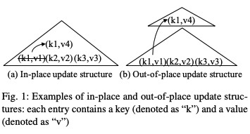

相反，out-of-place 更新结构（例如 LSM-tree）始终将更新存储到新位置，而不是覆盖旧条目。 例如，在 Figure 1b 中，更新 (k1, v4) 被存储到新位置，而不是直接更新旧条目 (k1, v1)。 此设计**提高了写入性能**，因为它可以利用顺序 I/O 来处理写入。 它还可以通过不覆盖旧数据来简化恢复过程。 然而，这种设计的主要问题是牺牲了读取性能，因为一条记录可能存储在多个位置中的任何一个位置。 此外，这些结构通常需要单独的数据重组过程来不断提高存储和查询效率。

顺序的、out-of-place 更新并不是新的概念，自 1970s 以来，它已成功地应用于数据库系统。1976年提出的 Differential files [63] 是 out-of-place 更新结构的早期案例。在这种设计中，所有更新首先应用于一个 differential file，该文件定期与主文件合并。后来，在 1980s Postgres project [65] 率先提出了日志结构数据库存储的想法。Postgres 将所有写操作添加到一个顺序日志中，从而实现快速恢复和 “time-travel” 查询。使用称为 vacuum cleaner 的后台进程来不断从日志中 garbage-collect 过时的记录。文件系统社区也采用了类似的思想，以充分利用磁盘写带宽，例如日志结构文件系统(LFS)[60]。

在 LSM 树出现之前，日志结构存储方法遇到了几个关键问题。首先也是最重要的，将数据存储到仅附加日志中会导致查询性能较低，因为相关记录分散在日志中。另一个问题是由于尚未删除的过时记录造成的空间利用率低。即使设计了各种各样的数据重组（data reorganization）过程，也没有原则性的成本模型来分析写成本、读成本和空间利用率之间的权衡，这使得早期的日志结构存储很难调优。数据重组很容易成为性能瓶颈[62]。

1996 年提出的 LSM-tree [52] 通过设计一个合并过程来解决这些问题，该合并过程集成到结构本身，提供高写入性能以及有限的查询性能和空间利用率。最初的 LSM-tree 设计包含一系列组件 $C0$ , $C1$, ···, $Ck$， 如图 Figure 2。所有组件使用 B+ tree 数据结构, $C0$ 存储在内存中并服务于传入的写，其他剩余的组件 $C1$, ···, $Ck$ 存储在磁盘上。当 $Ci$ 满时，将触发一个滚动合并过程，从 $Ci$ 中 merge a range of leaf pages 为 $Ci+1$。这种设计通常被称为水平合并策略（Leveling Merge Policy）[24, 25] 。然而，正如我们稍后将看到的，由于其实现的复杂性，最初提出的滚动合并过程并未被当今 LSM-based 存储系统所使用。LSM-trees [52] 的原始论文进一步表明，**在稳定的工作负载下，levels 的数量保持不变，当大小比 $Ti = |Ci+1|/|Ci|$ 一致时，写性能会得到优化。这个原则影响了 LSM-trees 的所有后续实现和改进。**

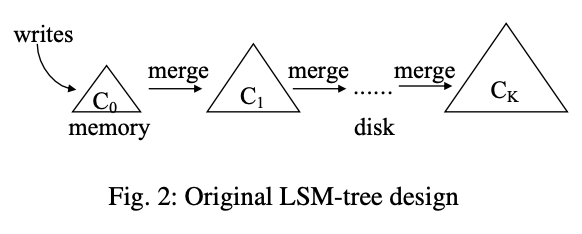

与 LSM-tree 并行，Jagadish 等人 [37] 提出了一个类似的结构和分步合并策略（stepped-merge policy），以获得更好的写性能。It organizes the components into levels, and when level L is full with T components, these T components are merged together into a new component at level L+1。该策略成为分层合并策略（tiering merge policy）[24，25] 在今天的  LSM-tree 实现中使用。

注：原地更新会优化读取性能，会产生随机 I/O 牺牲写入性能；异地更新顺序 I/O 提高写入性能，牺牲读取性能，数据会存储在多个位置，需要不断的数据重组降低空间使用率和提高查询效率。层级不变，层级的比例大小为 $Ti=|Ci+1|/|Ci|$ 时，写入性能是最优的。

### 2.2 Today’s LSM-trees

#### 2.2.1 Basic Structure

今天的 LSM-tree 实现仍然使用 out-of-place 更新来减少随机 I/O。所有传入的写操作都被追加到内存组件中。插入或更新操作只是添加一个新条目，而删除操作则添加一个 anti-matter 条目来表明 key 已被删除。然而，当前的 LSM-tree 实现通常利用硬盘组件 (disk components) 的不变性来简化并发控制和恢复。Multiple disk components are merged  together into a new one without modifying existing components.（注：非破坏性合并，合并出一个新文件，旧文件不修改，直到新文件稳定后删除）。这与原始的 LSM-tree [52] 提出的滚动合并过程不同。

在内部，LSM-tree component 可以使用任何索引结构来实现。如今的 LSM-tree 实现通常使用并发数据结构 (例如跳跃列表或 B+ tree ) 来组织其 memory components，同时他们使用 B+ tree 或排序字符串表 (SSTables) 组织 disk components。SSTable 包含数据块列表和索引块，数据块存储按 key 排序的键值对，索引块存储所有数据块的 key 范围。

LSM-tree 上的查询必须搜索多个组件以执行协调 (reconciliation)，即查找每个键的最新版本。获取特定键值的点查找查询 (point lookup query) 可以简单地逐个搜索所有组件(newest to oldest)，并在找到第一个匹配项后立即停止。范围查询 (range query) 可以同时搜索所有组件，将搜索结果输入优先级队列以执行调整。

随着磁盘组件随着时间的推移而累积，查询 LSM-tree 的性能往往会下降，因为必须检查更多组件(components)。 为了解决这个问题，磁盘组件逐渐合并以减少组件总数。实践中通常使用两种类型的合并策略 [24, 25]。如果 Figure 3，这两种策略都将磁盘组件组织为 logical levels (or tiers)，并由大小比 T 控制。图中每个组件都标有其潜在的 key 范围。在**水平合并策略 (leveling merge policy)**(Figure 3a），每层 (Level) 只维护一个组件，但 $L$ 层的组件比 $L$−1 层的组件大 $T$ 倍。因此, $L$ 级的组件将与 $L$-1 级的传入组件多次合并，直到填满，然后合并到 $L$+1 级。例如，在图中，level 0 的组件与 level 1 的组件合并，这将导致 level 1 的组件更大。相比之下，**分层合并策略(tiering merge policy)**(Figure 3b）每层（Level）最多维护 $T$ 个组件。当 $L$ 级满时，其 $T$ 个组件被合并到 $L$+1 的新组件中。图中，级别 0 的两个组件合并在一起，形成级别 1 的新组件。需要注意的是，如果级别 $L$ 已经是配置的最大级别，则生成的组件仍保持级别 L。在实践中，对于插入量等于删除量的稳定工作负载，级别总数保持不变。 一般来说，**水平合并策略 (leveling merge policy)** 会优化查询性能，因为 LSM 树中需要搜索的组件较少。**分层合并策略 (tiering merge policy)** 更加适合写入优化，因为它降低了合并频率。 我们将在 2.3 节中进一步讨论这两种合并策略的性能。

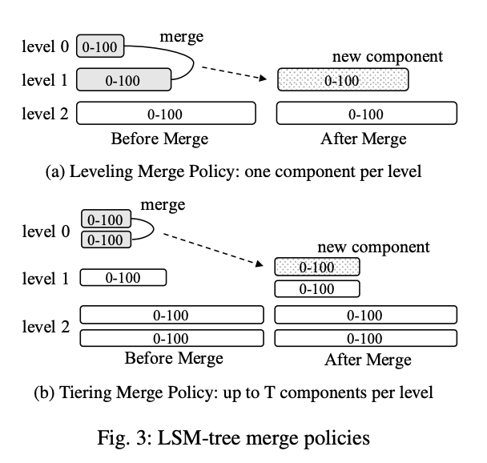

注：两种数据重组的方式：水平合并策略和分层合并策略。查询性能：水平合并策略 > 分层合并策略；写入性能：水平合并策略 < 分层合并策略。水平合并策略每层只维护一个组件，分层合并策略每层最多维护 $T$ 个组件。

#### 2.2.2 Some Well-Known Optimizations

There are two well-known optimizations that are used by most LSM-tree implementations today.

**Bloom Filter.**  Bloom Filter[18]是一种空间效率高的概率数据结构，旨在帮助回答集合成员查询 (set membership queries)。它支持两种操作，即插入键和测试给定键的成员关系。插入 key 时，它应用多个哈希函数将 key 映射到位向量中的多个位置，并将这些位置上的位设为 1。为了检查给定 key 是否存在，该 key 再次散列到多个位置。如果所有位都是 1，则 Bloom Filter 报告 key 可能存在。按照设计，布隆过滤器可以报告误报，但不能报告漏报。

Bloom Filter 可以构建在磁盘组件之上，以极大地提高点查找性能。要搜索磁盘组件，点查找查询可以首先检查它的 Bloom Filter ，然后只有当它所关联的 Bloom Filter 报告一个肯定的答案时才继续搜索它的 B+ tree。或者，可以为磁盘组件的每个叶子页构建 Bloom Filter。在这个设计中，点查询可以先搜索的非叶页面 B+ tree 定位叶页面，非叶页面被认为是足够小可以被缓存。然后在获取叶页面之前检查相应布隆过滤器来减少磁盘 I/O。请注意，Bloom Filter 报告的误报不会影响查询的正确性，但是查询可能会浪费一些 I/O 来搜索不存在的 key。Bloom Filter 的误报率可以计算为 $(1−e^{-kn/m})^k$ ，其中 k 为哈希函数的数量，n 是 key 的数量，m 为比特位的总数[18]。此外，最小化误报率的哈希函数的最佳数量是 $k =\frac m n ln2$。在实践中，大多数系统通常使用 10 bits/key 作为默认配置，这个配置有 1% 的误报率。由于 Bloom Filter 非常小，通常可以缓存到内存中，因此使用它们可以大大减少点查找的磁盘 I/O 数量。

**Partitioning.** 另一种常用的优化是将 LSM 树的磁盘组件进行范围分区为多个 (usually fixed-size) 小分区。为了尽量减少不同术语造成的潜在混淆，我们使用术语 SSTable 来表示这样的分区，遵循 LevelDB[4] 的术语。首先，分区将一个大型组件合并操作分解为多个较小的组件，从而限制了每个合并操作的处理时间以及创建新组件所需的临时磁盘空间。此外，分区可以通过仅合并具有重叠键范围的组件来优化具有顺序创建键或倾斜更新的工作负载。对于顺序创建的键，基本上不执行合并，因为不存在具有重叠键范围的组件。对于倾斜更新，冷更新范围的组件的合并频率可以大大降低。需要注意的是，原来的 LSM-tree[52] 会自动利用分区，因为它可以滚动合并 (rolling merges)。然而，由于滚动合并的实现复杂性，今天的 LSM-tree 实现通常选择实际的物理分区 (physical partitioning) 而不是滚动合并。

将分区应用到 LSM-tree 的一个早期建议是分区指数文件 (partitioned exponential file，PE文件)[38]。一个 PE 文件包含多个分区，其中每个分区在逻辑上都可以看作一个独立的 LSM-tree。当一个分区变得太大时，可以进一步将其分割为两个分区。然而，这种设计在分区之间强制执行严格的键范围边界，这降低了合并的灵活性。

现在我们讨论在当今的 LSM 树实现中使用的分区优化。需要注意的是，分区与合并策略是正交的；leveling merge 和 tiering merge (以及其他新兴的合并策略)都可以用于支持分区。据我们所知，只有分区均衡策略 (partitioned leveling merge policy) 已经被基于 LSM 的工业存储系统完全实现，例如 LevelDB[4] 和 RocksDB 6]。Some recent papers [12,50, 58, 76, 79] have proposed various forms of a partitioned tiering merge policy to achieve better write performance。

在 LevelDB[4] 首创的分级合并策略 (leveling merge policy) 中，每个级别的磁盘组件都被范围分区为多个固定大小的 SSTable，如 Figure 4 所示。图中每个 SSTable 都标有其 key 范围。 请注意，Level 0 的磁盘组件没有分区，因为它们是直接从内存中刷新的。这种设计还可以帮助系统吸收突发写 (absorb write bursts)，因为它可以在Level 0 容忍多个未分区组件。为了将 Level $L$ 的 SSTable 合并为 Level $L$+1 的 SSTable，我们将选取其所有 Level $L$+1 的重叠的 SSTable，并将这些重叠的 SSTable 与之合并，生成新的仍在 Level $L$+1 的 SSTable。例如在图中，Level 1 标记为 0-30 的 SSTable 与 Level 2 标记为 0-15 和 16-32 的 SSTable 合并。这个合并操作产生在 Level 2 标记为0-10、11-19 和 20-32 的新的 SSTables，然后旧的 SSTable 将被垃圾收集。可以使用不同的策略来选择接下来在每个 Level 合并哪个 SSTable。例如，LevelDB 使用 round-robin policy (以最小化总的写开销)。

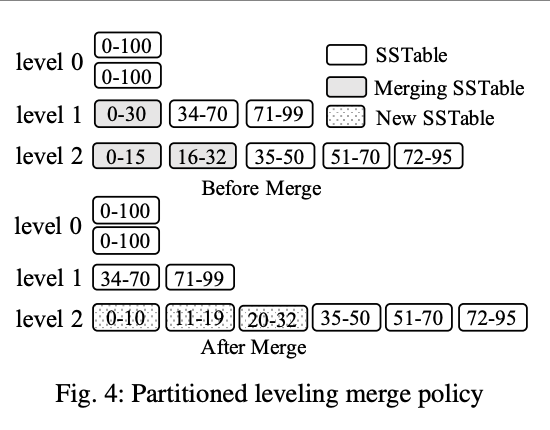

分区优化也可以应用于分层合并策略 (tiering merge policy)。 然而，这样做的一个主要问题是每个级别可以包含多个具有重叠键范围的 SSTable。这些 SSTable 必须根据其更新时间进行正确排序，以确保正确性。可以使用两种可能的方案来组织每个级别的 SSTable，即垂直分组和水平分组。在这两种方案中，每个级别的 SSTable 都被组织成组。 垂直分组方案将具有重叠键范围的 SSTable 分组在一起，以便这些组具有不相交的键范围。Thus, it can be viewed as an extension of partitioned leveling to support tiering。或者，在水平分组方案下，每个逻辑磁盘组件被范围划分为一组SSTable，直接作为一个组。这允许在 SSTable 单元的基础上增量地形成磁盘组件。下面我们将详细讨论这两种方案。

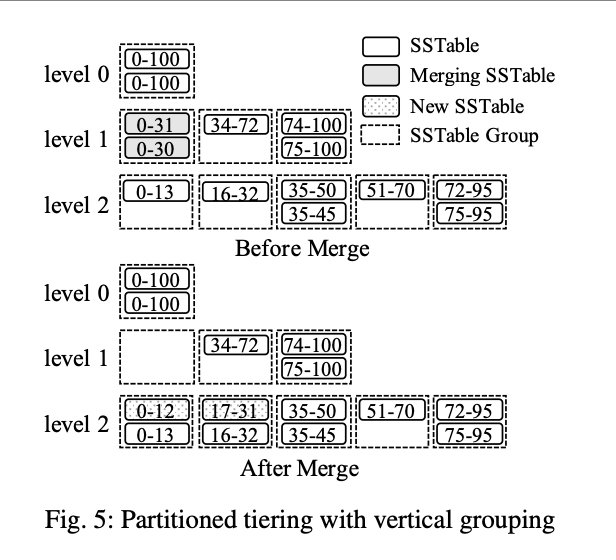

**垂直分组**方案示例如 Figure 5 所示。在这种方案中，具有重叠键范围的 SSTable 被分组在一起，这样分组就具有不相交的键范围。在合并操作期间，组中的所有 SSTable 被合并在一起，以根据下一级重叠组的键范围生成结果 SSTable，然后将其添加到这些重叠组中。例如在图中，level 1 标记为 0-30 和 0-31 的 SSTable 被合并在一起，生成标记为 0-12 和 17-31 的 SSTable，然后加入到 level 2 重叠组中。注意此合并操作之前和之后的 SSTable 之间的差异。在进行合并操作之前，标记为 0-30 和 0-31 的 SSTable 具有重叠的键范围，point lookup query 必须一起检查它们。然而，在合并操作之后，标记为 0-12 和 17-31 的 SSTables 具有不相连的键范围，并且只有其中一个需要通过点查找查询进行检查。还应当指出，在这一办法下，SSTable 的规模不再是固定的，因为它们是根据下一级重叠组的键范围产生的。

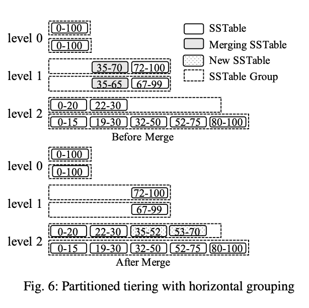

Figure 6 显示了**水平分组**方案的一个示例。在该方案中，每个组件被范围划分为一组固定大小的 SSTable，直接作为一个逻辑组。每个 level $L$还维护一个活动组，也是第一个组，用于接收从上一级合并的新 SSTable。该活动组可以被视为通过在未划分的情况下合并 level $L$-1 的组件而形成的部分组件。合并操作从当前 level 上的所有组中选择键范围重叠的 SSTable，并将得到的SSTable添加到 next level 的活跃组中。例如在图中，Level 1 标记为 35-70 和 35-65 的 SSTable 被合并在一起，Level 2 标记为 35-52 和 53-70 的SSTable被添加到第一组。然而，尽管在水平分组方案下，SSTable 的大小是固定的，但仍然有可能一个组中的一个 SSTable 与其他组中的大量 SSTable 重叠。

注：两种常见优化方式：布隆过滤器和分区。水平分区合并策略和分层分区合并策略（垂直分组、水平分组）。

#### 2.2.3 Concurrency Control and Recovery

我们现在简要讨论当今 LSM-tree 实现所使用的并发控制和恢复技术。对于并发控制，LSM-tree 需要处理并发读取和写入，并处理并发刷新和合并操作。确保并发读写的正确性是数据库系统访问方法的一般要求。根据事务隔离要求，当今的 LSM-tree 实现要么使用锁定方案[9]，要么使用多版本方案[1,3,6]。多版本方案可以很好地使用 LSM-tree，因为在合并期间可以自然地对 key 的过时版本进行垃圾收集。并发刷新和合并操作对于 LSM-tree 来说是唯一的。这些操作修改 LSM-tree  的元数据，例如 active 组件列表。因此，对组件元数据的访问必须正确地同步。为了防止正在使用的组件被删除，每个组件可以维护一个引用计数器。在访问 LSM-tree 的组件之前，查询可以首先获取 active 组件的快照，并增加它们正在使用的计数器。

由于所有写入都会首先附加到内存中，因此可以执行预写日志记录 (WAL) 以确保其持久性。为了简化恢复过程，现有系统通常采用 no-steal 的缓冲区管理策略[36]。也就是说，只有当所有活跃的写事务都终止时，内存组件才能刷新（注：先写WAL，成功后更新memtable）。在 LSM-tree 的恢复过程中，将重放事务日志以重做所有成功的事务，但由于 no-steal 策略，不需要撤消。同时，在发生崩溃的情况下，还必须恢复活跃磁盘组件列表。对于未分区的LSM树，可以通过向每个磁盘组件添加一对时间戳来实现这一点，这些时间戳指示存储条目的时间戳范围。这个时间戳可以简单地使用本地壁钟时间（local wall-lock time）或单调的序列号生成。重建组件列表，恢复过程只需找到所有时间戳不相交的组件。如果多个组件具有重叠的时间戳，则选择时间戳范围最大的组件，其余组件可以简单地删除，因为它们将被合并成所选组件。对于分区的 LSM-tree，这种基于时间戳的方法不再起作用，因为每个组件都进一步进行范围分区。为了解决这个问题，在 LevelDB[4] 和 RocksDB[6] 中使用的一种典型方法是维护一个单独的元数据日志，以存储对结构元数据的所有更改，如添加或删除 SSTable。然后，可以通过在恢复期间重放元数据日志来重新构建 LSM-tree 结构的状态。

### 2.3 Cost Analysis

为了帮助理解 LSM-Tree 的性能取舍，我们可以参考文献 [24, 25] 中对写入、点查找、范围查询和空间放大的成本分析。写入和查询的成本通过计算每次操作所需的磁盘 I/O 次数来衡量。该分析基于未分区的 LSM-Tree，并代表最坏情况下的成本。

设某 LSM-tree 的大小比率为 $T$，且包含 $L$ 个层级。在实际应用中，对于插入与删除量持平的稳定 LSM-tree, $L$ 保持恒定。定义 $B$ 为页容量（即每数据页可存储的条目数）, $P$ 为内存组件的页数。因此，单个内存组件最多包含 $B \cdot P$ 个条目，
第 i 层（i≥0）最多包含 $T^{i+1} \cdot B \cdot P$ 个条目。给定总条目数 $N$ 时，最大层级约存储 $N \cdot \frac{T}{T+1}$ 个条目（因其容量是上一层的T倍）。由此可得 $N$ 个条目所需的层级数估算公式: $L = \left\lceil \log_T\left(\frac{N}{B \cdot P} \cdot \frac{T}{T+1}\right) \right\rceil$

写入成本（在文献中也称为写放大）衡量将一个条目插入到 LSM-tree 中的摊销 I/O 成本。需要注意的是，这个成本衡量的是该条目最终被合并到最大层级所需的总体 I/O 成本，因为将条目插入到内存不会产生任何磁盘 I/O。对于 leveling 策略，每一层的组件将在填满并推送到下一层之前被合并 $T-1$ 次。
对于 tiering 策略，每一层的多个组件只需要合并一次然后直接推送到下一层。由于每个磁盘页包含 $B$ 个条目，因此每个条目的写入成本是：对于 leveling，写入成本为 $O\left(T \cdot \frac{L}{B}\right)$ ；对于 tiering，写入成本为 $O\left(\frac{L}{B}\right)$。

查询的 I/O 成本取决于 LSM-tree 中的组件数量。在没有 Bloom 过滤器的情况下，点查询的 I/O 成本对于 leveling 策略为
$O(L)$ ，对于 tiering 策略为 $O(T \cdot L)$。但 Bloom 过滤器能显著改善点查询成本：对于零结果点查询（即查找不存在的键），所有磁盘 I/O 均由 Bloom 过滤器误判引起。假设所有 Bloom 过滤器共使用
$M$ 比特且各层级误判率相同，在总键数为 $N$ 时，单个 Bloom 过滤器的误判率为 $O(e^{-\frac{M}{N}})$ [18]。因此，零结果点查询的 I/O 成本对 leveling 为
$O(L \cdot e^{-\frac{M}{N}})$ ，对 tiering 为 $O(T \cdot L \cdot e^{-\frac{M}{N}})$。而对于存在的唯一键查询，至少需要一次 I/O 获取条目。
由于实际应用中 Bloom 过滤器误判率远小于 1，leveling 和 tiering 的成功点查询 I/O 成本均为 $O(1)$。

范围查询的 I/O 开销取决于查询的选择性。设 $s$ 为范围查询访问的唯一条目数，当 $\frac{s}{B} > 2 \cdot L$ 时称为长范围查询，否则为短范围查询[24,25]。
区别在于，长范围查询的 I/O 成本将由最大级别控制，因为最大级别包含大部分数据。相比之下，短范围查询的 I/O 成本(几乎)来自所有级别，因为查询必须向每个磁盘组件发出一个 I/O。因此，长范围查询的 I/O 开销是 
leveling $O\left(\frac{s}{B} \right)$， tiering $O(T \cdot \frac{s}{B})$。短范围查询的 I/O 开销时 leveling $O(L)$， leveling $O(T \cdot L)$。

最后我们分析 LSM-tree 的空间放大率（Space Amplification），其定义为总条目数与唯一条目数之比 $^5$ (原文在[24, 25]中给出的分析将space amplification定义为过时entries的总数除以唯一entries的数量。我们稍微修改了这个定义，以确保space amplification不小于1。)。Leveling 的最坏情况发生在第 1 至 $L-1$ 层（约含总量 $\frac{1}{T}$ 的数据）全是最大层条目的更新时，
此时空间放大率为 $O(\frac{T+1}{T})$；Tiering 的最坏情况是最大层所有组件包含完全相同的键集合，此时空间放大率为 $O(T)$。实际部署存储系统时[28]，空间放大率是影响存储成本的关键因素。

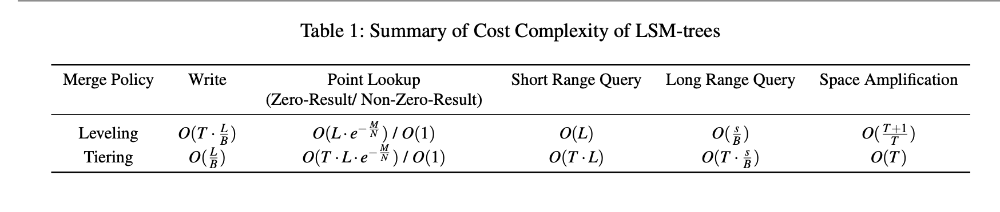

LSM-tree 的成本复杂度总结在 Table 1 中。注意大小比 $T$ 如何以不同的方式影响 leveling 和 tiering 的性能。通常，leveling 通过每层维护一个组件来优化查询性能和空间利用率。然而，组件必须被更频繁地合并，这将使写入成本增加一个 $T$ 的因子。相比之下，tiering 通过每层维护最多 $T$ 个组件来优化写入性能。然而，这将以 $T$ 的因子降低查询性能并恶化空间利用率。正如所见，LSM-tree 是高度可调的。例如，通过将合并策略从 leveling 更改为 tiering，可以在由于 Bloom filters 的存在而对点查询产生较小负面影响的情况下，大大提高写入性能。然而，范围查询和空间利用率将受到显著影响。随着我们继续研究最近关于改进 LSM-tree 的文献，我们将看到每种方法都做出了一定的性能权衡。实际上，基于 RUM 猜想[14]，每种访问方法都必须在读取成本（R）、更新成本（U）和内存或存储成本（M）之间做出一定的权衡。读者牢记此处描述的成本复杂度，将有助于更好地理解所提出改进所做的权衡。

## 3、LSM-tree Improvements

在本节中，我们将提出一个用于分类现有 LSM-tree 改进研究工作的分类法。随后，我们将按照所提出的分类法结构，对 LSM-tree 相关文献进行深入综述。

### 3.1 A Taxonomy of LSM-tree Improvements

尽管 LSM-tree 在现代 NoSQL 系统中非常流行，但其基本设计仍然存在各种缺陷和不足。我们将在这里指出基本 LSM-tree 设计中的主要问题，并基于这些缺陷，进一步提出一套 LSM-tree 改进方案的分类法。

**写放大**。尽管 LSM-tree 通过减少随机 I/O，相较于像 B+-树这样的原地更新结构，能够提供更好的写入吞吐量，但被现代键值存储系统（如 LevelDB [4] 和 RocksDB [6]）采用的 leveling 合并策略，仍然会导致相对较高的写放大。高写放大不仅限制了 LSM-tree 的写入性能，还会因为频繁的磁盘写操作而降低 SSD 的使用寿命。已有大量研究致力于降低 LSM-tree 的写放大问题。

**合并操作**。合并操作对于 LSM-tree 的性能至关重要，因此必须经过精心实现。此外，合并操作还可能对系统造成负面影响，包括合并完成后导致的缓冲缓存未命中，以及在执行大型合并时引发的写入阻塞。已有多项改进方案被提出，旨在优化合并操作，以解决这些问题。

**硬件优化**。为了充分发挥性能潜力，必须对 LSM-trees 进行精心实现以充分利用底层硬件平台。最初的LSM-trees 设计针对机械硬盘，主要目标是减少随机 I/O 操作。近年来，随着大容量内存、多核处理器、SSD/NVM 以及原生存储等新型硬件平台的出现，为数据库系统实现更优性能创造了新的机遇。当前大量研究都致力于优化 LSM-trees，以更好地适配这些硬件平台特性。

**特殊工作负载适配**。除硬件层面的优化外，针对特定应用场景的特殊工作负载，也可以通过定制化设计来提升性能表现。这就需要根据这些特殊工作负载的独特特征，对基础 LSM-trees 实现进行相应的调整和优化。

**自动调优**。根据RUM猜想[14]，任何访问方法都无法同时实现读取最优、写入最优和空间最优。LSM-trees 的可调性为实现特定工作负载的最优权衡提供了可行方案。然而，由于存在内存分配、合并策略、大小比率等诸多调节参数，LSM-trees的调优过程可能相当复杂。针对这一问题，文献中已提出多种自动调优技术。

**二级索引**。标准的 LSM-tree 仅提供简单的键值接口。为支持非键属性的高效查询，必须维护二级索引。该领域的关键问题在于：如何以最小的写入性能开销，高效维护一组相关的二级索引。目前，研究者们已经设计并评估了多种基于 LSM 的二级索引结构和技术方案。

基于 LSM-tree 基础设计中存在的这些主要问题，我们提出了一个改进方案的分类框架，如F igure 7 所示，以突出现有研究试图优化的具体方面。根据该分类框架，Table 2 进一步从每个改进方案的主要关注点和次要关注点两个维度对 LSM-tree 改进进行了分类。基于这个分类框架和分类结果，接下来我们将更深入地分析每个改进方案。

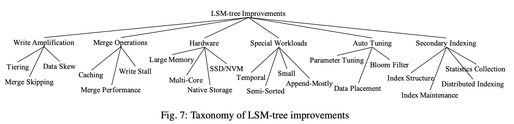

### 3.2 Reducing Write Amplification

本节将回顾现有文献中针对降低LSM-trees写入放大的改进方案。这些改进方案主要采用tiering策略，因其写入性能显著优于leveling策略。其余改进方案则通过开发合并跳过技术或利用数据倾斜特征等新方法实现优化。

#### 3.2.1 Tiering

优化写入放大的一种方法是采用 tiering 策略，因为相比 leveling 策略，它能显著降低写入放大。但如第2.3节所述，这会导致查询性能和空间利用率下降。本类改进方案均可视为第 2.2.2 节讨论的垂直或水平分组分区 tiering 设计的变体。以下将重点讨论这些改进方案的具体修改点。

WriteBuffer (WB) Tree [12] 可被视为采用垂直分组的分区 tiering 设计变体。它主要进行了以下修改：首先，采用哈希分区实现工作负载均衡，确保每个 SSTable 组存储的数据量大致相同；其次，将 SSTable 组组织成类似 B+-tree 的结构以实现自平衡，从而最小化总层数。具体而言，每个 SSTable 组被视为 B+-tree 中的一个节点。当非叶节点存满 $T$ 个 SSTable 时，这些 $T$ 个SSTable 会被合并并添加到其子节点中；当叶节点存满 $T$ 个 SSTable 时，通过合并操作将其分裂为两个键值范围较小的叶节点，每个新节点包含约 $T/2$ 个 SSTable。

轻量级压缩树（LWC-tree）[78,79]采用了类似的垂直分组分区 tiering 设计。该设计进一步提出了一种实现SSTable 组工作负载均衡的方法。需要注意的是，在垂直分组方案下，SSTable 不再严格固定大小，因为它们是基于下一级重叠组的键值范围（而非自身大小）生成的。在 LWC-tree中，若某组包含过多条目，系统会在该组完成合并（此时暂时为空）后缩小其键值范围，并相应扩大相邻兄弟组的键值范围。

PebblesDB [58] 同样采用了垂直分组的分区 tiering 设计。其主要区别在于使用受跳表[55]启发的 guards概念来确定 SSTable 组的键值范围。这些作为 SSTable 组键值范围的 guards 是基于插入键的概率选择，以实现工作负载均衡。一旦选定 guard，将在下次合并时延迟应用。PebblesDB 还通过并行查找 SSTable 来提升范围查询性能。

dCompaction [53] 引入了虚拟 SSTable 和虚拟合并的概念来降低合并频率。虚拟合并操作会生成一个虚拟 SSTable，该 SSTable 仅指向输入 SSTable 而无需执行实际合并。但由于虚拟 SSTable 指向多个范围重叠的 SSTable，查询性能会有所下降。为解决这个问题，dCompaction 基于实际 SSTable 数量设置了触发实际合并的阈值。当查询过程中遇到指向过多 SSTable 的虚拟 SSTable 时，也会触发实际合并。总体而言，dCompaction 会延迟合并操作直到可以合并多个 SSTable，因此可被视为 tiering 合并策略的一个变种。

如上所述，上述四种结构都采用了基于垂直分组的分区 tiering 相似高层设计。它们的主要区别在于实现SSTable 组工作负载均衡的方式不同。例如，WB-tree[12] 依赖哈希方法，但放弃了支持范围查询的能力；LWC-tree[78,79] 动态缩小密集 SSTable 组的键值范围；PebblesDB[58] 则依赖概率选择的 guards；而dCompaction[53] 未内置工作负载均衡支持。目前尚不清楚倾斜的 SSTable 组会如何影响这些结构的性能，需要未来研究来理解这个问题并评估这些工作负载均衡策略。

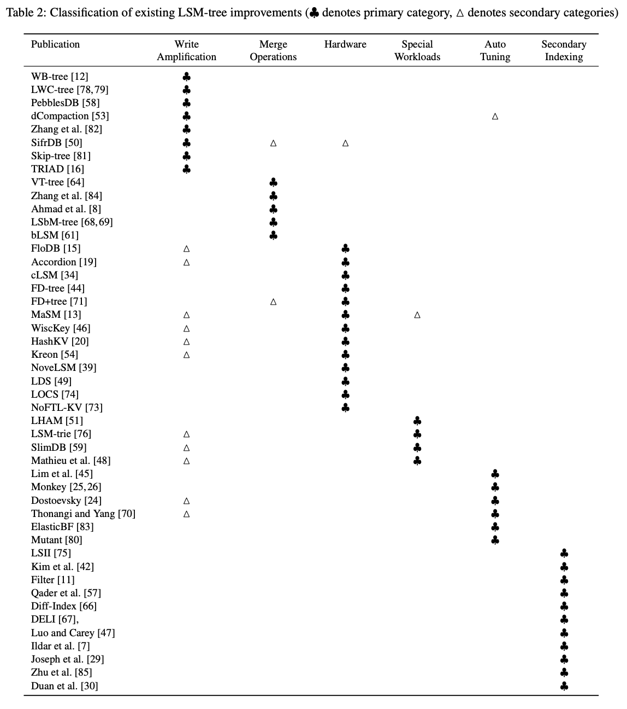

采用水平分组的分区 tiering 设计已被 Zhang et al[82]和 SifrDB[50] 所采用。SifrDB 还提出了一种早期清理技术来降低合并过程中的磁盘空间占用。在合并操作期间，SifrDB 会逐步激活新生成的 SSTable 并停用旧的 SSTable。此外，SifrDB 通过并行检查多个 SSTable 来利用 I/O 并行性，从而提升查询性能。

#### 3.2.2 Merge Skipping

Skip-tree [81]提出了一种合并跳过（merge skipping）技术来提升写入性能。其核心观察是：传统 LSM-tree 中每个数据条目必须从第0层逐级合并到最高层。若能让部分条目跳过中间层直接推送到更高层级，则可显著降低总体写入开销。如图8所示，当执行L层合并时，skip-tree 会将部分键直接推送至 L+K 层的可变缓冲区（mutable buffer），从而跳过中间层级的合并操作。同时，缓冲区中被跳过的条目将在后续合并时与 L+K 层的 SSTable 进行合并。为确保正确性，只有当键值不出现在中间层级（L+1 至 L+K-1）时，才允许从L层直接跳转到 L+K 层。该条件可通过检查中间层级的Bloom过滤器高效验证。skip-tree 还采用预写日志（write-ahead logging）确保缓冲区数据的持久性。为降低日志开销，仅记录键值及其原始 SSTable 的 ID，并禁止删除被缓冲区引用的 SSTable。尽管合并跳过是降低写入放大（write amplification）的创新思路，但其引入的可变缓冲区管理机制显著增加了实现复杂度。此外，由于该技术本质上是通过减少中间层合并次数来优化性能，与通过调整大小比率（size ratio）优化的 LSM-tree 相比，其实际效益仍需进一步验证。

#### 3.2.3 Exploiting Data Skew

TRIAD [16] 为减少热键频繁更新的偏斜工作负载的写入放大，其基本思路是在内存组件中分离热键和冷键，仅冷键会被刷写到磁盘。因此当热键更新时，旧版本可直接丢弃而无需写入磁盘。尽管热键不刷盘，它们仍会被定期复制到新事务日志中以回收旧日志空间。TRIAD还通过延迟L0层合并直到积累多个SSTable来降低写入放大。最后，它提出避免在刷写后创建新磁盘组件的优化方案，直接使用事务日志作为磁盘组件并构建索引结构来提升查询性能，但由于日志条目未排序，范围查询性能仍会受到影响。

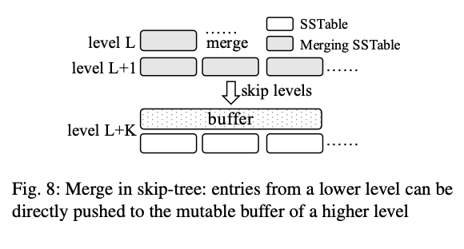

#### 3.2.4 Summary

Tiering 已被广泛用于提升 LSM-trees 的写入性能，但这会降低查询性能和空间利用率，如第 2.3 节所述。现有的基于 tiering 的改进方案主要区别在于 SSTables 的管理方式，包括垂直分组[12,53,58,78,79]和水平分组[50,82]。目前尚不清楚这些不同分组方案对系统性能的影响，未来研究需要评估它们的具体影响。skip-tree[81] 和T RIAD[16] 提出了几种提升写入性能的新思路，这些思路与 tiering 正交。但这些优化给实际系统带来了显著的实现复杂度，例如 skip-tree 引入的可变缓冲区和 TRIAD 将事务日志用作刷盘组件。

本类别的所有改进方案以及后文某些方案都声称能显著提升 LSM-trees 的写入性能，但其性能评估往往未考虑LSM-trees 的可调性。这些改进主要针对 LevelDB 或 RocksDB 的默认（未调优）配置进行评估，这些配置使用 size ratio 为 10 的 leveling 合并策略。目前尚不清楚这些改进方案与经过良好调优的 LSM-trees 相比效果如何。为解决这个问题，一个可能的解决方案是通过调整 size ratio 或采用 tiering 合并策略，将RocksDB 调优到与改进方案相似的写入吞吐量，然后评估这些改进方案对查询性能和空间放大的提升效果。此外，这些改进主要关注查询性能，往往忽略了空间放大。未来研究应该对这些改进方案与经过良好调优的基准 LSM-trees 进行全面评估，以确定其实际价值。我们也希望未来研究在评估改进方案时能充分考虑 LSM-trees 的可调性，避免出现这种情况。

### 3.3 Optimizing Merge Operations

接下来我们回顾一些改进合并操作实现的现有工作，包括提升合并性能、最小化缓冲缓存未命中和消除写入停顿。

#### 3.3.1 Improving Merge Performance

VT-tree[64] 提出了一种缝合(stitching)操作来提升合并性能。其基本思路是：当合并多个 SSTable 时，如果某个输入 SSTable 的页面键值范围与其他 SSTable 的任何页面都不重叠，那么结果 SSTable 可以直接引用该页面而无需重新读取和复制。尽管缝合操作能提升特定工作负载下的合并性能，但它也存在一些缺陷。首先，它可能导致碎片化，因为页面不再连续存储在磁盘上。为缓解这个问题，VT-tree 引入了缝合阈值 $K$，只有当输入 SSTabl e中存在至少 $K$ 个连续页面时才会触发缝合操作。此外，由于缝合页面中的键在合并操作期间不会被扫描，因此无法生成 Bloom 过滤器。为解决这个问题，VT-tree 使用商过滤器(quotient filters)[17]，因为多个商过滤器可以直接组合而无需访问原始键值。

Zhang 等人[84]提出了一种流水线合并实现，通过更好地利用 CPU 和 I/O 并行性来提升合并性能。关键观察是合并操作包含多个阶段，包括读取阶段、合并排序阶段和写入阶段。读取阶段从输入 SSTable 读取页面，然后在合并排序阶段进行归并排序以生成新页面，最后在写入阶段将新页面写入磁盘。因此，读取阶段和写入阶段是 I/O 密集型的，而合并排序阶段是 CPU 密集型的。为更好地利用 CPU 和 I/O 并行性，该方法将这些阶段流水线化执行，figure 9 所示。在这个例子中，读取第一个输入页面后，该方法会继续读取第二个输入页面(使用磁盘)，同时第一个页面可以进行合并排序(使用CPU)。

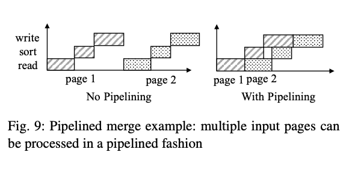

#### 3.3.2 Reducing Buffer Cache Misses

合并操作可能会干扰系统的缓存行为。当新组件启用后，由于该组件尚未被缓存，查询可能会遭遇大量缓冲缓存未命中。简单的直写式缓存维护策略无法解决这个问题——如果在合并操作期间缓存新组件的所有页面，将导致大量其他工作页面被置换出缓存，这同样会造成缓冲缓存未命中。

Ahmad 等人[8]通过实验研究了合并操作对系统性能的影响。研究发现合并操作会消耗大量CPU和I/O资源，并显著增加查询响应时间。为此，该工作提出将大型合并操作卸载到远程服务器执行以降低影响。合并完成后，采用智能缓存预热算法逐步获取新组件数据，从而最小化缓冲缓存未命中。其核心思路是通过分块(chunk-by-chunk)方式渐进切换至新组件，使查询请求能够平缓地从旧组件重定向到新组件。这种方法将突发的缓冲缓存未命中分解为大量较小的未命中事件，有效降低了组件切换对查询性能的负面影响。

Ahmad等人[8]提出的方法存在一个限制：合并操作必须卸载到独立服务器执行。后续研究发现仅靠增量预热算法是不够的，因为新生成的页面与现有热页面之间存在竞争[68,69]。为解决这个问题，日志结构缓冲合并树(LSbM-tree)[68,69]提出了替代方案：figure 10 所示，当 $L$ 层 SSTabl e合并到 $L$+1 层后，$L$层的旧 SSTable 会被追加到 $L$+1 层的关联缓冲区而非立即删除。注意 $L$+1 层的旧 SSTable 无需加入缓冲区，因为它们都来自 $L$ 层且其条目已预先加入缓冲区。查询也会检索缓冲区的 SSTable 以减少缓存未命中，系统会根据访问频率逐步删除缓冲的 SSTable。该方法不会在合并时产生额外磁盘 I/O（仅延迟删除旧 SSTable），但主要适用于只有少量键被频繁访问的偏斜工作负载，对于访问未缓存冷数据的查询（特别是无法利用 Bloom 过滤器的范围查询）可能引入额外开销。

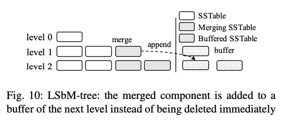

#### 3.3.3 Minimizing Write Stalls

虽然 LSM-tree 相比传统 B+-tree 具有更高的写入吞吐量，但由于 flush 和 merge 等重量级操作在后台运行，经常会出现写入停顿和不可预测的写入延迟。bLSM[61]提出了 spring-and-gear 合并调度器，针对非分区leveling 合并策略最小化写入停顿。其核心思想是允许每层保留一个额外组件，使得不同层级的合并操作可以并行执行。此外，该合并调度器通过控制合并进度，确保只有当L+1层的前次合并完成后，L层才会生成新的L+1层组件。这种机制最终会级联限制内存组件的最大写入速度，从而消除严重的写入停顿。但 bLSM 本身存在若干局限：它仅适用于非分区 leveling 合并策略；且仅约束了内存组件写入的最大延迟，而排队延迟（性能波动的主要来源之一）未被考虑。

#### 3.3.4 Summary

本类改进方案从性能、缓冲缓存未命中和写入停顿三个方面优化了合并操作的实现。为加速合并操作，VT-tree[64] 引入了缝合(stitching)操作，在适用情况下避免复制输入页面。但该操作可能导致碎片化，这对机械硬盘不利。此外，该优化与现代 LSM-tree 实现广泛采用的 Bloom 过滤器不兼容。流水线合并实现[84]通过利用CPU和I/O并行性提升合并性能。值得注意的是，许多基于 LSM 的存储系统已通过利用磁盘预读(read-ahead)和延迟写(write-behind)技术实现了某种形式的流水线处理。

Ahmed 等人[8] 和 LSbM-tree[68,69] 提出了两种缓解合并操作导致缓冲缓存未命中的替代方案。然而这两种方法都存在特定局限：Ahmed等人[8]的方案需要专用服务器执行合并操作，而 LSbM-tree[68,69] 延迟删除旧组件的策略可能对访问冷数据的查询产生负面影响。写入停顿是LSM-tree因其异地更新特性所独有的问题，bLSM[61] 是目前唯一尝试解决该问题的方案。但 bLSM[61] 仅约束了内存组件写入的最大延迟，由于排队因素，端到端写入延迟仍可能出现较大波动。提升 LSM-tree 性能稳定性仍需更多研究努力。

### 3.4 Hardware Opportunities

下面我们将回顾针对不同硬件平台提出的 LSM-tree 改进方案，包括大内存、多核、SSD/NVM 和原生存储等。这些改进方案的通用范式是修改 LSM-tree 的基础设计，以充分利用目标硬件平台的独特特性，从而实现更好的性能。

#### 3.4.1 Large Memory

采用大内存组件对 LSM-tree 有利，这能减少总层级数从而提升写入和查询性能。但管理大内存组件会带来新挑战：若直接使用堆内数据结构实现内存组件，大内存会产生大量小对象导致显著 GC 开销；而若采用堆外结构（如并发 B+-tree）实现，大内存仍会导致更高查询成本（因树高度增加）和更多 CPU 缓存未命中（因写入操作需先定位数据在结构中的位置）。

FloDB[15] 采用双层设计来管理大内存组件：顶层是小型并发哈希表以支持快速写入，底层是大型跳表以高效支持范围查询。当哈希表填满时，系统使用批处理算法将其条目高效迁移至跳表。通过将随机写入限制在小内存区域，该设计显著提高了内存写入吞吐量。为支持范围查询，FloDB 要求查询必须等待哈希表清空，从而仅需搜索跳表即可应答查询。但 FloDB 存在两个主要问题：首先，对于同时包含写入和范围查询的工作负载效率不高，因其存在竞争；其次，跳表可能占用过大内存空间，导致内存利用率降低。

为改进 FloDB 的不足，Accordion[19] 采用多层架构管理大容量内存组件。该设计(figure 11)在顶层设置小型可变内存组件处理写入操作。当可变内存组件满载时，系统通过内存刷新操作将其转换为(更紧凑的)不可变内存组件，而非直接写入磁盘。类似的，这些不可变内存组件可通过内存合并操作进行整合，既提升查询效率又可回收无效条目占用的存储空间。需要强调的是，内存刷新与合并操作完全不涉及磁盘 I/O，通过充分利用大容量内存显著降低了总体磁盘 I/O 开销。

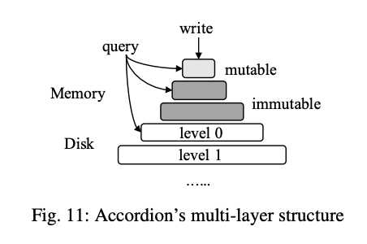

#### 3.4.2 Multi-Core

cLSM [34]针对多核机器进行了优化，提出了适用于各类 LSM-tree 操作的新型并发控制算法。该系统将 LSM 组件组织成并发链表结构，以最小化同步操作造成的阻塞。flush 和 merge 操作经过精心设计，仅会对链表进行原子级修改，确保不会阻塞查询操作。当内存组件存满时，系统会分配新内存组件，同时旧组件将被 flush。为避免写入操作继续修改旧内存组件，写入线程在执行修改前需获取共享锁，而 flush 线程在执行 flush 前需获取排他锁。cLSM 还通过多版本技术支持快照扫描，并采用乐观并发控制方法实现原子化的读-改-写操作——该方法利用了所有写入操作（因而所有冲突）都涉及内存组件这一特性。

#### 3.4.3 SSD/NVM

与传统机械硬盘仅支持高效顺序 I/O 不同，固态硬盘(SSD)和非易失性内存(NVM)等新型存储设备同样支持高效随机I/O 操作。NVM 更进一步提供了具有持久化保证的高效字节寻址随机访问能力。

FD-tree[44] 使用了与 LSM-trees 类似的设计以减少 SSDs 上的随机写入。一个主要的不同点在于，FD-tree 利用了 fractional cascading[22] 来提升查询性能，而不是使用 Bloom filters。对于每一层的 component，FD-tree 额外存储了 fence pointers，这些指针指向下一层的每一个 page。例如，在 Figure 12中，level 2 的 pages 由 level 1 中 keys 为 1、27、51、81 的 fence pointers 指向。在 level 0 执行一次 binary search 之后，查询可以沿着这些 fence pointers 遍历所有的层。然而，这种设计为合并操作引入了额外的复杂性。当 level L 的 component 被合并到 level L+1 时，所有从 level 0 到 level L−1 的层也必须一并合并，以重建 fence pointers。此外，在搜索不存在的 keys 时，point lookup 仍然需要执行 disk I/Os，而使用 Bloom filters 可以在很大程度上避免这种开销。基于这些原因，现代的 LSM-tree 实现更倾向于使用 Bloom filters 而不是 fractional cascading $^6$。（RocksDB[6] 通过为每个 SSTable 维护相邻下一层重叠 SSTable 集合，实现了有限形式的 fractional cascading。这些指针用于在点查询定位特定 SSTable 时缩小搜索范围。）

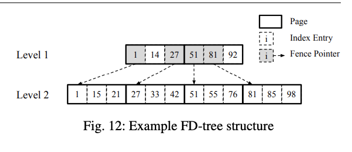

FD+tree[71] 优化了FD-tree [44]的合并过程。在 FD-tree 中，当发生从 level 0 到 level L 的合并时，需要创建 level 0 到 L 的新 components，这会暂时使磁盘空间翻倍。为解决这个问题，FD+tree 在合并操作期间逐步激活新 components，并回收那些未被任何活跃查询使用的旧 components 中的 pages。

MaSM（materialized sort-merge）[13] 旨在通过利用 SSD 来支持数据仓库工作负载中的高效更新。MaSM 首先将所有更新缓存在 SSD 中。它使用 tiering merge policy 以较低的 write amplification 合并中间 components。然后，这些更新被合并回驻留在硬盘中的 base data。MaSM 可以被视为 Dostoevsky [24] 提出的 lazy leveling merge policy 的简化形式，稍后在本综述中我们将看到。此外，由于 MaSM 主要面向支持数据仓库工作负载的 long range queries，因此存储在 SSD 中的中间 components 引入的开销相比访问 base data 的成本是可以忽略的。这使得 MaSM 在处理具有并发更新的 queries 时仅带来很小的开销。

由于 SSD 支持高效的 random reads，将 values 与 keys 分离成为提升 LSM-trees 写入性能的可行方案。这种方法最早由 WiscKey[46] 实现，随后被 HashKV[20] 和 SifrDB[50] 采用。如 Figure 13 所示，WiscKey[46] 将 key-value pairs 存储到 append-only log 中，而 LSM-tree 仅作为一个 primary index，用于将每个 key 映射到其在 log 中的位置。虽然这种方式可以通过仅合并 keys 大大减少写入成本，但由于 values 不再排序，range query 的性能将会受到显著影响。此外，value log 必须被高效地 garbage-collect 以回收存储空间。在 WiscKey 中，garbage-collection 通过三个步骤进行。首先，WiscKey 扫描 log tail，并通过对 LSM-tree 执行 point lookups 来验证每个 entry，以判断每个 key 的位置是否发生了变化。其次，位置未变化的 valid entries 被追加到 log 中，并且它们在 LSM-tree 中的位置也被更新。最后，log tail 被截断以回收存储空间。然而，由于昂贵的 random point lookups，这一 garbage-collection 过程已被证明成为新的性能瓶颈 [20]。

HashKV[20] 引入了一种更高效的方法来垃圾回收 obsolete values。基本思想是根据 keys 将 value log 进行 hash-partition，并独立地对每个 partition 进行 garbage-collection。为了对一个 partition 进行 garbage-collection，HashKV 对 keys 执行 group-by 操作，以找到每个 key 的最新 value。Valid key-value pairs 被添加到新的 log 中，并且它们的位置随后在 LSM-tree 中被更新。HashKV 进一步将 cold entries 单独存储，以便可以减少它们的 garbage-collection 频率。

Kreon[54] 利用 memory-mapped I/O 来通过避免不必要的数据拷贝来减少 CPU 开销。它在 Linux kernel 中实现了一个定制的 memory-mapped I/O 管理器，用于控制缓存替换并启用 blind writes。为了提升 range query 性能，Kreon 在查询处理期间通过将访问过的 key-value pairs 一起存储在一个新的位置来重组数据。

NoveLSM[39] 是一个基于 NVMs 的 LSM-tree 实现。NoveLSM 添加了一个基于 NVM 的 memory component，当 DRAM memory component 满时，用来继续处理 writes，而不会使写入阻塞。它进一步通过跳过 logging 来优化 NVM memory component 的写入性能，因为 NVM 本身提供了持久性。最后，它利用 I/O 并行性来提升性能。

#### 3.4.4 Native Storage

最后，这类研究中的最新工作尝试对 HDD 和 SSD 等存储设备进行原生管理，以优化 LSM-tree 实现的性能。

基于 LSM-tree 的直接存储系统(LDS)[49]通过绕过文件系统来更好地利用 LSM-tree 的顺序和聚合 I/O 模式。LDS 的磁盘布局包含三个部分：数据块(chunks)、版本日志(version log)和备份日志(backup log)。数据块存储 LSM-tree 的磁盘组件；版本日志记录每次 flush 和 merg e后的元数据变更（如记录被淘汰的旧数据块和 merge 产生的新数据块），并通过定期 checkpoint 聚合变更以截断日志；备份日志则通过预写日志(WAL)为内存写入提供持久性保证。

LOCS[74] 是基于开放通道 SSD 的 LSM-tree 实现，该系统通过开放通道 SSD 提供的通道接口（每个通道作为独立逻辑磁盘设备运行）来调度磁盘写入：1) 采用最小加权队列长度策略将 flush 和 merge 产生的写入分配到所有通道；2) 为提升分区 LSM-tree 的 I/O 并行性，将不同层级但键范围相近的 SSTable 分散到不同通道以实现并行读取。

LOCS[74] 是 LSM-tree 在开放通道 SSD 上的实现。开放通道 SSD 通过称为通道的接口暴露内部 I/O 并行性，每个通道作为独立的逻辑磁盘设备运行。这使得应用程序可以灵活调度磁盘写入以利用可用 I/O 并行性，但磁盘读取必须由存储数据的同一通道处理。为利用此特性，LOCS 采用最小加权队列长度策略将 flus h和 merge 产生的磁盘写入分发到所有通道，以平衡各通道的工作负载。为进一步提升分区 LSM-tree 的 I/O 并行性，LOCS 将来自不同层级但具有相似键范围的 SSTable 放置到不同通道，使这些 SSTabl e能够并行读取。

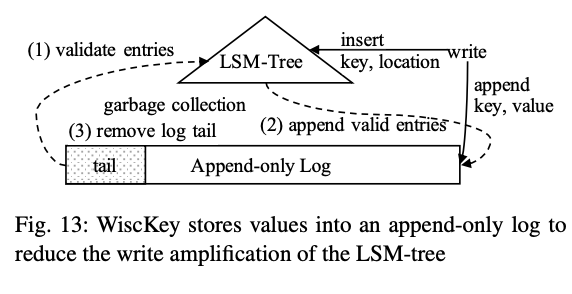

NoFTL-KV[73] 提出将闪存转换层(FTL)从存储设备提取到键值存储中，以直接控制存储设备。传统上，FTL通过将逻辑块地址转换为物理块地址来实现磨损均衡，通过均匀分布写入到所有块来提高 SSD 寿命。NoFTL-K V阐述了提取 FTL 的多个优势：将任务下推到存储设备、执行更高效的数据布局以利用 I/O 并行性，以及将存储设备的垃圾回收过程与 LSM-tree 的合并过程集成以减少写入放大。

#### 3.4.5 Summary

本节我们回顾了针对不同硬件平台的 LSM-tree 优化方案，包括大内存[15,19]、多核[34]、SSD/NVM[13,20,39,44,46,54,71]和原生存储[49,74,73]。针对大内存管理，FloDB[15] 和 Accordion[19] 均采用多层架构将随机写入限制在小内存区域，区别在于 FloDB 仅使用两层结构，而 Accordion 采用多层以提供更好的并发性和内存利用率。针对多核机器，cLSM[34] 提出新的并发控制算法提升并发性能。

针对 SSD/NVM 优化的核心思路是：在利用其高随机读取吞吐量的同时降低 LSM-tree 的写入放大以延长设备寿命。FD-tree[44] 及其改进版 FD+tree[71] 采用 fractional cascading[22] 提升点查询性能（每组件仅需1次随机I/O），但当前实现更倾向使用 Bloom 过滤器以避免不必要 I/O。键值分离方案[20,46,54]通过仅合并键显著提升写入性能，但会降低查询性能和空间利用率，且需单独回收值日志（类似传统日志结构文件系统[60]）。最新研究通过对 HDD[49] 和 SSD[73,74] 的原生管理，利用 LSM-tree 的顺序和非覆盖 I/O 模式获得显著性能提升。

### 3.5 Handling Special Workloads

我们现在回顾一些现有的 LSM-tree 改进方案，这些方案针对特殊工作负载以获得更好的性能。所考虑的特殊工作负载包括时序数据、小数据、半排序数据和追加密集型数据。

日志结构历史访问方法(LHAM)[51]改进了原始 LSM-tree 以更高效支持时序工作负载。LHAM的 关键改进是给每个组件附加时间戳范围，通过剪枝无关组件来优化时序查询处理。它进一步保证组件间时间戳范围互不重叠，这是通过修改滚动合并过程实现的——总是将组件 $Ci$ 中最旧时间戳的记录合并到 $Ci+1$ 中。

LSM-trie[76] 是一种基于 LSM 的哈希索引，用于管理大量小型 key-value 对。它提出了多种优化以减少元数据开销。LSM-trie 采用分区分层设计以降低写放大。LSM-trie 并不是直接存储每个 SSTable 的 key 范围，而是利用其哈希值前缀来组织 SSTable，从而减少元数据开销，figure 14 所示。LSM-trie 进一步去除了索引页，而是根据哈希值将 key-value 对分配到固定大小的桶中。溢出的 key-value 对会被分配到未满的桶，并将该信息记录在迁移元数据表中。LSM-trie 还为每个桶构建 了Bloom filter。由于每一层的每个分组中有多个 SSTable，LSM-trie 会将这些 SSTable 中同一逻辑桶的所有 Bloom filter 聚集在一起，这样点查找查询时可以通过一次 I/O 获取。总体而言，LSM-trie 主要在 key-value 对数量极大，以至于元数据（如索引页和 Bloom filter）无法完全缓存时才有效。然而，LSM-trie 仅支持点查找，因为其优化高度依赖哈希。

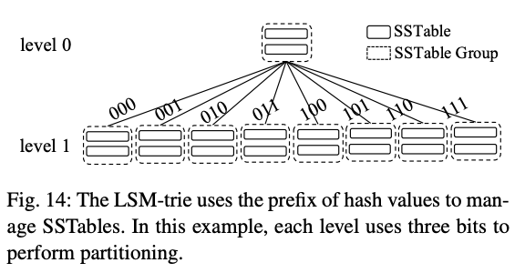

SlimDB[59] 针对半排序数据，其中每个 key 包含前缀 x 和后缀 y。它支持常规点查找（给定前缀和后缀）以及检索所有具有相同前缀 key x 的 key-value 对。为减少写放大，SlimDB 在底层采用分层结构，在高层采用分级结构。SlimDB 还在采用分层合并策略的层级中使用多级 cuckoo filter[32] 以提升点查找性能。在每一层，多级 cuckoo filter 将每个 key 映射到存储该 key 最新版本的 SSTable 的 ID，因此点查找只需一次 filter 检查。为减少 SSTable 的元数据开销，SlimDB 采用如下多级索引结构：首先将每个前缀 key 映射到包含该前缀 key 的页面列表，以便在给定前缀 key 时高效检索 key-value 对；然后为每个页面存储后缀key 的范围，以便基于前缀和后缀 key 高效支持点查找查询。

Mathieu 等人[48]提出了两种针对追加为主工作负载且组件数量有界的新合并策略。分级和分层的一个问题是层数取决于总条目数。因此，在追加为主的工作负载下，数据量不断增加，为了达到第 2.3 节描述的写入成本，总层数将无法有界。为了解决这个问题，该工作研究了在最多 $K$ 个组件的情况下，追加为主工作负载下在线合并策略的写入成本理论下界，并提出了两种合并策略：MinLatency 和 Binomial，以达到该下界。

这里介绍的四种改进方案各自针对特定的工作负载。需要注意的是，这些优化对于通用工作负载可能无用甚至不适用。例如，LSM-trie[76] 仅支持点查找，而 SlimDB[59] 仅支持通过获取所有前缀key对应值的有限形式范围查询。因此，这些优化的采用应根据具体工作负载谨慎选择。

### 3.6 Auto-Tuning

我们现在回顾一些旨在为LSM-tree开发自动调优技术的研究工作，以减轻终端用户的调优负担。一些技术对所有参数进行协同调优以找到最优设计，而另一些则专注于某些特定方面，如合并策略、Bloom filter 或数据放置。

#### 3.6.1 Parameter Tuning

Lim 等人[45]提出了一种分析模型，将 key 分布纳入其中以改进 LSM-tree 操作的成本估算，并进一步利用该模型对 LSM-tree 的参数进行调优。其核心观点是，传统的最坏情况分析（第2.3节）未考虑 key 分布。如果某个 key 在早期合并时被发现已被删除或更新，它将不会参与后续合并，因此其整体写入成本会降低。该模型假设已知 key 分布，使用概率质量函数 $f_X(k)$ 来衡量特定 key k 被写入请求写入的概率。给定总写入请求数 p，唯一 key 的数量可通过期望值估算为 $Unique(p) = N - Σ_{k ∈ K} (1 - f_X(k))^p$，其中 $N$ 为唯一 key 总数, $K$ 为 key 空间。基于该公式，可以通过累加所有 flush 和 merge 的成本（但重复 key 不会参与后续 merge）来计算 p 次写入的总写入成本。最后，通过最小化总写入成本，利用该成本模型找到最优系统参数。

Monkey[25, 26] 协同调优合并策略、大小比，以及内存组件与 Bloom filter 之间的内存分配，以为给定工作负载找到最优的 LSM-tree 设计。Monkey 的第一个贡献是指出，常见的 Bloom filter 内存分配方案——为所有 Bloom filter 分配相同的每 key 位数——会导致次优性能。其直觉是，最后一层的 $T$ 个组件包含了大部分数据，消耗了大部分 Bloom filter 内存，但这些 Bloom filter 最多只能为一次点查找节省 $T$ 次磁盘 I/O。为最小化所有 Bloom filter 的整体误判率，Monkey 通过分析表明，应为低层组件分配更多位数，使得 Bloom filter 的误判率呈指数递增。在这种方案下，零结果点查找查询的 I/O 成本将由最后一层主导，新的 I/O 成本为 leveling 时 $O(e^{-\frac{M}{N}})$，tiering 时为 $O(T \cdot e^{-\frac{M}{N}})$。随后，Monkey 通过最大化整体吞吐量，结合类似第 2.3 节的成本模型并考虑工作负载的操作混合，找到最优的 LSM-tree 设计。

#### 3.6.2 Tuning Merge Policies

Dostoevsky[24] 表明，现有的合并策略（即分层和分级）对于某些工作负载来说是次优的。其直觉是，对于分级，零结果点查找、长范围查询和空间放大主要受最大层影响，但写入成本则均匀分布在所有层。为了解决这个问题，Dostoevsky 引入了一种 lazy-leveling 合并策略，在低层采用分层，在最大层采用分级。lazy-leveling 的写入成本远优于分级，但点查找成本、长范围查询成本和空间放大与分级相似。由于组件数量增加，其短范围查询成本略高于分级。Dostoevsky 还提出了一种混合策略：最大层最多有 Z 个组件，其余每层最多有 K 个组件，Z 和 K 均可调。随后，Dostoevsky 采用与 Monkey[25] 类似的方法，为给定工作负载找到最优的 LSM-tree 设计。值得注意的是，Dostoevsky[24] 的性能评估非常全面，通过与调优良好的LSM-tree 对比，证明在特定工作负载 下Dostoevsky 严格优于现有 LSM-tree 设计。

Thonangi 和 Yang 70] 正式研究了分区对 LSM-tree 写入成本的影响。该工作首先提出了ChooseBest 策略，总是选择与下一层重叠 SSTable 最少的 SSTable 进行合并，以限定最坏情况下的合并成本。虽然ChooseBest 策略在整体写入成本上优于无分区合并策略，但在某些时期，由于当前层在一次全量合并后变为空，降低了后续合并成本，无分区合并策略的写入成本会更低。为利用全量合并的优势，该工作进一步提出了一种混合合并策略，根据相邻层之间的相对大小有选择地执行全量合并或分区合并，并动态学习这些大小阈值，以最小化给定工作负载下的整体写入成本。

#### 3.6.3 Dynamic Bloom Filter Memory Allocation

所有现有的 LSM-tree 实现，甚至包括 Monkey[25]，都采用静态方案来管理 Bloom filter 的内存分配。即一旦为某个组件创建了 Bloom filter，其误判率就保持不变。而 ElasticBF[83] 则根据数据的冷热程度和访问频率动态调整 Bloom filter 的误判率，以优化读性能。假设每个 key 有 k 位 Bloom filter 预算，ElasticBF 会构建多个较小的 Bloom filter，分别分配 k1, ···, kn 位，使得 k1 + ··· + kn = k。当这些 Bloom filter 联合使用时，整体误判率与原始单一 Bloom filter 相同。ElasticBF 随后根据访问频率动态激活或停用这些 Bloom filter，以最小化总额外 I/O 量。实验表明，ElasticBF 主要在 Bloom filter 内存非常有限（如平均每 key 仅4位）时效果显著，此时 Bloom filter 误判导致的磁盘I/O占主导。当内存较大、每 key 可分配更多位（如10位）时，ElasticBF 的收益有限，因为误判导致的磁盘 I/O 远小于实际定位 key 的 I/O 次数。

#### 3.6.4 Optimizing Data Placement

Mutant [80] 优化了 LSM-tree 在云存储上的数据放置。云服务商通常提供多种性能和成本不同的存储选项。在给定预算下，合理地将 SSTable 放置在不同存储设备上对于最大化系统性能非常重要。Mutant 通过监控每个SSTable 的访问频率，选择一部分 SSTable 放在高速存储上，使得对高速存储的总访问次数最大化，同时被选中的 SSTable 数量受限。这个优化问题等价于 0/1 背包问题（NP难），可用贪心算法近似求解。

#### 3.6.5 Summary

本类别介绍的技术旨在针对给定工作负载自动调优 LSM-tree。Lim 等人[45]和 Monkey[25, 26] 都试图为LSM-tree 找到最优设计以最大化系统性能，但这两种技术是互补的。Lim 等人[45]采用新颖的分析模型改进了成本估算，但只关注于调优分级合并策略的最大层大小。相比之下，Monkey[25, 26] 及其后续工作 Dostoevsky[24] 则协同调优 LSM-tree 的所有参数以找到最优设计，但仅针对最坏情况下的 I/O 成本进行优化。将这两种技术结合起来以实现更准确的性能调优和预测将非常有价值。

Dostoevsky[24] 通过结合分级和分层扩展了 LSM-tree 的设计空间。这对于需要高效写入、点查找和长范围查询而对短范围查询要求较低的某些工作负载非常有用。Thonangi 和 Yang [70] 提出将全量合并与分区合并结合，以获得更好的写入性能。其他调优技术则关注于 LSM-tree 实现的某些方面，如 ElasticBF[83] 对Bloom filter 的调优和 Mutant[80] 对数据放置的优化。

### 3.7 Secondary Indexing

到目前为止，我们讨论的 LSM-tree 改进都基于仅包含单一 LSM-tree 的 key-value 存储场景。现在我们将讨论基于 LSM 的二级索引技术，以支持高效的查询处理，包括索引结构、索引维护、统计信息收集和分布式索引。

在详细介绍这些研究工作之前，我们先讨论一些基于 LSM 的二级索引技术的基本概念。一般来说，基于 LSM 的存储系统会包含一个主索引和多个二级索引。主索引按主键存储记录值。每个二级索引通过复合键方式或 key list 方式，为每个二级键存储对应的主键。在复合键方式中，二级索引的索引键由二级键和主键组成；在 key list 方式中，二级索引为每个二级键关联一个主键列表。无论哪种方式，使用二级索引处理查询时，首先在二级索引中查找，返回匹配的主键列表，然后如有需要再用这些主键从主索引中获取记录。figure 15 展示了一个基于 LSM 的二级索引示例。
示例中的 User 数据集有三个字段：Id、Name 和 Age，其中 Id 为主键。主索引按 Id 存储完整记录，而两个二级索引分别存储二级键（Name 和 Age）及其对应的 Id。

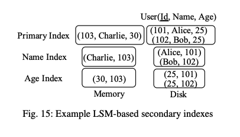

#### 3.7.1 Index Structures

日志结构倒排索引（LSII）[75]是一种为微博客实时精确关键词搜索设计的索引结构。查询 q 会检索得分最高的前 K 条微博客，得分为重要性、新鲜度和相关性的加权和。为支持高效查询处理，磁盘组件中每个关键词分别按重要性、新鲜度和频率降序存储三条倒排主键列表。存储三条倒排列表可通过阈值算法[31]高效处理查询：一旦未见微博客的得分上界低于当前前 K 答案，查询即停止。而内存组件只存储一条倒排列表，因为内存组件中的文档通常新鲜且大多会被查询访问，且存储多条倒排列表会显著增加内存组件的写入成本。

Kim 等人[42]对地理标记数据的 LSM 基础空间索引结构进行了实验研究，包括 R-tree[35]、动态 Hilbert B+-tree（DHB-tree）[43]、动态 Hilbert 值 B+-tree（DHVB-tree）[43]、静态 Hilbert B+-tree（SHB-tree）[33]和空间倒排文件（SIF）[40]的 LSM-tree 版本。R-tree 是一种用最小包围矩形存储多维空间数据的平衡搜索树。DHB-tree 和 DHVB-tree 通过空间填充曲线将空间点直接存入 B+-tree。SHB-tree 和 SIF 采用基于网格的方法，将二维空间静态分解为多级网格层次。每个空间对象存储其重叠网格单元的 ID。两者区别在于，SHB-tree 将单元 ID 与主键对存储在 B+-tree 中，而 SIF 为每个单元 ID 在倒排索引中存储主键列表。研究结论是，这些索引结构没有绝对优劣，但 LSM 基础 R-tree 在数据导入和查询负载下表现均衡，且无需过多调优，同时能很好地处理点和非点数据。此外，对于非索引查询，最终主键查找步骤通常占主导，因为每个主键常需单独磁盘 I/O，这进一步缩小了空间索引方法间的差异。

Filters[11] 为主索引和二级索引的每个组件增加 filter，以便在查询处理时基于 filter key 进行数据剪枝。filter 为组件内条目的选定 filter key 存储最小值和最大值。如果查询条件与 filter 的最小值和最大值不相交，则该组件可被剪枝。虽然 filter 可建立在任意字段上，但实际上只对时间相关字段有效，因为组件天然按时间分区，filter 范围往往不重叠。需要注意的是，key 被更新或删除时，filter 的维护需特别小心。此时，内存组件的 filter 需基于新旧记录共同维护，以保证未来查询不会遗漏新更新。例如figure 16所示的带 filter 主 LSM-tree，在插入新记录(k1, v4, T4)后，内存组件的 filter 变为 [T1, T4]，这样未来查询能正确识别磁盘组件中旧记录(k1, v1, T1)已被删除。否则，如果 filte r只基于新值 T4 维护为 [T3, T4]，则 T≤T2 的查询会错误地剪枝内存组件，导致实际查到已删除的记录(k1, v1, T1)。

Qadar 等人[57]对基于 LSM 的二级索引技术（包括 filter 和二级索引）进行了实验研究。对于 filter，评估了组件级范围 filter 和二级键上的 Bloom filter。对于二级索引，评估了基于复合键和 key list 的两种方案。根据二级索引的维护方式，key list 方案可进一步分为 eager 和lazy。eager key list 方案总是读取前一列表，生成包含新条目的完整新列表并插入内存组件；lazy key list 方案则在每个组件维护多个部分列表。实验结果表明，eager 倒排列表方案因点查找和高写放大导致数据导入开销大。当查询选择性变大（即结果集包含更多条目）时，lazy key list 方案与复合键方案的性能差异减小，因为最终点查找步骤占主导。最后，filter 在时间相关负载下以极小存储开销表现出极高有效性。但该研究未考虑更新时清理二级索引，意味着二级索引可能返回过时主键。

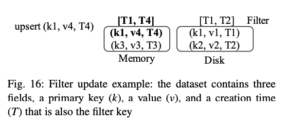

#### 3.7.2 Index Maintenance

维护基于LSM的二级索引的一个关键挑战是处理更新。对于主 LSM-tree，更新时可以直接将新条目（具有相同key）写入内存组件，旧条目会自动被删除。但这种机制不适用于二级索引，因为更新时二级键值可能发生变化，必须额外清理二级索引中的过时条目。

Diff-Index [66] 提出了四种 LSM 二级索引维护方案：sync-full、sync-insert、async-simple 和 async-session。更新时，需执行插入新条目和清理旧条目两步。插入新条目对 LSM-tree 来说很高效，但清理旧条目通常代价较高，因为需要点查找获取旧记录。sync-full 在数据导入时同步执行两步，保证二级索引始终最新，查询性能最佳，但数据导入开销大。sync-insert 只向二级索引插入新数据，过时条目由查询时懒惰清理。async-simple 异步维护索引，通过异步更新队列保证最终执行。async-session 在客户端本地缓存新更新，为应用提供会话一致性。

Deferred Lightweight Indexing（DELI）[67] 基于 Diff-Index 的 sync-insert 方案，提出通过扫描主索引组件清理二级索引的新方法。具体做法是，扫描主索引组件时遇到相同 key 的多条记录，利用过时记录生成反物质条目清理二级索引。该过程可与主索引的合并过程自然集成，减少额外开销。由于二级索引并非始终最新，查询必须通过主索引验证结果，因此 DELI 无法高效支持仅索引查询，因为需点查找验证。

Luo 和 Carey[47] 提出了多种高效利用和维护 LSM 辅助结构（包括二级索引和 filter）的方法。他们首先通过实验评估了多种点查找优化，包括新提出的批量查找算法（对一批 key 顺序访问组件）、有状态 B+-tree 游标和分块 Bloom filter[56]。结果发现，批量查找算法最能减少随机 I/O，另外两种方法则主要适用于非选择性查询以进一步降低内存搜索成本。为高效维护辅助结构，作者进一步提出两种策略。核心思想是维护并利用主键索引（仅存主键和时间戳）以减少磁盘 I/O。提出的验证策略在后台懒惰维护二级索引，消除同步点查找开销。查询时需通过主索引或主键索引验证二级索引返回的主键是否为最新。后台利用主键索引高效清理二级索引，无需访问完整记录，基本思路是通过主键索引验证每个二级索引条目是否为最新时间戳。与 DELI [67]相比，该验证策略显著降低了清理二级索引的 I/O 成本，因为只需访问主键索引。作者还提出了 mutable-bitmap 策略，高效维护带 filter 的主索引：为每个磁盘组件附加可变位图，直接标记旧记录为已删除，从而无需基于旧记录维护 filter。

#### 3.7.3 Statistics Collection

Absalyamov 等人[7]为 LSM 系统提出了轻量级统计信息收集框架。基本思想是将统计信息收集任务集成到 flush 和 merge 操作中，以最小化统计维护开销。flush 和 merge 时，系统动态生成统计概要（如直方图和小波），并回传系统目录。由于 LSM-tree 多组件特性，系统目录为每个数据集存储多份统计信息。为减少查询优化时的开销，可合并的统计信息（如等宽直方图）会预先合并；不可合并的统计信息则保留多份，以提升基数估算的准确性。

#### 3.7.4 Distributed Indexing

Joseph 等人[29]描述了在 HBase[3] 上实现分布式二级索引的两种基本方式：全局二级索引和本地二级索引，这两种方式基于并行数据库中常见的数据索引方法。全局二级索引作为独立表实现，存储二级键及其对应的主键，并通过HBase提供的协处理器（类似数据库触发器）进行维护。这种方式实现简单，但在数据导入时通信开销较大，因为二级索引分区可能与主索引分区存储在不同节点。本地二级索引通过将每个二级索引分区与对应主索引分区共置，避免了数据导入时的通信开销。但在 HBase 中，这种方式需从零实现，且本地二级索引按主键分区，即使是高选择性查询也必须扫描所有分区。

Zhu 等人[85]提出了一种高效加载全局二级索引的方法，分三步进行：首先，扫描并排序每个分区的主索引，创建本地二级索引，同时收集二级键的统计信息以便下一步；其次，根据第一步收集的统计信息，对二级索引条目进行范围分区，并将这些分区分配到物理节点；最后，根据分配的二级键范围，每个节点从所有其他节点获取二级键及其主键，这一步可通过扫描第一步建立的本地二级索引高效完成。

Duan 等人[30]提出了一种分布式 LSM-tree 物化视图的懒惰维护方法。其基本思想是将新更新追加到物化视图的 delta list 中，以减少数据导入时的开销，delta list 中的变更会在查询处理时懒惰地应用到物化视图上。

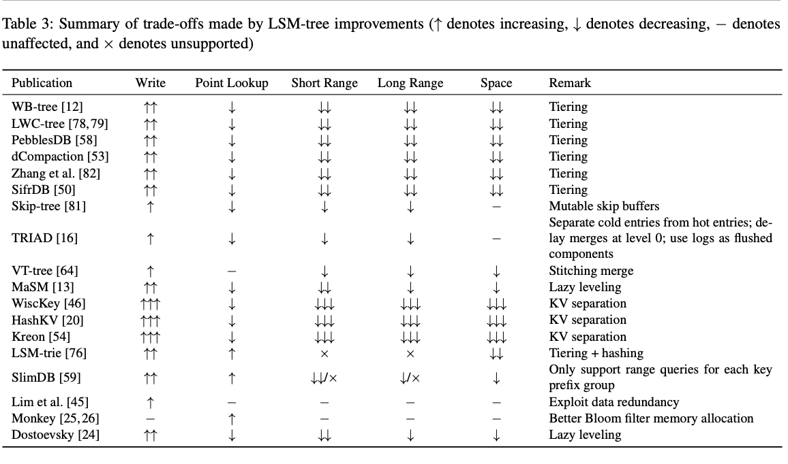

#### 3.7.5 Summary

本类别的技术均聚焦于在具有二级索引和其他辅助结构的数据库场景下改进 LSM-tree。已有多种基于 LSM 的二级索引结构被提出，包括基于 LSM 的倒排索引[75]、空间索引[42]和 filter[11]。这些结构有助于优化特定查询负载。在高效维护二级索引方面，常见做法是延迟二级索引的维护，从而避免数据导入时的高开销点查找。各方案主要区别在于后台清理二级索引的方式：可由查询触发[66]、扫描主索引[67]或利用主键索引[47]。由于这些方法的最优性可能依赖于具体负载，未来可设计自适应维护机制以最大化性能。Absalyamov 等人[7]提出了统计信息收集框架，为基于 LSM 系统的基于代价的查询优化迈出了重要一步。最后，还介绍了几种分布式索引技术[29, 30, 85]。需要注意的是，这些技术并非 LSM-tree 专有，但为完整性起见也在此列出。

### 3.8 Discussion of Overall Trade-offs

根据 RUM 猜想[14]，没有任何访问方法能够同时在读、写和空间方面都达到最优。正如本综述所展示，许多针对特定工作负载或系统方面优化的 LSM-tree 改进方案，通常都涉及权衡。为总结本节内容，我们对这些旨在优化 LSM-tree 各方面的研究工作所做的权衡进行定性分析和总结。本文以分级合并策略为基线进行讨论。

各种 LSM-tree 改进的性能权衡如 table 3 所示。可以看到，大多数改进都试图提升分级合并策略的写入性能，因为其写放大较高。常见做法是采用分层合并策略[12, 50, 53, 58, 76, 78, 79, 82]，但这会对查询性能和空间利用率产生负面影响。此外，分层对范围查询的负面影响大于点查找，因为范围查询无法利用 Bloom filter。

其他改进如 skip-tree[81]、TRIAD[16] 和 VT-tree[64] 提出了多种新思路以提升写入性能，但这些优化除了带来查询性能和空间利用率的额外开销外，还可能增加实际系统的实现复杂度。例如，skip-tree 引入可变缓冲区存储跳过的 key，这与磁盘组件不可变性相悖；TRIAD 提出将事务日志作为磁盘组件以消除 flush，但事务日志的存储格式和操作接口与磁盘组件差异很大，且通常需专用磁盘以减少 log force 带来的负面影响；VT-tree[64] 提出的拼接操作会导致碎片化，并与 Bloom filter 不兼容。

LSM-trie[76] 和 SlimDB[59] 则牺牲部分查询能力以提升性能。LSM-trie 利用哈希提升读写性能，但不支持范围查询；SlimDB 仅支持基于公共前缀key的有限范围查询。这些改进适用于不需要完整范围查询的特定负载。

键值分离[20, 46, 54]可极大提升 LSM-tree 写入性能，因为只需合并 key。但主要问题是，值不再有序，范围查询性能会显著下降。即使通过 SSD 的 I/O 并行性[20, 46]可部分缓解，但当值较小时，磁盘效率仍然较低。此外，分离存储值会降低空间利用率，因为合并时不会回收过时值，需要专门的垃圾回收机制。

既然权衡不可避免，探索 LSM-tree 的设计空间以实现更优权衡具有重要意义。例如，Lim 等人[45]利用数据冗余调优各层最大容量以优化写入性能，对其他性能指标影响很小或没有影响，因为层数不变。Monkey[25, 26] 则在合并策略、大小比和内存分配等方面统一了 LSM-tree 设计空间，并提出更优的 Bloom filter 内存分配方案，在不影响其他指标的情况下提升点查找性能。Dostoevsky[24] 通过引入 lazy leveling 合并策略扩展了LSM-tree 设计空间，在低层采用分层、最大层采用分级，写入吞吐量接近分层，点查找、长范围查询和空间利用率仅略逊于分级。

## 4 Representative LSM-based Systems

在详细讨论了 LSM-tree 及其改进后，下面我们将综述五个具有代表性的基于 LSM 的开源 NoSQL 系统，分别是 LevelDB [4]、RocksDB [6]、Cassandra [1]、HBase [3]和 AsterixDB [9]。我们将重点关注它们的存储层。

### 4.1 LevelDB

LevelDB[4] 是 Google 于2011年开源的基于 LSM 的 key-value 存储系统。它支持简单的 key-value 接口，包括 put、get 和 scan 操作。LevelDB 并不是一个完整的数据管理系统，而是作为嵌入式存储引擎为上层应用提供支持。LevelDB 的主要贡献在于**率先设计和实现了分区分级合并策略**（partitioned leveling merge policy 详见第 2.2.1 节）。正如本综述所述，这一设计影响了许多后续的 LSM-tree 改进和实现。由于第 2.2.1 节已介绍分区分级，这里不再赘述。

### 4.2 RocksDB

RocksDB[6] 最初是 Facebook 于2012年基于 LevelDB 的一个分支。此后，RocksDB 增加了大量新特性。凭借高性能和灵活性，RocksDB 已在 Facebook 内外的各种系统[28]中得到广泛应用。Facebook 表示，采用 LSM 存储的主要动机之一是其良好的空间利用率[28]。在默认大小比为 10 的情况下，RocksDB 的分级实现会将约 90% 的数据存储在最大层，保证最多只有 10% 的存储空间用于存放过时条目。正如前文所述，这优于传统 B-tree 存储引擎，后者由于碎片化平均每页仅 2/3 填满[77]。下面我们将讨论 RocksDB 在合并策略、合并操作及新功能方面的多项改进。

RocksDB 的 LSM-tree 实现仍基于分区分级（partitioned leveling）设计，但做了一些改进。由于 level 0 的 SSTables 未分区，将 level 0 的 SSTable 合并到 level 1 通常会重写 level 1 的所有 SSTables，导致 level 0 成为性能瓶颈。为部分缓解该问题，RocksDB 可选用分层合并策略（tiering merge policy）合并 level 0 的 SSTables。这种弹性设计使 RocksDB 能更好地吸收写入突发，同时不会过多影响查询性能。RocksDB 还支持动态层级容量方案以限制空间放大。理想的分级空间放大 $O(\frac{T+1}{T})$ 仅在最后一层达到最大容量时成立，实际中未必如此。为此，RocksDB 会根据最后一层的当前大小动态调整所有低层的最大容量，从而始终保证空间放大为 $O(\frac{T+1}{T})$ 。除 LevelDB 采用的轮询合并策略（round-robin policy）外，RocksDB 还支持 cold-first 和 delete-first 两种策略。cold-first 优先合并冷 SSTables 以优化倾斜负载，确保热 SSTables 留在低层以降低写入成本；delete-first 优先合并含大量 antimatter entries 的 SSTables，以快速回收被删除条目占用的磁盘空间。RocksDB 还支持 merge filter API $^7$（在 RocksDB 中，这一功能被称为 compaction filter，因为 RocksDB 更倾向于使用 compaction（压缩）一词而非 merge（合并）。为避免术语混淆，本文统一使用 merge），允许用户在合并时自定义垃圾回收逻辑，合并时仅将未被过滤的 key-value 对写入新 SSTables。

除了分区分级合并策略外，RocksDB 还支持分层（tiering）和 FIFO 等合并策略。在 RocksDB 及其他系统中，实际的分层合并策略与本文（及相关文献）描述的略有不同。RocksDB 的分层合并策略由两个参数控制：合并组件数 $K$ 和大小比 $T$。具体做法是从最老到最新依次检查组件，对于每个组件 $C_i$，判断其 $K$-1 个更年轻组件 $C_{i-1}$, $C_{i-2}$, ..., $C_{i-K}$ 的总大小是否大于 $T$ 倍 $C_i$，若是则将这些组件一起合并，否则继续检查下一个组件。RocksDB 对分层合并策略做了有限分区，类似于第 2.2.2 节的水平分组设计，以限制 SSTable 的最大尺寸。这样做的动机是最大页大小被限制为 4GB，若单个 SSTable 过大，其索引页可能超出限制。但在大合并期间，磁盘空间可能会临时翻倍，因为 RocksDB 将每个 SSTable 组视为整体，只有合并完成后才删除旧 SSTable。FIFO 合并策略下，组件不会合并，而是根据指定生命周期删除旧组件。

在 LSM 存储中，合并操作通常消耗大量 CPU 和磁盘资源，可能影响查询性能，且合并时机难以预测，直接取决于写入速率。为缓解该问题，RocksDB 支持基于漏桶机制[72]的速率限制，控制合并操作的磁盘写入速度。基本思想是维护一个“桶”，桶内有一定数量的令牌，令牌补充速率可控。所有 flush 和 merge 操作在写入前都需请求一定数量的令牌，因此其磁盘写入速度受限于指定的令牌补充速率。

在此之外，RocksDB 还支持一种新的读-改-写（read-modify-write）操作。在实际应用中，许多场景通常需要先读取再更新已有值。为高效支持该操作，RocksDB 允许用户直接将增量记录（delta records）写入内存，从而避免读取原始记录。查询处理和合并时，增量记录会根据用户提供的组合逻辑与基础记录合并。如有可能，RocksDB 还会在合并过程中将多个增量记录合并，以提升后续查询性能。

注：RocksDB 在 level 0 上使用分层合并策略，处理写入突发情况。

###  4.3 HBase

Apache HBase[3] 是 Hadoop 生态系统中的分布式数据存储系统，其设计借鉴了 Google 的 Bigtable [21]。HBase 采用主从架构，将数据集（通过哈希或范围）划分为多个 region，每个 region 由一个LSM-tree 管理。HBase 支持动态 region 分裂和合并，可根据工作负载弹性管理系统资源。这里我们主要关注HBase 的存储引擎。

HBase 的 LSM-tree 实现通常基于基本的分层合并策略，同时也支持一些变体，如 exploring merge policy 和 date-tiered merge policy。exploring merge policy 会检查所有可合并组件序列，选择写入成本最小的方案。该策略比基本分层合并更健壮，尤其适用于因加载和删除导致组件大小不规则的情况，因此被用作HBase的默认合并策略。date-tiered merge policy 专为时序数据设计，按时间范围而非大小合并组件，使组件按时间范围分区，从而高效处理时序查询。

近期，HBase 引入了 stripping 特性，将大 region 进一步分区以提升合并效率。其思想是将 key 空间划分为多个分区，每个分区包含一组组件，独立进行合并。这类似于 PEfiles[38] 提出的设计，但不同于第 2.2.1 节描述的分区分层合并策略。

HBase 本身不原生支持二级索引，但可通过协处理器实现，将二级索引作为独立表存储二级键及其主键，如[29]所述。

### 4.4 Cassandra

Apache Cassandra[1] 是一个开源分布式数据存储系统，其设计借鉴了 Amazon 的 Dynamo[27] 和 Google 的 BigTable[21]。Cassandra 采用去中心化架构，消除了单点故障的可能性。Cassandra 中的每个数据分区都由基于 LSM 的存储引擎驱动。

Cassandra 支持与 RocksDB 和 HBase 类似的多种合并策略，包括（非分区）分层合并策略、分区分级合并策略和 date-tiered 合并策略。此外，Cassandra 支持本地二级索引以便于查询处理。为避免高点查找开销，二级索引采用懒惰维护，类似于 DELI[67]。更新时，如果在内存组件中找到旧记录，则直接用于清理二级索引；否则，在主索引组件合并时懒惰清理二级索引。

### 4.5 AsterixDB

Apache AsterixDB[9] 是一个开源的大数据管理系统（BDMS），旨在高效管理海量半结构化（如JSON）数据。这里我们主要关注 AsterixDB[10] 的存储管理。

AsterixDB 采用 shared-nothing 并行数据库架构。每个数据集的记录根据主键进行哈希分区，分布在多个节点上。每个分区由基于 LSM 的存储引擎管理，包含主索引、主键索引和多个本地二级索引。AsterixDB 采用记录级事务模型，确保每个分区内所有索引的一致性。主索引按主键存储记录，主键索引仅存储主键。主键索引用于高效支持 COUNT(*) 类查询及各种索引维护操作[47]，因为其体积远小于主索引。

二级索引采用二级键与主键的组合作为索引键。AsterixDB 通过通用 LSM 化框架支持基于 LSM 的 B+-tree、R-tree 和倒排索引，可将原地索引转换为 LSM 索引。对于 LSM R-tree，磁盘组件中的条目按线性顺序（如点数据用 Hilbert 曲线，非点数据用 Z-order 曲线）排序，内存组件中删除的 key 则单独记录在 B+-tree 中，以避免删除时多路径遍历。AsterixDB 还支持基于 LSM 的倒排索引，高效处理全文和相似性查询[41]。默认情况下，每个 LSM 索引的组件独立采用类似分层的合并策略。AsterixDB 还支持相关合并策略，通过同步合并同一数据集的所有索引组件，结合 filter 提升查询性能。该策略的基本思想是将合并调度委托给主索引，当一组主索引组件合并时，其他索引的对应组件也会一同合并。

## 5 Future Research Directions

对现有文献中 LSM-tree 改进的分类与总结揭示了若干有趣的不足和未来 LSM 存储研究的机会。下面简要讨论本综述结果所提出的一些未来研究方向。

全面的性能评估。 如前所述，许多研究工作并未充分考虑 LSM-tree 的可调优性。改进方案通常只与 LevelDB 或 RocksDB 的默认（未调优）配置进行对比。对于特定工作负载，这些改进与调优良好的基线 LSM-tree 相比表现如何尚不清楚。此外，许多改进方案主要评估了对查询性能的影响，而常常忽略了空间利用率。未来研究可通过更细致地考虑 LSM-tree 的可调优性来解决这一问题。

分区分层结构。 分层被许多 LSM-tree 改进用于降低写放大。在第2.2.1节中，我们指出了两种可能的分区分层方案：横向分组和纵向分组，几乎涵盖了最近所有与分层相关的 LSM-tree 改进。然而，这两种方案的性能特性和权衡尚不明确。一般来说，纵向分组在选择合并 SSTable 时更灵活，而横向分组则保证 SSTable 为固定大小。未来可系统性地评估这两种方案，并设计结合两者优点的新方案。

混合合并策略。 直到最近，大多数 LSM-tree 改进都假设 LSM-tree 所有层采用同质的分级或分层合并策略。然而，事实证明这对某些负载是次优的[24]。分级与分层的混合合并策略可在最小影响点查找、长范围查询和空间放大的前提下，显著提升写入性能。未来可以设计和实现采用混合合并策略的 LSM-tree，并重新探讨这一设计选择带来的关键问题。

最小化性能波动。在实际应用中，性能波动与绝对吞吐量同样重要。不幸的是，LSM-tree 由于将内存写入与昂贵的后台 I/O 解耦，常常表现出较大的性能波动。正如本综述所示，bLSM[61] 是唯一尝试最小化 LSM-tree 写入阻塞的方案，但 bLSM 本身仍有局限：它仅针对非分区分级合并策略设计，只能减少写入阻塞导致的长延迟，而不能最小化整体导入吞吐量的波动。未来，设计机制以最小化 LSM-tree 的性能波动将非常有价值。

面向数据库存储引擎。最后，现有 LSM-tree 改进大多聚焦于单一 LSM-tree 的 key-value 存储场景。随着LSM-tree 逐步在 DBMS 存储引擎中广泛应用，应为更通用（多索引）场景开发新的查询处理和数据导入技术。例如：辅助结构的自适应维护以便于查询处理、面向 LSM的 查询优化，以及 LSM-tree 维护任务与查询执行的协同调度等。

## 6 Conclusion

近年来，LSM-tree 因其卓越的写入性能、高空间利用率、磁盘数据不可变性和良好的可调优性，在现代 NoSQL 系统中日益流行。这些优势使 LSM-tree 能够被广泛采用和部署，以支持多种工作负载。

本文综述了数据库领域和系统领域近年来在 LSM-tree 改进方面的研究工作。我们提出了一套通用分类法，根据优化目标对现有 LSM-tree 改进进行分类，并基于该分类法详细讨论了各类改进。此外，我们还回顾了几个具有代表性的基于 LSM 的开源 NoSQL 系统，并指出了一些有趣的未来研究方向。希望本综述能为 LSM 存储技术领域的研究者、工程师和用户提供有价值的参考和指引。

致谢 我们感谢 Mark Callaghan、Manos Athanassoulis 以及匿名评审的宝贵意见和反馈。本工作得到了 NSF CNS-1305430、IIS-1447720 和 IIS-1838248 项目的资助，以及来自 Amazon、Google、Microsoft 和加州大学欧文分校 Donald Bren 基金会（Bren Chair）的产业支持。

## References

[LSM-based Storage Techniques: A Survey](https://arxiv.org/pdf/1812.07527)