# 论文 | Raft：寻找一种可理解的共识算法

## 目录
* [Abstract](#abstract)
* [1 Introduction](#1introduction)
* [2 Replicated state machines](#2replicated-state-machines)
* [3 What’s wrong with Paxos?](#3whats-wrong-with-paxos)
* [4 Designing for understandability](#4designing-for-understandability)
* [5 The Raft consensus algorithm](#5the-Raft-consensus-algorithm)
    * [5.1 Raft basics](#51-raft-basics)
    * [5.2 Leader election](#52-leader-election)
    * [5.3 Log replication](#53-log-replication)
    * [5.4 Safety](#54-safety)
        * [5.4.1 Election restriction](#541-election-restriction)
        * [5.4.2 Committing entries from previous terms](#542-committing-entries-from-previous-terms)
        * [5.4.3 Safety argument](#543-safety-argument)
    * [5.5 Follower and candidate crashes](#55-follower-and-candidate-crashes)
    * [5.6 Timing and availability](#56-timing-and-availability)
* [6 Cluster membership changes](#6cluster-membership-changes)
* [7 Clients and log compaction](#7clients-and-log-compaction)
* [8 Implementation and evaluation](#8implementation-and-evaluation)
    * [8.1 Understandability](#81-understandability)
    * [8.2 Correctness](#82-correctness)
    * [8.3 Performance](#83-performance)
* [9 Related work](#9related-work)
* [10 Conclusion](#10conclusion)
* [11 Acknowledgments](#11acknowledgments)
* [个人总结](#个人总结)
* [面试题](#面试题)
* [相关链接](#相关链接)


## Abstract

Raft 是一种用于管理复制日志的共识算法。它产生的结果相当于 (multi-)Paxos，并且与 Paxos 一样高效，但其结构与 Paxos 不同；这使得 Raft 比 Paxos 更容易理解，也为构建实用系统提供了更好的基础。为了增强可理解性，Raft 将共识的关键要素（例如 leader 选举、日志复制和安全性）分开，并强制执行更强的一致性以减少必须考虑的状态数量。用户研究的结果表明，Raft 比 Paxos 更容易让学生学习。Raft 还包括一种用于更改集群成员资格的新机制，该机制使用重叠多数来保证安全性。

## 1、Introduction

共识算法允许一组机器作为一个协调一致的集体工作，即使其中一些成员发生故障也能够存活下来。因此，它们在构建可靠的大规模软件系统中扮演着关键角色。在过去的十年中，Paxos[13, 14] 已经主导了关于共识算法的讨论：大多数共识的实现都是基于 Paxos 或受其影响的，Paxos 已成为教授学生关于共识的主要工具。

不幸的是，尽管已经做了许多尝试来使其更容易理解，Paxos 仍然相当难以理解。此外，其架构需要复杂的变更才能支持实际系统。因此，系统构建者和学生都难以掌握 Paxos。

在我们自己努力理解 Paxos 之后，我们开始寻找一种新的共识算法，这种算法能为系统构建和教育提供更好的基础。我们的方法不同寻常，因为我们的主要目标是可理解性：我们能否为实际系统定义一个共识算法，并以一种比 Paxos 显著更易于学习的方式来描述它？此外，我们希望该算法能促进系统构建者必需的直觉的发展。重要的不仅是算法能工作，而且要明显知道它为什么能工作。

这项工作的结果是一个名为 Raft 的共识算法。在设计 Raft 时，我们应用了特定的技术来提高可理解性，包括分解（Raft 将 leader 选举、日志复制和安全性分开）和状态空间减少（相对于 Paxos，Raft 减少了非确定性的程度和服务器之间可能存在的不一致的方式）。在两所大学进行的一项涉及 43 名学生的用户研究显示，Raft 比 Paxos 显著更易于理解：在学习了这两种算法之后，这些学生中有 33 人能够更好地回答有关 Raft 的问题，而不是 Paxos 的问题。


Raft 在许多方面与现有的共识算法（尤其是 Oki 和 Liskov 的 Viewstamped Replication）相似，但它具有几个新颖的特性：

* **Strong leader**：Raft 使用比其他共识算法更强的领导形式。例如，日志条目只从 leader 流向其他服务器。这简化了复制日志的管理，并使 Raft 更易于理解。

* **Leader election**: Raft 使用随机计时器来选举 leader 。这只为任何共识算法已经需要的心跳机制添加了一小部分机制，同时简单且迅速地解决冲突。

* **Membership changes**: Raft 更改集群中服务器集的机制使用了一种新的联合共识方法，在转换期间两个不同配置的多数派重叠。这允许集群在配置更改期间正常运行。

我们相信，无论是出于教育目的还是作为实现的基础，Raft 都优于 Paxos 和其他共识算法。它比其他算法更简单、更易于理解；它的描述完整足以满足实际系统的需求；它有几个开源实现，并被几家公司使用；其安全属性已被正式指定和证明；其效率与其他算法相当。

本文的其余部分介绍了复制状态机问题（Section 2）、讨论了 Paxos 的优点和缺点（Section 3）、描述了我们对可理解性的一般方法（Section 4）、介绍了 Raft 共识算法（Sections 5-7）、评估了 Raft（Section 8）并讨论了相关工作（Section 9）。由于篇幅限制，这里省略了 Raft 算法的一些元素，但它们在扩展的技术报告 [29] 中有详细描述。附加材料描述了客户端如何与系统交互，以及如何回收 Raft 日志中的空间。

## 2、Replicated state machines

共识算法通常出现在复制状态机的背景下。在这种方法中，一组服务器上的状态机计算相同状态的完全相同的副本，并且即使某些服务器宕机也能继续运行。复制状态机用于解决分布式系统中的各种容错问题。例如，具有单个集群 leader 的大规模系统，如 GFS、HDFS 和 RAMCloud，通常使用单独的复制状态机来管理 leader 选举和存储必须在 leader 崩溃时保留的配置信息。复制状态机的例子包括 Chubby 和 ZooKeeper。

<div align=center>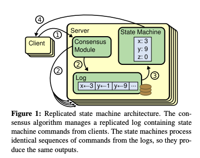</div>

复制状态机通常使用复制日志来实现，如 Figure 1 所示。每个服务器存储一个包含一系列命令的日志，其状态机按顺序执行这些命令。每个日志包含相同的命令，且顺序相同，因此每个状态机处理相同的命令序列。由于状态机是确定性的，每个都计算出相同的状态和相同的输出序列。

保持复制日志的一致性是共识算法的工作。服务器上的共识模块从客户端接收命令并将它们添加到其日志中。它与其他服务器上的共识模块通信，以确保每个日志最终包含相同的请求且顺序相同，即使某些服务器失败。一旦命令被正确复制，每个服务器的状态机按日志顺序处理它们，然后将输出返回给客户端。结果，服务器看起来形成了一个单一的、高度可靠的状态机。

实际系统的共识算法通常具有以下特性：
* 它们在所有非拜占庭条件下确保安全性（永远不返回错误结果），包括网络延迟、分区以及数据包的丢失、复制和重新排序。

* 只要服务器的任何多数派运行正常并且能够相互以及与客户端通信，它们就能完全正常工作（可用）。因此，一个典型的五服务器集群可以容忍任何两台服务器的故障。假设服务器通过停止来失败；它们可能稍后从稳定存储的状态中恢复并重新加入集群。

* 它们不依赖于时间来确保日志的一致性：错误的时钟和极端的消息延迟最多只能导致可用性问题。

* 在常见情况下，只要集群的大多数已经对一轮远程过程调用做出响应，命令就可以完成；少数慢速服务器不需要影响整个系统的性能。

## 3、What’s wrong with Paxos?

在过去的十年中，Leslie Lamport 的 Paxos 协议[13]几乎成了共识的代名词：它是最常在课程中教授的协议，大多数共识的实现都以它为出发点。Paxos 首先定义了一个能够就单一决策（如单个复制日志条目）达成一致的协议。我们将这个子集称为单一法令（single-decree） Paxos。然后，Paxos 结合了这个协议的多个实例，以促进一系列决策，如日志（multi-Paxos）。Paxos 确保了安全性和活性，并且支持集群成员身份的变化。它的正确性已被证明，并且在常规情况下是高效的。

不幸的是，Paxos 有两个显著的缺点。第一个缺点是 Paxos 极其难以理解。完整的解释[13]是出了名的晦涩难懂；很少有人能够理解它，而且只有付出巨大努力。因此，已经有几次尝试用更简单的术语来解释 Paxos [14, 18, 19]。这些解释关注于单一法令子集，但它们仍然具有挑战性。在 NSDI 2012 的参会者中进行的非正式调查中，我们发现很少有人对 Paxos 感到满意，即使是在经验丰富的研究人员中也是如此。我们自己也在 Paxos 上挣扎；直到阅读了几个简化的解释并设计了我们自己的替代协议后，我们才能理解完整的协议，这个过程几乎花了一年时间。

我们假设 Paxos 的晦涩难懂源于其选择单一法令子集作为其基础。单一法令 Paxos 是密集且微妙的：它分为两个阶段，这两个阶段没有简单直观的解释，也不能独立理解。因此，很难对为什么单一法令协议能够工作形成直观理解。多Paxos的组合规则增加了显著的额外复杂性和微妙性。我们相信，关于在多个决策上达成共识的整体问题（即，一个日志而不是单个条目）可以以更直接和明显的方式分解。

Paxos 的第二个问题是它没有提供一个良好的基础来构建实际的实现。一个原因是没有一个广泛认同的 multi-Paxos 算法。Lamport 的描述主要是关于单一法令 Paxos；他勾勒了 multi-Paxos 的可能方法，但许多细节缺失。已经有几次尝试来充实和优化 Paxos，如 [24]、[35] 和 [11]，但这些尝试彼此不同，也与 Lamport 的草图不同。像 Chubby [4] 这样的系统已经实现了类似 Paxos 的算法，但在大多数情况下，它们的细节没有被公开。

Paxos 架构对于构建实际系统来说是一个糟糕的选择；这是单一法令分解的另一个后果。例如，独立选择一系列日志条目然后将它们融合成一个顺序日志几乎没有好处；这只会增加复杂性。围绕日志设计系统，在其中新条目以受限顺序依次追加，这样更简单、更高效。Paxos 的另一个问题是它在核心上使用了对等的点对点方法（尽管它最终建议作为性能优化的一种弱形式的领导）。在只做出一个决定的简化世界中，这种方法是有意义的，但很少有实际系统使用这种方法。如果必须做出一系列决定，首先选举一个 leader ，然后让 leader 协调决定，这样更简单、更快。

因此，实际系统与 Paxos 几乎没有相似之处。每个实现都是从 Paxos 开始的，发现了实现它的困难，然后开发了一个截然不同的架构。这既耗时又容易出错，而且理解 Paxos 的困难加剧了这个问题。Paxos 的公式可能适合证明其正确性的定理，但真实的实现与 Paxos 如此不同，以至于这些证明几乎没有价值。来自 Chubby 实现者的以下评论是典型的：

***
There are significant gaps between the description of the Paxos algorithm and the needs of a real-world system. . . . the final system will be based on an unproven protocol [4].
***

由于这些问题，我们得出结论，Paxos 既不适合作为系统构建的基础，也不适合用于教育。鉴于共识在大规模软件系统中的重要性，我们决定尝试设计一个比 Paxos 更优的替代共识算法。Raft 就是这一实验的结果。

## 4、Designing for understandability

在设计 Raft 时，我们有几个目标：它必须提供一个完整且实用的系统构建基础，从而显著减少开发者所需的设计工作量；它必须在所有条件下都是安全的，并且在典型的操作条件下可用；它对于常见操作必须高效。但我们最重要的目标——也是最难的挑战——是可理解性。必须让广大受众能够舒适地理解算法。此外，必须能够对算法形成直觉，以便系统构建者可以进行实际实现中不可避免的扩展。

在 Raft 的设计中，我们有许多情况需要在不同的方法之间做出选择。在这些情况下，我们根据可理解性评估了这些替代方案：解释每种替代方案有多困难（例如，它的状态空间有多复杂，它是否有微妙的含义？），读者完全理解这种方法及其含义有多容易？

我们的第二种方法是通过减少需要考虑的状态数量来简化状态空间，使系统更加连贯，并在可能的情况下消除非确定性。具体来说，不允许日志中出现空洞，Raft 限制了日志之间变得不一致的方式。虽然在大多数情况下我们试图消除非确定性，但在某些情况下非确定性实际上可以提高可理解性。特别是，随机化方法引入了非确定性，但它们倾向于通过以类似的方式处理所有可能的选择来减少状态空间（“choose any; it doesn’t matter”）。我们使用随机化来简化 Raft  leader 选举算法。

## 5、The Raft consensus algorithm

Raft 是一种用于管理 Section 2 中描述的复制日志的算法。Figure 2 以简明形式总结了该算法以供参考，Figure 3 列出了该算法的关键属性；本节的其余部分将分部分讨论这些图的内容。

Raft 通过首次选举一个杰出的 leader 来实现共识，然后让 leader 完全负责管理复制的日志。leader 接受来自客户机的日志条目，在其他服务器上复制它们，并告诉服务器何时可以安全地将日志条目应用到它们的状态机。拥有 leader 可以简化对复制日志的管理。例如，leader 可以在不咨询其他服务器的情况下决定在日志中放置新条目的位置，并且数据以一种简单的方式从 leader 流向其他服务器。leader 可能会失败或与其他服务器断开连接，在这种情况下，会选举一个新的 leader。

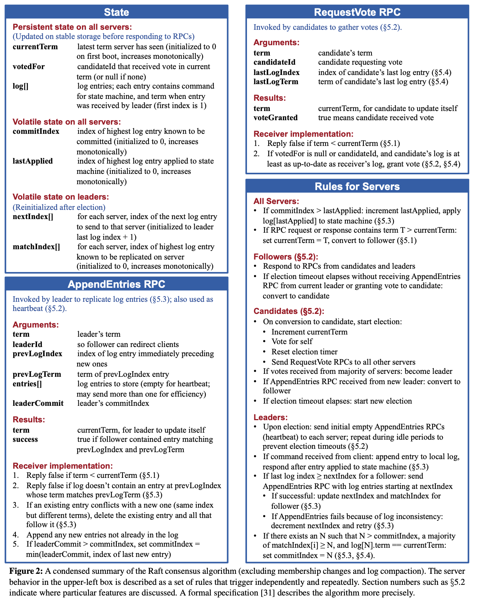

鉴于 leader 方法，Raft 将共识问题分解为三个相对独立的子问题，将在以下小节中讨论：

* **Leader election**：当现有的 leader 失败时，必须选择一个新的 leader（Section 5.2）。

* **Log replication**：leader 必须接受来自客户端的日志条目，并在整个集群中复制它们，强制其他日志与自己的日志一致。 (Section 5.3)。

* **Safety**：Raft 安全属性的关键是 Figure 3 中的 State Machine Safety Property：如果任何服务器已将特定日志条目应用于其状态机，则其他任何服务器都不能针对同一日志索引应用不同的命令。 Section 5.4 描述了 Raft 如何确保此属性；该解决方案涉及 Section 5.2 中描述的选举机制的额外限制。

<div align=center>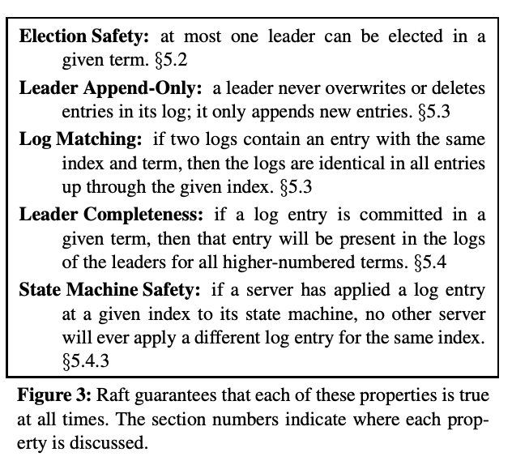</div>

在介绍了共识算法之后，本节将讨论可用性问题和定时在系统中的作用。

> 注：共识问题拆分为三个子问题：Leader 选举、日志复制、安全性。

> 安全性：

> 1、选举安全，每个任期只能有一个 leader
> 2、Leader 只能追加，leader 不会覆盖或删除自己的日志，只会追加新日志，日志既定不可逆，只能往后扩展；
> 3、日志匹配，如果两个日志在相同索引位置和任期包含相同条目，那么这两个日志在该索引之前的所有条目都完全一致；
> 4、领导者完整性，如果一条日志在某任期被提交，那么之后所有更高任期的领导者一定包含该条日志。 Leader 选举来保证，选举成功的 leader 必须是拥有最新日志（committed）的节点；
> 5、状态机安全，如果某个服务器已经将某条日志应用到状态机，那么不会有其他服务器在同一索引应用不同日志。

### 5.1 Raft basics

Raft 集群包含多个服务器；典型的 Raft 集群通常由 5 个节点组成，可以容错 2 个节点。在任何给定时间，每个服务器都处于以下三种状态之一：leader、 follower or candidate。在正常情况中，只有一个 leader，所有其他服务器都是 follower。follower 是被动的：他们自己不发出任何要求，只是对 leader 和 candidate 的请求做出响应。leader 处理所有客户端请求(如果客户端请求了 follower, follower 会将其重定向到 leader)。第三个状态 candidate，用于选举新的 leader，如 Section 5.2 所述。Figure 4 显示了状态及其转换；下面将讨论这些转换。

<div align=center>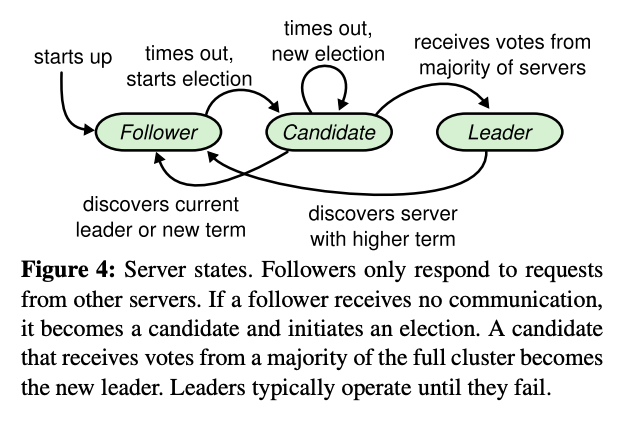</div>

Raft 将时间划分为任意长度，如 Figure 5 所示。任期用连续整数编号。每个任期以选举开始，其中一个或多个候选人试图成为第 Section 5.2 所述的 leader。如果一位 candidate 赢得选举，那么他将在剩下的任期内担任 leader。在某些情况下，选举会导致票数不一致。在这种情况下，任期结束时将没有领导人; 新任期(新选举)在短时间内开始。Raft 保证在给定的任期内最多只能有一个 leader。

<div align=center>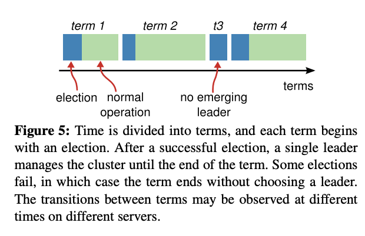</div>

不同的服务器可能会在不同的时间观察任期之间的过渡，在某些情况下，服务器可能不会观察选举甚至整个任期。**任期实际上在 Raft 中充当逻辑时钟[14]，它们允许服务器检测过时的信息，如过时的 leader**。每个服务器存储一个 current term number，该任期号随时间单调增加。每当服务器通信时，都会交换当前任期号；如果一台服务器的当前任期小于另一台服务器的，则将其当前任期更新为较大的值。如果候选人或 leader 发现自己的任期过期，则立即恢复为 follower  状态。如果服务器接收到一个带有过期任期号的请求，它将拒绝该请求。

Raft 服务器使用远程过程调用(RPCs)进行通信，基本的共识算法只需要两种类型的 RPCs。 RequestVote RPCs 由 candidates 在选举期间发起 (Section 5.2), and AppendEntries RPCs are initiated by leaders to replicate log entries and to provide a form of heartbeat (Section 5.3). Section 7 adds a third RPC for transferring snapshots between servers. Servers retry RPCs if they do not receive a response in a timely manner, and they issue RPCs in parallel for best performance。

### 5.2 Leader election

**Raft 使用心跳机制来触发 leader 选举**。当服务器启动时以 follower 的角色开始。只要服务器从 leader 或 candidate 那里收到有效的 RPC，它就会保持 follower  状态。Leaders 会定期向所有 followers 发送心跳（不携带日志条目的 AppendEntries RPCs），以保持当前的任期。如果 follower  在一段时间内没有收到任何通信，称为选举超时，那么它会假定没有可行的 leader 并开始选举以选出新的 leader。

开始选举时，a follower 会递增其当前任期并转换为 candidate 状态。然后，它会为自己投票，并向集群中的其他每个服务器并行发出 RequestVote RPCs。A candidate 会继续保持这种状态，直到发生以下三件事之一：(a) 它赢得选举，(b) 另一台服务器确立自己为 leader，或 (c) 一段时间过去而没有获胜者。这些结果将在以下段落中单独讨论。

如果 candidate 在同一任期内获得整个集群中大多数服务器的投票，则该 candidate 将赢得选举。每个服务器将按照先到先得的原则在给定任期内最多为一名 candidate 投票（注意：Section 5.4 增加了对投票的额外限制）。多数规则确保最多有一个 candidate 可以在特定任期内赢得选举（Figure 3 中的选举安全属性）。一旦 candidate 赢得选举，它就成为 leader。然后，它向所有其他服务器发送心跳消息，以建立其权威并防止新的选举。

在等待投票时，a candidate 可能会收到来自另一台声称自己是 leader 的服务器的 AppendEntries RPC。如果 leader 的任期（included in its RPC）至少与 candidate 的当前任期一样大，则 candidate 将承认 leader 是合法的并返回到 follower 状态。如果 RPC 中的任期小于 candidate 的当前任期，则 candidate 拒绝 RPC 并继续处于 candidate 状态。

第三种可能结果是 candidate 既没有赢得选举也没有输掉选举：如果许多 follower 同时成为 candidate，选票可能会被分割，以至于没有候选人获得多数票。当这种情况发生时，每个候选人都会超时并通过增加其任期并启动另一轮 RequestVote RPCs 来开始新的选举。然而，如果没有额外的措施，分裂投票可能会无限期地重复。

**Raft 使用随机选举超时来确保分裂投票很少发生，并且能够快速解决**。为了首先防止分裂投票，选举超时是从固定间隔（例如 150-300 毫秒）中随机选择的。这样可以分散服务器，以便大多数情况下只有一个服务器会超时；它赢得选举并在任何其他服务器超时之前发送心跳。使用相同的机制来处理分裂投票。每个 candidate 在选举开始时重新启动其随机选举超时，并等待该超时过去后再开始下一次选举；这降低了在新选举中再次出现分裂投票的可能性。Section 8.3 显示，这种方法可以快速选出 leader 。

选举是说明可理解性如何指导我们在设计方案之间做出选择的例子，最初，我们计划使用排名系统：每个 candidate 都被分配一个唯一的排名，用于在竞争 candidate 之间进行选择。如果 candidate 发现另一个排名更高的 candidate，它将返回到 follower 状态，以便排名更高的 candidate 更容易赢得下一次选举。我们发现这种方法在可用性方面造成了微妙的问题（如果排名较高的服务器发生故障，排名较低的服务器可能需要超时并再次成为 candidate，但如果它过早发生故障，它可能会重置选举 leader 的进程）。我们对算法进行了几次调整，但每次调整后都会出现新的极端情况。**最终我们得出结论，随机重试方法更明显、更容易理解**。

> 注：Raft 通过随机选举超时来解决无限制的分裂投票情况。

### 5.3 Log replication

一旦选出 leader，它就会开始处理客户端请求。每个客户端请求都包含一个由复制状态机执行的命令。leader 将命令作为新条目附加到其日志中，然后并行向其他每个服务器发出 AppendEntries RPCs 以复制该条目。当条目被安全复制后（如下所述），leader 会将该条目应用到其状态机并将执行结果返回给客户端。如果 followers 崩溃或运行缓慢，或者网络数据包丢失，leader **会无限期地重试 AppendEntries RPC**（即使在它响应客户端之后），直到所有 followers 最终存储所有日志条目。

日志的组织方式 Figure 6 所示。每个日志条目都存储状态机命令以及 leader 收到条目时的任期号。日志条目中的任期号用于检测日志之间的不一致并确保 Figure 3 中的某些属性。每个日志条目还有一个整数索引，用于标识其在日志中的位置。

> 注：日志条目包含命令、任期号、索引。

<div align=center>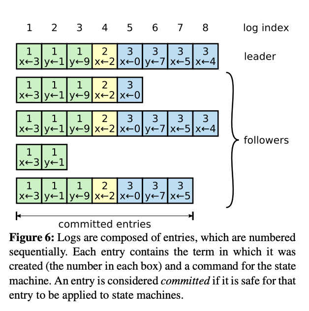</div>

Leader 决定何时将日志条目安全地应用于状态机；这样的条目称为 committed。Raft 保证 committed 的条目是持久的，并最终将由所有可用的状态机执行。一旦创建条目的 leader 在大多数服务器上复制了该条目（例如，entry 7 in Figure 6），日志条目就会被 commit。这还会提交 leader 日志中的所有先前条目，包括先前 leader 创建的条目。Section 5.4 讨论了在 leader 变更后应用此规则的一些细微差别，它还表明这种承诺定义是安全的。Leader 会跟踪它知道要提交的最高索引（commitedIndex），并将该索引包含在未来的 AppendEntries RPC（包括心跳）中，以便其他服务器最终发现。一旦 follower 得知日志条目已提交，它就会将该条目应用于其本地状态机（按日志顺序）。

> 注：条目被 committed 的条件是：leader 在大多数服务器上复制了该条目。

我们设计了 Raft 日志机制来保持不同服务器上的日志之间的高度一致性。这不仅简化了系统的行为并使其更可预测，而且是确保安全的重要组成部分。Raft 保持以下属性，这些属性共同构成了 Figure 3 中的日志匹配属性：

* **如果不同日志中的两个条目具有相同的索引和任期，则它们存储相同的命令**。

* **如果不同日志中的两个条目具有相同的索引和任期，则这些日志在所有前面的条目中都是相同的**。

第一个属性源于这样一个事实：最多在一个任期里在指定的一个日志索引位置创建一条日志条目（a leader creates at most one entry with a given log index in a given term），并且日志条目永远不会改变其在日志中的位置。第二个属性由 AppendEntries 执行的简单一致性检查保证。发送 AppendEntries RPC 时，leader 会在其日志中包含紧接在新条目之前的条目的索引和任期。如果 follower 在其日志中找不到具有相同索引和任期的条目，则它会拒绝新条目。一致性检查充当归纳步骤：日志的初始空状态满足日志匹配属性，并且一致性检查会在日志扩展时保留日志匹配属性。因此，只要 AppendEntries 成功返回，leader 就知道 follower 的日志与其自己的日志完全相同，直到新条目。

在正常运行期间，leader 和 followers 的日志保持一致，因此 AppendEntries 一致性检查永远不会失败。但是，leader 崩溃可能会导致日志不一致（旧 leader 可能没有完全复制其日志中的所有条目）。这些不一致可能会在一系列 leader 和 followers 崩溃后加剧。Figure 7 说明了 leader 的日志可能与新 leader 的日志不同。A follower 可能会缺少 leader 上存在的条目，可能会有 leader 上不存在的额外条目，或者两者兼而有之。日志中缺失和多余的条目可能跨越多个任期。

<div align=center>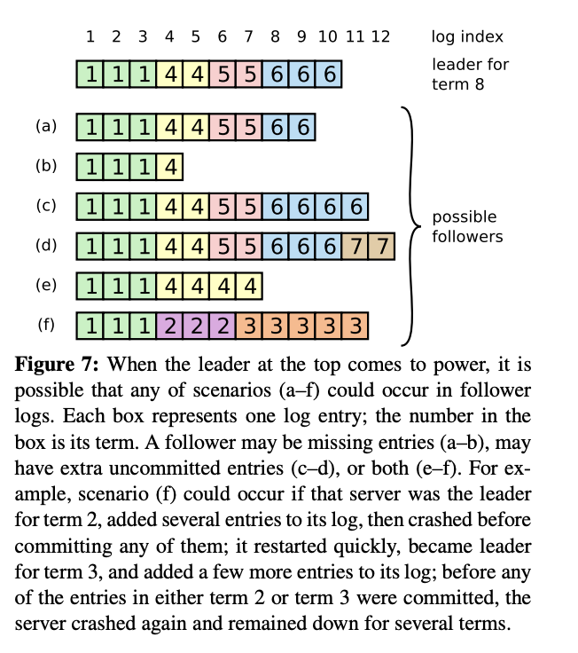</div>

在 Raft 中，Leader 通过强制 follower 的日志复制自己的日志来处理不一致问题。这意味着 follower  日志中的冲突条目将被 leader 日志中的条目覆盖。Section 5.4 将展示，如果再增加一个限制，这种方法是安全的。

为了使 follower 的日志与自己的日志保持一致， leader 必须找到两个日志一致的最新日志条目，删除 follower  日志中该点之后的所有条目，并将 leader 该点之后的所有条目发送给 follower  。所有这些操作都是响应 AppendEntries RPCs 执行的一致性检查而发生的。Leader 为每个 follower 维护一个 nextIndex，这时 Leader 将发送给该​​ follower 的下一个日志条目的索引。当 leader 首次获得权力的时候，它会将所有 nextIndex 值初始化为其日志中最后一个条目之后的索引（11 in Figure 7）。
如果 follower 的日志与 leader 的日志不一致，下一个 AppendEntries RPC 中的 AppendEntries 一致性检查将失败。拒绝后，leader 会减少 nextIndex 并重试 AppendEntries RPC。最终，nextIndex 将达到 leader 和 follower 日志匹配的点。发生这种情况时，AppendEntries 将成功，这将删除 follower 日志中的所有冲突条目并附加 leader 日志中的条目（如果有）。一旦 AppendEntries 成功，follower 的日志就与 leader 的日志一致，并且在剩余的任期内将保持这种状态。

该协议可以进行优化，以减少被拒绝的 AppendEntries RPC 的数量；详情请参阅[29]。

有了这种机制， leader 在掌权后无需采取任何特殊措施来恢复日志一致性。它只需开始正常运行，并且日志会自动收敛以响应 AppendEntries 一致性检查失败。 leader 永远不会覆盖或删除其自身日志中的条目（the Leader Append-Only Property in Figure 3）。

这种日志复制机制展现了 Section 2 中描述的一致性共识属性：只要大多数服务器处于启动状态，Raft 就可以接受、复制和应用新的日志条目；在正常情况下，可以通过一轮 RPC 将新条目复制到集群的大多数服务器；单个缓慢的 follower  不会影响性能。

### 5.4 Safety

前面的章节描述了 Raft 如何选举 leader 和复制日志条目。然而，到目前为止描述的机制还不足以确保每个状态机以相同的顺序执行完全相同的命令。例如，一个 follower 可能在 leader 提交几个日志条目时不可用，然后它可能被选为 leader 并用新的条目覆盖这些条目；结果，不同的状态机可能执行不同的命令序列。

本节通过增加一个限制，即哪些服务器可以被选为 leader，来完成 Raft 算法。该限制确保任何给定任期的 leader 包含在前面任期中提交的所有条目（来自 Figure 3 的 Leader Completeness Property）。鉴于选举限制，我们随后使提交规则更加精确。最后，我们提出了 Leader Completeness Property 的证明草图，并展示了它如何导致复制状态机的正确行为。

#### 5.4.1 Election restriction

在任何基于 leader 的共识算法中，leader 最终必须存储所有已提交的日志条目。在一些共识算法中，例如 Viewstamped Replication，即使 leader 最初不包含所有已提交的条目，它也可以被选举。这些算法包含额外的机制来识别缺失的条目，并在选举过程中或之后不久将它们传输给新的 leader。不幸的是，这导致了相当多的额外机制和复杂性。Raft 使用了一种更简单的方法，它保证所有前任期中已提交的条目在新 leader 被选举的那一刻起就存在于每个新 leader 上，无需将这些条目传输给 leader。这意味着日志条目只在一个方向上流动，从 leader 到 followers，且 leaders 从不覆盖其日志中现有的条目。

**Raft 使用投票过程来防止候选人赢得选举，除非其日志包含所有已提交的条目**。候选人必须联系大多数集群才能被选举，这意味着每个已提交的条目必须至少出现在这些服务器中的一个上。如果候选人的日志至少与该多数派中任何其他日志一样最新（其中“最新”下面有明确定义），那么它将包含所有已提交的条目。RequestVote RPC 实现了这一限制：RPC 包含有关候选人日志的信息，如果投票者自己的日志比候选人的更最新，则它会拒绝投票给该候选人。

Raft 通过比较日志中最后条目的索引和任期来确定哪个日志更加最新。如果日志的最后条目在不同的任期内，则任期较晚的日志更加最新。如果日志以相同的任期结束，则较长的日志更加最新。

<div align=center>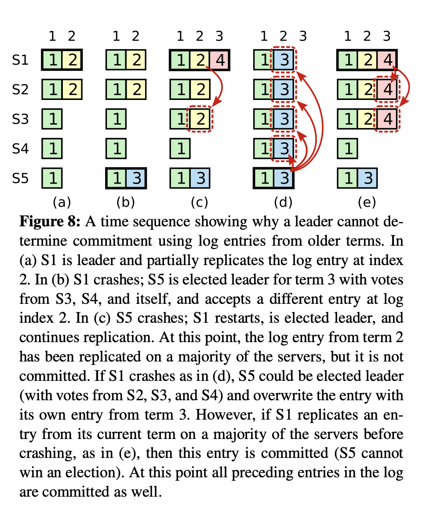</div>

#### 5.4.2 Committing entries from previous terms

正如 Section 5.3 所描述的，一旦当前任期的条目存储在大多数服务器上，leader 就知道该条目已提交。如果 leader 在提交条目之前崩溃，未来的 leader 将尝试完成复制该条目。然而，leader 不能立即得出结论，认为一旦某个前任期的条目存储在大多数服务器上就已经提交。Figure 8 展示了一种情况，其中一个旧的日志条目存储在大多数服务器上，但仍然可以被未来的 leader 覆盖。

为了避免 Figure 8 中的问题，Raft 永远不会通过统计副本数量来提交前任期的日志条目。**只有来自 leader 当前任期的日志条目，才可以通过计数副本（多数派复制）方式提交；一旦当前任期的一条日志通过计数副本提交，那么所有之前的日志条目也是间接提交的，因为有日志匹配（Log Matching）保证**。有一些情况下，leader 可以安全地得出结论，认为一个较旧的日志条目已经被提交（例如，如果该条目存储在每个服务器上），但为了简单起见，Raft 采取了更为保守的方法。

> 注：Raft 只允许“当前任期”的日志通过多数派提交，旧任期日志即使超过半数也不算提交。
> 只有当当前任期日志提交后，旧任期日志才能被视作“顺带提交”。
> 这样做是为了避免旧日志被误认提交然后被覆盖的问题，并保持算法简单可靠。

Raft 在提交规则中引入了这种额外的复杂性，因为当 leader 从前任期复制条目时，日志条目保留其原始任期号。在其他共识算法中，如果一个新的 leader 重新复制来自之前“任期”的条目，它必须使用其新的“任期号”来这样做。Raft 的方法使得关于日志条目的推理变得更加简单，因为它们随时间和跨日志保持相同的任期号。此外，与其他算法相比，Raft 中的新 leader 发送来自前任期的日志条目较少（其他算法必须发送冗余的日志条目来重新编号，然后才能提交它们）。

<div align=center>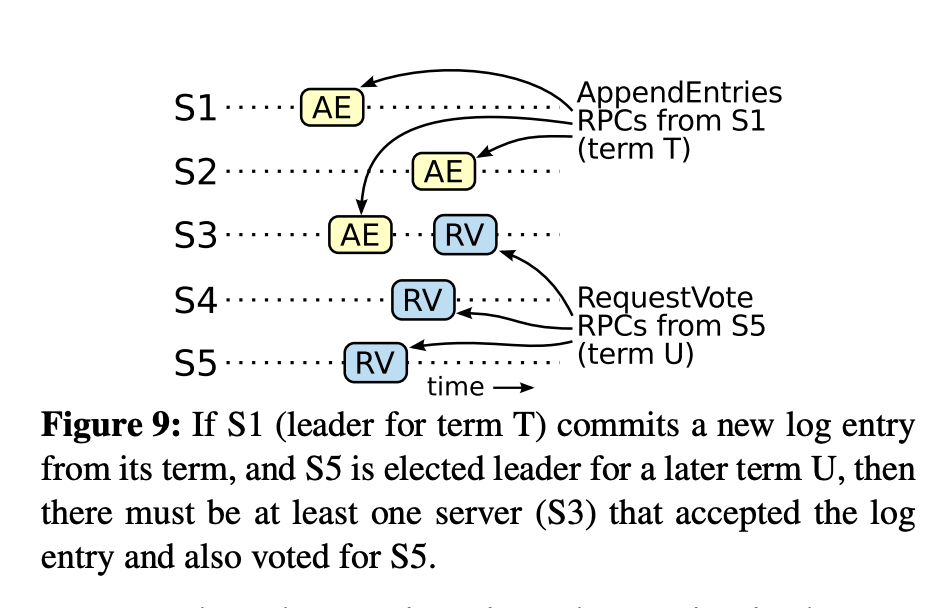</div>

#### 5.4.3 Safety argument

鉴于完整的 Raft 算法，我们现在可以更精确地论证 leader 完整性属性成立（这个论证基于安全性证明；见 Section 8.2）。我们假设 leader 完整性属性不成立，然后我们证明一个矛盾。假设任期 T 的 leader （leader T）提交了一个来自其任期的日志条目，但未来某个任期的 leader （leader U）并未存储该日志条目。考虑最小的任期 U > T，其 leader （leader U）不存储该条目。

1. 提交的条目在 leader U 当选时必须不在其日志中（leader 从不删除或覆盖条目）。
2. leader T 在集群的大多数上复制了该条目，并且 leader U 从集群的大多数中获得了选票。因此，至少有一个服务器（“投票者”）既接受了来自 leader T 的条目，又为 leader U 投票，如 Figure 9 所示。投票者是达成矛盾的关键。
3. 投票者必须在为 leader U 投票之前接受了来自 leader T 的提交条目；否则它会拒绝来自 leader T 的 AppendEntries 请求（它的当前任期会比 T 高）。
4. 投票者在为 leader U 投票时仍然存储了该条目，因为每个介入的 leader 都包含了该条目（按假设），leader 从不移除条目，且 follower 只有在与 leader 冲突时才移除条目。
5. 投票者授予了 leader U 其投票，因此 leader U 的日志必须与投票者的日志一样最新。这导致了两个矛盾之一。
6. 首先，如果投票者和 leader U 拥有相同的最后日志任期，那么 leader U 的日志长度必须至少与投票者的一样长，因此其日志包含了投票者日志中的每一个条目。这是一个矛盾，因为投票者包含了已提交的条目，而假设 leader U 并未包含该条目。
7. 否则，leader U 的最后日志任期必须大于投票者的。此外，它比 T 大，因为投票者的最后日志任期至少是 T（它包含了来自任期 T 的已提交条目）。创建 leader U 最后日志条目的早期 leader 必须在其日志中包含了已提交的条目（按假设）。然后，根据日志匹配属性，leader U 的日志也必须包含已提交的条目，这是一个矛盾。
8. 这完成了矛盾的证明。因此，所有大于 T 任期的 leader 必须包含任期 T 中提交的所有条目。
9. 日志匹配属性保证未来的 leader 也会包含间接提交的条目，例如 Figure 8(d) 中的索引 2。

鉴于 leader 完整性属性，从 Figure 3 证明状态机安全性属性变得简单，并且所有状态机以相同的顺序应用相同的日志条目（见 [29]）。

#### 5.5 Follower and candidate crashes

直到这一点，我们主要关注的是 leader 故障。Follower 和 candidate 崩溃比 leader 崩溃更容易处理，且两者的处理方式相同。如果一个 follower 或 candidate 崩溃，那么未来发送给它的 RequestVote 和 AppendEntries RPC 将会失败。Raft 通过无限重试来处理这些失败；如果崩溃的服务器重启，那么 RPC 将成功完成。如果服务器在完成 RPC 后但在响应之前崩溃，那么它在重启后将再次收到相同的 RPC。Raft RPC 是幂等的，所以这不会造成任何伤害。例如，如果一个 follower 收到一个包含已经存在于其日志中的日志条目的 AppendEntries 请求，它会忽略新请求中的那些条目。

#### 5.6 Timing and availability

我们对 Raft 的一个要求是，安全性不得依赖于时间：系统不应仅因为某些事件发生得比预期更快或更慢而产生错误结果。然而，可用性（系统及时响应客户端的能力）必然依赖于时间。例如，如果消息交换的时间超过了服务器崩溃之间的典型时间，候选者将无法保持足够长的时间来赢得选举；没有稳定的 leader ，Raft 无法取得进展。

 leader 选举是 Raft 中时间最为关键的方面。只要系统满足以下时间要求，Raft 将能够选举并维持一个稳定的 leader ：

```
broadcastTime ≪ electionTimeout ≪ MTBF
```

在这个不等式中，broadcastTime 是指一个服务器并行发送 RPC 到集群中的每个服务器并接收它们响应的平均时间；electionTimeout 是在 Section 5.2 中描述的选举超时时间；MTBF 是单个服务器平均故障间隔时间。broadcastTime 应该比 electionTimeout 小一个数量级，以便 leader 可以可靠地发送保持 follower 不启动选举所需的心跳消息；鉴于选举超时的随机化方法，这个不等式也使得分裂投票变得不太可能。electionTimeout 应该比 MTBF 小几个数量级，以便系统稳定进展。当 leader 崩溃时，系统将在大约 electionTimeout 的时间内不可用；我们希望这只占总时间的一小部分。

broadcastTime 和 MTBF 是底层系统的属性，而 electionTimeout 是我们必须选择的。Raft 的 RPC 通常要求接收者将信息持久化到稳定存储中，因此 broadcastTime 可能在 0.5ms 到 20ms 范围内，这取决于存储技术。结果是，electionTimeout 可能在 10ms 到 500ms 之间。典型的服务器 MTBF 是几个月或更长，这轻松满足时间要求。

## 6、Cluster membership changes

到目前为止，我们假设集群配置（参与共识算法的服务器集）是固定的。实际上，偶尔需要更改配置，例如在服务器故障时替换服务器或更改复制程度。虽然可以通过将整个集群离线、更新配置文件然后重启集群来完成这一操作，但这会在更换期间使集群不可用。此外，如果有任何手动步骤，它们可能会出现操作错误。为了避免这些问题，我们决定自动化配置更改并将其纳入 Raft 共识算法。

为了确保配置更改机制的安全性，在过渡期间不得出现可能为同一任期选举出两位 leader 的情况。不幸的是，任何服务器直接从旧配置切换到新配置的方法都是不安全的。不可能原子性地一次性切换所有服务器，因此在过渡期间，集群可能会分裂成两个独立的多数派（see Figure 10）。

<div align=center>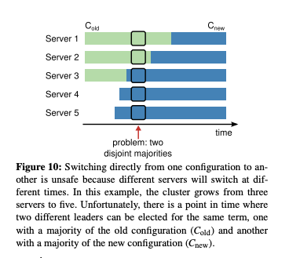</div>

为了确保安全性，配置更改必须使用两阶段方法。实现两个阶段的方法有多种。例如，一些系统（例如，[20]）使用第一阶段禁用旧配置，使其无法处理客户端请求；然后第二阶段启用新配置。在 Raft 中，集群首先切换到我们称之为联合共识的过渡配置；一旦联合共识被提交，系统随后过渡到新配置。联合共识结合了旧配置和新配置：

* 日志条目被复制到两种配置的所有服务器上。

* 任何来自旧配置或新配置的服务器都可以作为 leader 。

* 达成一致（对于选举和条目提交）需要来自旧配置和新配置的独立多数同意。

联合共识允许各个服务器在不同时间之间转换配置，而不会妥协安全性。此外，联合共识允许集群在配置更改期间继续为客户端请求提供服务。

集群配置通过复制日志中的特殊条目存储和通信；Figure 11 说明了配置更改过程。当 leader 收到从 Cold 到 Cnew 的配置更改请求时，它将联合共识的配置（Cold,new in the figure）作为日志条目存储，并使用之前描述的机制复制该条目。一旦给定服务器将新配置条目添加到其日志中，它就会使用该配置进行所有未来的决策（服务器总是使用其日志中的最新配置，无论该条目是否已提交）。这意味着 leader 将使用 Cold,new 的规则来确定 Cold,new 的日志条目何时提交。如果 leader 崩溃，新的 leader 可能在 Cold 或 Cold,new 下被选出，这取决于获胜候选人是否收到了 Cold,new。在任何情况下，Cnew 在此期间都不能做出单方面的决策。

一旦 Cold,new 被提交，Cold 和 Cnew 都不能在没有对方批准的情况下做出决策，而 leader 完整性属性确保只有拥有 Cold,new 日志条目的服务器可以被选为 leader 。现在， leader 可以安全地创建描述 Cnew 的日志条目并将其复制到集群中。同样，这个配置将在每个服务器看到它时立即生效。当新配置根据 Cnew 的规则被提交后，旧配置就变得无关紧要了，不在新配置中的服务器可以被关闭。Figure 11 所示，Cold 和 Cnew 没有同时做出单方面决策的时刻；这保证了安全性。

<div align=center>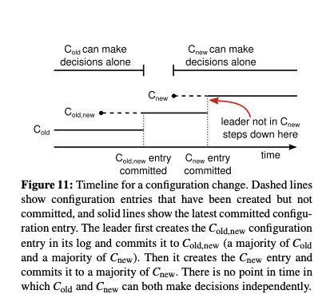</div>

对于重新配置，还有三个问题需要解决。第一个问题是，新服务器最初可能不存储任何日志条目。如果它们在这种状态下被添加到集群中，它们可能需要相当长的时间来赶上其他服务器，在此期间可能无法提交新的日志条目。为了避免可用性间隙，Raft 引入了一个额外的阶段，在配置更改之前，新服务器以非投票成员的身份加入集群（ leader 将日志条目复制给它们，但它们不被考虑在多数中）。一旦新服务器赶上了集群的其他部分，重新配置可以按照上述描述进行。

第二个问题是，集群 leader 可能不是新配置的一部分。在这种情况下，一旦 leader 提交了 Cnew 日志条目，它就会退回到 follower  状态。这意味着会有一段时间（在提交 Cnew 期间）， leader 管理的是一个不包括自己的集群；它复制日志条目，但不把自己算在多数中。 leader 转换发生在 Cnew 被提交时，因为这是新配置可以独立运行的第一个时刻（总是可以从 Cnew 中选择一个 leader ）。在这一点之前，可能只有来自 Cold 的服务器可以被选为 leader 。

第三个问题是，被移除的服务器（那些不在 Cnew 中的服务器）可以扰乱集群。这些服务器将不会接收到心跳，因此它们将超时并启动新的选举。然后它们将发送带有新任期号的 RequestVote RPC，这将导致当前 leader 回退到 follower 状态。最终将选出一个新的 leader ，但被移除的服务器将再次超时，这一过程将重复，导致可用性差。

为了防止这个问题，当服务器认为当前 leader 存在时，它们会忽略 RequestVote RPC。具体来说，如果服务器在从当前 leader 收到消息的最小选举超时内收到 RequestVote RPC，它不会更新其任期或授予其投票。这不影响正常选举，其中每个服务器至少等待一个最小选举超时之后才开始选举。然而，它有助于避免被移除服务器的干扰：如果 leader 能够向其集群发送心跳，那么它就不会被更大的任期号罢免。

> 注：Raft 使用两阶段的联合共识方法来安全地更改集群配置，上面三个问题需要注意。

## 7、Clients and log compaction

这部分内容由于篇幅限制被省略，但在本文的扩展版本[29]中有详细描述。它描述了客户端如何与 Raft 交互，包括客户端如何找到集群 leader 以及 Raft 如何支持线性化语义[8]。扩展版本还描述了如何使用快照方法回收复制日志中的空间。这些问题适用于所有基于共识的系统，而 Raft 的解决方案与其他系统类似。

## 8、Implementation and evaluation

我们已将 Raft 作为复制状态机的一部分实现，该状态机存储 RAMCloud [30]的配置信息，并协助 RAMCloud 协调器的故障转移。Raft 实现大约包含 2000 行C++代码，不包括测试、注释或空行。源代码是免费提供的 [21]。基于本文的草稿，还有大约 25 个独立的第三方开源实现 [31]，这些实现处于不同的开发阶段。此外，各种公司正在部署基于 Raft 的系统 [31]。 本节的其余部分使用三个标准评估 Raft：可理解性、正确性和性能。

### 8.1 Understandability

为了衡量相对于 Paxos 的 Raft 的可理解性，我们在斯坦福大学的高级操作系统课程和加州大学伯克利分校的分布式计算课程中，使用高年级本科生和研究生进行了一项实验研究。我们录制了一段 Raft 的视频讲座和另一段 Paxos 的视频讲座，并创建了相应的测验。Raft 讲座涵盖了本文的内容；Paxos 讲座涵盖了足够的材料来创建一个等效的复制状态机，包括single-decree Paxos、multi-decree Paxos、重新配置，以及实践中需要的一些优化（如 leader election）。测验测试了对算法的基本理解，并要求学生推理一些特殊情况。每个学生观看一个视频，完成相应的测验，然后观看第二个视频，并完成第二个测验。大约一半的参与者首先进行 Paxos 部分，另一半首先进行 Raft 部分，以此来考虑个体在性能上的差异和从研究的第一部分获得的经验。我们比较了参与者在每个测验上的分数，以确定参与者是否对 Raft 有更好的理解。

我们尽可能公平地比较了 Paxos 和 Raft。这项实验以两种方式对 Paxos 有利：43 名参与者中有 15 名报告说他们之前有过 Paxos 的一些经验，而且 Paxos 视频的长度比 Raft 视频长 14%。如表 1 所总结的，我们已采取措施减轻潜在的偏见来源。我们的所有材料都可供审查 [26, 28]。

<div align=center>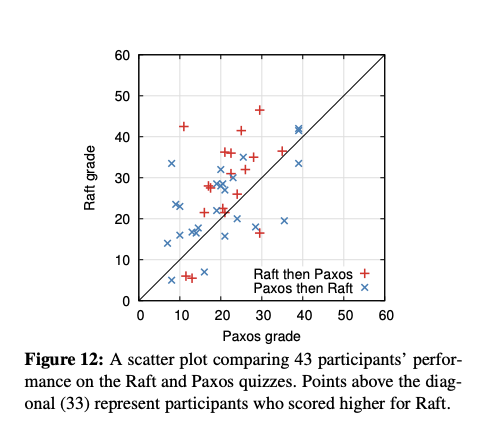</div>

平均而言，参与者在 Raft 测验上的得分比 Paxos 测验高出 4.9 分（在可能的 60 分中，Raft 的平均得分是 25.7，Paxos 的平均得分是 20.8）；图 12 显示了他们的个人得分。配对 t 检验表明，有 95% 的置信度，Raft 得分的真实分布的平均值至少比 Paxos 得分的真实分布高出 2.5 分。我们还创建了一个线性回归模型，该模型根据三个因素预测新学生的测验得分：他们参加的是哪个测验，他们之前有多少 Paxos 经验，以及他们学习算法的顺序。模型预测，选择测验产生了 12.5 分的差异，有利于 Raft。这比观察到的 4.9 分的差异显著更高，因为许多实际学生之前有 Paxos 经验，这在很大程度上帮助了 Paxos，而对 Raft 的帮助稍微小一些。有趣的是，该模型还预测，对于已经参加过 Paxos 测验的人，他们在 Raft 上的得分会低 6.3 分；尽管我们不知道为什么，但这似乎是统计上显著的。

<div align=center>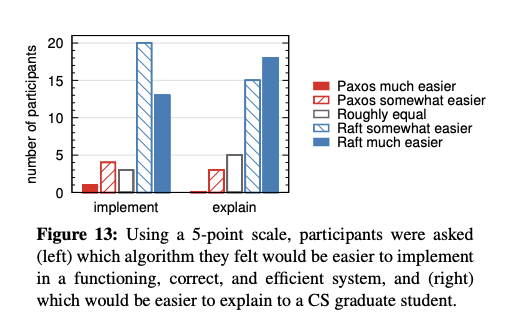</div>

我们还在参与者完成测验后进行了调查，以了解他们认为哪种算法更容易实现或解释；这些结果显示在 Figure 13 中。绝大多数参与者报告说 Raft 更容易实现和解释（每个问题都有 33 位中的 41 位）。然而，这些自我报告的感受可能不如参与者的测验成绩可靠，并且参与者可能因为知道我们的假设——Raft 更易于理解而有所偏见。关于 Raft 用户研究的详细讨论可在 [28] 中找到。

<div align=center>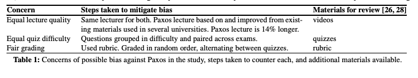</div>

### 8.2 Correctness

我们已经为 Section 5 中描述的共识机制开发了一个正式规范和安全性证明。正式规范 [28] 使用 TLA+ 规范语言 [15] 使图 2 中总结的信息完全精确。它大约有 400 行长，作为证明的主题。对于任何实现 Raft 的人来说，它本身也是有用的。我们已经使用 TLA 证明系统 [6] 机械地证明了日志完整性属性。然而，这个证明依赖于没有机械检查的不变量（例如，我们没有证明规范的类型安全）。此外，我们编写了状态机安全性属性的非正式证明 [28]，它是完整的（仅依赖于规范）并且相对精确（大约 3500 个单词长）。

### 8.3 Performance

Raft 的性能与 Paxos 等其他共识算法相似。性能最重要的情况是当一个已建立的 leader 正在复制新的日志条目时。Raft 通过最少的消息数量实现了这一点（从 leader 到半数集群的单次往返）。也有可能进一步提高 Raft 的性能。例如，它很容易支持批处理和请求管道化，以获得更高的吞吐量和更低的延迟。文献中已经提出了针对其他算法的各种优化；许多这些优化可以应用于 Raft，但我们将这留给未来的工作。

我们使用我们的 Raft 实现来测量 Raft  leader 选举算法的性能，并回答两个问题。首先，选举过程是否能快速收敛？其次，在 leader 崩溃后，可以实现的最小停机时间是多少？

<div align=center>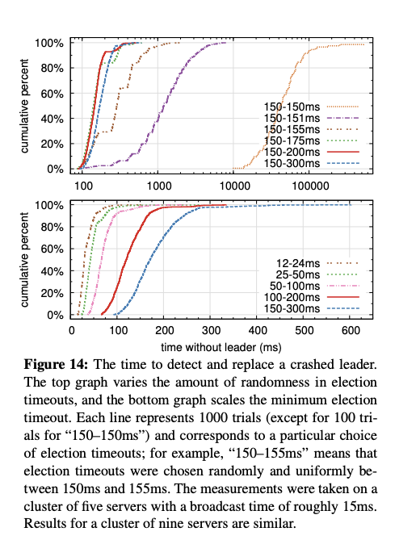</div>

为了测量 leader 选举，我们反复崩溃了一个由五个服务器组成的集群的 leader，并计时了检测到崩溃并选举出新 leader 所需的时间（见 Figure 14）。为了生成最坏情况，每次试验中的服务器具有不同的日志长度，因此一些 candidate 不符合成为 leader 的资格。此外，为了鼓励分裂投票，我们的测试脚本在终止其进程之前触发了来自 leader 的心跳 RPC 的同步广播（这大致模拟了 leader 在崩溃前复制新日志条目的行为）。leader 在其心跳间隔内均匀随机崩溃，这是所有测试中最小选举超时的一半。因此，最小可能的停机时间约为最小选举超时的一半。

Figure 14 中的顶部图表显示，选举超时中的少量随机化足以避免选举中的分裂投票。在没有随机性的情况下，由于许多分裂投票，leader 选举在我们的测试中一致地需要超过 10 秒的时间。仅添加 5ms 的随机性就能显著帮助，导致中位数停机时间为 287ms。使用更多的随机性可以改善最坏情况行为：随机性为 50ms 时，最坏情况完成时间（超过 1000 次试验）为 513ms。

Figure 14 中的底部图表显示，通过减少选举超时可以减少停机时间。当选举超时为 12-24ms 时，平均只需要 35ms 就可以选举出 leader（最长的试验花费了 152ms）。然而，将超时时间降低到这一点以下会违反 Raft 的时间要求：leader 在其他服务器开始新选举之前有困难广播心跳。这可能导致不必要的 leader 更换和降低整个系统的可用性。我们建议使用一个保守的选举超时，如 150-300ms；这样的超时时间不太可能导致不必要的 leader 更换，并且仍然能提供良好的可用性。

## 9、Related work

与共识算法相关的出版物众多，其中许多可以归入以下几个类别：

* Lamport 最初对 Paxos 的描述 [13]，以及试图更清晰地解释它的尝试 [14, 18, 19]。

* Paxos 的详细阐述，它们填补了遗漏的细节并修改算法，为实现提供了更好的基础 [24, 35, 11]。

* 实现共识算法的系统，如 Chubby [2, 4]、ZooKeeper [9, 10] 和 Spanner [5]。Chubby 和 Spanner 的算法尚未详细公布，尽管两者都声称基于 Paxos。ZooKeeper 的算法已经更详细地公布，但它与 Paxos 非常不同。

* 可以应用于 Paxos 的性能优化 [16, 17, 3, 23, 1, 25]。

* Oki 和 Liskov 的 Viewstamped Replication (VR)，与 Paxos 大致同时期发展起来的一种共识的替代方法。原始描述 [27] 与分布式事务的协议交织在一起，但在最近的更新中已将核心共识协议分离出来 [20]。VR 使用了与 Raft 许多相似之处的基于 leader 的方法。

Raft 与 Paxos 之间最大的区别在于 Raft 的强领导力：Raft 将 leader 选举作为共识协议的一个基本部分，并尽可能将更多的功能集中在 leader 身上。这种方法导致了一个更简单、更易于理解的算法。例如，在 Paxos 中， leader 选举与基本共识协议是正交的：它仅作为性能优化服务，并不是实现共识所必需的。然而，这导致了额外的机制：Paxos 包括用于基本共识的两阶段协议和用于 leader 选举的单独机制。相比之下，Raft 直接将 leader 选举纳入共识算法，并将其作为共识的两个阶段之一。这导致了比 Paxos 更少的机制。

像 Raft 一样，VR 和 ZooKeeper 也是基于 leader 的，因此在很多方面与 Raft 相比都有优势。然而，Raft 的机制比 VR 或 ZooKeeper 更少，因为它最小化了非 leader 的功能。例如，在 Raft 中，日志条目只有一个方向流动：从 leader 向外通过 AppendEntries RPCs。在 VR 中，日志条目可以双向流动（ leader 在选举过程中可以接收日志条目）；这导致了额外的机制和复杂性。ZooKeeper 的公开描述也是日志条目向 leader 和来自 leader 双向传输，但实现显然更像 Raft [32]。

Raft 的消息类型比我们所知的任何其他基于共识的日志复制算法都要少。例如，VR 和 ZooKeeper 每个定义了 10 种不同的消息类型，而 Raft 只有 4 种消息类型（两种 RPC 请求及其响应）。Raft 的消息虽然比其他算法的消息更密集，但总体上更简单。此外，VR 和 ZooKeeper 在描述中提到在 leader 变更期间传输整个日志；需要额外的消息类型来优化这些机制，使之实用。在其他工作中已经提出或实现了几种不同的集群成员变更方法，包括 Lamport 的原始提议 [13]、VR [20] 和 SMART [22]。我们为 Raft 选择了联合共识方法，因为它利用了共识协议的其余部分，因此对于成员变更几乎不需要额外的机制。Lamport 的 α-based 方法不适用于 Raft，因为它假设可以在没有 leader 的情况下达成共识。与 VR 和 SMART 相比，Raft 的重配置算法有一个优势，即成员变更可以发生而不限制正常请求的处理；相比之下，VR 在配置变更期间停止所有正常处理，而 SMART 对未决请求的数量施加了类似 α 的限制。Raft 的方法也比 VR 或 SMART 添加的机制要少。

## 10、Conclusion

算法的设计通常以正确性、效率和/或简洁性作为主要目标。虽然这些都是值得追求的目标，但我们认为可理解性同样重要。除非开发者将算法转化为实际的实现，否则其他任何目标都无法实现，而这种转化不可避免地会偏离和扩展已发布的形式。除非开发者深刻理解算法并能对其形成直觉，否则他们很难在实现中保留其期望的属性。

在这篇论文中，我们解决了分布式共识的问题，其中一个广泛接受但难以理解的算法，Paxos，多年来一直是学生和开发者的挑战。我们开发了一个新算法，Raft，我们已经证明它比Paxos更易于理解。我们也相信Raft为系统构建提供了更好的基础。将可理解性作为主要设计目标改变了我们设计Raft的方式；随着设计的进展，我们发现自己反复使用了一些技术，例如分解问题和简化状态空间。这些技术不仅提高了Raft的可理解性，也使我们更容易确信其正确性。

## 11、Acknowledgments

用户研究得到了 Ali Ghodsi、David Mazieres 以及伯克利大学 CS 294-91 课程和斯坦福大学 CS 240 课程的学生们的支持，这才得以进行。Scott Klemmer 帮助我们设计了用户研究，Nelson Ray 为我们提供了统计分析方面的建议。用户研究的 Paxos 幻灯片大量借用了由 Lorenzo Alvisi 最初创建的幻灯片。特别感谢 David Mazieres 和 Ezra Hoch 发现了 Raft 中的细微错误。许多人对论文和用户研究材料提供了有益的反馈，包括 Ed Bugnion、Michael Chan、Hugues Evrard、Daniel Giffin、Arjun Gopalan、Jon Howell、Vimalkumar Jeyakumar、Ankita Kejriwal、Aleksandar Kracun、Amit Levy、Joel Martin、Satoshi Matsushita、Oleg Pesok、David Ramos、Robbert van Renesse、Mendel Rosenblum、Nicolas Schiper、Deian Stefan、Andrew Stone、Ryan Stutsman、David Terei、Stephen Yang、Matei Zaharia、24 位匿名会议评审（包括重复的评审），特别是我们的指导人 Eddie Kohler。Werner Vogels 在推特上分享了一个早期草稿的链接，这为 Raft 带来了显著的曝光率。这项工作得到了 Gigascale Systems Research Center 和 Multiscale Systems Center 的支持，这两个中心是由半导体研究公司计划资助的六个研究中心之一，还得到了由 MARCO 和 DARPA 赞助的半导体研究公司计划 STARnet 的支持，以及国家科学基金会的资助（资助号：0963859），以及来自 Facebook、Google、Mellanox、NEC、NetApp、SAP 和三星的资助。Diego Ongaro 得到了 Junglee Corporation 斯坦福研究生奖学金的支持。


## 个人总结

### 特性

从论文的名字《In Search of an Understandable Consensus Algorithm》也能看出，Raft 的设计思想是为了更易于理解和实现。

1、强领导：Raft 使用比其他共识算法更强的领导形式。例如，日志条目只从 leader 流向其他服务器。这简化了复制日志的管理；

2、Leader 选举：通过心跳机制触发选举，添加随机计时器简单且迅速地解决选举冲突；

3、成员变更: 采用联合共识方法，在转换期间两个不同配置的多数派重叠。这允许集群在配置更改期间正常运行；

Raft 将分布式共识问题分成了多个独立的子问题：Leader 选举（Leader Election）、日志复制（Log Replication）、安全（Safety）和成员变化（Membership Changes）等。

### 角色

Leader，它会接收外部客户端数据写入，并且向 follower 请求同步日志的服务器。同一时间，在整个 Raft 集群里，只会有一个 leader。

Follower，它会接收 leader 同步的日志，然后把日志在本地复制一份。

Candidate，这是一个临时角色，在 leader 选举过程中才会出现。外部的客户端写入数据的时候，都是发送给 leader。

### Leader 选举

如果在超时时间内没有接收到 leader 的心跳，follower 会递增其当前任期并转换为 candidate 状态，然后，它会为自己投票，并向集群中的其他每个服务器并行发出 RequestVote RPCs。

A candidate 会继续保持这种状态，直到发生以下三件事之一：(a) 它赢得选举，(b) 另一台服务器确立自己为 leader，或 (c) 一段时间过去而没有获胜者。

每个 follower 将按照先到先得的原则给 candidate 投票，每任期内最多为一名 candidate 投票。Follower 会对比 RequestVote RPCs 请求中的任期，如果请求的任期更大，那么它会投票给这个 candidate。不然，这个请求会被拒绝掉。投票还需要满足“安全性”要求，选举出来的 Leader 上，一定要有最新的已经提交的日志（？最新的日志）。

投票请求里包含 candidate 日志的信息，如果 follower 自己的日志比 candidate 的更新，则它会拒绝投票给该候选人。(通过过比较日志中最后条目的索引和任期来确定哪个日志最新，优先比较任期，然后比较索引大小，这里索引是commitIndex)

获取到大多数的投票，candidate 就会成为 leader。如果在在等待投票时，收到 AppendEntries RPCs 请求，如果 RPC 中的任期小于 candidate 的当前任期，则 candidate 拒绝 RPC 并继续处于 candidate 状态。反之，则 candidate 会承认 leader 是合法的并返回到 follower 状态。

无获胜者的话 Raft 使用随机选举超时来确保分裂投票很少发生，并且能够快速解决。

### 日志复制

Leader，本质上是通过一个两阶段提交，来做到同步复制的。一方面，它会先把日志写在本地，同时也发送给 follower，这个时候，日志还没有提交，也就没有实际生效。Follower 会返回 leader，是否可以提交日志。当 leader 接收到超过一半的 follower 可以提交日志的响应之后，它会再次发送一个提交的请求给到 follower（实际是在本地更新状态，不需要再发提交请求，通过心跳或新日志提交），完成实际的日志提交，并把写入结果返回给客户端。

AppendEntries RPCs 请求中会包含信息：当前日志索引和任期，日志内容，上一条日志索引和任期。follower 会先对比上一条日志索引和任期信息，如果存在，对这个位置之后的日志都删除掉。然后把新日志追加上去；如果不存在，则拒绝新追加的日志。Leader 会不断重复这个过程，确保找到和 follower 的同步点。

在 Raft 中，leader 通过强制 follower 的日志复制自己的日志来处理不一致问题。这意味着 follower 日志中的冲突条目将被 leader 日志中的条目覆盖。

上面的同步规则保障了日志匹配属性：

* 如果不同日志中的两个条目具有相同的索引和任期，则它们存储相同的命令；

* 如果不同日志中的两个条目具有相同的索引和任期，则这些日志在所有前面的条目中都是相同的；

Raft 只保证已提交的日志项永远不会丢失。

### 安全性

安全性规则确保新的 leader 具有最新的日志（已提交的日志），这里的做法是选举时要比较最后日志的索引和任期，如果 follower 本地有更新的数据，则拒绝投票。

* 选举安全性：在给定的任期内，最多只能选举出一个 leader 。§5.2

*  leader 只追加： leader 从不覆盖或删除其日志中的条目；它只追加新条目。§5.3

* 日志匹配：如果两个日志在相同的索引和任期内包含一个条目，则这两个日志在给定索引之前的所有条目中都是相同的。§5.3

*  leader 完整性：如果在给定的任期内提交了一个日志条目，那么该条目将出现在所有更高编号任期的 leader 的日志中。§5.4

* 状态机安全性：如果一个服务器已经将给定索引的日志条目应用到其状态机，那么没有其他服务器会应用同一索引的不同日志条目。§5.4.3

### 成员变更

Raft 采用了一个加入“联合 共识（Joint Consensus）”的办法来保证在变更过程中不妥协安全性并在变更过程中保持服务可用性。

要变更整个 Raft 集群的配置，我们会进行两阶段的变更。第一阶段是把我们的服务器配置，从 Cold​ 变更成 Cold​,Cnew​，然后在第二阶段，再从 Cold​,Cnew​ 变更成 Cnew​。而两次的配置变更，也是通过 Raft 算法，通过一个日志追加写入更新到整个 Raft 集群里的。

当第一阶段的配置提交后，集群进入“过渡共识”阶段，此时此刻，所有的数据写入，都需要至少获得半数的 Cold​ 里的服务器和半数的 Cnew​ 里的服务器通过，才能被提交。

第二阶段的配置提交会把配置从 Cold​,Cnew​ 变成 Cnew​，这个操作，只需要 Cnew​ 里的服务器的半数通过，而不再需要 Cold​ 里的半数通过了。

对于重新配置，还有三个问题需要解决：

* 新加入的成员在配置更改之前，以非投票成员的身份加入，进行日志同步；

* 新集群不包含 leader，leader 在提交了 Cnew 日志条目后，会退回到 follower 状态；

* 被移除的服务器可能会干扰集群，为了避免这个问题，当服务器认为当前 leader 存在时（最小选举超时内），它们会忽略 RequestVote RPC。


## 面试题

1、日志会出现空洞吗？已经提交的日志会被删除吗？

```
不会、不会
```

2、Follower 是如何做日志一致性检查的？

```
日志匹配属性
```

3、 Leader 和 Follower 日志不一致怎么办？

```
找出一致的日志索引点，强制同步之后的日志，会进行日志覆盖
```
4、选举投票规则

```
1、term 大的成员拒绝 term 小的成员投票
2、日志索引大的成员拒绝日志索引小的成员投票
3、一个 term 只能投一次票，先到先得
```

源码验证：选举时 term 和日志项如何比较的？

幽灵日志如何产生？


## 相关链接

[The Raft Consensus Algorithm](https://raft.github.io/)

[In Search of an Understandable Consensus Algorithm](https://raft.github.io/raft.pdf)
