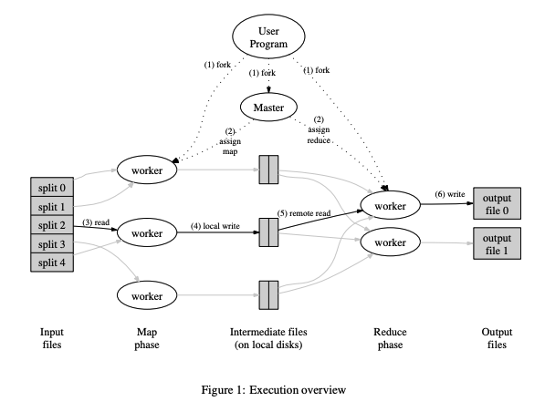
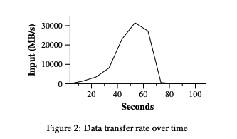
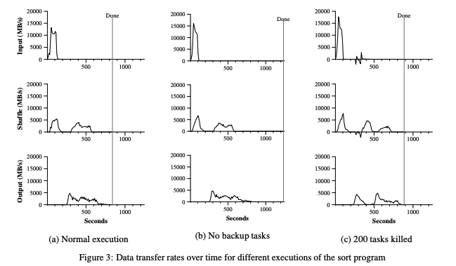
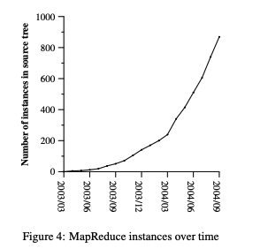
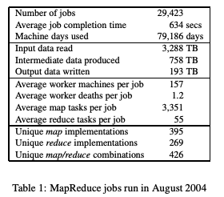

# MapReduce: Simplified Data Processing on Large Clusters

> Jeffrey Dean and Sanjay Ghemawat Google, Inc. 2004

## 目录

- [Abstract](#abstract)
- [1 Introduction](#1-introduction)
- [2 Programming Model](#2-programming-model)
  - [2.1 Example](#21-example)
  - [2.2 Types](#22-types)
  - [2.3 More Examples](#23-more-examples)
- [3 Implementation](#3-implementation)
  - [3.1 Execution Overview](#31-execution-overview)
  - [3.2 Master Data Structures](#32-master-data-structures)
  - [3.3 Fault Tolerance](#33-fault-tolerance)
  - [3.4 Locality](#34-locality)
  - [3.5 Task Granularity](#35-task-granularity)
  - [3.6 Backup Tasks](#36-backup-tasks)
- [4 Refinements](#4-refinements)
  - [4.1 Partitioning Function](#41-partitioning-function)
  - [4.2 Ordering Guarantees](#42-ordering-guarantees)
  - [4.3 Combiner Function](#43-combiner-function)
  - [4.4 Input and Output Types](#44-input-and-output-types)
  - [4.5 Side-effects](#45-side-effects)
  - [4.6 Skipping Bad Records](#46-skipping-bad-records)
  - [4.7 Local Execution](#47-local-execution)
  - [4.8 Status Information](#48-status-information)
  - [4.9 Counters](#49-counters)
- [5 Performance](#5-performance)
  - [5.1 Cluster Configuration](#51-cluster-configuration)
  - [5.2 Grep](#52-grep)
  - [5.3 Sort](#53-sort)
  - [5.4 Effect of Backup Tasks](#54-effect-of-backup-tasks)
  - [5.5 Machine Failures](#55-machine-failures)
- [6 Experience](#6-experience)
  - [6.1 Large-Scale Indexing](#61-large-scale-indexing)
- [7 Related Work](#7-related-work)
- [8 Conclusions](#8-conclusions)
- [Acknowledgements](#acknowledgements)


## Abstract

MapReduce 是一种用于处理和生成大规模数据集的编程模型及其相关实现。用户指定一个 map 函数，用于处理一个键/值对并生成一组中间键/值对；以及一个 reduce 函数，用于合并所有与同一中间键相关联的中间值。正如论文中所示，许多现实世界中的任务都可以用该模型来表达。

以这种函数式风格编写的程序会被自动并行化，并在由大量通用机器组成的大规模集群上执行。运行时系统负责处理输入数据的划分、在一组机器上调度程序的执行、处理机器故障，以及管理所需的跨机器通信等细节。这使得即使没有并行与分布式系统经验的程序员，也能够轻松地利用大型分布式系统的资源。

我们实现的 MapReduce 运行在由大量通用机器组成的大规模集群上，并且具有很强的可扩展性：一次典型的 MapReduce 计算可以在数千台机器上处理数 TB 级的数据。程序员发现该系统易于使用：已经实现了数百个 MapReduce 程序，并且 Google 的集群每天都会执行一千多个 MapReduce 作业。

## 1 Introduction

在过去的五年中，作者以及 Google 的许多其他人实现了数百个专用计算，用于处理大量原始数据，例如抓取的文档、Web 请求日志等，以计算各种派生数据，例如倒排索引、Web 文档图结构的多种表示形式、每个主机被抓取页面数量的汇总、某一天中最频繁查询的集合等。大多数此类计算在概念上都相对简单。然而，输入数据通常规模巨大，为了在合理的时间内完成计算，必须将这些计算分布到数百甚至数千台机器上执行。如何对计算进行并行化、如何分发数据以及如何处理故障等问题，往往会引入大量用于应对这些问题的复杂代码，从而掩盖了原本简单的计算逻辑。

针对这种复杂性，我们设计了一种新的抽象，使我们能够表达希望执行的简单计算，同时将并行化、容错、数据分发和负载均衡等繁琐细节隐藏在一个库中。该抽象受到 Lisp 以及许多其他函数式语言中 map 和 reduce 原语的启发。我们认识到，我们的大多数计算都涉及对输入中的每一个逻辑“记录”应用一次 map 操作，以生成一组中间键/值对，然后对所有具有相同键的值应用一次 reduce 操作，从而以适当的方式合并派生数据。采用由用户指定 map 和 reduce 操作的函数式模型，使我们能够轻松地并行化大规模计算，并将重新执行作为容错的主要机制。

本工作的主要贡献在于提出了一种简单而强大的接口，该接口能够实现大规模计算的自动并行化和分布式执行，并结合了该接口的一种实现，使其在由通用 PC 组成的大规模集群上获得了高性能。

第 2 节描述了基本的编程模型并给出了若干示例。第 3 节描述了一个针对我们基于集群的计算环境定制的 MapReduce 接口实现。第 4 节介绍了我们认为有用的若干编程模型改进。第 5 节给出了该实现针对多种任务的性能测量结果。第 6 节探讨了 MapReduce 在 Google 内部的使用情况，包括我们将其作为重写生产索引系统基础的使用经验。第 7 节讨论了相关工作和未来工作。

## 2 Programming Model

该计算以一组输入键/值对作为输入，并生成一组输出键/值对。MapReduce 库的用户通过两个函数来表达该计算：Map 和 Reduce。

由用户编写的 Map 函数接收一个输入对，并生成一组中间键/值对。MapReduce 库将所有与同一中间键 I 相关联的中间值分组，并将它们传递给 Reduce 函数。

同样由用户编写的 Reduce 函数接收一个中间键 I 以及该键对应的一组值。它将这些值合并，以形成一个可能更小的值集合。通常，每次 Reduce 调用只会生成零个或一个输出值。中间值通过一个迭代器提供给用户的 reduce 函数，这使得我们能够处理那些大到无法完全装入内存的值列表。

### 2.1 Example

考虑在一个大型文档集合中统计每个单词出现次数的问题。用户将编写类似于以下伪代码的代码：

```
map(String key, String value):
    // key: document name
    // value: document contents
    for each word w in value:
        EmitIntermediate(w, "1");

reduce(String key, Iterator values):
    // key: a word
    // values: a list of counts
    int result = 0;
    for each v in values:
        result += ParseInt(v);
    Emit(result);
```

map 函数输出每个单词及其对应的出现次数（在这个简单示例中仅为“1”）。reduce 函数将针对某一特定单词输出的所有计数值进行求和。

此外，用户还需要编写代码，在一个 mapreduce 规范对象中填入输入和输出文件的名称，以及可选的调优参数。随后，用户调用 MapReduce 函数，并将该规范对象作为参数传入。用户代码与 MapReduce 库（以 C++ 实现）进行链接。附录 A 给出了该示例的完整程序文本。

### 2.2 Types

尽管前面的伪代码是以字符串作为输入和输出来编写的，但从概念上讲，用户提供的 map 和 reduce 函数都具有相应的类型：

```
map     → (k1, v1)       → list(k2, v2)
reduce  → (k2, list(v2)) → list(v2)
```

也就是说，输入的键和值来自于与输出键和值不同的域。此外，中间键和值来自与输出键和值相同的域。

我们的 C++ 实现将字符串传递给用户定义的函数，并从这些函数返回字符串，具体的字符串与相应类型之间的转换由用户代码负责。

### 2.3 More Examples

以下是一些可以用 MapReduce 计算轻松表达的有趣程序的简单示例。

**Distributed Grep（分布式文本搜索）**：map 函数在行匹配给定模式时输出该行。reduce 函数是一个恒等函数，仅将传入的中间数据复制到输出。

**Count of URL Access Frequency（URL 访问频率统计）**：map 函数处理网页请求日志，并输出 ⟨URL, 1⟩。reduce 函数将同一 URL 的所有值相加，并输出 ⟨URL, 总计数⟩ 对。

**Reverse Web-Link Graph（反向网页链接图）**：map 函数为每个页面 source 中指向目标 URL 的链接输出 ⟨target, source⟩ 对。reduce 函数将与给定目标 URL 相关的所有源 URL 列表连接起来，并输出 ⟨target, list(source)⟩ 对。

**Term-Vector per Host（每个主机的词向量）**：词向量通过 ⟨单词, 频率⟩ 对的列表总结文档或文档集合中最重要的单词。map 函数为每个输入文档输出 ⟨hostname, term vector⟩ 对（hostname 从文档的 URL 中提取）。reduce 函数接收给定主机的所有文档词向量，将它们相加，丢弃不常用的词，然后输出最终的 ⟨hostname, term vector⟩ 对。

**Inverted Index（倒排索引）**：map 函数解析每个文档，并输出一系列 ⟨word, document ID⟩ 对。reduce 函数接收某个单词对应的所有对，对相应的文档 ID 进行排序，并输出 ⟨word, list(document ID)⟩ 对。所有输出对的集合就构成了一个简单的倒排索引。扩展此计算以跟踪单词位置也很容易实现。

**Distributed Sort（分布式排序）**：map 函数从每条记录中提取键，并输出 ⟨key, record⟩ 对。reduce 函数将所有对原样输出。该计算依赖于第 4.1 节描述的分区机制以及第 4.2 节描述的排序属性。

## 3 Implementation

MapReduce 接口可以有多种不同的实现方式，具体选择取决于运行环境。例如，一种实现可能适用于小型共享内存机器，另一种适用于大型 NUMA 多处理器系统，还有一种可能适用于更大规模的网络化机器集合。

本节描述一种针对 Google 广泛使用的计算环境的实现：由大量通用 PC 组成的集群，通过交换式以太网互联。在我们的环境中：

1. 机器通常为双处理器 x86 架构，运行 Linux，每台机器配备 2–4 GB 内存。
2. 使用通用网络硬件——通常每台机器为 100 兆位/秒或 1 吉位/秒，但总体平均的对半带宽要低得多。
3. 一个集群由数百到数千台机器组成，因此机器故障是常见的。
4. 存储由直接连接到各个机器的廉价 IDE 硬盘提供。使用内部开发的分布式文件系统管理这些硬盘上的数据。文件系统通过复制机制，在不可靠硬件之上提供可用性和可靠性。
5. 用户将作业提交给调度系统。每个作业由一组任务组成，由调度器映射到集群内的一组可用机器上执行。

### 3.1 Execution Overview

Map 调用通过将输入数据自动划分为 M 个分片（splits）分布到多台机器上。不同机器可以并行处理这些输入分片。Reduce 调用通过使用分区函数（例如 hash(key) mod R）将中间键空间划分为 R 个部分来分发。分区数 R 以及分区函数由用户指定。

Figure 1 展示了我们实现中 MapReduce 操作的整体流程。当用户程序调用 MapReduce 函数时，会发生以下操作（图中编号对应下列表中的序号）：

1. 用户程序中的 MapReduce 库首先将输入文件分割为 M 个片段，每个片段通常为 16 到 64 MB（用户可通过可选参数控制）。随后，它在集群上的多台机器上启动多个程序副本。
2. 这些程序副本中有一个特殊的——主控（master），其余为工作节点（workers），由主控分配任务。共有 M 个 map 任务和 R 个 reduce 任务需要分配。主控挑选空闲的工作节点，并为每个节点分配 map 任务或 reduce 任务。
3. 被分配 map 任务的工作节点读取对应输入分片的内容，将输入数据解析为键/值对，并传递给用户定义的 Map 函数。Map 函数生成的中间键/值对会缓存在内存中。
4. 缓冲的键/值对会定期写入本地磁盘，并通过分区函数划分为 R 个区域。这些缓冲对在本地磁盘上的位置会反馈给主控，由主控负责将这些位置转发给 reduce 工作节点。
5. 当 reduce 工作节点收到主控的通知后，会通过远程过程调用（RPC）从 map 工作节点的本地磁盘读取缓冲数据。reduce 工作节点读取完所有中间数据后，会按中间键对其进行排序，以便相同键的所有值被分组在一起。排序是必要的，因为通常许多不同键会映射到同一个 reduce 任务。如果中间数据量过大无法完全装入内存，则使用外部排序。
6. reduce 工作节点遍历排序后的中间数据，对于每个唯一中间键，将该键及其对应的中间值集合传递给用户的 Reduce 函数。Reduce 函数的输出会追加到该 reduce 分区的最终输出文件中。
7. 当所有 map 和 reduce 任务完成后，主控唤醒用户程序。此时，用户程序中的 MapReduce 调用返回给用户代码。

MapReduce 执行成功完成后，其输出存放在 R 个输出文件中（每个 reduce 任务对应一个文件，文件名由用户指定）。通常用户不需要将这 R 个输出文件合并为一个文件——它们常被作为另一个 MapReduce 调用的输入，或者由其他能够处理分片输入的分布式应用程序使用。

<div align=center></div>

### 3.2 Master Data Structures

主控（master）维护若干数据结构。对于每个 map 任务和 reduce 任务，它存储任务的状态（空闲、进行中或已完成）以及工作节点的身份信息（针对非空闲任务）。

主控是中间文件区域位置从 map 任务传递到 reduce 任务的通道。因此，对于每个已完成的 map 任务，主控会存储该 map 任务生成的 R 个中间文件区域的位置和大小。随着 map 任务的完成，这些位置信息和大小信息会被更新，并以增量方式推送给那些正在执行 reduce 任务的工作节点。

### 3.3 Fault Tolerance

由于 MapReduce 库旨在利用数百甚至数千台机器处理海量数据，因此该库必须能够**优雅地容忍机器故障**。

**工作节点故障**

Master 会定期对每个工作节点进行心跳检测。如果在一定时间内未收到某个工作节点的响应，Master 会将该节点标记为故障。该节点已完成的任何 map 任务会被重置为初始的空闲状态，从而可以重新调度到其他工作节点上。同样，该节点上正在进行的任何 map 或 reduce 任务也会被重置为空闲状态，并可重新调度。

已完成的 map 任务需要在故障时重新执行，因为它们的输出存储在故障节点的本地磁盘上，无法访问。已完成的 reduce 任务则无需重新执行，因为它们的输出已存储在全局文件系统中。

当一个 map 任务最初由工作节点 A 执行，后来由于 A 故障而由工作节点 B 重新执行时，所有正在执行 reduce 任务的工作节点都会收到重新执行的通知。任何尚未从工作节点 A 读取数据的 reduce 任务，会从工作节点 B 读取数据。

MapReduce 对大规模工作节点故障具有很强的容错能力。例如，在一次 MapReduce 操作中，正在运行的集群因网络维护导致每次有 80 台机器暂时无法访问，持续数分钟。MapReduce Master 简单地重新执行了这些不可访问工作节点完成的任务，并继续向前推进，最终完成了整个 MapReduce 操作。

**Master 故障**

让 Master 定期写入上述 Master 数据结构的检查点是容易实现的。如果 Master 任务宕机，可以从最近的检查点状态启动新的副本。然而，由于系统中只有一个 Master，其故障发生的可能性较低；因此我们当前的实现中，如果 Master 失败，MapReduce 计算将中止。客户端可以检测到这种情况，并在需要时重试 MapReduce 操作。

**存在故障时的语义**

当用户提供的 map 和 reduce 操作是其输入值的确定性函数时，我们的分布式实现产生的输出与整个程序在无故障的顺序执行中产生的输出相同。

我们依赖 map 和 reduce 任务输出的**原子提交**来实现这一特性。每个正在执行的任务将其输出写入私有临时文件。reduce 任务生成一个这样的文件，而 map 任务会生成 $R$ 个这样的文件（每个 reduce 任务对应一个文件）。当 map 任务完成时，工作节点向 Master 发送一条消息，并在消息中包含这 $R$ 个临时文件的名称。如果 Master 收到已完成 map 任务的完成消息，它会忽略该消息；否则，它将在 Master 的数据结构中记录这 $R$ 个文件的名称。

当 reduce 任务完成时，reduce 工作节点会将其临时输出文件原子性地重命名为最终输出文件。如果同一 reduce 任务在多台机器上执行，则会对同一最终输出文件执行多次重命名操作。我们依赖底层文件系统提供的原子重命名操作，以保证最终文件系统状态只包含 reduce 任务一次执行产生的数据。

我们绝大多数的 map 和 reduce 操作都是确定性的，因此在这种情况下，我们的语义等价于顺序执行，这使得程序员很容易推理程序行为。当 map 和/或 reduce 操作是非确定性时，我们提供较弱但仍合理的语义。在存在非确定性操作时，特定 reduce 任务 $R_1$ 的输出等价于顺序执行该非确定性程序时 $R_1$ 的输出。然而，不同 reduce 任务 $R_2$ 的输出可能对应于另一种顺序执行非确定性程序时 $R_2$ 的输出。

考虑 map 任务 M 和 reduce 任务 $R_1$ 与 $R_2$。令 $e(R_i)$ 为提交的 $R_i$ 执行（每个 reduce 任务恰好有一次这样的提交）。语义较弱的原因在于，$e(R_1)$ 可能读取了 M 的一次执行产生的输出，而 $e(R_2)$ 可能读取了 M 的另一执行产生的输出。

> 注：保证每个 Reduce 单独一致，但跨 Reduce 不保证全局一致（当 Map/Reduce 是非确定性时）。

### 3.4 Locality

在我们的计算环境中，网络带宽是一种相对稀缺的资源。我们通过利用输入数据（由 GFS 管理）存储在组成集群的各台机器的本地磁盘上的事实来节约网络带宽。GFS 将每个文件划分为 64 MB 的块，并在不同机器上存储每个块的多个副本（通常为 3 个副本）。

MapReduce Master 会考虑输入文件的位置信息，尝试将 map 任务调度到包含对应输入数据副本的机器上。如果无法做到这一点，则尝试将 map 任务调度到靠近该任务输入数据副本的机器上（例如，在与存储数据的机器处于同一网络交换机的工作节点上）。在对集群中大部分工作节点运行大规模 MapReduce 操作时，大多数输入数据都是在本地读取的，因此几乎不消耗网络带宽。

### 3.5 Task Granularity

如前所述，我们将 map 阶段划分为 $M$ 个片段，reduce 阶段划分为 $R$ 个片段。理想情况下，$M$ 和 $R$ 应远大于工作节点的数量。让每个工作节点执行多个不同任务，有助于动态负载均衡，同时在工作节点故障时也能加快恢复速度：该节点已完成的多个 map 任务可以分布到其他所有工作节点上。

在我们的实现中，$M$ 和 $R$ 的大小存在实际限制，因为 Master 必须做 $O(M + R)$ 次调度决策，并在内存中维护 $O(M \times R)$ 的状态，如上文所述。（不过内存使用的常数因子很小：$O(M \times R)$ 的状态部分大约每个 map 任务/ reduce 任务对占用 1 字节数据。）

此外，$R$ 通常受用户约束，因为每个 reduce 任务的输出最终会存放在单独的输出文件中。在实践中，我们倾向于选择 $M$，使得每个单独任务处理大约 16 MB 到 64 MB 的输入数据（以便上述本地性优化最有效），并将 $R$ 设为预期使用的工作节点数量的一个小倍数。我们经常使用 2,000 个工作节点执行 MapReduce 计算，选择 $M = 200,000$，$R = 5,000$。

### 3.6 Backup Tasks

延长 MapReduce 操作总耗时的一个常见原因是“拖后任务”（straggler）：即某台机器在完成计算中最后几个 map 或 reduce 任务时耗时异常长。

拖后任务可能由多种原因引起。例如，磁盘损坏的机器可能频繁出现可纠正错误，导致其读取性能从 30 MB/s 降至 1 MB/s。集群调度系统可能在该机器上安排了其他任务，使其由于 CPU、内存、本地磁盘或网络带宽竞争而执行 MapReduce 代码速度变慢。我们近期遇到的一个问题是机器初始化代码中的一个错误导致处理器缓存被禁用，受影响机器上的计算速度下降了 100 倍以上。

我们有一个通用机制来缓解拖后任务的问题。当 MapReduce 操作接近完成时，Master 会调度剩余进行中任务的备份执行。无论主执行还是备份执行先完成，该任务都会被标记为已完成。我们对该机制进行了调优，使其通常只会增加操作所使用的计算资源几个百分点。我们发现，这显著缩短了大规模 MapReduce 操作的完成时间。例如，第 5.3 节描述的排序程序在禁用备份任务机制时，完成时间增加了 44%。

## 4 Refinements

虽然仅通过编写 Map 和 Reduce 函数提供的基本功能已能满足大多数需求，但我们发现一些扩展功能也很有用。本节将对此进行说明。

### 4.1 Partitioning Function

MapReduce 的用户可以指定所需的 reduce 任务数/输出文件数（$R$）。数据通过对中间键应用分区函数在这些任务之间进行划分。系统提供了一个默认的分区函数，使用哈希方法（例如 “hash(key) mod R”），通常可以得到比较均衡的分区。然而，在某些情况下，按照键的其他函数来划分数据更为有用。例如，有时输出键是 URL，我们希望同一主机的所有条目最终出现在同一个输出文件中。为支持这种情况，MapReduce 库的用户可以提供自定义分区函数。例如，将 “hash(Hostname(urlkey)) mod R” 作为分区函数，就能使同一主机的所有 URL 出现在同一个输出文件中。

### 4.2 Ordering Guarantees

我们保证在给定分区内，中间键/值对会按照键的升序进行处理。这种排序保证使得为每个分区生成排序后的输出文件变得容易，这在以下情况下非常有用：输出文件格式需要支持按键的高效随机访问查询，或者输出的使用者希望数据是有序的，以便使用更方便。

### 4.3 Combiner Function

在某些情况下，每个 map 任务产生的中间键存在大量重复，且用户指定的 Reduce 函数是可交换且结合的。一个典型例子是第 2.1 节的单词计数示例。由于单词频率通常遵循 Zipf 分布，每个 map 任务会生成数百或数千条形如 ⟨the, 1⟩ 的记录。所有这些计数都会通过网络发送到单个 reduce 任务，然后由 Reduce 函数将它们相加生成一个总数。我们允许用户指定一个可选的 Combiner 函数，在数据发送到网络之前进行部分合并。

Combiner 函数在执行 map 任务的每台机器上运行。通常同一段代码既用于实现 combiner，也用于实现 reduce 函数。reduce 函数与 combiner 函数的唯一区别在于 MapReduce 库如何处理函数输出：reduce 函数的输出写入最终输出文件，而 combiner 函数的输出写入中间文件，随后会发送到 reduce 任务。

部分合并能够显著加快某些类别的 MapReduce 操作。附录 A 给出了使用 combiner 的示例。

### 4.4 Input and Output Types

MapReduce 库支持以多种不同格式读取输入数据。例如，“text” 模式将每行视为一个键/值对：键是文件中的偏移量，值是该行内容。另一种常用的支持格式是按键排序的一系列键/值对。每种输入类型的实现都知道如何将自身划分为有意义的范围，以便作为独立的 map 任务进行处理（例如，text 模式的范围划分确保分片只发生在行边界）。用户也可以通过提供一个简单 reader 接口的实现来支持新的输入类型，但大多数用户通常只使用少数预定义的输入类型之一。

reader 不一定需要从文件中提供数据。例如，可以很容易地定义一个 reader，从数据库或映射到内存的数据结构中读取记录。

以类似的方式，MapReduce 支持一组输出类型，用于以不同格式生成数据，并且用户代码可以轻松添加对新输出类型的支持。

### 4.5 Side-effects

在某些情况下，MapReduce 的用户发现从其 map 和/或 reduce 操作生成辅助文件作为额外输出很方便。我们依赖应用程序编写者确保此类副作用具有原子性且幂等性。通常，应用程序会先写入临时文件，并在文件完全生成后将其原子性重命名。

我们不提供对单个任务生成的多个输出文件进行原子两阶段提交的支持。因此，生成多个输出文件且需要跨文件一致性的任务应具有确定性。在实际使用中，这一限制从未成为问题。

### 4.6 Skipping Bad Records

有时，用户代码中存在 bug，会导致 Map 或 Reduce 函数在处理某些特定记录时确定性崩溃。这类 bug 会阻止 MapReduce 操作完成。通常的处理方式是修复 bug，但有时不可行——例如 bug 出现在无法获取源代码的第三方库中。此外，在对大数据集进行统计分析时，忽略少数记录也是可以接受的。我们提供了一种可选的执行模式，在该模式下，MapReduce 库会检测哪些记录会导致确定性崩溃，并跳过这些记录以保证计算继续进行。

每个工作进程都会安装一个信号处理器，用于捕捉段错误（segmentation violations）和总线错误（bus errors）。在调用用户 Map 或 Reduce 操作之前，MapReduce 库会将参数的序列号存储在全局变量中。如果用户代码触发了信号，信号处理器会发送一个包含该序列号的“最后通牒”（last gasp）UDP 数据包给 MapReduce Master。当 Master 在某条记录上观察到多次失败时，它会在下一次重新执行对应的 Map 或 Reduce 任务时指示跳过该记录。

### 4.7 Local Execution

调试 Map 或 Reduce 函数的问题可能比较棘手，因为实际计算发生在分布式系统中，通常涉及数千台机器，工作分配由 Master 动态决定。为了便于调试、性能分析和小规模测试，我们开发了 MapReduce 库的另一种实现，它可以在本地机器上顺序执行整个 MapReduce 操作的所有任务。用户可以通过控制选项限制计算仅在特定的 map 任务上执行。用户使用特殊标志调用程序后，就可以轻松使用任何调试或测试工具（例如 gdb）。

### 4.8 Status Information

Master 运行一个内部 HTTP 服务器，并导出一组面向用户的状态页面。状态页面显示计算的进度，例如已完成的任务数、正在进行的任务数、输入字节数、中间数据字节数、输出字节数、处理速率等。页面还包含每个任务生成的标准错误和标准输出文件的链接。用户可以利用这些数据预测计算需要的时间，以及是否需要为计算增加更多资源。这些页面也可以帮助判断计算是否明显慢于预期。

此外，顶层状态页面会显示哪些工作节点失败，以及它们失败时正在处理的 map 和 reduce 任务。这些信息在尝试诊断用户代码中的 bug 时非常有用。

### 4.9 Counters

MapReduce 库提供了计数器（counter）功能，用于统计各种事件的发生次数。例如，用户代码可能希望统计处理的总单词数，或者索引的德语文档数量等。

要使用该功能，用户代码需创建一个命名计数器对象，并在 Map 和/或 Reduce 函数中适当地增加计数。例如：

```
Counter* uppercase;
uppercase = GetCounter("uppercase");

map(String name, String contents):
    for each word w in contents:
        if (IsCapitalized(w)):
            uppercase->Increment();
        EmitIntermediate(w, "1");
```

来自各个工作节点的计数器值会定期传回 Master（附加在 ping 响应中）。Master 会聚合成功完成的 map 和 reduce 任务的计数器值，并在 MapReduce 操作完成时将其返回给用户代码。当前计数器值也会显示在 Master 的状态页面上，以便人工观察计算进度。在聚合计数器值时，Master 会消除同一 map 或 reduce 任务重复执行的影响，避免重复计数。（重复执行可能由备份任务或因故障重新执行任务引起。）

一些计数器值由 MapReduce 库自动维护，例如处理的输入键/值对数量和产生的输出键/值对数量。

用户发现计数器功能对验证 MapReduce 操作的行为非常有用。例如，在某些 MapReduce 操作中，用户代码可能希望确保生成的输出对数与处理的输入对数完全一致，或者确保处理的德语文档占总文档数量的比例在可接受范围内。

## 5 Performance

本节中，我们在一个大型机器集群上测量了 MapReduce 对两类计算的性能。一类计算是在约 1TB 的数据中搜索特定模式，另一类计算是对约 1TB 的数据进行排序。

这两个程序代表了 MapReduce 用户所编写的大量实际程序中的一个子集——一类程序将数据从一种表示形式重新整理（shuffle）到另一种表示形式，另一类程序则从大数据集中提取少量有趣的数据。

### 5.1 Cluster Configuration

所有程序都在一个约有 1800 台机器的集群上执行。每台机器配备两颗 2GHz 的 Intel Xeon 处理器，并启用超线程（HyperThreading）、4GB 内存、两个 160GB IDE 磁盘，以及千兆以太网接口。机器通过两级树形交换网络连接，根节点处的总带宽约为 100–200 Gbps。所有机器均位于同一机房，因此任意两台机器之间的往返时延不到一毫秒。

在 4GB 内存中，大约 1–1.5GB 被集群上运行的其他任务占用。程序在周末下午执行，当时 CPU、磁盘和网络大多处于空闲状态。

### 5.2 Grep

grep 程序扫描了 $10¹⁰$ 条 100 字节的记录，搜索一个相对罕见的三字符模式（该模式出现在 92,337 条记录中）。输入被划分为约 64 MB 的片段（M = 15,000），整个输出放在一个文件中（R = 1）。

Figure 2 显示了计算随时间的进展情况。Y 轴表示扫描输入数据的速率。随着更多机器被分配到该 MapReduce 计算中，速率逐渐提升，当分配了 1764 个工作节点时，速率峰值超过 30 GB/s。随着 map 任务完成，速率开始下降，并在计算开始约 80 秒时降至零。整个计算从开始到结束大约耗时 150 秒，其中包括约一分钟的启动开销。启动开销来自程序分发到所有工作节点，以及与 GFS 交互以打开 1000 个输入文件和获取实现本地性优化所需信息的延迟。

<div align=center></div>

### 5.3 Sort

sort 程序对 $10¹⁰$ 条 100 字节记录（约 1 TB 数据）进行排序。该程序参考了 TeraSort 基准 [10]。

排序程序的用户代码不足 50 行。一个三行的 Map 函数从文本行中提取一个 10 字节的排序键，并将键和原始文本行作为中间键/值对输出。我们使用内置的 Identity 函数作为 Reduce 操作，该函数将中间键/值对原样传递为输出键/值对。最终排序后的输出写入一组两份副本的 GFS 文件（即程序输出为 2 TB 数据）。

如前所述，输入数据被划分为 64 MB 的片段（M = 15,000）。我们将排序后的输出划分为 4000 个文件（R = 4000），分区函数使用键的前若干字节将其分配到 R 个片段之一。针对该基准的分区函数内置了键分布的知识。在一般的排序程序中，我们会增加一次预处理 MapReduce 操作，收集键的样本，并根据样本键的分布计算最终排序阶段的分割点。

Figure 3(a) 显示了 sort 程序正常执行的进展情况。左上图显示输入数据的读取速率。速率峰值约为 13 GB/s，并较快下降，因为所有 map 任务在 200 秒内完成。注意输入速率低于 grep，这是因为 sort 的 map 任务约一半的时间和 I/O 带宽用于将中间输出写入本地磁盘，而 grep 的中间输出几乎可以忽略。

左中图显示 map 任务向 reduce 任务发送数据的网络速率（shuffle）。一旦第一个 map 任务完成，shuffle 就开始。图中的第一个峰值对应约 1700 个 reduce 任务的第一批（整个 MapReduce 分配了约 1700 台机器，每台机器一次最多执行一个 reduce 任务）。大约在计算开始 300 秒时，这批 reduce 任务中的部分完成，我们开始为剩余 reduce 任务传输数据。所有 shuffle 在约 600 秒时完成。

左下图显示 reduce 任务将排序后的数据写入最终输出文件的速率。第一次 shuffle 结束与写入开始之间存在延迟，因为机器正在排序中间数据。写入阶段以约 2–4 GB/s 的速率持续一段时间，所有写入在计算开始约 850 秒完成。包括启动开销，整个计算耗时 891 秒。这与 TeraSort 基准报告的当前最佳结果 1057 秒 [18] 相近。

需要注意几点：输入速率高于 shuffle 速率和输出速率，这是由于我们的本地性优化——大部分数据从本地磁盘读取，绕过了网络带宽限制。shuffle 速率高于输出速率，因为输出阶段要写两份排序数据副本（为了可靠性和可用性）。我们使用两份副本，是底层文件系统提供的可靠性和可用性机制。如果底层文件系统使用纠删码 [14] 而非复制，写入数据所需的网络带宽会降低。

<div align=center></div>

### 5.4 Effect of Backup Tasks

在 Figure 3(b) 中，我们展示了禁用备份任务时 sort 程序的执行情况。执行流程与 Figure 3(a) 类似，但存在一个很长的尾部阶段，几乎没有写入活动。

在 960 秒时，除 5 个 reduce 任务外，所有任务均已完成。然而，这最后几台拖慢任务要 300 秒后才完成。整个计算耗时 1283 秒，执行时间增加了 44%。

### 5.5 Machine Failures

在 Figure 3(c) 中，我们展示了 sort 程序的一次执行，其中在计算开始几分钟后，我们故意终止了 1746 个 worker 进程中的 200 个。底层集群调度器立即在这些机器上重启了新的 worker 进程（因为仅进程被终止，机器本身仍正常运行）。

worker 的故障表现为负输入速率，因为一些之前已完成的 map 任务消失（对应的 map worker 被终止），需要重新执行。这些 map 任务的重执行相对较快。整个计算包括启动开销在内耗时 933 秒，仅比正常执行时间增加了 5%。

## 6 Experience

我们在 2003 年 2 月编写了 MapReduce 库的第一个版本，并在 2003 年 8 月对其进行了重大增强，包括本地性优化、跨 worker 机器的任务执行动态负载均衡等。自那时起，我们对 MapReduce 库在我们所处理问题上的广泛适用性感到非常惊喜。

它已被应用于 Google 内部的多个领域，包括：

* 大规模机器学习问题，
* Google News 和 Froogle 产品的聚类问题，
* 用于生成热门查询报告的数据提取（例如 Google Zeitgeist），
* 为新实验和产品提取网页属性（例如从大量网页语料中提取地理位置信息以支持本地化搜索），以及
* 大规模图计算。

Figure 4 显示了随着时间推移，提交到我们主源代码管理系统的独立 MapReduce 程序数量的显著增长，从 2003 年初的 0 个增加到 2004 年 9 月末的近 900 个独立实例。MapReduce 之所以如此成功，是因为它使得编写一个简单程序并在半小时内高效运行在一千台机器上成为可能，大大加快了开发和原型设计的周期。此外，它还允许没有分布式和/或并行系统经验的程序员轻松利用大量资源。

<div align=center></div>

在每个作业结束时，MapReduce 库会记录该作业使用的计算资源统计信息。在 Table 1 中，我们展示了 2004 年 8 月 Google 运行的一部分 MapReduce 作业的统计数据。

<div align=center></div>

### 6.1 Large-Scale Indexing

到目前为止，我们对 MapReduce 最重要的应用之一，是对用于生成 Google 网络搜索服务数据结构的生产索引系统进行了完整重写。该索引系统以由爬虫系统获取的一大批文档为输入，这些文档以一组 GFS 文件存储。文档的原始内容超过 20 TB 数据。索引处理作为五到十个 MapReduce 操作的序列运行。使用 MapReduce（而不是先前索引系统中的临时分布式处理）带来了若干好处：

* 索引代码更简单、更小且更易理解，因为处理容错、分布和并行化的代码被隐藏在 MapReduce 库中。例如，当使用 MapReduce 表达时，某一阶段计算的代码量从约 3800 行 C++ 代码减少到约 700 行。
* MapReduce 库的性能足够好，使我们可以将概念上不相关的计算保持分离，而不必将它们混合在一起以避免对数据的额外遍历。这使得更改索引过程变得容易。例如，在旧索引系统中需要几个月完成的一次更改，在新系统中仅需几天即可实现。
* 索引过程的操作变得更加容易，因为大部分由机器故障、慢速机器和网络故障引起的问题都由 MapReduce 库自动处理，无需操作员干预。此外，通过向索引集群添加新机器，可以轻松提高索引过程的性能。

## 7 Related Work

许多系统提供了受限的编程模型，并利用这些限制来自动并行化计算。例如，一个结合函数可以通过并行前缀计算在 N 个处理器上以 log N 时间计算 N 元素数组的所有前缀［6, 9, 13］。MapReduce 可以被看作是对这些模型的一种简化和提炼，基于我们在处理大规模实际计算中的经验。更重要的是，我们提供了可扩展到数千个处理器的容错实现。

相比之下，大多数并行处理系统仅在较小规模上实现，并将处理机器故障的细节留给程序员。Bulk Synchronous Programming［17］和一些 MPI 原语［11］提供了更高级的抽象，使程序员更容易编写并行程序。这些系统与 MapReduce 的一个关键区别在于，MapReduce 利用受限的编程模型自动并行化用户程序，并提供透明的容错能力。

我们的本地性优化灵感来自于诸如主动磁盘（active disks）［12, 15］等技术，其中计算被推送到靠近本地磁盘的处理单元，以减少通过 I/O 子系统或网络传输的数据量。我们运行在与少量磁盘直接相连的商用处理器上，而不是直接在磁盘控制器处理器上运行，但总体方法类似。

我们的备份任务机制类似于 Charlotte 系统［3］中使用的急切调度（eager scheduling）机制。简单急切调度的一个缺点是，如果某个任务导致重复失败，整个计算将无法完成。我们通过跳过错误记录的机制解决了部分此类问题。

MapReduce 的实现依赖于内部的集群管理系统，该系统负责在大量共享机器上分发和运行用户任务。尽管这不是本文的重点，但该集群管理系统在设计理念上类似于其他系统，如 Condor［16］。

MapReduce 库中的排序功能在操作上类似于 NOW-Sort［1］。源机器（map worker）对待排序的数据进行分区，并发送到 R 个 reduce worker 之一。每个 reduce worker 在本地对其数据进行排序（如果可能则在内存中）。当然，NOW-Sort 并不具备用户可定义的 Map 和 Reduce 函数，而这些函数使我们的库具有广泛的适用性。

River［2］提供了一种编程模型，其中进程通过分布式队列发送数据进行通信。与 MapReduce 类似，River 系统即使在异构硬件或系统扰动引入的不均匀情况下，也力图提供良好的平均性能。River 通过对磁盘和网络传输进行精心调度来实现平衡的完成时间。而 MapReduce 采用了不同的方法。通过限制编程模型，MapReduce 框架能够将问题划分为大量细粒度任务。这些任务在可用的工作节点上动态调度，使得处理速度更快的工作节点处理更多任务。受限的编程模型还允许我们在作业接近完成时调度任务的冗余执行，从而在存在非均匀性（例如缓慢或卡住的工作节点）时显著缩短完成时间。

BAD-FS［5］的编程模型与 MapReduce 非常不同，而且与 MapReduce 不同，它面向在广域网中执行作业。然而，两者有两个基本相似点：（1）两者都使用冗余执行来从故障引起的数据丢失中恢复；（2）两者都使用本地性感知调度，以减少通过拥塞网络链路传输的数据量。

TACC［7］是一个旨在简化高可用网络服务构建的系统。与 MapReduce 类似，它依赖重执行作为实现容错的机制。

## 8 Conclusions

MapReduce 编程模型已在 Google 成功应用于多种不同用途。我们将这种成功归因于几个原因。首先，该模型易于使用，即使对于没有并行和分布式系统经验的程序员也是如此，因为它隐藏了并行化、容错、本地化优化和负载均衡的细节。其次，各类问题都可以轻松地用 MapReduce 计算来表达。例如，MapReduce 被用于生成 Google 生产 Web 搜索服务的数据，用于排序、数据挖掘、机器学习以及许多其他系统。第三，我们开发了一个能够扩展到由数千台机器组成的大型集群的 MapReduce 实现。该实现能够高效利用这些机器资源，因此适合处理 Google 遇到的许多大型计算问题。

我们从这项工作中学到了几件事。首先，限制编程模型使得并行化和分布式计算变得容易，并且可以使这些计算具备容错能力。其次，网络带宽是一个稀缺资源。因此，我们系统中的一些优化针对减少跨网络传输的数据量：本地化优化使我们能够从本地磁盘读取数据，而将中间数据只写入本地磁盘的一份拷贝则节省了网络带宽。第三，冗余执行可以用于减轻慢速机器的影响，并处理机器故障和数据丢失。

## Acknowledgements

Josh Levenberg 在修订和扩展用户级 MapReduce API 方面发挥了重要作用，他基于自身使用 MapReduce 的经验以及他人提出的改进建议，增加了许多新特性。MapReduce 从 Google 文件系统（GFS）[8] 读取输入并写入输出。我们感谢 Mohit Aron、Howard Gobioff、Markus Gutschke、David Kramer、Shun-Tak Leung 和 Josh Redstone 在 GFS 开发中的贡献。我们还要感谢 Percy Liang 和 Olcan Sercinoglu 在 MapReduce 所使用的集群管理系统开发中的工作。Mike Burrows、Wilson Hsieh、Josh Levenberg、Sharon Perl、Rob Pike 和 Debby Wallach 对本文早期草稿提出了宝贵意见。匿名的 OSDI 审稿人以及我们的 shepherd Eric Brewer 提出了许多有助于改进论文的建议。最后，我们感谢 Google 工程团队中所有 MapReduce 用户提供的反馈、建议和错误报告。

> 总结：

> MapReduce 是一种分布式编程模型：通过将计算拆分为 Map（映射）和 Reduce（归约）两个阶段，在集群上自动并行处理大规模数据。

> Hadoop 1.x 采用 JobTracker / TaskTracker 的集中式架构，资源管理与作业调度强耦合，系统仅面向 MapReduce 计算模型，存在 JobTracker 单点瓶颈与单点故障问题。

> Hadoop 2.x 通过引入 YARN（Yet Another Resource Negotiator），将 资源管理从计算框架中剥离，形成通用的集群资源管理平台，支持多种计算模型共存。ResourceManager（RM）、NodeManager（每节点）、ApplicationMaster（每应用）。


> [论文链接](https://static.googleusercontent.com/media/research.google.com/zh-CN//archive/mapreduce-osdi04.pdf)
