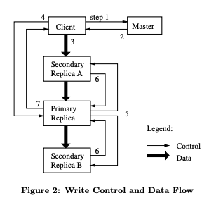
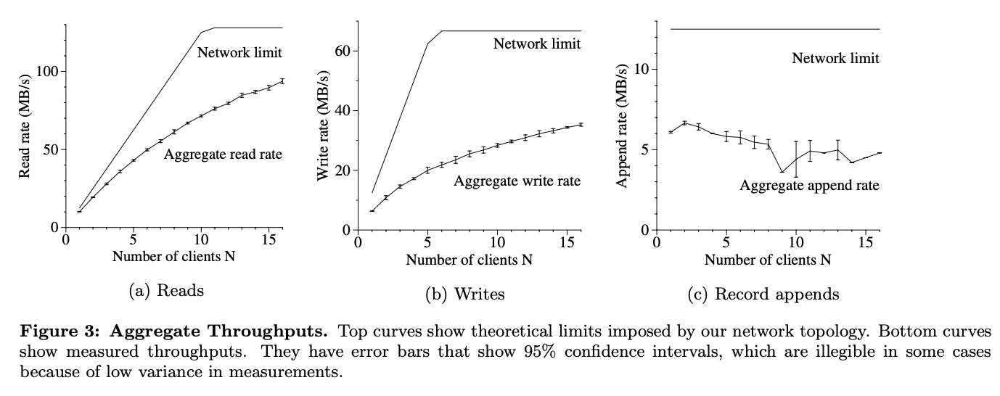
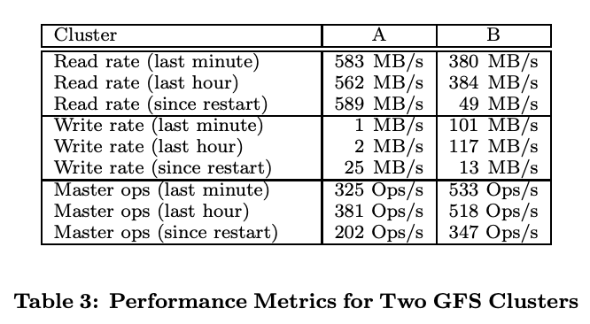
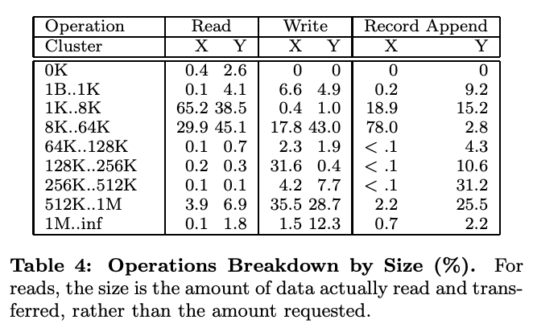
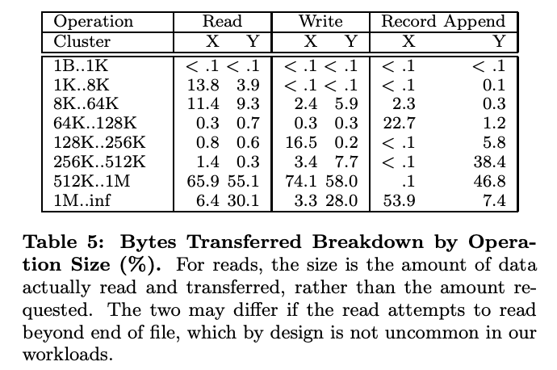
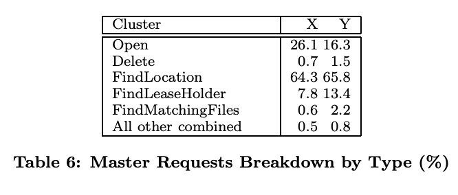

# The Google File System

> Sanjay Ghemawat, Howard Gobioff, and Shun-Tak Leung Google∗ 2003

## 目录
* [ABSTRACT](#abstract)
* [1. INTRODUCTION](#1-introduction)
* [2. DESIGN OVERVIEW](#2-design-overview)
    * [2.1 Assumptions](#21-assumptions)
    * [2.2 Interface](#22-interface)
    * [2.3 Architecture](#23-architecture)
    * [2.4 Single Master](#24-single-master)
    * [2.5 Chunk Size](#25-chunk-size)
    * [2.6 Metadata](#26-metadata)
        * [2.6.1 In-Memory Data Structures](#261-in-memory-data-structures)
        * [2.6.2 Chunk Locations](#262-chunk-locations)
        * [2.6.3 Operation Log](#263-operation-log)
    * [2.7 Consistency Model](#27-consistency-model)
        * [2.7.1 Guarantees by GFS](#271-guarantees-by-gfs)
        * [2.7.2 Implications for Applications](#272-implications-for-applications)
* [3. SYSTEM INTERACTION](#3-system-interaction)
    * [3.1 Leases and Mutation Order](#31-leases-and-mutation-order)
    * [3.2 Data Flow](#32-data-flow)
    * [3.3 Atomic Record Appends](#33-atomic-record-appends)
    * [3.4 Snapshot](#34-snapshot)
* [4. MASTER OPERATION](#4-master-operation)
    * [4.1 Namespace Management and Locking](#41-namespace-management-and-locking)
    * [4.2 Replica Placement](#42-replica-placement)
    * [4.3 Creation, Re-replication, Rebalancing](#43-creation-re-replication-rebalancing)
    * [4.4 Garbage Collection](#44-garbage-collection)
        * [4.4.1 Mechanism](#441-mechanism)
        * [4.4.2 Discussion](#442-discussion)
    * [4.5 Stale Replica Detection](#45-stale-replica-detection)
* [5. FAULT TOLERANCE AND DIAGNOSIS](#5-fault-tolerance-and-diagnosis)
    * [5.1 High Availability](#51-high-availability)
        * [5.1.1 Fast Recovery](#511-fast-recovery)
        * [5.1.2 Chunk Replication](#512-chunk-replication)
        * [5.1.3 Master Replication](#513-master-replication)
    * [5.2 Data Integrity](#52-data-integrity)
    * [5.3 Diagnostic Tools](#53-diagnostic-tools)
* [6. MEASUREMENTS](#6-measurements)
    * [6.1 Micro-benchmarks](#61-micro-benchmarks)
        * [6.1.1 Reads](#611-reads)
        * [6.1.2 Writes](#612-writes)
        * [6.1.3 Record Appends](#613-record-appends)
    * [6.2 Real World Clusters](#62-real-world-clusters)
        * [6.2.1 Storage](#621-storage)
        * [6.2.2 Metadata](#622-metadata)
        * [6.2.3 Read and Write Rates](#623-read-and-write-rates)
        * [6.2.4 Master Load](#624-master-load)
        * [6.2.5 Recovery Time](#625-recovery-time)
    * [6.3 Workload Breakdown](#63-workload-breakdown)
        * [6.3.1 Methodology and Caveats](#631-methodology-and-caveats)
        * [6.3.2 Chunkserver Workload](#632-chunkserver-workload)
        * [6.3.3 Appends versus Writes](#633-appends-versus-writes)
        * [6.3.4 Master Workload](#634-master-workload)
* [7. EXPERIENCES](#7-experiences)
* [8. RELATED WORK](#8-related-work)
* [9. CONCLUSIONS](#9-conclusions)
* [ACKNOWLEDGMENTS](#acknowledgments)

## ABSTRACT

我们设计并实现了 Google File System（GFS），这是一种面向大规模分布式、数据密集型应用的可扩展分布式文件系统。GFS 运行在廉价的通用硬件之上，能够在提供容错能力的同时，为大量客户端提供高聚合性能。

尽管在目标上与以往的分布式文件系统有诸多相似之处，但我们的设计主要受应用工作负载以及当前与可预期技术环境的观察所驱动，而这些观察与早期文件系统所基于的一些假设存在显著差异。这促使我们重新审视传统设计选择，并探索在设计空间中截然不同的取舍点。

该文件系统已经成功满足了我们的存储需求。它已在 Google 内部得到广泛部署，作为支撑公司各项服务中数据生成与处理的存储平台，同时也服务于需要处理大规模数据集的研究与开发工作。迄今为止，最大的集群在一千多台机器上、跨越数千块磁盘，提供了数百 TB 的存储容量，并且可被数百个客户端并发访问。

本文介绍了为支持分布式应用而设计的文件系统接口扩展，讨论了系统设计的诸多方面，并报告了来自微基准测试以及真实生产环境使用的测量结果。

## 1. INTRODUCTION

我们设计并实现了 Google File System（GFS），以满足 Google 数据处理需求快速增长的要求。GFS 在性能、可扩展性、可靠性和可用性等方面与以往的分布式文件系统具有许多相同的目标。然而，其设计主要源于我们对应用工作负载以及当前与可预期技术环境的若干关键观察，而这些观察在很大程度上背离了早期文件系统的一些设计假设。基于此，我们重新审视了传统设计选择，并探索了设计空间中截然不同的取舍点。

首先，组件失效是常态而非例外。该文件系统由数百甚至上千台存储机器构成，这些机器基于廉价的通用硬件部件搭建，并由数量相当的客户端机器进行访问。组件在数量和质量上的客观现实几乎可以保证：在任何时刻，都会有部分组件处于不可用状态，且其中一些无法从当前的故障中恢复。我们已经观察到由应用程序缺陷、操作系统缺陷、人为错误以及磁盘、内存、连接器、网络和电源等硬件故障引发的问题。因此，持续监控、错误检测、容错机制以及自动恢复能力必须成为系统设计中不可或缺的组成部分。

其次，与传统标准相比，文件规模极其庞大。多 GB 级别的文件十分常见。每个文件通常包含大量应用对象，例如网页文档。当我们经常需要处理由数十 TB、包含数十亿对象且持续快速增长的数据集时，即便文件系统在技术上能够支持，管理数十亿个近似 KB 级别的小文件也会变得极其笨拙。因此，诸如 I/O 操作方式和块大小等设计假设与参数都必须重新加以审视。

第三，大多数文件的修改方式是追加新数据，而非覆盖已有数据。文件内部的随机写操作几乎不存在。文件一旦写入，之后通常只被读取，而且往往是顺序读取。多种类型的数据都具有这一特性：有的构成大型数据仓库，供数据分析程序顺序扫描；有的作为由运行中应用持续生成的数据流；有的作为归档数据；还有的作为在一台机器上生成、并在另一台机器上（可能是同时或稍后）处理的中间结果。在这种针对超大文件的访问模式下，系统性能优化与原子性保证的重点自然集中在追加操作上，而在客户端缓存数据块的吸引力则显著降低。

第四，应用程序与文件系统 API 的协同设计能够通过提升系统整体灵活性而带来显著收益。例如，我们有意放宽了 GFS 的一致性模型，从而在不对应用程序施加过重负担的前提下，大幅简化了文件系统的设计。此外，我们还引入了一种原子追加（atomic append）操作，使得多个客户端可以在无需彼此额外同步的情况下并发地向同一文件追加数据。上述机制将在本文后续部分中作更为详细的讨论。

目前，多个 GFS 集群已针对不同用途投入运行。其中规模最大的集群包含 1000 余个存储节点、超过 300 TB 的磁盘存储容量，并且在持续运行过程中由分布在不同机器上的数百个客户端进行高强度并发访问。

## 2. DESIGN OVERVIEW

### 2.1 Assumptions

在为满足自身需求而设计文件系统的过程中，我们受到一系列既带来挑战又蕴含机遇的假设条件的指导。前文已提及其中若干关键观察，现对这些设计假设作更为系统和详细的阐述：

* 系统由大量廉价的通用硬件组件构成，而这些组件频繁发生故障。因此，系统必须能够持续进行自我监控，并在日常运行中及时检测、容忍并快速从组件故障中恢复。

* 系统存储的是数量适中但规模巨大的文件。我们预计文件数量为数百万级，每个文件通常大小在 100 MB 或以上。多 GB 级文件是常态，必须得到高效管理。系统需要支持小文件，但无需针对小文件进行性能优化。

* 工作负载主要由两类读操作构成：大规模流式读与小规模随机读。在流式读中，单次操作通常读取数百 KB 的数据，更常见的是 1 MB 或以上；来自同一客户端的连续读操作往往顺序访问文件中的连续区域。小规模随机读则通常在任意偏移位置读取数 KB 数据。对性能敏感的应用往往会对这些小规模读请求进行批处理和排序，使访问模式尽量向顺序扫描演进，而非频繁来回跳转。

* 工作负载同样包含大量顺序写入，且主要表现为对文件的追加操作。写操作的典型规模与读操作相近。文件一旦写入完成，便很少再被修改。系统支持在文件任意位置进行小规模写入，但不要求其具备高效率。

* 系统必须为多个客户端并发向同一文件追加数据提供高效且语义明确的支持。文件常被用作生产者—消费者队列或多路合并的中间结果。可能有数百个生产者（通常每台机器运行一个）同时向同一文件追加数据。在这种场景下，以最小同步开销实现原子性保证至关重要。文件既可能在追加完成后被读取，也可能在追加过程中被消费者同时顺序读取。

* 持续的高带宽比低延迟更为重要。我们的大多数目标应用更关注以高吞吐率批量处理数据，而极少对单次读写操作的响应时间提出严格要求。

> 注：组件故障是常态而非例外，保证容错能力是系统设计的关键；支持小文件，但小文件的性能优化不是重点，绝大部分文件都是大文件；工作负载主要由两类读操作构成：大规模流式读与小规模随机读；工作负载同样包含大量顺序写入，且主要表现为对文件的追加操作；系统必须为多个客户端并发向同一文件追加数据提供高效且语义明确的支持（排他锁租约，追加内容落盘后再更新元数据文件长度保证原子性）；持续的高带宽比低延迟更为重要。

### 2.2 Interface

GFS 提供了一个熟悉的文件系统接口，尽管它并未实现诸如 POSIX 之类的标准 API。文件以分层目录结构进行组织，并通过路径名进行标识。系统支持常见的文件操作，包括创建、删除、打开、关闭、读和写。

此外，GFS 还提供了快照（snapshot）和记录追加（record append）操作。快照能够以较低的成本创建一个文件或整个目录树的副本。记录追加允许多个客户端并发地向同一个文件追加数据，同时保证每个客户端追加操作的原子性。该机制对于实现多路归并结果以及生产者—消费者队列非常有用，在这些场景中，多个客户端可以同时向同一文件追加数据，而无需额外的锁机制。我们发现，这类文件在构建大型分布式应用时具有极高的价值。快照和记录追加操作分别在第 3.4 节和第 3.3 节中作进一步讨论。

> 注：HDFS 的实现并不支持同一文件并发写入。 

### 2.3 Architecture

一个 GFS 集群由一个主服务器（master）和多个块服务器（chunkserver）组成，并由多个客户端进行访问，如 Figure 1 所示。它们通常都是运行用户态服务器进程的通用 Linux 机器。在机器资源允许、且可以接受由于运行可能不够稳定的应用代码而带来的可靠性下降的情况下，在同一台机器上同时运行 chunkserver 和 client 是很容易的。

文件被划分为固定大小的块（chunk）。每个块在创建时由 master 分配一个不可变且全局唯一的 64 位块句柄（chunk handle）。Chunkserver 将块以 Linux 文件的形式存储在本地磁盘上，并根据给定的块句柄和字节范围对块数据进行读写。为提高可靠性，每个块都会在多个 chunkserver 上进行副本存储。默认情况下，我们为每个块保存三个副本，不过用户也可以为文件命名空间中的不同区域指定不同的副本数。

Master 维护所有文件系统的元数据，包括命名空间、访问控制信息、文件到块的映射关系以及块的当前位置信息。它还负责系统范围内的活动控制，例如块租约（chunk lease）管理、孤立块的垃圾回收，以及块在不同 chunkserver 之间的迁移。Master 会定期通过心跳（Heartbeat）消息与每个 chunkserver 通信，向其下发指令并收集其状态信息。

链接到每个应用程序中的 GFS 客户端代码实现了文件系统 API，并代表应用程序与 master 和 chunkserver 通信以完成数据的读写操作。客户端仅在元数据操作时与 master 交互，而所有承载实际数据的通信都直接与 chunkserver 进行。由于 GFS 并未提供 POSIX API，因此也无需挂接到 Linux 的 vnode 层。

无论是客户端还是 chunkserver 都不会缓存文件数据。客户端缓存带来的收益很小，因为大多数应用都是顺序扫描超大文件，或者其工作集规模大到无法被有效缓存。不进行数据缓存可以消除缓存一致性问题，从而简化客户端及整个系统的设计（但客户端会缓存元数据）。Chunkserver 也无需缓存文件数据，因为块是以本地文件的形式存储的，Linux 的缓冲区缓存机制已经能够将频繁访问的数据保存在内存中。

### 2.4 Single Master

采用单一 master 极大地简化了系统设计，并使 master 能够利用其掌握的全局信息，对块的放置与副本策略做出较为复杂而有效的决策。然而，必须尽量减少 master 在读写路径中的参与，以避免其成为系统瓶颈。客户端从不通过 master 直接读写文件数据，而是先向 master 询问应当联系哪些 chunkserver。客户端会将这些信息缓存一段有限的时间，在随后的多次操作中直接与相应的 chunkserver 进行交互。

下面结合 Figure 1 说明一次简单读操作的交互过程。首先，客户端利用固定的块大小，将应用程序指定的文件名和字节偏移量转换为该文件中的一个块索引（chunk index）。随后，客户端向 master 发送一个请求，其中包含文件名和块索引。Master 返回对应的块句柄（chunk handle）以及该块各个副本所在的位置。客户端以文件名和块索引为键对这些信息进行缓存。

接下来，客户端向其中一个副本发送读请求，通常会选择网络距离最近的副本。该请求中包含块句柄以及块内的一个字节范围。只要缓存的信息未过期或文件未被重新打开，对同一块的后续读取操作就不再需要与 master 进行交互。事实上，客户端通常会在一次请求中查询多个块的信息，而 master 也可以在响应中一并返回紧随其后的若干块的相关信息。以几乎可以忽略的额外开销换取这些附加信息，可以有效避免未来多次客户端与 master 之间的交互。

### 2.5 Chunk Size

块大小（chunksize）是一个关键的设计参数。我们选择了 64 MB，这一大小远大于典型文件系统的块大小。每个块副本在 chunkserver 上都以普通的 Linux 文件形式存储，并且仅在需要时才进行扩展。通过延迟空间分配，可以避免由于内部碎片而造成的空间浪费，而内部碎片可能正是采用如此大块大小时最主要的反对理由。

较大的块大小带来了若干重要优势。首先，它减少了客户端与 master 之间的交互需求，因为对同一块的读写操作只需要一次初始的 master 请求来获取块位置信息。对于我们的工作负载而言，这种减少尤为显著，因为应用程序主要以顺序方式读写大文件。即使是在小规模的随机读场景下，客户端也可以较为轻松地缓存一个多 TB 工作集所需的全部块位置信息。其次，由于在较大的块上，客户端更有可能对同一块执行多次操作，因此可以通过在较长时间内保持与 chunkserver 的持久 TCP 连接来减少网络开销。第三，它减少了 master 上存储的元数据规模，从而使我们能够将这些元数据全部保存在内存中，这一点又进一步带来了其他优势，相关内容将在第 2.6.1 节中讨论。

> 注：较大的块可以减少元数据规模，同时减少请求 master 的次数。

另一方面，较大的块大小即使配合延迟空间分配，也存在一定的缺点。一个小文件只包含很少的块，甚至可能只有一个块。当大量客户端同时访问同一个文件时，存储这些块的 chunkserver 可能会成为热点。在实际运行中，热点并未成为主要问题，这是因为我们的应用大多以顺序方式读取包含多个块的大文件。

然而，在 GFS 最初被一个批处理队列系统使用时，确实出现过热点问题：某个可执行文件被写入 GFS，作为一个单块文件存储，然后在数百台机器上同时启动。存储该可执行文件的少数几个 chunkserver 因同时收到数百个请求而出现过载。我们通过为这类可执行文件设置更高的副本数，并让批处理队列系统错开应用启动时间，解决了这一问题。从长远来看，一个潜在的解决方案是在这种场景下允许客户端从其他客户端读取数据。

### 2.6 Metadata

主服务器（master）存储三类主要的元数据：文件与块的命名空间、文件到块的映射关系，以及每个块副本的位置。所有元数据都保存在主服务器的内存中。其中前两类（命名空间以及文件到块的映射）还通过将变更操作记录到操作日志中而被持久化，该日志存储在主服务器的本地磁盘上，并复制到远程机器。采用日志机制使我们能够以简单且可靠的方式更新主服务器状态，并在主服务器发生崩溃时避免产生不一致性。主服务器并不对块位置相关的信息进行持久化存储，而是在主服务器启动时以及每当有 chunkserver 加入集群时，向各个 chunkserver 询问其所存储的块信息。

> 注：只有当一次元数据操作对应的 EditLog 被成功持久化到多数派（quorum） JournalNode 之后，GFS 才会向客户端返回成功。

#### 2.6.1 In-Memory Data Structures

由于元数据存储在内存中，主服务器上的各类操作都非常迅速。此外，主服务器可以方便而高效地在后台周期性地扫描其全部状态。这种周期性扫描被用于实现块的垃圾回收、在 chunkserver 发生故障时的重新复制，以及为了在各个 chunkserver 之间平衡负载和磁盘空间使用而进行的块迁移。第 4.3 节和第 4.4 节将对这些活动作进一步讨论。

这种仅在内存中保存元数据的方法可能引发的一个潜在担忧是：块的数量、进而整个系统的容量，会受到主服务器内存容量的限制。但在实践中，这并不是一个严重的限制。主服务器为每个 64 MB 的块维护的元数据少于 64 字节。由于大多数文件包含多个块，且只有最后一个块可能是部分填充的，因此大多数块都是满的。类似地，文件命名空间的数据通常每个文件也只需要少于 64 字节，因为文件名通过前缀压缩的方式被紧凑地存储。

> 注：HDFS Federation 架构可以缓解单节点内存瓶颈问题。

如果需要支持规模更大的文件系统，为主服务器增加额外内存所带来的成本，相对于将元数据存储在内存中所获得的简洁性、可靠性、性能以及灵活性而言，是完全可以接受的。

#### 2.6.2 Chunk Locations

主服务器并不持久化保存某个块的副本位于哪些 chunkserver 上的信息。相反，它在启动时通过轮询各个 chunkserver 来获取这些信息。此后，由于主服务器负责所有块的放置决策，并通过周期性的 HeartBeat 消息监控 chunkserver 的状态，因此可以持续保持这些信息的更新。

我们最初曾尝试在主服务器上持久化保存块位置（chunk location）信息，但后来发现，在系统启动时以及之后定期向 chunkserver 请求这些数据要简单得多。这样就消除了在 chunkserver 加入或离开集群、名称变化、发生故障、重启等情况下，保持主服务器与各个 chunkserver 状态一致所带来的复杂性。在一个拥有数百台服务器的集群中，这类事件发生得非常频繁。

从另一个角度来看这一设计决策，可以认识到：chunkserver 对其本地磁盘上实际拥有哪些块拥有最终裁决权。试图在主服务器上维护这一信息的一致视图并没有意义，因为 chunkserver 上的错误可能导致块“自行消失”（例如磁盘损坏并被禁用），或者运维人员可能会重命名某个 chunkserver。

#### 2.6.3 Operation Log

操作日志包含了关键元数据变更的历史记录，是 GFS 的核心组成部分。它不仅是元数据唯一的持久化存储形式，同时还充当了一条逻辑时间线，用以定义并发操作的先后顺序。文件和块，以及它们的版本（见第 4.5 节），都由其创建时对应的逻辑时间唯一且永久地标识。

由于操作日志至关重要，我们必须以高度可靠的方式存储它，并且在元数据变更被持久化之前，不能将这些变更对客户端可见。否则，即使块数据本身仍然存在，我们也可能丢失整个文件系统，或至少丢失最近的客户端操作。因此，操作日志会被复制到多台远程机器上，主服务器只有在相应的日志记录同时刷新到本地磁盘和远程磁盘之后，才会对客户端的操作作出响应。主服务器会将多个日志记录**批量处理**后再刷新，从而降低日志刷写和复制对系统整体吞吐量的影响。

主服务器通过重放操作日志来恢复其文件系统状态。为了尽量缩短启动时间，日志必须保持较小规模。当日志增长到超过某一阈值时，主服务器会对自身状态进行一次检查点（checkpoint），以便在恢复时只需从本地磁盘加载最新的检查点，并重放其后的少量日志记录即可。检查点采用一种紧凑的、类似 B 树的形式，可以直接映射到内存中，并在无需额外解析的情况下用于命名空间查找。这进一步加快了恢复过程并提高了系统的可用性。

由于构建检查点可能需要一定时间，主服务器的内部状态被设计为可以在不中断正在进行的元数据变更操作的情况下创建新的检查点。主服务器会切换到一个新的日志文件，并在一个独立的线程中生成新的检查点。该检查点包含切换之前的所有变更。在一个包含数百万个文件的集群中，生成检查点通常只需一分钟左右。完成后，检查点会同时写入本地磁盘和远程磁盘。

在恢复过程中，只需要最新的一个完整检查点以及其后的日志文件。更早的检查点和日志文件可以被安全地删除，不过我们通常会保留少量旧文件以防止灾难性故障。即使在创建检查点的过程中发生失败，也不会影响系统的正确性，因为恢复代码能够检测并跳过不完整的检查点。

> 注：操作日志保证了文件创建的顺序性，同时保障了元数据的持久化和一致性。

### 2.7 Consistency Model

GFS 采用了一种较为宽松的一致性模型，这种模型能够很好地支持高度分布式的应用，同时在实现上仍然保持相对的简单性和高效性。下面我们将讨论 GFS 所提供的一致性保证及其对应用程序的含义，并概述 GFS 是如何维持这些保证的，具体实现细节则留待论文的其他部分展开说明。

#### 2.7.1 Guarantees by GFS

文件命名空间的变更（例如文件创建）是原子的。这类操作完全由主服务器处理：命名空间加锁机制保证了操作的原子性和正确性（见第 4.1 节）；主服务器的操作日志为这些操作定义了一个全局的全序关系（见第 2.6.3 节）。

一次数据变更之后，文件某个区域所处的状态取决于变更的类型、该变更是成功还是失败，以及是否存在并发变更。Table 1 对这些结果进行了总结。如果一个文件区域是“一致的”，则无论客户端从哪个副本读取，都会始终看到相同的数据。若一个文件区域在数据变更之后是“一致的”，并且客户端能够完整地看到该变更写入的内容，则称该区域是“已定义的”。当一次数据变更在没有并发写入干扰的情况下成功完成时，受影响的区域就是已定义的（并且由此可知也是一致的）：所有客户端都会看到该变更写入的内容。并发的成功变更会使该区域处于“未定义但一致”的状态：所有客户端看到的数据是相同的，但这些数据未必完全对应于任何一次单独变更所写入的内容，通常由多个变更写入的片段混合而成。一次失败的变更会使该区域变为“不一致”（因此也必然是未定义的）：不同客户端在不同时间可能看到不同的数据。下面我们将说明应用程序如何区分已定义区域与未定义区域；应用程序无需进一步区分未定义区域的不同类型。

> 注: HDFS 不支持并发写入同一个文件。

数据变更可以是写入（write）或记录追加（record append）。写入操作会在应用程序指定的文件偏移处写入数据。记录追加操作则会在存在并发变更的情况下，保证将数据（即“记录”）以原子方式至少追加一次，但其偏移位置由 GFS 自行决定（见第 3.3 节）。（相比之下，“普通”追加只是一次写入操作，写入位置是客户端认为的当前文件末尾。）该偏移会返回给客户端，并标记一个已定义区域的起始位置，该区域包含这条记录。此外，GFS 可能会在中间插入填充数据或重复的记录，它们占据的区域被视为不一致区域，且其规模通常远小于用户数据本身。

在一系列成功的数据变更之后，被修改的文件区域可以保证是已定义的，并且包含最后一次变更写入的数据。GFS 通过以下两点来实现这一保证：(a) 在所有副本上以相同的顺序对某个块应用变更（见第 3.1 节）；(b) 使用块版本号来检测那些由于其所在的 chunkserver 宕机而错过变更、从而变得过期的副本（见第 4.5 节）。过期副本不会再参与任何变更操作，也不会被返回给向主服务器请求块位置的客户端，并会在最早的时机被垃圾回收。

由于客户端会缓存块位置信息，它们在这些信息刷新之前，可能会从一个过期副本中读取数据。这个时间窗口受到缓存项超时时间以及下一次打开该文件操作的限制，后者会从缓存中清除该文件的所有块信息。此外，由于大多数文件是只追加的，过期副本通常只会返回一个过早的块结束标记，而不是过期的数据。当读者重试并联系主服务器时，会立即获得最新的块位置信息。

即使在一次成功的数据变更很久之后，组件故障仍然可能破坏或丢失数据。GFS 通过主服务器与所有 chunkserver 之间的定期握手来识别失效的 chunkserver，并通过校验和来检测数据损坏（见第 5.2 节）。一旦发现问题，系统会尽快从有效副本中恢复数据（见第 4.3 节）。只有在 GFS 作出反应之前（通常在几分钟内），某个块的所有副本都同时丢失时，该块才会不可逆地丢失。即便在这种情况下，数据也只是不可用，而不会被破坏：应用程序会收到明确的错误信息，而不是损坏的数据。

#### 2.7.2 Implications for Applications

GFS 应用程序可以通过一些简单的技术来适应这种宽松的一致性模型，而这些技术本身在其他场景下也早已是必需的：依赖追加而非覆盖写、使用检查点，以及写入自校验、自标识的记录。

> 注：GFS提供宽松的一致性，对任意文件区域，系统只保证副本间一致，但不保证该一致内容一定对应某一次单独的数据变更。一致性保证弱于 POSIX 语义。

几乎所有应用对文件的修改都是通过追加而不是覆盖完成的。在一种典型用法中，写入程序从文件开头到结尾顺序生成内容，在写完所有数据后，会以原子方式将文件重命名为永久名称，或者定期对已经成功写入的部分进行检查点记录。检查点还可以包含应用层的校验和。读取程序只验证并处理截至最近一次检查点的文件区域，因为该区域被认为处于已定义状态。无论存在怎样的一致性或并发问题，这种方式在实践中都运行良好。与随机写相比，追加操作在效率上更高，也更能抵御应用程序故障；而检查点机制则允许写入程序以增量方式重启，并防止读取程序处理那些虽然已经写入文件、但从应用角度看仍不完整的数据。

在另一种典型用法中，多个写入程序会并发地向同一个文件追加数据，用于合并结果或作为生产者—消费者队列。记录追加的“至少追加一次”语义保证了每个写入程序的输出都会被保留下来。读取程序通过以下方式处理偶尔出现的填充和重复记录：写入程序生成的每条记录都包含额外的信息（如校验和），以便验证其有效性；读取程序可以利用这些校验和识别并丢弃多余的填充数据和记录片段。如果应用无法容忍偶发的重复（例如这些重复会触发非幂等操作），则可以通过记录中的唯一标识符将其过滤掉，而这些标识符通常本来就需要用于命名相应的应用实体，如网页文档。上述记录 I/O 的功能（除重复消除外）由应用共享的库代码提供，并且同样适用于 Google 内部其他文件接口实现。借助这些机制，记录读取程序总是能够接收到同一序列的记录，只是可能伴随少量的重复。

> 注：GFS 不通过强化文件系统一致性来保证正确性，而是通过“追加写 + 检查点 + 自校验记录”的应用模式，使得即使在并发和失败条件下，应用仍能获得可预测、可恢复且高效的行为。

## 3. SYSTEM INTERACTION

我们在设计该系统时，力求将主节点在各类操作中的参与程度降到最低。在此背景下，下面将说明客户端、主节点以及块服务器如何协同工作，以实现数据变更、原子记录追加以及快照功能。

### 3.1 Leases and Mutation Order

一次变更（mutation）是指对某个 chunk 的内容或元数据产生修改的操作，例如写入（write）或追加（append）。每一次变更都会在该 chunk 的所有副本上执行。为保证各副本之间的变更顺序一致，GFS 使用了租约（lease）机制。

主节点会将某个 chunk 的租约授予其中一个副本，该副本被称为主副本（primary）。主副本负责为该 chunk 上发生的所有变更操作选择一个串行顺序。所有副本在应用变更时都严格遵循这一顺序。因此，全局的变更顺序首先由主节点选择的租约授予顺序决定，而在同一个租约期间内，则由主副本分配的序列号来确定。

租约机制的设计目标是尽量降低主节点的管理开销。每个租约的初始超时时间为 60 秒。然而，只要该 chunk 仍在被频繁修改，主副本就可以向主节点请求租约续期，并且通常可以无限期地获得批准。这些续期请求与批准并不会引入额外通信开销，而是捎带（piggyback）在主节点与各个 chunkserver 之间周期性交换的 HeartBeat 消息中完成的。

在某些情况下，主节点可能会在租约到期之前主动尝试回收租约（例如，当主节点需要在文件重命名期间禁止对该文件进行变更时）。即便主节点与当前主副本失去通信，只要旧租约到期，主节点也可以安全地将新的租约授予另一个副本。

在 Figure 2 中，我们通过编号步骤跟踪一次写操作的控制流，以示意这一过程的具体执行方式。

1. 客户端向主服务器询问：哪个 chunkserver 当前持有该 chunk 的租约，以及其他副本所在的位置。如果当前没有任何副本持有租约，主服务器会将租约授予其选择的某个副本（图中未示出）。

2. 主服务器返回主副本（primary）的身份以及其他（次要，secondary）副本的位置。客户端将这些信息缓存起来，以便后续的变更操作使用。只有当主副本变得不可达，或返回其已不再持有租约时，客户端才需要再次联系主服务器。

3. 客户端将数据推送到所有副本。推送的顺序可以是任意的。每个 chunkserver 都会将数据存放在其内部的 LRU 缓冲缓存中，直到数据被实际使用或因老化而被淘汰。通过将数据流与控制流解耦，可以根据网络拓扑来调度开销较大的数据传输过程，而不必关心哪个 chunkserver 是主副本，从而提升性能。第 3.2 节将对此作进一步讨论。

4. 当所有副本都确认已接收到数据后，客户端向主副本发送写请求。该请求标识之前已经推送到所有副本的数据。主副本会为其接收到的所有变更（可能来自多个客户端）分配连续的序列号，从而提供所需的串行化保证，并按照序列号顺序将变更应用到自身的本地状态中。

5. 主副本将写请求转发给所有次要副本。每个次要副本都按照主副本分配的相同序列号顺序来应用这些变更。

6. 所有次要副本向主副本回复，表明它们已经完成了该操作。

7. 主副本向客户端回复。在任意副本上遇到的错误都会被报告给客户端。如果发生错误，写操作可能已经在主副本以及任意子集的次要副本上成功执行。（如果在主副本上失败，则该操作不会被分配序列号，也不会被转发。）此时客户端请求被视为失败，被修改的区域处于不一致状态。客户端代码通过重试失败的变更来处理此类错误：它会对步骤（3）到（7）进行若干次重试，如果仍然失败，则退回到从写操作开始处重新尝试。

如果应用程序发起的写操作规模较大，或者跨越了 chunk 边界，GFS 客户端代码会将其拆分为多个写操作。这些写操作都遵循上述控制流程，但可能会与来自其他客户端的并发操作相互交错，甚至被其覆盖。因此，共享的文件区域最终可能包含来自不同客户端的片段。尽管如此，由于各个独立的写操作在所有副本上都按照相同的顺序成功完成，各副本之间仍然保持一致。正如第 2.7 节所述，这种情况会使该文件区域处于一致但未定义的状态。

### 3.2 Data Flow

我们将数据流与控制流解耦，以高效利用网络资源。控制流从客户端到主副本，再到所有次副本；而数据则以流水线方式，沿着一条经过精心选择的 chunkserver 链线性地推送。我们的目标是充分利用每台机器的网络带宽，避免网络瓶颈和高延迟链路，并尽量缩短完成全部数据推送所需的时间。

为了充分利用每台机器的网络带宽，数据沿着一条 chunkserver 链线性传输，而不是采用其他拓扑结构（例如树形结构）。这样，每台机器的出站带宽都可以被完全用于尽可能快速地传输数据，而不是在多个接收方之间被分割。

为了尽可能避免网络瓶颈和高延迟链路（例如交换机之间的链路通常同时具备这两种特性），每台机器都会将数据转发给在网络拓扑中尚未接收数据、且与其“距离”最近的那台机器。假设客户端需要向 chunkserver S1 到 S4 推送数据，它首先将数据发送给距离最近的 chunkserver，例如 S1。随后，S1 再将数据转发给在 S2 到 S4 中距离 S1 最近的 chunkserver，例如 S2。类似地，S2 再将数据转发给 S3 或 S4 中距离 S2 最近的一个，如此继续。我们的网络拓扑结构足够简单，可以根据 IP 地址准确估计这种“距离”。

最后，我们通过在 TCP 连接上对数据传输进行流水线化来最小化延迟。一旦某个 chunkserver 接收到部分数据，它就立即开始向下游转发。流水线机制对我们尤其有效，因为我们使用的是带有全双工链路的交换网络，立即发送数据不会降低接收速率。在没有网络拥塞的情况下，将 $B$ 字节数据传输到 $R$ 个副本的理想耗时为 $B/T + \tilde{R}L$，其中 $T$ 表示网络吞吐率 $L$ 表示两台机器之间传输数据的延迟。我们的网络链路通常为 100 Mbps（即 $T$），而 $L$ 远小于 1 ms。因此，理想情况下，分发 1 MB 数据大约需要 80 ms。

### 3.3 Atomic Record Appends

GFS 提供了一种称为 **record append（记录追加）** 的原子追加操作。在传统写操作中，客户端需要指定数据写入的文件偏移量；当多个客户端并发地向同一文件区域写入时，这些写操作无法串行化，最终该区域可能包含来自多个客户端的数据片段。相比之下，在 record append 中，客户端只需提供要写入的数据本身。GFS 会在其自行选择的文件偏移处，将该数据至少一次、以原子方式（即作为一段连续的字节序列）追加到文件中，并将该偏移量返回给客户端。这一语义类似于在 Unix 中以 O_APPEND 模式打开文件并进行写入，但避免了多个写入者并发追加时所产生的竞态条件。

记录追加在我们的分布式应用中被大量使用，这类应用通常运行在不同机器上的多个客户端会并发地向同一个文件追加数据。如果使用传统写操作，客户端就必须引入额外而复杂、且代价高昂的同步机制，例如通过分布式锁管理器来实现。在我们的工作负载中，这类文件通常充当多生产者 / 单消费者队列，或用于存放来自多个不同客户端的合并结果。

Record append 属于一种变更操作（mutation），其基本控制流程与第 3.1 节所述相同，只是在主副本处增加了少量额外逻辑。客户端首先将数据推送到该文件最后一个 chunk 的所有副本上，然后向主副本发送请求。主副本检查将该记录追加到当前 chunk 后是否会导致该 chunk 超过最大大小（64 MB）。如果会超过，则主副本将该 chunk 填充至最大大小，并通知所有次副本执行相同操作，同时向客户端返回响应，指示其在下一个 chunk 上重试该操作。（为了将最坏情况下的内部碎片控制在可接受范围内，record append 的大小被限制为不超过最大 chunk 大小的四分之一。）如果记录可以容纳在当前 chunk 的最大大小之内（这是最常见的情况），主副本便将数据追加到自身副本中，并指示所有次副本在与其完全相同的偏移处写入数据，最后向客户端返回成功。

如果某次 record append 在任意一个副本上失败，客户端就会重试该操作。因此，同一 chunk 的不同副本中可能包含不同的数据，其中可能包括同一记录的重复内容（无论是完整的还是部分的）。GFS 并不保证所有副本在字节级别上完全一致；它只保证数据至少一次以原子单元的形式被写入。之所以能够满足这一性质，是因为只有在数据已经在某个 chunk 的所有副本上、以相同偏移成功写入之后，该操作才会向客户端报告成功。进一步地，在此之后，所有副本的长度至少都会达到该记录的末尾，因此任何后续记录都会被分配到更高的偏移量，或者被写入到不同的 chunk 中，即使之后由不同的副本成为主副本也是如此。

从一致性保证的角度来看，成功完成 record append 操作并写入数据的那些文件区域是已定义的（因此也是一致的）；而位于这些区域之间的填充区或重复区则是不一致的（因此是未定义的）。正如第 2.7.2 节所讨论的那样，我们的应用能够正确地处理这些不一致区域。

### 3.4 Snapshot

快照（snapshot）操作可以在几乎瞬时的时间内对一个文件或一个目录树（“源”）创建副本，同时尽量减少对正在进行的数据变更操作的干扰。我们的用户利用该机制，可以快速地为规模巨大的数据集创建分支副本（而且往往会递归地对这些副本再进行复制），或者在尝试性修改之前对当前状态进行检查点保存，以便之后能够方便地提交或回滚这些修改。

与 AFS［5］类似，我们采用标准的写时复制（copy-on-write）技术来实现快照。当主服务器接收到一个快照请求时，它首先撤销即将被快照的文件中所有 chunk 上尚未到期的租约。这一操作确保了对这些 chunk 的任何后续写入都必须再次与主服务器交互以获取租约持有者，从而为主服务器在写入发生之前创建新的 chunk 副本提供机会。

在相关租约被撤销或自然过期之后，主服务器会将该快照操作记录到磁盘日志中。随后，它将这条日志记录应用到自身的内存状态中，具体方式是复制源文件或源目录树的元数据。新创建的快照文件最初指向与源文件相同的 chunk。

在快照操作完成之后，当某个客户端第一次试图写入某个 chunk C 时，它会向主服务器发送请求以查找当前的租约持有者。主服务器注意到 chunk C 的引用计数大于 1，于是暂缓对客户端请求的响应，并改为选择一个新的 chunk 句柄 C′。随后，主服务器要求所有持有 chunk C 当前副本的 chunkserver 各自创建一个名为 C′ 的新 chunk。通过在与原始 chunk 相同的 chunkserver 上创建新 chunk，可以保证数据在本地磁盘上完成复制，而不需要通过网络传输（我们的磁盘带宽大约是 100 Mb 以太网链路的三倍）。从这一时刻起，请求的处理方式与普通 chunk 完全相同：主服务器为新 chunk C′ 的某个副本授予租约并回复客户端，客户端随后即可像往常一样对该 chunk 进行写入，而无需意识到它实际上是从一个已有 chunk 复制而来的。

## 4. MASTER OPERATION

主服务器负责执行所有命名空间操作。此外，它还对整个系统中的 chunk 副本进行管理：包括作出副本放置决策、创建新的 chunk 及其相应副本，并协调各种系统范围内的活动，以确保 chunk 始终保持充分复制、在各个 chunkserver 之间实现负载均衡，以及回收未被使用的存储空间。下面我们将分别讨论这些方面的内容。

### 4.1 Namespace Management and Locking

许多主服务器操作可能耗时较长。例如，快照操作需要撤销快照所覆盖的所有 chunk 上的 chunkserver 租约。我们不希望在这些操作执行期间阻塞其他主服务器操作。因此，GFS 允许多个操作同时处于活动状态，并通过在命名空间的不同区域上加锁来保证正确的串行化。

与许多传统文件系统不同，GFS 并不存在一种按目录维护、用于列出该目录下所有文件的数据结构；同时，它也不支持同一文件或目录的别名（即 Unix 语义中的硬链接或符号链接）。在逻辑上，GFS 将其命名空间表示为一张从完整路径名到元数据的查找表。通过前缀压缩，该表可以高效地存放在内存中。命名空间树中的每一个节点（无论是绝对路径的文件名还是绝对路径的目录名）都关联一个读写锁。

每个主服务器操作在执行之前都会获取一组锁。通常，如果一个操作涉及路径 /d1/d2/.../dn/leaf，它会在目录名 /d1、/d1/d2、……、/d1/d2/.../dn 上获取读锁，并在完整路径名 /d1/d2/.../dn/leaf 上获取读锁或写锁。需要注意的是，leaf 可能是文件，也可能是目录，具体取决于操作的类型。

下面通过一个示例说明该加锁机制如何防止在对 /home/user 执行快照到 /save/user 的过程中创建文件 /home/user/foo。快照操作会在 /home 和 /save 上获取读锁，并在 /home/user 和 /save/user 上获取写锁；而文件创建操作会在 /home 和 /home/user 上获取读锁，并在 /home/user/foo 上获取写锁。由于这两个操作都会尝试在 /home/user 上获取互斥的锁，因此它们会被正确地串行化。文件创建操作不需要在父目录上获取写锁，因为系统中并不存在需要保护的“目录”或类 inode 数据结构；在目录名上获取读锁已经足以防止父目录被删除。

这种加锁方案的一个优点在于，它允许在同一目录下进行并发的修改操作。例如，可以在同一目录中并发执行多个文件创建操作：每个操作都在目录名上获取读锁，并在各自的文件名上获取写锁。目录名上的读锁足以防止该目录被删除、重命名或执行快照操作，而文件名上的写锁则用于串行化对同一文件名的重复创建尝试。

由于命名空间中可能包含大量节点，读写锁对象采用按需分配的方式，在不再使用时即被释放。此外，为了防止死锁，锁的获取遵循一个一致的全序：首先按照命名空间树中的层级顺序排序，在同一层级内再按字典序排序。

### 4.2 Replica Placement

GFS 集群在多个层面上都是高度分布式的。一个典型的集群包含数百个分布在多个机器机架上的 chunkserver，而这些 chunkserver 又可能被来自同一机架或不同机架上的数百个客户端访问。位于不同机架上的两台机器之间的通信，可能需要经过一个或多个网络交换机。此外，进入或离开某个机架的带宽，可能低于该机架内所有机器带宽的总和。多层次的分布式结构在可扩展性、可靠性和可用性方面给数据分发带来了独特的挑战。

chunk 副本的放置策略有两个目的：最大化数据的可靠性与可用性，以及最大化网络带宽的利用率。在这两方面，仅仅将副本分散到不同机器上是不够的，因为这只能防范磁盘或单机故障，并充分利用每台机器的网络带宽。我们还必须将 chunk 副本分布到不同的机架上。这样可以确保即使整个机架受损或下线（例如由于网络交换机或供电线路等共享资源的故障），某个 chunk 的部分副本仍然能够存活并保持可用。同时，这也意味着对某个 chunk 的访问流量，尤其是读取操作，可以利用多个机架的聚合带宽。另一方面，写入流量则必须跨越多个机架传输，这是我们在设计中有意接受的一种权衡。

### 4.3 Creation, Re-replication, Rebalancing

chunk 副本的创建有三种原因：chunk 的初次创建、重新复制（re-replication）以及负载均衡（rebalancing）。

当 master 创建一个 chunk 时，它会选择放置初始空副本的位置，并考虑几个因素：（1）我们希望将新副本放在磁盘空间利用率低于平均水平的 chunkserver 上。随着时间推移，这将平衡各个 chunkserver 的磁盘利用率。（2）我们希望限制每台 chunkserver 上“近期”创建的副本数量。虽然创建本身开销很小，但它可以可靠地预测即将到来的大量写入流量，因为 chunk 的创建通常是由写操作触发的，而在我们的 append-once-read-many 工作负载中，一旦写入完成，它们通常会变为几乎只读。（3）如前所述，我们希望将同一个 chunk 的副本分布在不同机架上。

当可用副本数量低于用户设定的目标时，master 会立即重新复制该 chunk。这种情况可能由多种原因引起：某个 chunkserver 不可用，它报告其副本可能损坏，或者其某块磁盘因错误被禁用，亦或是复制目标被提高。需要重新复制的每个 chunk 都会根据多个因素进行优先级排序。其中一个因素是它距离复制目标的差距。例如，丢失两个副本的 chunk 会比只丢失一个副本的 chunk 优先级更高。此外，我们倾向于优先为活跃文件的 chunk 进行重新复制，而不是刚被删除文件的 chunk（见 4.4 节）。最后，为了尽量减少故障对运行中应用的影响，我们会提升任何阻塞客户端操作的 chunk 的优先级。

master 会选择优先级最高的 chunk，并通过指示某个 chunkserver 从现有有效副本直接复制数据来“克隆”它。新副本的放置目标与创建时类似：平衡磁盘空间利用率、限制单个 chunkserver 上的活动克隆操作数量，以及将副本分布在不同机架上。为了防止克隆流量压过客户端流量，master 会限制集群整体及每个 chunkserver 上的活动克隆操作数量。此外，每个 chunkserver 也会通过限制对源 chunkserver 的读取请求来控制其在每个克隆操作上消耗的带宽。

最后，master 会定期对副本进行负载均衡：它检查当前副本分布情况并移动副本，以实现更好的磁盘空间和负载平衡。通过这个过程，master 可以逐步填充新的 chunkserver，而不是立即向其分配大量新 chunk 及随之而来的高写入流量。新副本的放置标准与前面讨论的类似。此外，master 还需要决定删除哪一个现有副本。一般来说，它倾向于删除位于可用空间低于平均水平的 chunkserver 上的副本，以平衡磁盘空间使用情况。

### 4.4 Garbage Collection

在文件被删除之后，GFS 并不会立即回收可用的物理存储空间。它仅在文件级和 chunk 级的常规垃圾回收过程中采用惰性回收。我们发现，这种方法使系统更加简单且可靠。

#### 4.4.1 Mechanism

当应用程序删除一个文件时，master 会像处理其他变更一样立即记录删除操作到日志中。然而，它并不会立即回收资源，而是将文件重命名为一个包含删除时间戳的隐藏名称。在 master 定期扫描文件系统命名空间时，如果这些隐藏文件存在时间超过三天（该时间间隔可配置），它们将被移除。在此之前，文件仍然可以通过这个新的特殊名称被读取，或者通过重命名恢复到原来的名称而被撤销删除。

当隐藏文件从命名空间中被移除时，其内存中的元数据也会被清除，这实际上切断了它与所有 chunk 的关联。

在对 chunk 命名空间的类似定期扫描中，master 会识别孤立的 chunk（即无法通过任何文件访问到的 chunk）并删除这些 chunk 的元数据。在与 master 定期交换的 HeartBeat 消息中，每个 chunkserver 会报告其拥有的部分 chunk，master 则会回复哪些 chunk 不再存在于其元数据中。chunkserver 可以自由地删除这些 chunk 的副本。

#### 4.4.2 Discussion

虽然在编程语言的上下文中分布式垃圾回收是一个复杂的问题，需要复杂的解决方案，但在我们的场景中却相对简单。我们可以轻松地识别所有对 chunk 的引用：它们都存在于由 master 独占维护的文件到 chunk 的映射中。我们也可以轻松地识别所有 chunk 副本：它们都是位于各个 chunkserver 指定目录下的 Linux 文件。任何未被 master 识别的副本都被视为“垃圾”。

这种通过垃圾回收来回收存储的方法，相比即时删除有几个优势。首先，在组件故障常见的大规模分布式系统中，它简单且可靠。chunk 的创建可能在某些 chunkserver 上成功，而在其他服务器上失败，从而留下 master 不知道存在的副本。副本删除消息可能丢失，而 master 需要记住在出现故障（无论是自身还是 chunkserver）时重新发送它们。垃圾回收提供了一种统一且可靠的方式来清理所有未被认定为有用的副本。其次，它将存储回收融入 master 的常规后台活动中，例如对命名空间的定期扫描和与 chunkserver 的握手。因此，回收是批量进行的，成本被摊销。此外，它只在 master 相对空闲时执行，从而使 master 能够更及时地响应需要立即处理的客户端请求。第三，延迟回收存储为意外且不可逆的删除提供了安全保障。

根据我们的经验，主要缺点是延迟有时会影响用户在存储紧张时对使用情况进行精细调控。频繁创建和删除临时文件的应用程序可能无法立即重用存储。我们通过以下方式解决这些问题：如果已删除的文件被显式再次删除，则加快存储回收；同时允许用户对命名空间的不同部分应用不同的副本和回收策略。例如，用户可以指定某个目录树中的所有文件 chunk 不进行副本存储，并且删除的文件立即且不可逆地从文件系统状态中移除。

### 4.5 Stale Replica Detection

如果一个 chunkserver 故障，在其宕机期间错过了对某个 chunk 的更新，该 chunk 的副本可能会变得过时（stale）。为此，master 为每个 chunk 维护一个 chunk 版本号（chunk version number），用于区分最新副本和过时副本。

每当 master 授予某个 chunk 新的 lease 时，它会增加该 chunk 的版本号，并通知所有最新副本。master 和这些副本都会在各自的持久状态中记录新的版本号。这一步发生在通知客户端之前，因此客户端在此之前还不能向该 chunk 写入数据。如果其他副本当前不可用，其版本号不会被更新。当该 chunkserver 重启并上报它所持有的 chunk 及其版本号时，master 会检测到该副本是过时的。如果 master 看到的版本号大于其记录的版本号，它会假设在授予 lease 时该副本曾失败，因此将较高版本号视为最新。

master 会在定期垃圾回收过程中删除过时副本。在此之前，当客户端请求 chunk 信息时，master 实际上会认为过时副本不存在。作为额外的保障措施，master 在告知客户端哪个 chunkserver 持有 chunk lease 或在指示某个 chunkserver 从其他 chunkserver 克隆 chunk 时，会附带该 chunk 的版本号。客户端或 chunkserver 在执行操作时会校验版本号，从而保证始终访问的是最新数据。

## 5. FAULT TOLERANCE AND DIAGNOSIS

在系统设计中，我们面临的最大挑战之一是应对频繁的组件故障。组件的数量与质量共同导致这类问题更常见于常态而非例外：我们既无法完全信任机器，也无法完全信任磁盘。组件故障可能导致系统不可用，或者更严重的情况——数据损坏。我们将在下文讨论如何应对这些挑战，以及系统中为在故障不可避免时诊断问题而构建的工具。

### 5.1 High Availability

在 GFS 集群中的数百台服务器中，总有一些在任意时刻不可用。我们通过两种简单而有效的策略——快速恢复与数据副本——来保持整个系统的高可用性。

#### 5.1.1 Fast Recovery

无论以何种方式终止，主服务器和块服务器都被设计为能够在几秒钟内恢复其状态并重新启动。实际上，我们并不区分正常终止与异常终止；服务器通常只是通过杀掉进程来关闭。客户端和其他服务器在等待的请求超时、重新连接到重启的服务器并重试时，会经历短暂的中断。第 6.2.2 节报告了实际观察到的启动时间。

#### 5.1.2 Chunk Replication

如前所述，每个块都会在不同机架的多个块服务器上进行副本存储。用户可以为文件命名空间的不同部分指定不同的副本级别，默认值为三。主服务器根据需要克隆已有副本，以在块服务器下线或通过校验和验证发现副本损坏时，保持每个块的完整副本（参见第 5.2 节）。尽管副本机制已能很好地满足我们的需求，但针对日益增长的只读存储需求，我们正在探索其他形式的跨服务器冗余，例如奇偶校验或擦除码。我们预计，在我们的松耦合系统中实现这些更复杂的冗余方案具有一定挑战性，但仍可管理，因为系统流量主要由追加写入和读取构成，而非小规模随机写入。

#### 5.1.3 Master Replication

主服务器的状态通过副本机制进行复制以提高可靠性。其操作日志和检查点会在多台机器上保存。只有在日志记录被写入本地磁盘并同步到所有主服务器副本后，对状态的修改才被视为已提交。为了简化管理，一个主服务器进程负责所有状态修改以及诸如垃圾回收等会内部改变系统的后台活动。当主服务器发生故障时，它可以几乎立即重启。如果其所在的机器或磁盘发生故障，GFS 外部的监控系统会在其他位置启动一个新的主服务器进程，并使用已复制的操作日志。客户端只使用主服务器的规范名称（例如 gfs-test），该名称为 DNS 别名，如主服务器迁移到另一台机器，可以更改该别名。

此外，“影子”主服务器在主服务器宕机时提供文件系统的只读访问。它们是影子而非镜像，因此可能会略微落后于主服务器，通常延迟为几分之一秒。影子主服务器增强了对未被主动修改的文件或能够容忍轻微陈旧结果的应用程序的读取可用性。实际上，由于文件内容直接从块服务器读取，应用程序不会感知文件内容的陈旧性。可能在短时间窗口内出现的陈旧信息主要是文件元数据，例如目录内容或访问控制信息。

为了保持信息同步，影子主服务器读取操作日志的副本，并按照主服务器相同的顺序将变更应用到自身的数据结构上。与主服务器类似，它在启动时（之后不频繁）轮询块服务器以定位块副本，并与它们频繁交换握手消息以监控状态。影子主服务器仅依赖主服务器提供的副本位置信息更新，这些更新源于主服务器对副本创建和删除的决策。

### 5.2 Data Integrity

每个块服务器使用校验和来检测存储数据的损坏。鉴于 GFS 集群通常拥有数百台机器上的数千块磁盘，它经常会遇到导致读写路径上数据损坏或丢失的磁盘故障（参见第 7 节中的一个原因）。我们可以通过其他块副本来恢复损坏的数据，但通过跨块服务器比较副本来检测损坏是不可行的。此外，副本间的差异在某些情况下是合法的：GFS 的修改语义，尤其是前文讨论的原子记录追加，并不保证副本完全一致。因此，每个块服务器必须通过维护校验和独立验证其自身副本的完整性。

一个块被划分为 64 KB 的小块，每个小块都有对应的 32 位校验和。与其他元数据一样，校验和保存在内存中，并通过日志持久化存储，独立于用户数据。

在读取时，块服务器会在返回数据给请求方（无论是客户端还是其他块服务器）之前，验证覆盖读取范围的数据块的校验和。因此，块服务器不会将损坏数据传播到其他机器。如果某个数据块的校验和与记录不符，块服务器会向请求方返回错误，并将不匹配信息报告给主服务器。随后，请求方会从其他副本读取数据，而主服务器会从其他副本克隆该块。在新的有效副本就绪后，主服务器会指示报告不匹配的块服务器删除其副本。

校验和对读取性能影响较小，原因有几方面：首先，由于大部分读取操作至少跨越几个数据块，我们只需读取并校验相对少量的额外数据即可完成验证；其次，GFS 客户端代码进一步通过尽量在校验块边界对齐读取，减少了开销；此外，块服务器上的校验和查找和比较无需 I/O，并且校验和计算通常可以与 I/O 操作重叠进行。

校验和计算对追加写入（即写入块末尾的数据，而非覆盖已有数据）进行了高度优化，因为这类操作在我们的工作负载中占主导地位。对于最后一个部分填充的校验块，我们只需增量更新校验和，对于新增的校验块，则计算新的校验和。即使最后一个部分填充的校验块已损坏且未能及时检测，新生成的校验和也不会与存储数据匹配，而在下一次读取该块时，损坏仍会像往常一样被检测出来。

相比之下，如果写操作覆盖了块中已有的数据范围，我们必须先读取并验证被覆盖范围的首尾数据块，然后执行写入，最后计算并记录新的校验和。如果在部分覆盖前不验证首尾数据块，新生成的校验和可能掩盖未被覆盖区域中存在的损坏。

在空闲期间，块服务器可以扫描并验证非活动块的内容。这使我们能够检测那些很少被读取的块中的损坏。一旦检测到损坏，主服务器可以创建一个新的未损坏副本，并删除损坏的副本，从而防止一个非活动但已损坏的块副本误导主服务器，以为它拥有足够的有效副本。

### 5.3 Diagnostic Tools

详尽而详细的诊断日志在问题定位、调试和性能分析中起到了不可估量的作用，同时仅带来了极低的开销。没有日志，就很难理解机器之间的短暂且不可复现的交互。GFS 服务器会生成诊断日志，记录许多重要事件（例如块服务器的上线和下线）以及所有 RPC 请求和响应。这些诊断日志可以随意删除，而不会影响系统的正确性，但我们会尽可能保留这些日志，直到存储空间允许为止。

RPC 日志记录了网络上传输的精确请求和响应，但不包括被读取或写入的文件数据。通过将请求与响应匹配，并汇总不同机器上的 RPC 记录，我们可以重建完整的交互历史，以便诊断问题。这些日志也可用作负载测试和性能分析的追踪数据。

日志记录对性能的影响极小（且其带来的收益远大于开销），因为日志是顺序且异步写入的。最新事件还会保存在内存中，可用于持续的在线监控。

## 6. MEASUREMENTS

在本节中，我们给出若干微基准测试，用以说明 GFS 架构和实现中固有的瓶颈，同时还展示了一些来自 Google 实际运行集群的性能数据。

### 6.1 Micro-benchmarks

我们在一个由 1 个主服务器、2 个主服务器副本、16 个块服务器以及 16 个客户端组成的 GFS 集群上进行了性能测试。需要指出的是，该配置是为了便于测试而搭建的；典型的生产集群通常包含数百个块服务器和数百个客户端。

所有机器的配置相同，均配备双路 1.4 GHz PIII 处理器、2 GB 内存、两块 80 GB、5400 rpm 的磁盘，并通过一条 100 Mbps 全双工以太网连接到一台 HP 2524 交换机。19 台 GFS 服务器机器连接到其中一台交换机，16 台客户端机器连接到另一台交换机，两台交换机之间通过一条 1 Gbps 的链路相连。

Figure 3(a) 给出了 N 个客户端的聚合读取速率及其理论上限。当两台交换机之间的 1 Gbps 链路被完全占满时，该上限为 125 MB/s；或者当单个客户端的 100 Mbps 网络接口被占满时，上限为每个客户端 12.5 MB/s，二者取其先达到者。当只有一个客户端进行读取时，观测到的读取速率为 10 MB/s，相当于单客户端理论上限的 80%。当读取客户端数量为 16 个时，聚合读取速率达到 94 MB/s，约为 125 MB/s 链路上限的 75%，即每个客户端约 6 MB/s。效率从 80% 降至 75% 的原因在于，随着读取客户端数量的增加，多个客户端同时从同一个块服务器读取的概率也随之增大。

#### 6.1.1 Reads

Figure 3(a) 给出了 N 个客户端的聚合读取速率及其理论上限。当两台交换机之间的 1 Gbps 链路被完全占满时，该上限为 125 MB/s；或者当单个客户端的 100 Mbps 网络接口被占满时，上限为每个客户端 12.5 MB/s，二者取其先达到者。当只有一个客户端进行读取时，观测到的读取速率为 10 MB/s，相当于单客户端理论上限的 80%。当读取客户端数量为 16 个时，聚合读取速率达到 94 MB/s，约为 125 MB/s 链路上限的 75%，即每个客户端约 6 MB/s。效率从 80% 降至 75% 的原因在于，随着读取客户端数量的增加，多个客户端同时从同一个块服务器读取的概率也随之增大。

#### 6.1.2 Writes

N 个客户端同时向 N 个不同的文件写入数据。每个客户端以一系列 1 MB 的写操作向一个新文件写入 1 GB 数据。图 3(b) 展示了聚合写入速率及其理论上限。该上限在 67 MB/s 处趋于平稳，这是因为每个字节需要写入到 16 个块服务器中的 3 个，而每个块服务器的输入连接带宽为 12.5 MB/s。

当只有一个客户端写入时，写入速率为 6.3 MB/s，约为理论上限的一半。造成这一现象的主要原因在于网络协议栈，它与我们用于向块副本推送数据的流水线机制配合得并不理想。副本之间数据传播的延迟降低了整体写入速率。

当客户端数量为 16 个时，聚合写入速率达到 35 MB/s（即每个客户端约 2.2 MB/s），约为理论上限的一半。与读取情况类似，随着客户端数量的增加，多个客户端同时向同一块服务器写入的概率也随之增大。此外，与 16 个读取客户端相比，16 个写入客户端更容易发生冲突，因为每次写操作涉及三个不同的副本。

写入性能比我们期望的要低。在实际使用中，这并未成为一个主要问题，因为尽管它增加了单个客户端所感知的延迟，但并未显著影响系统向大量客户端提供的聚合写入带宽。

#### 6.1.3 Record Appends

图 3(c) 展示了记录追加（record append）的性能。N 个客户端同时向同一个文件进行追加写入。性能受限于存储该文件最后一个块的块服务器的网络带宽，与客户端数量无关。当只有一个客户端时，追加速率为 6.0 MB/s；当客户端数量增加到 16 个时，速率下降至 4.8 MB/s，这主要是由于网络拥塞以及不同客户端所经历的网络传输速率差异所致。

在实际应用中，我们的应用通常会并发生成多个此类文件。换言之，N 个客户端会同时向 M 个共享文件进行追加写入，其中 N 和 M 通常都在几十到数百的数量级。因此，在我们的实验中观察到的块服务器网络拥塞在实践中并不构成严重问题，因为当某个文件对应的块服务器正忙于处理写入时，客户端仍然可以在其他文件的写入上取得进展。

### 6.2 Real World Clusters

下面我们考察 Google 内部正在使用的两个集群，它们可以代表多种类似的集群。集群 A 主要用于研发工作，日常由一百多名工程师使用。典型任务由人工用户发起，运行时间从数小时不等；任务会读取从数 MB 到数 TB 规模的数据，对数据进行转换或分析，并将结果写回集群。

集群 B 则主要用于生产环境的数据处理。其任务持续时间要长得多，持续不断地生成并处理多 TB 级的数据集，仅偶尔需要人工干预。在这两种场景下，单个“任务”通常由分布在多台机器上的多个进程组成，这些进程会同时读取和写入大量文件。

#### 6.2.1 Storage

如表中前五项所示，两个集群都拥有数百个块服务器，支持数十 TB 的磁盘空间，且磁盘利用率较高但并未完全占满。“已用空间”包括所有块副本。几乎所有文件都采用三副本存储，因此两个集群分别存储了 18 TB 和 52 TB 的文件数据。

两个集群的文件数量相近，但集群 B 中“死亡文件”的比例更高，即那些已被删除或被新版本替换、但其占用的存储空间尚未被回收的文件。由于集群 B 的文件通常更大，因此其块数量也更多。

#### 6.2.2 Metadata

块服务器整体上存储了数十 GB 的元数据，其中绝大部分是针对 64 KB 用户数据块的校验和。块服务器上保存的其他元数据仅包括第 4.5 节讨论的块版本号。

主服务器所维护的元数据规模要小得多，仅为数十 MB，平均每个文件约 100 字节。这与我们的假设一致，即在实际使用中，主服务器内存容量并不会限制系统的整体规模。每个文件的大部分元数据是以前缀压缩形式存储的文件名。其他元数据还包括文件的所有权和访问权限、文件到块的映射关系，以及每个块的当前版本号。此外，针对每个块，主服务器还保存其当前副本的位置以及用于实现写时复制（copy-on-write）的引用计数。

无论是块服务器还是主服务器，每台单独的服务器仅维护约 50～100 MB 的元数据。因此，系统恢复速度很快：服务器只需从磁盘读取这些元数据，通常在几秒钟内即可开始响应请求。然而，主服务器在一段时间内会受到一定限制——通常为 30～60 秒——直到它从所有块服务器获取到完整的块位置信息。

#### 6.2.3 Read and Write Rates

Table 3 给出了不同时间段内的读写速率。这些测量是在两个集群运行约一周后进行的（此前集群刚刚为升级到新的 GFS 版本而重启）。

自重启以来，平均写入速率一直低于 30 MB/s。在进行测量时，集群 B 正处于一次写入活动突发阶段，数据生成速率约为 100 MB/s；由于写操作需要传播到三个副本，这在网络上产生了约 300 MB/s 的负载。

读取速率明显高于写入速率。整体工作负载以读操作为主，这与我们的假设一致。两个集群在测量期间都处于高强度读取活动中。尤其是集群 A，在此前一周内一直维持约 580 MB/s 的读取速率。其网络配置最高可支持 750 MB/s，因此资源利用效率较高。集群 B 的峰值读取能力可达 1300 MB/s，但其应用仅使用了约 380 MB/s。

#### 6.2.4 Master Load

Table 3 还显示，发送到主服务器的操作速率约为每秒 200～500 次。主服务器可以轻松应对这一负载，因此在这些工作负载下并未成为系统瓶颈。

在早期版本的 GFS 中，主服务器在某些工作负载下偶尔会成为瓶颈，其主要时间消耗在顺序扫描大型目录（其中可能包含数十万个文件）以查找特定文件上。随后，我们对主服务器的数据结构进行了改进，使其能够在命名空间中高效地执行二分查找。现在，主服务器可以轻松支持每秒数千次的文件访问。如有需要，还可以通过在命名空间数据结构之前引入名称查找缓存来进一步提升性能。

#### 6.2.5 Recovery Time

在某个块服务器发生故障后，部分块会变成副本数不足的状态，必须通过克隆操作来恢复其副本级别。完成所有此类块恢复所需的时间取决于可用资源的多少。在一次实验中，我们在集群 B 中关闭了一台块服务器。该块服务器约包含 15,000 个块，总数据量约为 600 GB。为了限制对正在运行的应用的影响，并为调度决策留出余地，我们的默认参数将该集群的并发克隆操作数限制为 91 个（约为块服务器数量的 40%），并且每个克隆操作最多允许占用 6.25 MB/s（50 Mbps）的带宽。最终，所有块在 23.2 分钟内完成恢复，有效副本恢复速率达到 440 MB/s。

在另一项实验中，我们关闭了两台块服务器，每台大约包含 16,000 个块和 660 GB 的数据。这种双重故障使得 266 个块仅剩一个副本。针对这 266 个块，系统以更高优先级进行克隆，并在 2 分钟内全部恢复到至少两副本，从而使集群重新处于能够容忍再次发生块服务器故障而不导致数据丢失的状态。

### 6.3 Workload Breakdown

在本节中，我们对两个 GFS 集群的工作负载进行详细分析。这两个集群与第 6.2 节中描述的集群相似但并不完全相同。集群 X 主要用于研发工作，而集群 Y 则用于生产环境的数据处理。

#### 6.3.1 Methodology and Caveats

这些结果仅包含由客户端发起的请求，因此反映了应用程序在整体上对文件系统所产生的工作负载。其中不包括为完成客户端请求而产生的服务器间请求，也不包括诸如写入转发或负载重平衡等内部后台活动。

I/O 操作的统计数据基于对 GFS 服务器所记录的实际 RPC 请求进行启发式重构得到。例如，GFS 客户端代码可能会将一次读取操作拆分为多个 RPC 以提高并行性，我们据此推断出原始的读取请求。由于我们的访问模式高度结构化，预计由此带来的误差只会处于噪声水平。虽然由应用程序进行显式日志记录可能会提供略为更精确的数据，但在实际操作上，需要重新编译并重启数以千计正在运行的客户端是不现实的，而且从如此多的机器上收集结果也十分繁琐。

在解读这些工作负载结果时，应避免过度泛化。由于 Google 对 GFS 及其应用程序都具有完全控制权，应用程序往往针对 GFS 进行了调优，而 GFS 的设计也服务于这些应用。这种相互影响在通用应用与文件系统之间同样可能存在，但在我们的场景中，这种效应可能更加显著。

#### 6.3.2 Chunkserver Workload

Table 4 展示了按操作大小划分的操作分布情况。读取操作的大小呈现出双峰分布。小规模读取（小于 64 KB）主要来自寻道密集型客户端，这些客户端在超大文件中查找少量数据片段；而大规模读取（大于 512 KB）则主要源于对整个文件进行的长时间顺序读取。

在集群 Y 中，有相当数量的读取操作未返回任何数据。我们的应用，尤其是生产系统中的应用，常常将文件用作生产者—消费者队列：生产者并发地向文件追加数据，而消费者读取文件末尾。当消费者的处理速度超过生产者时，偶尔会出现读取不到数据的情况。集群 X 中这种现象较少出现，因为它通常用于短生命周期的数据分析任务，而非长期运行的分布式应用。

写操作的大小同样呈现出双峰分布。大规模写入（大于 256 KB）通常源于写入端进行了较多的数据缓冲；而缓冲较少、检查点或同步操作更频繁，或本身生成数据量较小的写入端，则产生了较小规模的写操作（小于 64 KB）。

对于记录追加（record append）操作而言，集群 Y 中大规模记录追加所占比例显著高于集群 X，这是因为使用集群 Y 的生产系统对 GFS 进行了更为激进的调优。

Table 5 展示了不同规模操作中传输的数据总量。对于所有类型的操作而言，大规模操作（大于 256 KB）通常占据了绝大多数的数据传输量。尽管如此，小规模读取（小于 64 KB）由于随机寻道型工作负载的存在，仍然传输了数量虽小但不可忽视的一部分读取数据。

#### 6.3.3 Appends versus Writes

记录追加（record append）在系统中被大量使用，尤其是在生产系统中。对于集群 X，按传输字节数计算，写操作与记录追加的比例为 108:1；按操作次数计算，该比例为 8:1。对于由生产系统使用的集群 Y，这两个比例分别为 3.7:1 和 2.5:1。此外，这些比例表明，在两个集群中，记录追加操作的规模通常大于普通写操作。不过，对于集群 X 而言，在测量期间记录追加的总体使用量较低，因此结果很可能受到一两个具有特定缓冲区大小配置的应用的影响而产生偏差。

正如预期的那样，我们的数据修改工作负载主要由追加操作而非覆盖写入构成。我们测量了在主副本上被覆盖写入的数据量，这近似反映了客户端有意覆盖先前写入的数据、而非追加新数据的情况。在集群 X 中，覆盖写入占被修改字节数的比例低于 0.0001%，占修改操作次数的比例低于 0.0003%；在集群 Y 中，这两个比例均为 0.05%。尽管这一比例极小，但仍高于我们的预期。进一步分析发现，这些覆盖写入大多源于客户端在发生错误或超时后的重试操作，它们并非工作负载本身的一部分，而是重试机制所带来的结果。

#### 6.3.4 Master Workload

Table 6 给出了发送到主服务器的请求类型分布。大多数请求用于获取读取操作所需的块位置信息（FindLocation），以及用于数据修改操作的租约持有者信息（FindLeaseLocker）。

集群 X 与集群 Y 在 Delete 请求数量上存在显著差异，这是因为集群 Y 存储的是生产数据集，这些数据集会被定期重新生成并用新版本替换。这种差异在一定程度上还体现在 Open 请求数量的不同上，因为旧版本文件可能会通过“从头开始以写模式打开”（在 Unix open 术语中即模式 “w”）而被隐式删除。

FindMatchingFiles 是一种模式匹配请求，用于支持 “ls” 等类似的文件系统操作。与其他发送给主服务器的请求不同，它可能需要处理命名空间中的大部分内容，因此开销较大。集群 Y 中此类请求出现得更为频繁，因为自动化数据处理任务往往需要检查文件系统的部分内容，以了解应用的全局状态；相比之下，集群 X 的应用更多地受到用户的显式控制，通常在执行前就已明确所需文件的名称。

## 7. EXPERIENCES

在构建和部署 GFS 的过程中，我们经历了多种问题，既包括运维层面的，也包括技术层面的。

最初，GFS 被设想为生产系统的后端文件系统。随着时间推移，其使用范围逐渐扩展到研发任务。系统起初几乎不支持诸如权限和配额之类的功能，但如今已包含这些机制的初步实现。生产系统通常具有良好的规范性和可控性，而用户行为有时并非如此，因此需要更多的基础设施来防止不同用户之间相互干扰。

我们遇到的一些最严重的问题与磁盘和 Linux 有关。许多磁盘向 Linux 驱动声明其支持一系列 IDE 协议版本，但实际上只能对较新的协议版本作出可靠响应。由于这些协议版本之间差异不大，这些磁盘在大多数情况下能够正常工作，但偶尔协议不匹配会导致磁盘与内核在磁盘状态上产生分歧，从而因内核中的问题而悄然造成数据损坏。这一问题促使我们采用校验和机制来检测数据损坏，同时我们也对内核进行了修改，以更好地处理这些协议不匹配的情况。

在更早期，我们在使用 Linux 2.2 内核时还遇到过与 fsync() 开销相关的问题。其开销与文件大小成正比，而非与被修改部分的大小成正比。这对于我们的大型操作日志而言是一个问题，尤其是在尚未实现检查点机制之前。我们曾通过使用同步写入的方式暂时规避这一问题，随后最终迁移到了 Linux 2.4。

另一个 Linux 相关问题涉及一个全局的读写锁：地址空间中的任意线程在从磁盘调页时必须持有读锁，而在通过 mmap() 调用修改地址空间时则必须持有写锁。我们曾在系统负载较轻的情况下观察到瞬时超时现象，并长时间排查资源瓶颈或间歇性硬件故障。最终发现，该单一锁在磁盘线程调入先前映射的数据时，会阻塞主网络线程将新数据映射到内存中。由于系统主要受限于网络接口而非内存拷贝带宽，我们通过用 pread() 替换 mmap() 来规避这一问题，代价是引入了一次额外的数据拷贝。

尽管偶尔会遇到这些问题，Linux 源代码的可获得性仍多次帮助我们探索并理解系统行为。在合适的情况下，我们会对内核进行改进，并将这些修改反馈给开源社区。

## 8. RELATED WORK

与 AFS [5] 等其他大型分布式文件系统类似，GFS 提供了位置无关的命名空间，使数据能够为了负载均衡或容错而被透明地迁移。不同于 AFS，GFS 以更接近于 xFS [1] 和 Swift [3] 的方式，将单个文件的数据分布到多个存储服务器上，从而提供更高的聚合性能和更强的容错能力。

由于磁盘相对廉价，且副本机制相比更复杂的 RAID [9] 方法更为简单，GFS 当前仅采用副本复制来实现冗余，因此其原始存储消耗高于 xFS 或 Swift。

与 AFS、xFS、Frangipani [12] 以及 Intermezzo [6] 等系统不同，GFS 在文件系统接口之下不提供任何缓存机制。我们的目标工作负载在单次应用运行期间几乎不存在数据复用，因为它们要么顺序扫描大型数据集，要么在其中进行随机寻道，每次只读取少量数据。

一些分布式文件系统（如 Frangipani、xFS、Minnesota 的 GFS [11] 以及 GPFS [10]）取消了中心化服务器，转而依赖分布式算法来实现一致性和管理。我们选择中心化方案，以简化设计、提高可靠性并增强灵活性。尤其是，中心化的主服务器使得实现复杂的块放置和副本策略变得更加容易，因为主服务器已经掌握了大部分相关信息，并且控制这些信息的变更。我们通过保持主服务器状态规模较小，并将其完整地复制到其他机器上来解决容错问题。当前，系统的可扩展性以及（针对读取的）高可用性由影子主服务器机制提供。对主服务器状态的更新通过追加写前日志（write-ahead log）的方式进行持久化。因此，我们可以借鉴 Harp [7] 中的主副本方案，在提供比当前机制更强一致性保证的同时实现高可用性。

在为大量客户端提供聚合性能这一点上，我们所解决的问题与 Lustre [8] 类似。然而，我们通过聚焦于自身应用的需求，而非构建一个完全符合 POSIX 规范的文件系统，大幅简化了问题。此外，GFS 假设系统由大量不可靠组件构成，因此容错能力是设计中的核心考量。

GFS 在架构上与 NASD [4] 最为相似。尽管 NASD 架构基于网络附加磁盘驱动器，GFS 与 NASD 原型系统类似，使用通用机器作为块服务器。不同于 NASD 的工作，GFS 的块服务器采用惰性分配的固定大小块，而非可变长度对象。此外，GFS 实现了诸如重平衡、副本管理和恢复等生产环境所必需的功能。

与 Minnesota 的 GFS 和 NASD 不同，我们并不试图改变存储设备的模型，而是专注于利用现有的通用组件来满足复杂分布式系统中的日常数据处理需求。由原子记录追加所支持的生产者—消费者队列，与 River [2] 中的分布式队列解决的是相似的问题。River 使用分布在多台机器上的基于内存的队列以及精细的数据流控制机制，而 GFS 使用的是一个可被多个生产者并发追加的持久化文件。River 模型支持 m 对 n 的分布式队列，但缺乏持久化存储所带来的容错能力；而 GFS 仅能高效地支持 m 对 1 的队列模型。多个消费者可以读取同一个文件，但它们必须自行协调以对输入负载进行划分。

## 9. CONCLUSIONS

Google 文件系统（GFS）展示了在通用硬件之上支撑大规模数据处理工作负载所必需的关键特性。尽管其中一些设计决策源于我们特定的运行环境，但其中许多理念同样适用于规模和成本约束相近的数据处理任务。我们首先结合当前及预期的应用工作负载和技术环境，重新审视了传统文件系统的基本假设。基于这些观察，我们在设计空间中做出了与以往截然不同的取舍。

我们将组件失效视为常态而非例外；针对主要被追加写入（可能是并发追加）、随后再被读取（通常是顺序读取）的超大文件进行优化；并通过对标准文件系统接口的扩展与放宽，以提升整体系统性能。

系统通过持续监控、对关键数据进行复制以及快速、自动化的恢复机制来实现容错。块级副本机制使系统能够容忍块服务器的失效。由于此类失效发生频率较高，我们设计了一种新的在线修复机制，能够定期且透明地修复受损数据，并尽快补偿丢失的副本。此外，我们使用校验和来检测磁盘或 IDE 子系统层面的数据损坏；在拥有大量磁盘的系统中，这类问题变得尤为常见。

该设计能够为大量并发执行不同任务的读写客户端提供高聚合吞吐量。我们通过将文件系统控制路径（经由主服务器）与数据传输路径（客户端与块服务器之间直接进行）分离来实现这一目标。借助较大的块尺寸以及块租约（chunk lease）机制，在数据变更操作中将权限委派给主副本，从而将主服务器在常见操作中的参与度降至最低。这使得一个简单的、中心化的主服务器不会成为系统瓶颈。我们相信，随着网络栈的进一步改进，当前单个客户端写入吞吐量所受的限制将得到缓解。

GFS 已成功满足了我们的存储需求，并在 Google 内部被广泛用作研发与生产数据处理的存储平台。它是一项关键基础设施，使我们能够持续创新，并在整个 Web 规模上应对各种问题。

## ACKNOWLEDGMENTS

我们谨向以下人员致以感谢，感谢他们对系统或本文所作出的贡献。Brian Bershad（我们的 shepherd）以及匿名审稿人向我们提供了宝贵的评论与建议。Anurag Acharya、Jeff Dean 和 David desJardins 参与了系统的早期设计。Fay Chang 负责了跨 chunkserver 的副本一致性比较工作。Guy Edjlali 负责存储配额相关工作。Markus Gutschke 开发了测试框架并改进了系统安全性。David Kramer 负责性能优化。Fay Chang、Urs Hoelzle、Max Ibel、Sharon Perl、Rob Pike 以及 Debby Wallach 对论文的早期版本提出了修改意见。Google 的许多同事勇敢地将他们的数据托付给这一全新的文件系统，并向我们反馈了大量有价值的建议。Yoshka 协助完成了早期测试工作。

> [论文链接](https://static.googleusercontent.com/media/research.google.com/zh-CN//archive/gfs-sosp2003.pdf)
