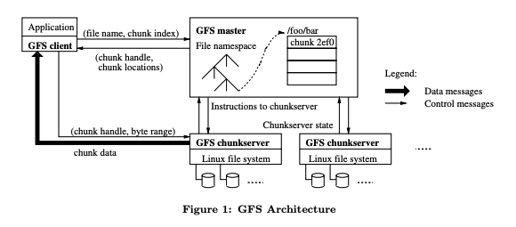
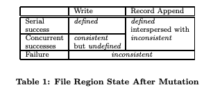

# The Google File System

> Sanjay Ghemawat, Howard Gobioff, and Shun-Tak Leung Google∗ 2003

## 目录
* [Abstract](#abstract)
* [1 Introduction](#1-introduction)
* [2 Design for file systems of the 1990's](#2-design-for-file-systems-of-the-1990s)
    * [2.1 Technology](#21-technology)
    * [2.2 Workloads](#22-workloads)
    * [2.3 Problems with existing file systems](#23-problems-with-existing-file-systems)
* [3 Log-structured file systems](#3-log-structured-file-systems)
    * [3.1 File location and reading](#31-file-location-and-reading)
    * [3.2 Free space management: segments](#32-free-space-management-segments)
    * [3.3 Segment cleaning mechanism](#33-segment-cleaning-mechanism)
    * [3.4 Segment cleaning policies](#34-segment-cleaning-policies)
    * [3.5 Simulation results](#35-simulation-results)
    * [3.6 Segment usage table](#36-segment-usage-table)
* [4 Crash recovery](#4-crash-recovery)
    * [4.1 Checkpoints](#41-checkpoints)
    * [4.2 Roll-forward](#42-roll-forward)
* [5 Experience with the Sprite LFS](#5-experience-with-the-sprite-lfs)
    * [5.1 Micro-benchmarks](#51-micro-benchmarks)
    * [5.2 Cleaning overheads](#52-cleaning-overheads)
    * [5.3 Crash recovery](#53-crash-recovery)
    * [5.4 Other overheads in Sprite LFS](#54-other-overheads-in-sprite-lfs)
* [6 Related work](#6-related-work)
* [7 Conclusion](#7-conclusion)
* [8 Acknowledgments](#8-acknowledgments)

## ABSTRACT

我们设计并实现了 Google File System（GFS），这是一种面向大规模分布式、数据密集型应用的可扩展分布式文件系统。GFS 运行在廉价的通用硬件之上，能够在提供容错能力的同时，为大量客户端提供高聚合性能。

尽管在目标上与以往的分布式文件系统有诸多相似之处，但我们的设计主要受应用工作负载以及当前与可预期技术环境的观察所驱动，而这些观察与早期文件系统所基于的一些假设存在显著差异。这促使我们重新审视传统设计选择，并探索在设计空间中截然不同的取舍点。

该文件系统已经成功满足了我们的存储需求。它已在 Google 内部得到广泛部署，作为支撑公司各项服务中数据生成与处理的存储平台，同时也服务于需要处理大规模数据集的研究与开发工作。迄今为止，最大的集群在一千多台机器上、跨越数千块磁盘，提供了数百 TB 的存储容量，并且可被数百个客户端并发访问。

本文介绍了为支持分布式应用而设计的文件系统接口扩展，讨论了系统设计的诸多方面，并报告了来自微基准测试以及真实生产环境使用的测量结果。

## 1. INTRODUCTION

我们设计并实现了 Google File System（GFS），以满足 Google 数据处理需求快速增长的要求。GFS 在性能、可扩展性、可靠性和可用性等方面与以往的分布式文件系统具有许多相同的目标。然而，其设计主要源于我们对应用工作负载以及当前与可预期技术环境的若干关键观察，而这些观察在很大程度上背离了早期文件系统的一些设计假设。基于此，我们重新审视了传统设计选择，并探索了设计空间中截然不同的取舍点。

首先，组件失效是常态而非例外。该文件系统由数百甚至上千台存储机器构成，这些机器基于廉价的通用硬件部件搭建，并由数量相当的客户端机器进行访问。组件在数量和质量上的客观现实几乎可以保证：在任何时刻，都会有部分组件处于不可用状态，且其中一些无法从当前的故障中恢复。我们已经观察到由应用程序缺陷、操作系统缺陷、人为错误以及磁盘、内存、连接器、网络和电源等硬件故障引发的问题。因此，持续监控、错误检测、容错机制以及自动恢复能力必须成为系统设计中不可或缺的组成部分。

其次，与传统标准相比，文件规模极其庞大。多 GB 级别的文件十分常见。每个文件通常包含大量应用对象，例如网页文档。当我们经常需要处理由数十 TB、包含数十亿对象且持续快速增长的数据集时，即便文件系统在技术上能够支持，管理数十亿个近似 KB 级别的小文件也会变得极其笨拙。因此，诸如 I/O 操作方式和块大小等设计假设与参数都必须重新加以审视。

第三，大多数文件的修改方式是追加新数据，而非覆盖已有数据。文件内部的随机写操作几乎不存在。文件一旦写入，之后通常只被读取，而且往往是顺序读取。多种类型的数据都具有这一特性：有的构成大型数据仓库，供数据分析程序顺序扫描；有的作为由运行中应用持续生成的数据流；有的作为归档数据；还有的作为在一台机器上生成、并在另一台机器上（可能是同时或稍后）处理的中间结果。在这种针对超大文件的访问模式下，系统性能优化与原子性保证的重点自然集中在追加操作上，而在客户端缓存数据块的吸引力则显著降低。

第四，应用程序与文件系统 API 的协同设计能够通过提升系统整体灵活性而带来显著收益。例如，我们有意放宽了 GFS 的一致性模型，从而在不对应用程序施加过重负担的前提下，大幅简化了文件系统的设计。此外，我们还引入了一种原子追加（atomic append）操作，使得多个客户端可以在无需彼此额外同步的情况下并发地向同一文件追加数据。上述机制将在本文后续部分中作更为详细的讨论。

目前，多个 GFS 集群已针对不同用途投入运行。其中规模最大的集群包含 1000 余个存储节点、超过 300 TB 的磁盘存储容量，并且在持续运行过程中由分布在不同机器上的数百个客户端进行高强度并发访问。

## 2. DESIGN OVERVIEW

### 2.1 Assumptions

在为满足自身需求而设计文件系统的过程中，我们受到一系列既带来挑战又蕴含机遇的假设条件的指导。前文已提及其中若干关键观察，现对这些设计假设作更为系统和详细的阐述：

* 系统由大量廉价的通用硬件组件构成，而这些组件频繁发生故障。因此，系统必须能够持续进行自我监控，并在日常运行中及时检测、容忍并快速从组件故障中恢复。

* 系统存储的是数量适中但规模巨大的文件。我们预计文件数量为数百万级，每个文件通常大小在 100 MB 或以上。多 GB 级文件是常态，必须得到高效管理。系统需要支持小文件，但无需针对小文件进行性能优化。

* 工作负载主要由两类读操作构成：大规模流式读与小规模随机读。在流式读中，单次操作通常读取数百 KB 的数据，更常见的是 1 MB 或以上；来自同一客户端的连续读操作往往顺序访问文件中的连续区域。小规模随机读则通常在任意偏移位置读取数 KB 数据。对性能敏感的应用往往会对这些小规模读请求进行批处理和排序，使访问模式尽量向顺序扫描演进，而非频繁来回跳转。

* 工作负载同样包含大量顺序写入，且主要表现为对文件的追加操作。写操作的典型规模与读操作相近。文件一旦写入完成，便很少再被修改。系统支持在文件任意位置进行小规模写入，但不要求其具备高效率。

* 系统必须为多个客户端并发向同一文件追加数据提供高效且语义明确的支持。文件常被用作生产者—消费者队列或多路合并的中间结果。可能有数百个生产者（通常每台机器运行一个）同时向同一文件追加数据。在这种场景下，以最小同步开销实现原子性保证至关重要。文件既可能在追加完成后被读取，也可能在追加过程中被消费者同时顺序读取。

* 持续的高带宽比低延迟更为重要。我们的大多数目标应用更关注以高吞吐率批量处理数据，而极少对单次读写操作的响应时间提出严格要求。

> 注：组件故障是常态而非例外，保证容错能力是系统设计的关键；支持小文件，但小文件的性能优化不是重点，绝大部分文件都是大文件；工作负载主要由两类读操作构成：大规模流式读与小规模随机读；工作负载同样包含大量顺序写入，且主要表现为对文件的追加操作；系统必须为多个客户端并发向同一文件追加数据提供高效且语义明确的支持（排他锁租约，追加内容落盘后再更新元数据文件长度保证原子性）；持续的高带宽比低延迟更为重要。

### 2.2 Interface

GFS 提供了一个熟悉的文件系统接口，尽管它并未实现诸如 POSIX 之类的标准 API。文件以分层目录结构进行组织，并通过路径名进行标识。系统支持常见的文件操作，包括创建、删除、打开、关闭、读和写。

此外，GFS 还提供了快照（snapshot）和记录追加（record append）操作。快照能够以较低的成本创建一个文件或整个目录树的副本。记录追加允许多个客户端并发地向同一个文件追加数据，同时保证每个客户端追加操作的原子性。该机制对于实现多路归并结果以及生产者—消费者队列非常有用，在这些场景中，多个客户端可以同时向同一文件追加数据，而无需额外的锁机制。我们发现，这类文件在构建大型分布式应用时具有极高的价值。快照和记录追加操作分别在第 3.4 节和第 3.3 节中作进一步讨论。

### 2.3 Architecture

一个 GFS 集群由一个主服务器（master）和多个块服务器（chunkserver）组成，并由多个客户端进行访问，如 Figure 1 所示。它们通常都是运行用户态服务器进程的通用 Linux 机器。在机器资源允许、且可以接受由于运行可能不够稳定的应用代码而带来的可靠性下降的情况下，在同一台机器上同时运行 chunkserver 和 client 是很容易的。

文件被划分为固定大小的块（chunk）。每个块在创建时由 master 分配一个不可变且全局唯一的 64 位块句柄（chunk handle）。Chunkserver 将块以 Linux 文件的形式存储在本地磁盘上，并根据给定的块句柄和字节范围对块数据进行读写。为提高可靠性，每个块都会在多个 chunkserver 上进行副本存储。默认情况下，我们为每个块保存三个副本，不过用户也可以为文件命名空间中的不同区域指定不同的副本数。

Master 维护所有文件系统的元数据，包括命名空间、访问控制信息、文件到块的映射关系以及块的当前位置信息。它还负责系统范围内的活动控制，例如块租约（chunk lease）管理、孤立块的垃圾回收，以及块在不同 chunkserver 之间的迁移。Master 会定期通过心跳（Heartbeat）消息与每个 chunkserver 通信，向其下发指令并收集其状态信息。

链接到每个应用程序中的 GFS 客户端代码实现了文件系统 API，并代表应用程序与 master 和 chunkserver 通信以完成数据的读写操作。客户端仅在元数据操作时与 master 交互，而所有承载实际数据的通信都直接与 chunkserver 进行。由于 GFS 并未提供 POSIX API，因此也无需挂接到 Linux 的 vnode 层。

无论是客户端还是 chunkserver 都不会缓存文件数据。客户端缓存带来的收益很小，因为大多数应用都是顺序扫描超大文件，或者其工作集规模大到无法被有效缓存。不进行数据缓存可以消除缓存一致性问题，从而简化客户端及整个系统的设计（但客户端会缓存元数据）。Chunkserver 也无需缓存文件数据，因为块是以本地文件的形式存储的，Linux 的缓冲区缓存机制已经能够将频繁访问的数据保存在内存中。

### 2.4 Single Master

采用单一 master 极大地简化了系统设计，并使 master 能够利用其掌握的全局信息，对块的放置与副本策略做出较为复杂而有效的决策。然而，必须尽量减少 master 在读写路径中的参与，以避免其成为系统瓶颈。客户端从不通过 master 直接读写文件数据，而是先向 master 询问应当联系哪些 chunkserver。客户端会将这些信息缓存一段有限的时间，在随后的多次操作中直接与相应的 chunkserver 进行交互。

下面结合 Figure 1 说明一次简单读操作的交互过程。首先，客户端利用固定的块大小，将应用程序指定的文件名和字节偏移量转换为该文件中的一个块索引（chunk index）。随后，客户端向 master 发送一个请求，其中包含文件名和块索引。Master 返回对应的块句柄（chunk handle）以及该块各个副本所在的位置。客户端以文件名和块索引为键对这些信息进行缓存。

接下来，客户端向其中一个副本发送读请求，通常会选择网络距离最近的副本。该请求中包含块句柄以及块内的一个字节范围。只要缓存的信息未过期或文件未被重新打开，对同一块的后续读取操作就不再需要与 master 进行交互。事实上，客户端通常会在一次请求中查询多个块的信息，而 master 也可以在响应中一并返回紧随其后的若干块的相关信息。以几乎可以忽略的额外开销换取这些附加信息，可以有效避免未来多次客户端与 master 之间的交互。

### 2.5 Chunk Size

块大小（chunksize）是一个关键的设计参数。我们选择了 64 MB，这一大小远大于典型文件系统的块大小。每个块副本在 chunkserver 上都以普通的 Linux 文件形式存储，并且仅在需要时才进行扩展。通过延迟空间分配，可以避免由于内部碎片而造成的空间浪费，而内部碎片可能正是采用如此大块大小时最主要的反对理由。

较大的块大小带来了若干重要优势。首先，它减少了客户端与 master 之间的交互需求，因为对同一块的读写操作只需要一次初始的 master 请求来获取块位置信息。对于我们的工作负载而言，这种减少尤为显著，因为应用程序主要以顺序方式读写大文件。即使是在小规模的随机读场景下，客户端也可以较为轻松地缓存一个多 TB 工作集所需的全部块位置信息。其次，由于在较大的块上，客户端更有可能对同一块执行多次操作，因此可以通过在较长时间内保持与 chunkserver 的持久 TCP 连接来减少网络开销。第三，它减少了 master 上存储的元数据规模，从而使我们能够将这些元数据全部保存在内存中，这一点又进一步带来了其他优势，相关内容将在第 2.6.1 节中讨论。

另一方面，较大的块大小即使配合延迟空间分配，也存在一定的缺点。一个小文件只包含很少的块，甚至可能只有一个块。当大量客户端同时访问同一个文件时，存储这些块的 chunkserver 可能会成为热点。在实际运行中，热点并未成为主要问题，这是因为我们的应用大多以顺序方式读取包含多个块的大文件。

然而，在 GFS 最初被一个批处理队列系统使用时，确实出现过热点问题：某个可执行文件被写入 GFS，作为一个单块文件存储，然后在数百台机器上同时启动。存储该可执行文件的少数几个 chunkserver 因同时收到数百个请求而出现过载。我们通过为这类可执行文件设置更高的副本数，并让批处理队列系统错开应用启动时间，解决了这一问题。从长远来看，一个潜在的解决方案是在这种场景下允许客户端从其他客户端读取数据。

### 2.6 Metadata

主服务器（master）存储三类主要的元数据：文件与块的命名空间、文件到块的映射关系，以及每个块副本的位置。所有元数据都保存在主服务器的内存中。其中前两类（命名空间以及文件到块的映射）还通过将变更操作记录到操作日志中而被持久化，该日志存储在主服务器的本地磁盘上，并复制到远程机器。采用日志机制使我们能够以简单且可靠的方式更新主服务器状态，并在主服务器发生崩溃时避免产生不一致性。主服务器并不对块位置相关的信息进行持久化存储，而是在主服务器启动时以及每当有 chunkserver 加入集群时，向各个 chunkserver 询问其所存储的块信息。

> 注：只有当一次元数据操作对应的 EditLog 被成功持久化到多数派（quorum） JournalNode 之后，GFS 才会向客户端返回成功。

#### 2.6.1 In-Memory Data Structures

由于元数据存储在内存中，主服务器上的各类操作都非常迅速。此外，主服务器可以方便而高效地在后台周期性地扫描其全部状态。这种周期性扫描被用于实现块的垃圾回收、在 chunkserver 发生故障时的重新复制，以及为了在各个 chunkserver 之间平衡负载和磁盘空间使用而进行的块迁移。第 4.3 节和第 4.4 节将对这些活动作进一步讨论。

这种仅在内存中保存元数据的方法可能引发的一个潜在担忧是：块的数量、进而整个系统的容量，会受到主服务器内存容量的限制。但在实践中，这并不是一个严重的限制。主服务器为每个 64 MB 的块维护的元数据少于 64 字节。由于大多数文件包含多个块，且只有最后一个块可能是部分填充的，因此大多数块都是满的。类似地，文件命名空间的数据通常每个文件也只需要少于 64 字节，因为文件名通过前缀压缩的方式被紧凑地存储。

如果需要支持规模更大的文件系统，为主服务器增加额外内存所带来的成本，相对于将元数据存储在内存中所获得的简洁性、可靠性、性能以及灵活性而言，是完全可以接受的。

#### 2.6.2 Chunk Locations

主服务器并不持久化保存某个块的副本位于哪些 chunkserver 上的信息。相反，它在启动时通过轮询各个 chunkserver 来获取这些信息。此后，由于主服务器负责所有块的放置决策，并通过周期性的 HeartBeat 消息监控 chunkserver 的状态，因此可以持续保持这些信息的更新。

我们最初曾尝试在主服务器上持久化保存块位置（chunk location）信息，但后来发现，在系统启动时以及之后定期向 chunkserver 请求这些数据要简单得多。这样就消除了在 chunkserver 加入或离开集群、名称变化、发生故障、重启等情况下，保持主服务器与各个 chunkserver 状态一致所带来的复杂性。在一个拥有数百台服务器的集群中，这类事件发生得非常频繁。

从另一个角度来看这一设计决策，可以认识到：chunkserver 对其本地磁盘上实际拥有哪些块拥有最终裁决权。试图在主服务器上维护这一信息的一致视图并没有意义，因为 chunkserver 上的错误可能导致块“自行消失”（例如磁盘损坏并被禁用），或者运维人员可能会重命名某个 chunkserver。

#### 2.6.3 Operation Log

操作日志包含了关键元数据变更的历史记录，是 GFS 的核心组成部分。它不仅是元数据唯一的持久化存储形式，同时还充当了一条逻辑时间线，用以定义并发操作的先后顺序。文件和块，以及它们的版本（见第 4.5 节），都由其创建时对应的逻辑时间唯一且永久地标识。

由于操作日志至关重要，我们必须以高度可靠的方式存储它，并且在元数据变更被持久化之前，不能将这些变更对客户端可见。否则，即使块数据本身仍然存在，我们也可能丢失整个文件系统，或至少丢失最近的客户端操作。因此，操作日志会被复制到多台远程机器上，主服务器只有在相应的日志记录同时刷新到本地磁盘和远程磁盘之后，才会对客户端的操作作出响应。主服务器会将多个日志记录批量处理后再刷新，从而降低日志刷写和复制对系统整体吞吐量的影响。

主服务器通过重放操作日志来恢复其文件系统状态。为了尽量缩短启动时间，日志必须保持较小规模。当日志增长到超过某一阈值时，主服务器会对自身状态进行一次检查点（checkpoint），以便在恢复时只需从本地磁盘加载最新的检查点，并重放其后的少量日志记录即可。检查点采用一种紧凑的、类似 B 树的形式，可以直接映射到内存中，并在无需额外解析的情况下用于命名空间查找。这进一步加快了恢复过程并提高了系统的可用性。

由于构建检查点可能需要一定时间，主服务器的内部状态被设计为可以在不中断正在进行的元数据变更操作的情况下创建新的检查点。主服务器会切换到一个新的日志文件，并在一个独立的线程中生成新的检查点。该检查点包含切换之前的所有变更。在一个包含数百万个文件的集群中，生成检查点通常只需一分钟左右。完成后，检查点会同时写入本地磁盘和远程磁盘。

在恢复过程中，只需要最新的一个完整检查点以及其后的日志文件。更早的检查点和日志文件可以被安全地删除，不过我们通常会保留少量旧文件以防止灾难性故障。即使在创建检查点的过程中发生失败，也不会影响系统的正确性，因为恢复代码能够检测并跳过不完整的检查点。

> 注：操作日志保证了文件创建的顺序性，同时保障了元数据的持久化和一致性。

### 2.7 Consistency Model

GFS 采用了一种较为宽松的一致性模型，这种模型能够很好地支持高度分布式的应用，同时在实现上仍然保持相对的简单性和高效性。下面我们将讨论 GFS 所提供的一致性保证及其对应用程序的含义，并概述 GFS 是如何维持这些保证的，具体实现细节则留待论文的其他部分展开说明。

#### 2.7.1 Guarantees by GFS

文件命名空间的变更（例如文件创建）是原子的。这类操作完全由主服务器处理：命名空间加锁机制保证了操作的原子性和正确性（见第 4.1 节）；主服务器的操作日志为这些操作定义了一个全局的全序关系（见第 2.6.3 节）。

一次数据变更之后，文件某个区域所处的状态取决于变更的类型、该变更是成功还是失败，以及是否存在并发变更。Table 1 对这些结果进行了总结。如果一个文件区域是“一致的”，则无论客户端从哪个副本读取，都会始终看到相同的数据。若一个文件区域在数据变更之后是“一致的”，并且客户端能够完整地看到该变更写入的内容，则称该区域是“已定义的”。当一次数据变更在没有并发写入干扰的情况下成功完成时，受影响的区域就是已定义的（并且由此可知也是一致的）：所有客户端都会看到该变更写入的内容。并发的成功变更会使该区域处于“未定义但一致”的状态：所有客户端看到的数据是相同的，但这些数据未必完全对应于任何一次单独变更所写入的内容，通常由多个变更写入的片段混合而成。一次失败的变更会使该区域变为“不一致”（因此也必然是未定义的）：不同客户端在不同时间可能看到不同的数据。下面我们将说明应用程序如何区分已定义区域与未定义区域；应用程序无需进一步区分未定义区域的不同类型。

数据变更可以是写入（write）或记录追加（record append）。写入操作会在应用程序指定的文件偏移处写入数据。记录追加操作则会在存在并发变更的情况下，保证将数据（即“记录”）以原子方式至少追加一次，但其偏移位置由 GFS 自行决定（见第 3.3 节）。（相比之下，“普通”追加只是一次写入操作，写入位置是客户端认为的当前文件末尾。）该偏移会返回给客户端，并标记一个已定义区域的起始位置，该区域包含这条记录。此外，GFS 可能会在中间插入填充数据或重复的记录，它们占据的区域被视为不一致区域，且其规模通常远小于用户数据本身。

在一系列成功的数据变更之后，被修改的文件区域可以保证是已定义的，并且包含最后一次变更写入的数据。GFS 通过以下两点来实现这一保证：(a) 在所有副本上以相同的顺序对某个块应用变更（见第 3.1 节）；(b) 使用块版本号来检测那些由于其所在的 chunkserver 宕机而错过变更、从而变得过期的副本（见第 4.5 节）。过期副本不会再参与任何变更操作，也不会被返回给向主服务器请求块位置的客户端，并会在最早的时机被垃圾回收。

由于客户端会缓存块位置信息，它们在这些信息刷新之前，可能会从一个过期副本中读取数据。这个时间窗口受到缓存项超时时间以及下一次打开该文件操作的限制，后者会从缓存中清除该文件的所有块信息。此外，由于大多数文件是只追加的，过期副本通常只会返回一个过早的块结束标记，而不是过期的数据。当读者重试并联系主服务器时，会立即获得最新的块位置信息。

即使在一次成功的数据变更很久之后，组件故障仍然可能破坏或丢失数据。GFS 通过主服务器与所有 chunkserver 之间的定期握手来识别失效的 chunkserver，并通过校验和来检测数据损坏（见第 5.2 节）。一旦发现问题，系统会尽快从有效副本中恢复数据（见第 4.3 节）。只有在 GFS 作出反应之前（通常在几分钟内），某个块的所有副本都同时丢失时，该块才会不可逆地丢失。即便在这种情况下，数据也只是不可用，而不会被破坏：应用程序会收到明确的错误信息，而不是损坏的数据。

#### 2.7.2 Implications for Applications

GFS 应用程序可以通过一些简单的技术来适应这种宽松的一致性模型，而这些技术本身在其他场景下也早已是必需的：依赖追加而非覆盖写、使用检查点，以及写入自校验、自标识的记录。

几乎所有应用对文件的修改都是通过追加而不是覆盖完成的。在一种典型用法中，写入程序从文件开头到结尾顺序生成内容，在写完所有数据后，会以原子方式将文件重命名为永久名称，或者定期对已经成功写入的部分进行检查点记录。检查点还可以包含应用层的校验和。读取程序只验证并处理截至最近一次检查点的文件区域，因为该区域被认为处于已定义状态。无论存在怎样的一致性或并发问题，这种方式在实践中都运行良好。与随机写相比，追加操作在效率上更高，也更能抵御应用程序故障；而检查点机制则允许写入程序以增量方式重启，并防止读取程序处理那些虽然已经写入文件、但从应用角度看仍不完整的数据。

在另一种典型用法中，多个写入程序会并发地向同一个文件追加数据，用于合并结果或作为生产者—消费者队列。记录追加的“至少追加一次”语义保证了每个写入程序的输出都会被保留下来。读取程序通过以下方式处理偶尔出现的填充和重复记录：写入程序生成的每条记录都包含额外的信息（如校验和），以便验证其有效性；读取程序可以利用这些校验和识别并丢弃多余的填充数据和记录片段。如果应用无法容忍偶发的重复（例如这些重复会触发非幂等操作），则可以通过记录中的唯一标识符将其过滤掉，而这些标识符通常本来就需要用于命名相应的应用实体，如网页文档。上述记录 I/O 的功能（除重复消除外）由应用共享的库代码提供，并且同样适用于 Google 内部其他文件接口实现。借助这些机制，记录读取程序总是能够接收到同一序列的记录，只是可能伴随少量的重复。
