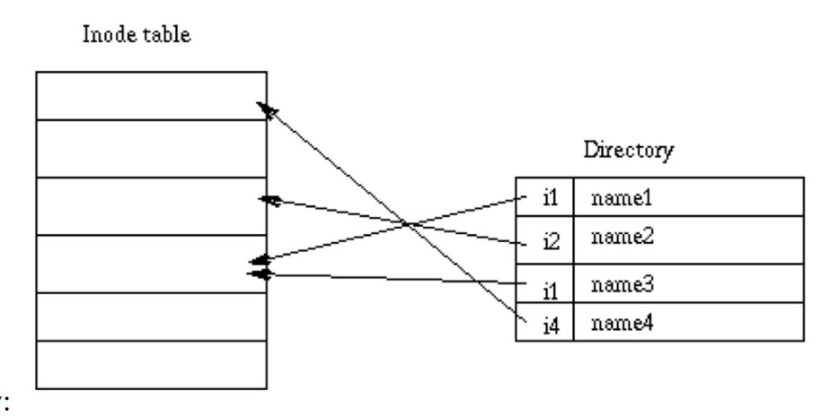
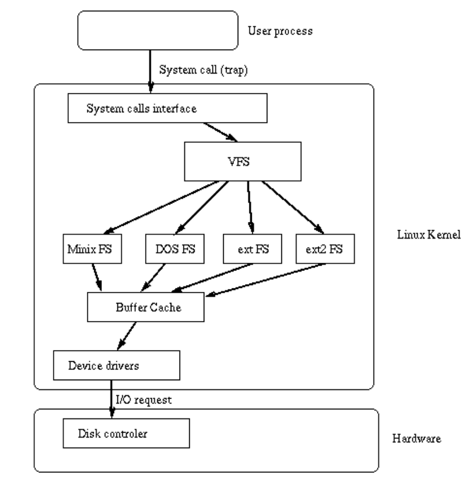

# Design and Implementation of the Second Extended Filesystem

> Rémy Card, Laboratoire MASI--Institut Blaise Pascal, E-Mail: card@masi.ibp.fr, and Theodore Ts'o, Massachussets Institute of Technology, E-Mail: tytso@mit.edu, and Stephen Tweedie, University of Edinburgh, E-Mail: sct@dcs.ed .ac.uk

> This paper was first published in the Proceedings of the First Dutch International Symposium on Linux, 1994 

## 目录
* [Introduction](#introduction)
* [History of Linux filesystems](#history-of-linux-filesystems)
* [Basic File System Concepts](#basic-file-system-concepts)
    * [inode](#inode)
    * [Directories](#directories)
    * [Links](#links)
    * [Device special files](#device-special-files)
* [The Virtual File System](#the-virtual-file-system)
    * [Principle](#principle)
    * [The VFS structure](#the-vfs-structure)
* [The Second Extended File System](#the-second-extended-file-system)
    * [Motivations](#motivations)
    * ["Standard" Ext2fs features](#standard-ext2fs-features)
    * ["Advanced" Ext2fs features](#advanced-ext2fs-features)
    * [Physical Structure](#physical-structure)
    * [Performance optimizations](#performance-optimizations)
* [The Ext2fs library](#the-ext2fs-library)
* [The Ext2fs tools](#the-ext2fs-tools)
* [Performance Measurements](#performance-measurements)
    * [Description of the benchmarks](#description-of-the-benchmarks)
    * [Results of the Bonnie benchmark](#results-of-the-bonnie-benchmark)
    * [Results of the Andrew benchmark](#results-of-the-andrew-benchmark)
* [Conclusion](#conclusion)
* [Acknowledgments](#acknowledgments)


## Introduction

Linux 是一种类 Unix 操作系统，可在 PC-386 计算机上运行。它最初是作为 Minix 操作系统的扩展实现的 [Tanenbaum 1987]，其早期版本仅支持 Minix 文件系统。Minix 文件系统存在两个严重的局限性：块地址存储在 16 位整数中，因此最大文件系统大小被限制在 64 兆字节；目录包含固定大小的条目，且最大文件名长度为 14 个字符。

我们设计并实现了两种新的文件系统，它们已被纳入标准的 Linux 内核。这两种文件系统分别名为"扩展文件系统"（Ext fs）和"第二代扩展文件系统"（Ext2 fs），它们突破了原有局限并增添了新功能。

在本文中，我们介绍了 Linux 文件系统的历史。我们简要阐述了 Unix 文件系统中实现的基本概念。我们展示了 Linux 中虚拟文件系统层的实现，并详细说明了第二代扩展文件系统的内核代码和用户模式工具。最后，我们呈现了在 Linux 和 BSD 文件系统上进行的性能测试结果，并总结了 Ext2fs 的现状及未来发展方向。

## History of Linux filesystems

在其早期阶段，Linux 是在 Minix 操作系统下交叉开发的。在两个系统之间共享磁盘比设计一个新的文件系统更容易，因此 Linus Torvalds 决定在 Linux 中实现对 Minix 文件系统的支持。Minix 文件系统是一款高效且相对无漏洞的软件。

然而，Minix 文件系统设计中的限制过于严格，因此人们开始思考并致力于在 Linux 中实现新的文件系统。

为了便于在 Linux 内核中添加新的文件系统，人们开发了虚拟文件系统（VFS）层。VFS 层最初由 Chris Provenzano 编写，后经 Linus Torvalds 重写，随后被整合到 Linux 内核中。《虚拟文件系统》中对其进行了描述。

1992 年 4 月，在将虚拟文件系统（VFS）集成到内核后，一种名为"扩展文件系统"的新文件系统被开发出来，并加入到了 Linux 0.96c 中。这种新文件系统消除了 Minix 文件系统的两个主要限制：其最大容量为 2 千兆字节，最大文件名长度为 255 个字符。它是对 Minix 文件系统的一种改进，但仍存在一些问题。它不支持单独的访问时间戳、索引节点修改时间戳和数据修改时间戳。该文件系统使用链表来跟踪空闲块和索引节点，这导致了性能不佳：随着文件系统的使用，链表变得无序，文件系统也出现了碎片化。

为解决这些问题，1993 年 1 月发布了两个处于 Alpha 版本的新文件系统：Xia 文件系统和第二次扩展文件系统（Second Extended File System）。Xia 文件系统在很大程度上基于 Minix 文件系统的内核代码，仅在该文件系统的基础上做了少量改进。基本上，它支持长文件名、更大的分区以及三种时间戳。另一方面，Ext2fs 基于 Extfs 代码，进行了大量重组和改进。其设计考虑到了演进性，并为未来的改进预留了空间。关于它的更多细节将在《第二次扩展文件系统》中介绍。

当这两种新的文件系统首次发布时，它们提供的功能基本相同。由于其极简的设计，Xia fs 比 Ext2fs 更稳定。随着这些文件系统的应用越来越广泛，Ext2fs 中的漏洞得到了修复，并且集成了许多改进和新功能。如今，Ext2fs 非常稳定，已成为事实上的标准 Linux 文件系统。

此表包含不同文件系统所提供功能的摘要：

| 特性               | Minix FS  | Ext FS | Ext2 FS | Xia FS  |
| ------------------ | --------- | ------ | ------- | ------- |
| Max FS size        | 64 MB     | 2 GB   | 4 TB    | 2 GB    |
| Max file size      | 64 MB     | 2 GB   | 2 GB    | 64 MB   |
| Max file name      | 16/30 c   | 255 c  | 255 c   | 248 c   |
| 3 times support    | No        | No     | Yes     | Yes     |
| Extensible         | No        | No     | Yes     | No      |
| Var. block size    | No        | No     | Yes     | No      |
| Maintained         | Yes       | No     | Yes     | ?       |

## Basic File System Concepts

每个 Linux 文件系统都实现了一组源自 Unix 操作系统的基本通用概念 [Bach 1986]：文件由索引节点表示，目录只是包含条目列表的文件，而设备可以通过对特殊文件请求输入/输出来访问。

### inode

每个文件都由一个称为索引节点（inode）的结构表示。每个索引节点包含文件的描述信息：文件类型、访问权限、所有者、时间戳、大小以及指向数据块的指针。分配给文件的数据块地址存储在其索引节点中。当用户请求对文件执行 I/O 操作时，内核代码会将当前偏移量转换为块号，将该块号用作块地址表中的索引，并读取或写入物理块。此图展示了索引节点的结构：

<div align=center></div>

### Directories

目录以层级树状结构组织。每个目录可以包含文件和子目录。

目录被实现为一种特殊类型的文件。实际上，目录是一个包含条目列表的文件。每个条目包含一个索引节点号和一个文件名。当进程使用路径名时，内核代码会在目录中搜索以找到相应的索引节点号。将名称转换为索引节点号后，索引节点会被加载到内存中，并供后续请求使用。

此图表示一个目录：

<div align=center></div>

### Links

Unix 文件系统实现了链接的概念。一个索引节点可以关联多个名称。索引节点包含一个字段，该字段包含与文件相关联的编号。添加链接只需创建一个目录项，其中索引节点编号指向该索引节点，并增加索引节点中的链接计数。当删除一个链接时，即使用 rm 命令删除一个文件名时，内核会减少链接计数，如果该计数变为零，则释放索引节点。

这种链接被称为硬链接，且只能在单个文件系统中使用：无法创建跨文件系统的硬链接。此外，硬链接只能指向文件：不能创建目录硬链接，以防止目录树中出现循环。

大多数 Unix 文件系统中还存在另一种链接。符号链接本质上是包含文件名的文件。当内核在将路径名转换为索引节点的过程中遇到符号链接时，会用链接的内容（即目标文件的名称）替换该链接的名称，并重新开始路径名解析。由于符号链接并不指向索引节点，因此可以创建跨文件系统的符号链接。符号链接可以指向任何类型的文件，甚至是不存在的文件。符号链接非常有用，因为它们没有硬链接所带来的限制。不过，它们会占用一些磁盘空间，这些空间用于分配其索引节点和数据块，并且在路径名到索引节点的转换过程中会产生开销，因为内核在遇到符号链接时必须重新开始名称解析。

### Device special files

在类 Unix 操作系统中，设备可以通过特殊文件进行访问。设备特殊文件不占用文件系统的任何空间，它仅仅是设备驱动程序的一个访问点。

存在两种类型的特殊文件：字符特殊文件和块特殊文件。前者允许以字符模式进行输入/输出操作，而后者要求通过缓冲区缓存函数以块模式写入数据。当对特殊文件发出输入/输出请求时，该请求会被转发到（伪）设备驱动程序。特殊文件由主设备号和次设备号引用，主设备号标识设备类型，次设备号标识单元。


## The Virtual File System

### Principle

Linux 内核包含一个虚拟文件系统层，该层在对文件执行系统调用时使用。虚拟文件系统（VFS）是一个间接层，它处理面向文件的系统调用，并调用物理文件系统代码中的必要函数来执行输入/输出操作。

这种间接机制在类 Unix 操作系统中经常被使用，以简化多种文件系统类型的集成和使用 [Kleiman 1986；Seltzer 等人 1993]。

当一个进程发出面向文件的系统调用时，内核会调用虚拟文件系统（VFS）中包含的一个函数。该函数处理与结构无关的操作，并将调用重定向到物理文件系统代码中包含的一个函数，这个函数负责处理与结构相关的操作。文件系统代码使用缓冲区缓存函数来请求设备上的输入/输出操作。这种方案如图所示：

<div align=center></div>

### The VFS structure

虚拟文件系统（VFS）定义了一套每个文件系统都必须实现的函数。这个接口由与三类对象相关联的一组操作构成，这三类对象分别是：文件系统、索引节点和打开的文件。

虚拟文件系统（VFS）知晓内核中支持的文件系统类型。它使用在内核配置期间定义的一个表。该表中的每个条目都描述了一种文件系统类型：包含文件系统类型的名称以及一个指向挂载操作期间调用的函数的指针。当需要挂载某个文件系统时，会调用相应的挂载函数。此函数负责从磁盘读取超级块、初始化其内部变量，并向虚拟文件系统返回一个已挂载的文件系统描述符。文件系统挂载后，虚拟文件系统的函数可以使用该描述符来访问物理文件系统的例程。

挂载的文件系统描述符包含多种数据：所有文件系统类型共有的信息、指向物理文件系统内核代码所提供函数的指针，以及由物理文件系统代码维护的私有数据。文件系统描述符中包含的函数指针使虚拟文件系统（VFS）能够访问文件系统的内部例程。

虚拟文件系统（VFS）还使用另外两种类型的描述符：索引节点描述符和打开文件描述符。每种描述符都包含与正在使用的文件相关的信息，以及物理文件系统代码提供的一组操作。索引节点描述符包含可用于对任何文件执行操作（例如创建、删除）的函数指针，而文件描述符则包含只能对打开的文件执行操作（例如读取、写入）的函数指针。

## The Second Extended File System

### Motivations

第二代扩展文件系统的设计与实现旨在解决第一代扩展文件系统中存在的一些问题。我们的目标是提供一个功能强大的文件系统，它能实现 Unix 文件语义并提供高级功能。

当然，我们希望 Ext2fs 具有出色的性能。我们还希望提供一个非常健壮的文件系统，以降低在密集使用时数据丢失的风险。最后同样重要的是，Ext2fs 必须包含扩展支持，让用户无需重新格式化文件系统就能享受新功能带来的好处。

### "Standard" Ext2fs features

Ext2fs 支持标准的 Unix 文件类型：普通文件、目录、特殊设备文件和符号链接。

Ext2fs 能够管理在非常大的分区上创建的文件系统。虽然原始内核代码将最大文件系统大小限制为 2 GB，但虚拟文件系统（VFS）层最近的改进已将这一限制提高到 4 TB。因此，现在可以使用大容量磁盘，而无需创建多个分区。

Ext2fs 支持长文件名。它使用可变长度的目录项。最大文件名长度为 255 个字符。如有需要，此限制可扩展至 1012 个字符。

Ext2fs 为超级用户（root）预留了一些块。通常情况下，会预留 5% 的块。这使得管理员能够在用户进程填满文件系统时轻松进行恢复。

### "Advanced" Ext2fs features

除了标准的 Unix 功能外，Ext2fs 还支持一些通常在 Unix 文件系统中不存在的扩展功能。

文件属性允许用户在对一组文件执行操作时修改内核行为。用户可以在文件或目录上设置属性。在后一种情况下，在该目录中创建的新文件会继承这些属性。

可以在挂载时选择 BSD 或 System V Release 4 语义。一个挂载选项允许管理员选择文件创建语义。在采用 BSD 语义挂载的文件系统上，文件创建时会使用与其父目录相同的组 ID。System V 语义则稍复杂一些：如果目录设置了 setgid 位，新文件会继承该目录的组 ID，子目录会继承该组 ID 和 setgid 位；在其他情况下，文件和子目录会使用调用进程的主组 ID 来创建。

类 BSD 的同步更新可用于 Ext2 文件系统。挂载选项允许管理员要求元数据（索引节点、位图块、间接块和目录块）在被修改时同步写入磁盘。这对于保持严格的元数据一致性可能很有用，但会导致性能不佳。实际上，此功能通常不被使用，因为除了元数据同步更新带来的性能损失外，它还可能导致用户数据损坏，而文件系统检查程序不会标记这种损坏。

Ext2 文件系统允许管理员在创建文件系统时选择逻辑块大小。块大小通常可以是 1024、2048 和 4096 字节。使用较大的块大小可以加快输入/输出速度，因为访问一个文件需要的输入/输出请求更少，从而磁盘磁头寻道次数也更少。另一方面，较大的块会浪费更多磁盘空间：平均而言，分配给文件的最后一个块只填满了一半，因此随着块变大，每个文件的最后一个块中浪费的空间会更多。此外，更大块大小的大部分优势可通过 Ext2 文件系统的预分配技术实现（参见"性能优化"部分）。

Ext2 文件系统实现了快速符号链接。快速符号链接不使用文件系统上的任何数据块。目标名称不存储在数据块中，而是存储在索引节点本身中。这种策略可以节省一些磁盘空间（无需分配数据块），并加快链接操作（访问此类链接时无需读取数据块）。当然，索引节点中的可用空间是有限的，因此并非每个链接都能实现为快速符号链接。快速符号链接中目标名称的最大长度为 60 个字符。我们计划在不久的将来将此方案扩展到小文件。

Ext2 文件系统会跟踪文件系统的状态。超级块中的一个特殊字段被内核代码用来指示文件系统的状态。当文件系统以读写模式挂载时，其状态被设置为"未清洁"。当它被卸载或以只读模式重新挂载时，其状态会重置为"清洁"。在启动时，文件系统检查器会利用此信息来决定是否必须检查某个文件系统。内核代码还会在此字段中记录错误。当内核代码检测到不一致时，文件系统会被标记为"错误"。文件系统检查器会对此进行检测，以强制检查文件系统，无论其表面上处于清洁状态。

总是跳过文件系统检查有时可能很危险，因此 Ext2fs 提供了两种方法来定期强制进行检查。超级块中会维护一个挂载计数器。每次以读写模式挂载文件系统时，该计数器就会递增。当它达到一个最大值（也记录在超级块中）时，即使文件系统处于"干净"状态，文件系统检查程序也会强制进行检查。超级块中还会维护最后一次检查时间和最大检查间隔。这两个字段允许管理员要求进行定期检查。当达到最大检查间隔时，检查程序会忽略文件系统的状态，强制进行文件系统检查。Ext2fs 提供了用于调整文件系统行为的工具。tune2fs 程序可用于修改：

* 错误行为。当内核代码检测到不一致时，文件系统会被标记为“错误”，并且可以执行以下三种操作之一：继续正常执行、以只读模式重新挂载文件系统以避免损坏文件系统、使内核崩溃并重启以运行文件系统检查程序。

* 最大挂载次数。

* 最大检查间隔。

* 为超级用户预留的逻辑块数量。

挂载选项也可用于更改内核错误行为。

一个属性允许用户请求对文件进行安全删除。当此类文件被删除时，随机数据会写入之前分配给该文件的磁盘块中。这可以防止恶意人员通过使用磁盘编辑器获取该文件先前的内容。

最后，受 4.4 BSD 文件系统启发的新型文件最近已被添加到 Ext2fs 中。不可变文件只能被读取：任何人都无法写入或删除它们。这可用于保护敏感的配置文件。仅追加文件可以以写入模式打开，但数据总是被追加到文件末尾。与不可变文件一样，它们不能被删除或重命名。这对于只能增长的日志文件来说特别有用。

### Physical Structure

Ext2 文件系统的物理结构深受 BSD 文件系统布局的影响 [McKusick 等人，1984]。文件系统由块组构成。块组类似于 BSD FFS 的柱面组。不过，块组并不与磁盘上块的物理布局相关联，因为现代驱动器往往针对顺序访问进行了优化，并且向操作系统隐藏了其物理几何结构。

文件系统物理结构表格:

```
+--------------+----------------+----------------+-----+----------------+
| Boot Sector  | Block Group 1  | Block Group 2  | ... | Block Group N  |
+--------------+----------------+----------------+-----+----------------+
```

每个块组都包含关键文件系统控制信息（超级块和文件系统描述符）的冗余副本，并且还包含文件系统的一部分（块位图、索引节点位图、索引节点表的一部分以及数据块）。块组的结构如下表所示：

```
+----------+------------------+------------+-------------+-------------+--------------+
| Super    | FS               | Block      | Inode       | Inode       | Data         |
| Block    | descriptors      | Bitmap     | Bitmap      | Table       | Blocks       |
+----------+------------------+------------+-------------+-------------+--------------+
```

就可靠性而言，使用块组是一个巨大的优势：由于控制结构在每个块组中都有复制，因此在超级块损坏的文件系统中很容易进行恢复。这种结构还有助于获得良好的性能：通过缩短索引节点表和数据块之间的距离，可以减少文件I/O过程中的磁头寻道次数。

在 Ext2 文件系统中，目录被作为变长条目的链表进行管理。每个条目包含索引节点号、条目长度、文件名及其长度。通过使用变长条目，可以实现长文件名，同时不会浪费目录中的磁盘空间。目录条目的结构如下表所示：

```
+---------------+---------------+---------------+---------------+
| inode number  | entry length  | name length   | filename      |
+---------------+---------------+---------------+---------------+
```

例如，下表展示了一个包含三个文件的目录结构：file1、long_file_name 和 f2。

```
+----+----+----+----------------+
| i1 | 16 | 05 | file1          |
+----+----+----+----------------+
| i2 | 40 | 14 | long_file_name |
+----+----+----+----------------+
| i3 | 12 | 02 | f2             |
+----+----+----+----------------+
```

### Performance optimizations

Ext2fs 内核代码包含许多性能优化，这些优化往往能提高文件读写时的 I/O 速度。

Ext2fs 通过执行预读操作来利用缓冲区缓存管理：当需要读取一个块时，内核代码会请求对多个连续块进行 I/O 操作。这样做是为了确保下一个要读取的块已经加载到缓冲区缓存中。预读操作通常在对文件进行顺序读取时执行，而 Ext2 文件系统将其扩展到了目录读取，包括显式读取（readdir(2) 调用）和隐式读取（namei 内核目录查找）。

Ext2fs 还包含许多分配优化。块组用于将相关的索引节点和数据聚集在一起：内核代码总是尝试在与文件索引节点相同的组中为文件分配数据块。这是旨在减少内核读取索引节点及其数据块时的磁盘磁头寻道操作。

在向文件写入数据时，Ext2fs 在分配新块时会预分配最多 8 个相邻的块。即使在非常满的文件系统上，预分配的命中率也在 75% 左右。这种预分配在高负载下能实现良好的写入性能。它还允许为文件分配连续的块，从而加快未来的顺序读取速度。

这两种分配优化产生了非常好的局部性：

* 通过块组实现的相关文件

* 通过块分配的 8 位聚类实现的相关块。

## The Ext2fs library

为了允许用户模式程序操作 Ext2 文件系统的控制结构，开发了 libext2fs 库。该库提供了一些例程，通过直接访问物理设备来检查和修改 Ext2 文件系统的数据。

Ext2fs 库的设计旨在通过软件抽象技术实现最大程度的代码复用。例如，它提供了多个不同的迭代器。程序只需向 ext2fs_block_interate() 传入一个函数，该函数就会对索引节点中的每个块进行调用。另一个迭代器函数允许为目录中的每个文件调用用户提供的函数。

许多 Ext2fs 工具（mke2fs、e2fsck、tune2fs、dumpe2fs 和 debugfs）都使用 Ext2fs 库。这极大地简化了这些工具的维护工作，因为任何为了体现 Ext2 文件系统格式新特性而进行的修改，都只需在一个地方完成——即在 Ext2fs 库中。这种代码复用还能生成更小的二进制文件，因为 Ext2fs 库可以构建为共享库镜像。

由于 Ext2fs 库的接口非常抽象和通用，因此可以很容易地编写需要直接访问 Ext2fs 文件系统的新程序。例如，在移植 4.4 BSD 的 dump 和 restore 备份工具时就用到了 Ext2fs 库。要让这些工具适配 Linux，只需要做很少的改动：只需用对 Ext2fs 库的调用替换几个依赖于文件系统的函数即可。

Ext2fs 库提供了对几类操作的访问。第一类是面向文件系统的操作。程序可以打开和关闭文件系统，读取和写入位图，以及在磁盘上创建新的文件系统。此外，还有用于操作文件系统坏块列表的函数。

第二类操作会影响目录。Ext2fs 库的调用者可以创建和扩展目录，也可以添加和删除目录项。此外，还提供了将路径名解析为 inode 编号，以及根据 inode 编号确定 inode 路径名的函数。

最后一类操作围绕索引节点展开。可以扫描索引节点表、读写索引节点，以及扫描索引节点中的所有块。分配和释放例程也可用，允许用户模式程序分配和释放块及索引节点。

## The Ext2fs tools

已经为 Ext2fs 开发了强大的管理工具。这些工具用于创建、修改 Ext2 文件系统并纠正其中的任何不一致问题。mke2fs 程序用于初始化分区，使其包含一个空的 Ext2 文件系统。

tune2fs 程序可用于修改文件系统参数。正如"高级" Ext2fs 特性部分所解释的，它可以更改错误行为、最大挂载次数、最大检查间隔以及为超级用户预留的逻辑块数量。

最有趣的工具可能是文件系统检查器。e2fsck 旨在修复系统非正常关机后出现的文件系统不一致问题。e2fsck 的原始版本基于由 Linus Torvalds 为 Minix 文件系统编写的 fsck 程序。然而，当前版本的 e2fsck 是使用 Ext2fs 库从零开始重写的，比原始版本速度更快，并且能够修复更多的文件系统不一致问题。

e2fsck 程序旨在尽可能快速地运行。由于文件系统检查器往往受磁盘限制，因此通过优化 e2fsck 所使用的算法来实现这一点，以避免从磁盘重复访问文件系统结构。此外，索引节点和目录的检查顺序会按块号进行排序，以减少磁盘寻道时间。这些想法中的许多最初是由 [Bina 和 Emrath 1989] 探索的，尽管此后作者们对其进行了进一步的完善。

在第一阶段，e2fsck 会遍历文件系统中的所有索引节点，并将每个索引节点作为文件系统中一个未连接的对象进行检查。也就是说，这些检查不需要与其他文件系统对象进行任何交叉检查。此类检查的示例包括确保文件模式合法，以及索引节点中的所有块都是有效的块编号。在第一阶段，会编译指示哪些块和索引节点正在使用的位图。

如果 e2fsck 检测到有数据块被多个索引节点占用，它会调用 1B 到 1D 阶段来解决这些冲突，解决方式要么是克隆共享块，让每个索引节点都拥有共享块的自己的副本，要么是释放一个或多个索引节点。

第一轮执行花费的时间最长，因为所有索引节点都必须读入内存并进行检查。为了减少后续轮次所需的 I/O 时间，关键的文件系统信息会缓存在内存中。这种技术最重要的例子是文件系统上所有目录块在磁盘上的位置。这就避免了在第二轮中需要重新读取目录索引节点结构来获取该信息的情况。

第二阶段将目录作为未连接的对象进行检查。由于目录项不会跨磁盘块，每个目录块都可以独立检查，无需参考其他目录块。这使得 e2fsck 能够按块号对所有目录块进行排序，并按升序检查目录块，从而减少磁盘寻道时间。检查目录块是为了确保目录项有效，并且包含对正在使用的 inode 号的引用（由第一阶段确定）。

对于每个目录索引节点中的第一个目录块，会检查 "." 和 ".." 条目是否存在，以及 "." 条目的索引节点号是否与当前目录匹配。（".." 条目的索引节点号要到第 3 阶段才会检查。）

第二遍处理还会缓存每个目录所链接到的父目录的相关信息。（如果一个目录被多个目录引用，那么该目录的第二个引用会被视为非法硬链接，并会被移除。）

值得注意的是，在第 2 阶段结束时，e2fsck 需要执行的几乎所有磁盘 I/O 操作都已完成。第 3、4 和 5 阶段所需的信息会缓存在内存中；因此，e2fsck 剩余的阶段在很大程度上受 CPU 限制，且所需时间不到 e2fsck 总运行时间的 5%-10%。

在第 3 阶段，会检查目录的连通性。e2fsck 会使用第 2 阶段缓存的信息，追踪每个目录返回根目录的路径。此时，每个目录的 "." 条目也会被已检查以确保其有效。任何无法追溯到根目录的目录都链接到 /lost+found 目录。

在第 4 阶段，e2fsck 通过遍历所有索引节点，并将（在第 1 阶段缓存的）链接计数与在第 2 阶段和第 3 阶段计算的内部计数器进行比较，来检查所有索引节点的引用计数。在此阶段，任何未删除且链接计数为零的文件也会被链接到 /lost+found 目录。

最后，在第 5 阶段，e2fsck 会检查文件系统摘要信息的有效性。它会将前几个阶段构建的块位图和索引节点位图与文件系统上的实际位图进行比较，并在必要时修正磁盘上的副本。

文件系统调试器是另一个有用的工具。debugfs 是一个强大的程序，可用于检查和更改文件系统的状态。基本上，它为 Ext2fs 库提供了一个交互式界面：用户输入的命令会被转换为对库例程的调用。

debugfs 可用于检查文件系统的内部结构、手动修复损坏的文件系统，或为 e2fsck 创建测试用例。但遗憾的是，若使用者不了解其操作原理，该程序可能会带来危险；使用此工具极易破坏文件系统。因此，debugfs 默认以只读方式打开文件系统。用户必须明确指定 -w 标志，才能使用 debugfs 以读写方式打开文件系统。

## Performance Measurements

### Description of the benchmarks

我们已经运行了基准测试来衡量文件系统的性能。这些基准测试是在一台中端个人电脑上进行的，该电脑基于 i486DX2 处理器，配备 16 MB 内存和两块 420 MB 的 IDE 硬盘。测试在 Ext2 文件系统和 Xia 文件系统（Linux 1.1.62）以及 BSD 快速文件系统的异步和同步模式（FreeBSD 2.0 Alpha——基于 4.4 BSD Lite 发行版）上进行。

我们运行了两个不同的基准测试。Bonnie 基准测试用于测试大文件的 I/O 速度——测试期间文件大小设置为 60 MB。它使用基于字符的 I/O 向文件写入数据，重写整个文件的内容，使用基于块的 I/O 写入数据，使用字符 I/O 和块 I/O 读取文件，并在文件中进行查找。Andrew 基准测试由卡内基梅隆大学开发，伯克利大学曾用它来对 BSD FFS 和 LFS 进行基准测试。它分为五个阶段运行：创建目录层次结构、复制数据、递归检查每个文件的状态、检查每个文件的每个字节，以及编译其中几个文件。

### Results of the Bonnie benchmark

本表格展示了 Bonnie 基准测试的结果：

```
+-------------+-------------------+--------------------+----------------+------------------+-------------------+
|             | Char Write (KB/s) | Block Write (KB/s) | Rewrite (KB/s) | Char Read (KB/s) | Block Read (KB/s) |
+-------------+-------------------+--------------------+----------------+------------------+-------------------+
| BSD Async   | 710               | 684                | 401            | 721              | 888               |
+-------------+-------------------+--------------------+----------------+------------------+-------------------+
| BSD Sync    | 699               | 677                | 400            | 710              | 878               |
+-------------+-------------------+--------------------+----------------+------------------+-------------------+
| Ext2 fs     | 452               | 1237               | 536            | 397              | 1033              |
+-------------+-------------------+--------------------+----------------+------------------+-------------------+
| Xia fs      | 440               | 704                | 380            | 366              | 895               |
+-------------+-------------------+--------------------+----------------+------------------+-------------------+
```
在面向块的输入/输出方面，结果非常好：Ext2 文件系统优于其他文件系统。这显然是一个分配程序中包含的优化所带来的好处。写入速度很快，因为数据是以集群模式写入的。读取速度也很快，因为已为文件分配了连续的块。因此，两次读取之间无需磁头寻道，并且可以充分利用预读优化。

另一方面，在面向字符的输入输出操作中，FreeBSD 操作系统的性能更优。这可能是因为 FreeBSD 和 Linux 在各自的 C 库中使用的标准输入输出程序不同。看起来 FreeBSD 拥有一个更优化的字符输入输出库，因此其性能更好。

### Results of the Andrew benchmark

Andrew 基准测试的结果如下表所示：

```
+-------------+----------------+---------------+---------------+---------------+-----------------+
|             | P1 Create (ms) | P2 Copy (ms)  | P3 Stat (ms)  | P4 Grep (ms)  | P5 Compile (ms) |
+-------------+----------------+---------------+---------------+---------------+-----------------+
| BSD Async   | 2203           | 7391          | 6319          | 17466         | 75314           |
+-------------+----------------+---------------+---------------+---------------+-----------------+
| BSD Sync    | 2330           | 7732          | 6317          | 17499         | 75681           |
+-------------+----------------+---------------+---------------+---------------+-----------------+
| Ext2 fs     | 790            | 4791          | 7235          | 11685         | 63210           |
+-------------+----------------+---------------+---------------+---------------+-----------------+
| Xia fs      | 934            | 5402          | 8400          | 12912         | 66997           |
+-------------+----------------+---------------+---------------+---------------+-----------------+
```

前两次传递的结果表明，Linux 得益于其异步元数据输入/输出。在第 1 次和第 2 次传递中，会创建目录和文件，而 BSD 会同步写入索引节点和目录项。不过存在一个异常情况：即使在异步模式下，BSD 的性能也很差。我们怀疑 FreeBSD 下的异步支持并未完全实现。

在第 3 轮测试中，Linux 和 BSD 的时间非常接近。与六个月前进行的相同基准测试相比，这是一个巨大的进步。虽然在这项测试中，BSD 的性能曾经是 Linux 的 3 倍，但虚拟文件系统（VFS）中添加的文件名缓存解决了这一性能问题。

在第 4 和第 5 次测试中，Linux 比 FreeBSD 更快，主要是因为它采用了统一的缓冲区缓存管理。缓冲区缓存空间在需要时可以扩大，并且能够使用比 FreeBSD 更多的内存，而 FreeBSD 使用的是固定大小的缓冲区缓存。对 Ext2fs 和 Xiafs 结果的比较表明，Ext2fs 中包含的优化确实很有用：Ext2fs 和 Xiafs 之间的性能提升约为 5%-10%。

## Conclusion

第二扩展文件系统可能是 Linux 社区中使用最广泛的文件系统。它提供标准的 Unix 文件语义和高级功能。此外，得益于内核代码中的优化，它具有很强的健壮性并能提供出色的性能。

由于 Ext2fs 在设计时就考虑到了可扩展性，它包含了可用于添加新功能的钩子。一些人正在对当前的文件系统进行扩展：符合 Posix 语义的访问控制列表 [IEEE 1992]、文件恢复以及实时文件压缩。

Ext2fs 最初是在 Linux 内核中开发并集成的，现在正积极地被移植到其他操作系统中。在 GNU Hurd 之上运行的 Ext2fs 服务器已经实现。人们还在致力于将 Ext2fs 移植到运行于 Mach 微内核之上的 LITES 服务器（Accetta 等人，1986）以及 VSTa 操作系统中。最后同样重要的是，Ext2fs 是 Masix 操作系统（Card 等人，1993）的重要组成部分，该系统目前正由本文作者之一进行开发。

## Acknowledgments

Ext2fs 的内核代码和工具主要由本文作者编写。其他一些人也通过提出新功能或发送补丁为 Ext2fs 的开发做出了贡献。我们要感谢这些贡献者的帮助。

> [论文链接](https://web.stanford.edu/class/archive/cs/cs240/cs240.1236/old/sp2014/readings/ext2_design.pdf)
