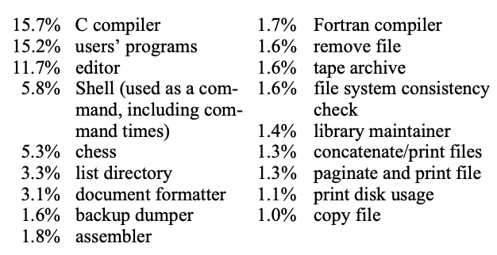
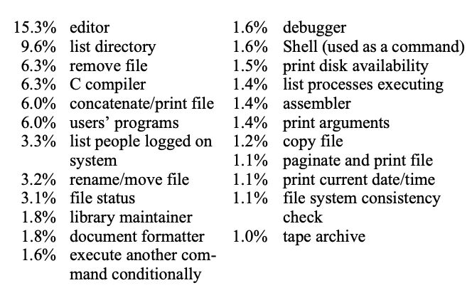

# The UNIX Time-Sharing System
Dennis M. Ritchie and Ken Thompson, Bell Laboratories

> Communications of the ACM (CACM), January 1974

UNIX 是一种通用、多用户、交互式的操作系统，运行在 Digital Equipment Corporation 的 PDP-11/40 和 PDP-11/45 计算机上。它提供了许多即使在更大型操作系统中也不常见的特性，包括：

```
(1) 一个层次化的文件系统，支持可挂载与卸载的存储卷；

(2) 统一且兼容的文件、设备以及进程间的 I/O 接口；

(3) 启动并运行异步进程的能力；

(4) 可按用户选择的系统命令语言；

(5) 超过一百个子系统，其中包含十余种编程语言。
```

本文讨论了 UNIX 文件系统的设计与实现，以及用户命令接口的结构。

关键词：分时系统、操作系统、文件系统、命令语言、PDP-11 CR 分类：4.30，4.32

© 1974 Association for Computing Machinery, Inc. 版权所有。

在非营利目的下，允许全部或部分转载本文材料，但须注明 ACM 的版权声明，并明确引用原出版物、其发行日期，以及转载系经 Association for Computing Machinery 许可这一事实。

本文为在第四届 ACM 操作系统原理研讨会（Fourth ACM Symposium on Operating Systems Principles）上提交论文的修订版本。该会议于 1973 年 10 月 15–17 日在纽约州约克镇高地的 IBM Thomas J. Watson 研究中心举行。作者地址：Bell Laboratories，Murray Hill，NJ 07974。

本文电子版本由加州大学伯克利分校 Eric A. Brewer（brewer@cs.berkeley.edu）重新整理生成。如发现与原文存在任何偏差，请予以告知；原文中存在的错误已按原样保留，未作更正。

## 目录

* [1、Introduction](#1introduction)
* [2. Hardware and Software Environment](#2-hardware-and-software-environment)
* [3. The File System](#3-the-file-system)
  * [3.1 Ordinary Files](#31-ordinary-files)
  * [3.2 Directories](#32-directories)
  * [3.3 Special Files](#33-special-files)
  * [3.4 Removable File Systems](#34-removable-file-systems)
  * [3.5 Protection](#35-protection)
  * [3.6 I/O Calls](#36-io-calls)
    * [3.6.1 Other I/O Calls](#361-other-io-calls)
* [4. Implementation of the File System](#4-implementation-of-the-file-system)
  * [4.1 Efficiency of the File System](#41-efficiency-of-the-file-system)
* [5. Processes and Images](#5-processes-and-images)
  * [5.1 Processes](#51-processes)
  * [5.2 Pipes](#52-pipes)
  * [5.3 Execution of Programs](#53-execution-of-programs)
  * [5.4 Process Synchronization](#54-process-synchronization)
  * [5.5 Termination](#55-termination)
* [6. The Shell](#6-the-shell)
  * [6.1 Standard I/O](#61-standard-io)
  * [6.2 Filters](#62-filters)
  * [6.3 Command Separators: Multitasking](#63-command-separators-multitasking)
  * [6.4 The Shell as a Command: Command files](#64-the-shell-as-a-command-command-files)
  * [6.5 Implementation of the Shell](#65-implementation-of-the-shell)
  * [6.6 Initialization](#66-initialization)
  * [6.7 Other Programs as Shell](#67-other-programs-as-shell)
* [7. Traps](#7-traps)
* [8. Perspective](#8-perspective)
  * [8.1 Influences](#81-influences)
* [9. Statistics](#9-statistics)
  * [9.1 Overall](#91-overall)
  * [9.2 Per day (24-hour day, 7-day week basis)](#92-per-day-24-hour-day-7-day-week-basis)
  * [9.3 Command CPU Usage (cut off at 1%)](#93-command-cpu-usage-cut-off-at-1)
  * [9.4 Command Accesses (cut off at 1%)](#94-command-accesses-cut-off-at-1)
  * [9.5 Reliability](#95-reliability)


## 1、Introduction

UNIX 已经经历了三个版本。最早的版本（约 1969–1970 年）运行于 Digital Equipment Corporation 的 PDP-7 和 PDP-9 计算机上。第二个版本运行于无保护机制的 PDP-11/20 计算机。本文仅描述 PDP-11/40 和 /45 系统 [1]，因为它更为现代，且其与早期 UNIX 系统的诸多差异主要源于对原有功能的重新设计，以纠正功能缺失或不足之处。

自 1971 年 2 月 PDP-11 UNIX 系统投入运行以来，已有约 40 个系统安装投入使用；这些系统通常规模小于本文描述的系统。它们大多用于专利申请及其他文本材料的编制和格式化、Bell 系统中各类交换机的故障数据采集与处理，以及电话服务订单的记录和核查。我们自己的安装主要用于操作系统、编程语言、计算机网络及计算机科学其他领域的研究，同时也用于文档编制工作。

UNIX 也许最重要的成就在于证明了一个用于交互式操作的强大操作系统，并不需要在设备或人力上花费高昂成本：UNIX 可以运行在成本仅为 40,000 美元的硬件上，而核心系统软件的开发所用时间不足两人年。然而，UNIX 仍包含许多即使在更大系统中也很少提供的功能。我们希望 UNIX 的用户能够认识到，该系统最重要的特性在于其简洁性、优雅性以及易用性。

除核心系统外，UNIX 下可用的主要程序包括：汇编器、基于 QED [2] 的文本编辑器、链接装入器、符号调试器、一种类似 BCPL [3] 且支持类型与结构的语言编译器（C）、BASIC 方言解释器、文本排版程序、Fortran 编译器、Snobol 解释器、自顶向下的编译器生成器（TMG）[4]、自底向上的编译器生成器（YACC）、表格信函生成器、宏处理器（M6）[5] 以及置换索引程序。

此外，还有大量的维护、实用、娱乐及实验性程序。所有这些程序均为本地开发。值得注意的是，系统完全自给自足：所有 UNIX 软件均在 UNIX 下维护；同样，UNIX 文档也由 UNIX 编辑器及文本排版程序生成和排版。

## 2. Hardware and Software Environment

我们安装 UNIX 的 PDP-11/45 是一台 16 位字（8 位字节）计算机，配备 144K 字节的核心存储器；UNIX 占用 42K 字节。然而，该系统包含大量设备驱动程序，并为 I/O 缓冲区及系统表分配了充足的空间；一个能够运行上述软件的最小系统，核心存储总共只需约 50K 字节。

> 注：即便在包含多种设备驱动、I/O 缓冲区以及系统表的情况下，系统仍可在约 50K 字节核心存储的最小配置下运行，体现了 UNIX 在资源受限环境中的高效性与紧凑性。

PDP-11 配备了一块 1 MB 的定头磁盘，用于文件系统存储和交换空间，四个活动磁头磁盘驱动器，每个驱动器通过可移动磁盘盒提供 2.5 MB 的存储容量，以及一个使用可移动 40 MB 磁盘包的活动磁头磁盘驱动器。此外，还有高速纸带读写机、九轨磁带和 D 磁带（D 磁带是一种可对单个记录进行寻址和重写的磁带设施）。除控制台打字机外，还连接有 14 个可变速通信接口到 100 系列数据集，以及一个 201 数据集接口，主要用于将打印作业排入共享行式打印机。系统还配备了若干独特设备，包括 Picturephone® 接口、语音响应装置、语音合成器、照排机、数字交换网络，以及一台卫星 PDP-11/20，可在 Tektronix 611 存储管显示器上生成矢量、曲线和字符。

UNIX 软件的大部分使用上述 C 语言 [6] 编写。操作系统的早期版本使用汇编语言实现，但在 1973 年夏季，该系统被改写为 C 语言版本。新系统的规模比旧系统大约增加三分之一。由于新系统不仅更易于理解和修改，而且包括许多功能改进，例如多道程序设计以及能够在多个用户程序间共享可重入代码，因此我们认为这种规模的增加是完全可以接受的。

> 注：采用高级语言重写，显著提升了系统的可理解性与可维护性，同时引入了多道程序设计以及可重入代码共享等关键改进。

## 3. The File System

UNIX 最重要的任务是提供一个文件系统。从用户的角度来看，文件可以分为三类：（1）普通磁盘文件；（2）目录；（3）特殊文件。

### 3.1 Ordinary Files

文件包含用户存放在其中的任意信息，例如符号程序或二进制（目标）程序。系统并不对文件施加特定结构要求。文本文件仅由字符序列组成，行与行之间由换行符分隔。二进制程序则是按照程序开始执行时在内存中出现的字序列。少数用户程序会操作具有特定结构的文件：例如汇编器生成、加载器期望以特定格式存储的目标文件。然而，文件的结构由使用它们的程序控制，而非系统控制。

> 注：文件的结构由使用它们的程序控制，而非系统控制。

### 3.2 Directories

目录提供文件名与文件本身之间的映射，从而在整个文件系统中引入结构。每个用户拥有自己的文件目录；用户也可以创建子目录以便将相关文件分组并统一管理。目录的行为与普通文件完全相同，不同之处在于未经授权的程序无法对其进行写操作，因此系统能够控制目录内容。然而，具有适当权限的用户可以像读取普通文件一样读取目录。

系统为自身使用维护了若干目录。其中之一是根目录。系统中的所有文件均可通过沿着目录链追踪路径直至目标文件来找到。此类搜索的起点通常是根目录。另一个系统目录包含为通用用途提供的所有程序，即所有命令。然而，如后文所述，程序并非必须位于该目录中才能执行。

文件名由不超过 14 个字符的序列构成。当向系统指定文件名时，该文件名可以采用路径名的形式，即由斜杠“/”分隔的目录名序列，最后以文件名结束。如果序列以斜杠开头，则搜索从根目录开始。例如，路径名 /alpha/beta/gamma 指示系统首先在根目录中搜索目录 alpha，然后在 alpha 中搜索 beta，最后在 beta 中找到 gamma。gamma 可以是普通文件、目录或特殊文件。极限情况下，名称 / 指根目录本身。

若路径名不以 / 开头，则搜索从用户当前目录开始。例如，路径名 alpha/beta 指当前目录下子目录 alpha 中的文件 beta。最简单的名称，如 alpha，指当前目录中的文件 alpha。另一极限情况，空文件名指当前目录本身。

同一个非目录文件可以出现在多个目录中，并且可以使用不同的名称。这一特性称为链接；文件的目录项有时被称为链接。UNIX 与允许链接的其他系统不同之处在于，指向同一文件的所有链接地位平等。也就是说，文件并不依附于某一特定目录；文件的目录项仅包含文件名以及指向实际描述该文件信息的指针。因此，文件的存在独立于任何目录项，尽管在实际操作中，当最后一个链接被删除时，文件也随之消失。

> 注: 文件的目录项仅包含文件名以及指向实际描述该文件信息的指针。

每个目录始终至少包含两个条目。目录中的名称指向目录自身，因此程序可以通过名称 “.” 读取当前目录而无需知道其完整路径名。约定上，名称 “..” 指向该目录的父目录，即创建该目录的目录。

> 注：每个目录至少包含 “.”（自身）和 “..”（父目录）两个特殊条目。

目录结构被约束为具有根树的形式。除了特殊条目 “.” 和 “..” 之外，每个目录必须恰好出现在另一个目录中，该目录即为其父目录。这样设计的原因在于简化访问目录子树的程序编写，更重要的是避免目录层次的分离。如果允许对目录进行任意链接，将很难检测从根目录到某一目录的最后连接何时被切断。

### 3.3 Special Files

特殊文件是 UNIX 文件系统中最为独特的特性。UNIX 支持的每个 I/O 设备都至少关联一个此类文件。特殊文件的读写操作与普通磁盘文件相同，但读写请求会触发与之关联的设备。每个特殊文件在目录 /dev 中都有一个条目，但可以像普通文件一样创建链接。例如，要打孔纸带，可以向文件 /dev/ppt 写入数据。每条通信线路、每个磁盘、每个磁带驱动器以及物理主存均对应一个特殊文件。当然，活动磁盘和主存特殊文件受到保护，防止随意访问。

以这种方式处理 I/O 设备有三重优点：第一，文件 I/O 与设备 I/O 尽可能相似；第二，文件名与设备名具有相同的语法和含义，因此程序若期望接收文件名作为参数，也可传入设备名；第三，特殊文件遵循与普通文件相同的保护机制

> 注：体现了 UNIX “一切皆文件”的设计思想，通过将设备抽象为文件，显著降低了 I/O 子系统的复杂性，并增强了程序接口的一致性与可复用性。

### 3.4 Removable File Systems

虽然文件系统的根目录总是存储在同一设备上，但整个文件系统层次结构不必全部位于该设备上。UNIX 提供了一个 mount 系统调用，该调用有两个参数：一个是已有普通文件的名称，另一个是直接访问的特殊文件名，其关联的存储卷（例如磁盘包）应具有独立文件系统的结构，并包含自己的目录层次。mount 的作用是使对先前普通文件的引用改为指向可移动存储卷上的文件系统根目录。实际上，mount 将层次结构树中的一个叶节点（普通文件）替换为整个新的子树（可移动卷上的层次结构）。在 mount 操作之后，可移动卷上的文件与永久文件系统中的文件几乎没有区别。

例如，在我们的安装中，根目录位于固定磁盘上，大容量磁盘驱动器存储用户文件，由系统初始化程序进行挂载；四个较小的磁盘驱动器则供用户挂载其自己的磁盘包。一个可挂载文件系统可通过向其对应的特殊文件写入数据生成。系统提供了一个实用程序用于创建空文件系统，也可以直接复制已有的文件系统。

对于不同设备上的文件统一处理的规则，只有一个例外：不同文件系统层次之间不允许存在链接。施加此限制的原因是避免在可移动卷最终卸载时，需要进行复杂的记录和管理以确保正确移除这些链接。特别地，在所有文件系统的根目录中，无论该文件系统是否可移动，名称 “..” 都指向目录自身，而非其父目录。

### 3.5 Protection

尽管 UNIX 的访问控制方案相当简单，但它具有一些特殊特性。系统为每个用户分配一个唯一的用户标识号（user ID）。当创建文件时，该文件会被标记为其所有者的用户 ID。新文件还具有一组七位保护位，其中六位分别为文件所有者和其他用户独立指定读、写、执行权限。

若第七位被置为开（on），则在文件作为程序执行时，系统会暂时将当前用户的 ID 改为文件创建者的 ID。该用户 ID 的改变仅在执行该程序期间有效。Set-user-ID 功能允许特权程序访问其他用户无法访问的文件。例如，一个程序可能维护一个会计文件，该文件只能被该程序本身读取或修改。如果程序的 set-user-ID 位被置为开，该程序仍可访问该文件，即使调用该程序的用户通过其他程序可能无法访问该文件。由于调用任意程序的实际用户 ID 始终可用，set-user-ID 程序可以采取任何必要措施，以确认调用者的权限。该机制用于允许用户执行经过精心设计的命令，这些命令调用了特权系统入口。例如，有一个系统入口仅可由“超级用户”调用，用于创建空目录。如前所述，目录应包含“.”和“..”两个条目。创建目录的命令归超级用户所有，并设置了 set-user-ID 位。在检查调用者是否有权创建指定目录之后，该命令创建目录并生成“.”和“..”条目。

由于任何用户都可以在其自己的文件上设置 set-user-ID 位，因此该机制通常可在无需管理员干预的情况下使用。例如，该保护方案能够轻松解决文献 [7] 中提出的 MOO 会计问题。

系统将一个特定的用户 ID（即“超级用户”）识别为不受通常文件访问限制约束的用户；因此，例如，程序可以被编写用于转储（dump）和重载文件系统，而不会受到保护机制的不必要干扰。

### 3.6 I/O Calls

系统调用用于执行 I/O 的设计旨在消除各种设备和访问方式之间的差异。系统不区分“随机”与顺序 I/O，也不对逻辑记录大小施加任何限制。普通文件的大小由其上被写入的最高字节决定；文件的大小无需也不可能事先确定。

> 注：在 I/O 系统调用设计上的核心抽象思想，即通过统一接口消除不同设备类型与访问方式之间的差异。

为了说明 UNIX 中 I/O 的基本要点，下文总结了一些基本调用，采用一种匿名语言描述，以展示所需参数，而不涉及机器语言编程的复杂性。每次系统调用都可能返回错误，为简便起见，调用序列中未表示错误返回。

要对已存在的文件进行读或写操作，必须通过如下调用打开该文件：`filep = open(name, flag)`。其中，name 表示文件名，可以使用任意路径名。flag 参数指示文件的访问模式：是只读、只写，还是“更新”模式，即同时进行读写。

返回值 filep 称为文件描述符。它是一个小整数，用于在后续对文件进行 read、write 或其他操作时标识该文件。

要创建新文件或完全重写已有文件，可使用 create 系统调用。若指定文件不存在，则创建该文件；若文件已存在，则将其截断为零长度。create 同样会将新文件打开以供写入，并返回文件描述符，与 open 类似。

文件系统中不存在用户可见的锁机制，也没有限制多个用户同时打开文件进行读写。尽管在两个用户同时写入同一文件时，文件内容可能会混乱，但实际上很少出现问题。我们认为，在我们的环境中，锁既非必要也非充分条件来防止用户间的干扰。它们不必要，因为我们并不面临由独立进程维护的大型单文件数据库；它们也不足够，因为普通意义上的锁——阻止某一用户写入其他用户正在读取的文件——无法防止混乱，例如当两个用户同时使用会创建编辑副本的编辑器编辑同一文件时。

需要说明的是，当两个用户同时进行诸如对同一文件写入、在同一目录创建文件或删除对方已打开文件等不便操作时，系统具有足够的内部互锁机制以保持文件系统的逻辑一致性。

除非另有说明，文件的读写操作是顺序进行的。这意味着，如果某个字节是文件中最后写入（或读取）的字节，则下一次 I/O 调用隐式地指向紧随其后的第一个字节。对于每个已打开的文件，系统维护一个指针，该指针指示下一次要读取或写入的字节位置。如果读取或写入了 n 个字节，指针将向前移动 n 个字节。

一旦文件被打开，可以使用以下系统调用：`n = read(filep, buffer, count) n = write(filep, buffer, count)`。在文件描述符 filep 指定的文件与字节数组 buffer 之间，最多传输 count 个字节。返回值 n 表示实际传输的字节数。在写操作中，n 通常等于 count，除非出现诸如 I/O 错误或特殊文件的物理介质到达末端等异常情况；在读操作中，n 可能小于 count，但不被视为错误。如果读指针接近文件末端，读取 count 个字符会超出文件末端，则只传输至文件末端所需的字节数；此外，类似打字机的设备一次最多返回一行输入。当读调用返回 n 等于零时，表示文件已到末尾。对于磁盘文件，当读指针等于文件当前大小时即为文件末尾。对于打字机设备，可通过使用依赖于设备的转义序列产生文件末尾标志。

写入文件的字节仅影响由写指针位置和 count 所指示的部分；文件的其他部分不会被改变。如果最后一个写入字节超出了文件末端，文件将按需增长。

要进行随机访问（直接访问）I/O，仅需将读指针或写指针移动到文件中的适当位置即可。`location = seek(filep, base, offset)`。与 filep 关联的指针可根据参数 base，被移动到距离文件开头、当前指针位置或文件末尾 offset 字节的位置。offset 可以为负值。对于某些设备（如纸带机和打字机），seek 调用会被忽略。指针实际移动到的、相对于文件开头的偏移量将作为 location 返回。

**3.6.1 Other I/O Calls.** 系统还提供若干与 I/O 及文件系统相关的附加入口，这里不再赘述。例如：关闭文件、获取文件状态、修改文件的保护模式或所有者、创建目录、为已存在文件建立链接、删除文件等。

## 4. Implementation of the File System

如前文 §3.2 所述，目录项仅包含与文件相关的名称以及指向该文件的指针。该指针是一个整数，称为文件的 i-number（索引号）。访问文件时，其 i-number 被用作系统表（i-list）的索引，该表存放在目录所在设备的已知位置。由此找到的表项（文件的 i-node）包含文件的描述信息，如下：

```
1. 文件的所有者。
2. 文件的保护位。
3. 文件内容的物理磁盘或磁带地址。
4. 文件大小。
5. 上次修改时间。
6. 指向该文件的链接数，即其在目录中出现的次数。
7. 一个指示文件是否为目录的位。
8. 一个指示文件是否为特殊文件的位。
9. 一个指示文件是“大型”还是“小型”的位。
```

> 注：i-node 存储文件的核心元信息，分离文件名与存储细节，并结合直接与间接块机制高效管理磁盘空间。

open 或 create 系统调用的目的是将用户提供的路径名转换为 i-number，这一过程通过搜索显式或隐式指定的目录完成。一旦文件被打开，其设备、i-number 以及读/写指针会存储在由系统表管理的条目中，该条目通过 open 或 create 返回的文件描述符进行索引。因此，在随后的 read 或 write 调用中提供的文件描述符能够方便地对应到访问文件所需的信息。

当创建新文件时，系统会为其分配一个 i-node，并在目录中建立一条条目，该条目包含文件名及 i-node 号。为已有文件创建链接涉及建立一个包含新文件名的目录条目，将原文件条目的 i-number 复制过来，并增加该 i-node 的 link-count 字段。删除文件的操作则通过将其目录条目所指 i-node 的 link-count 减一，并擦除该目录条目来完成。如果 link-count 降至 0，则文件占用的磁盘块被释放，i-node 被回收。

包含文件系统的固定或可移动磁盘空间被划分为多个 512 字节的块，逻辑地址从 0 起至设备所能支持的上限。每个文件的 i-node 中有 8 个设备地址的空间。小型（非特殊）文件可容纳在 8 个或更少的块中；此时直接存储块的地址。对于大型（非特殊）文件，每个 8 个设备地址可指向一个间接块，该间接块包含 256 个存储文件数据块的地址。这类文件最大可达 8 × 256 × 512 = 1,048,576（2²⁰）字节。

> 注：通过间接块为可扩展大文件提供了灵活支持。

上述讨论适用于普通文件。当对一个 i-node 指示为特殊的文件发出 I/O 请求时，最后七个设备地址字无关紧要，该列表被解释为一对字节，用于构成内部设备名。该字节分别指定设备类型和子设备号。设备类型确定由哪个系统例程处理该设备的 I/O；子设备号则选择例如附属于特定控制器的某个磁盘驱动器，或若干类似打字机接口中的一个。

在这种环境下，mount 系统调用（见 §3.4）的实现相当直接。mount 维护一张系统表，该表的键为挂载时指定的普通文件的 i-number 与设备名，表值为所指特殊文件的设备名。在执行 open 或 create 时扫描路径名过程中，每遇到一个 (i-number, 设备) 对，系统都会查找该表；若找到匹配项，则将 i-number 替换为 1（所有文件系统中根目录的 i-number），并将设备名替换为表中对应的值。

对于用户而言，文件的读写操作看起来都是同步且无缓冲的。也就是说，read 调用返回后数据立即可用，反之，write 调用返回后用户的工作空间可以被重新使用。实际上，系统维护了一个相当复杂的缓冲机制，从而大幅减少访问文件所需的 I/O 操作次数。假设一次 write 调用仅传输一个字节。UNIX 会首先在缓冲区中查找该字节所属的磁盘块是否已驻留在内存中；若未驻留，则从设备中读取该块。然后，将受影响的字节更新到缓冲区，并在待写块列表中登记该块。此时，write 调用可以返回，尽管实际的 I/O 可能要在稍后完成。相反，如果读取单个字节，系统会判断该字节所在的次级存储块是否已在系统缓冲区中；若在，则可立即返回该字节；否则，先将该块读入缓冲区，再取出所需字节。

> 注：内部通过缓冲机制优化性能，减少 I/O 操作次数。

以 512 字节为单位进行文件读写的程序，相较于一次读写单个字节的程序具有一定优势，但这种提升并不显著；其主要收益在于减少系统开销。对于不频繁使用或 I/O 量不大的程序，按照任意较小的单位进行读写也是完全合理的。

i-list 的概念是 UNIX 的一个特殊特性。在实际应用中，这种文件系统组织方式被证明既可靠又易于操作。对于系统本身而言，其优势在于每个文件都有一个简短且唯一的名称，并且该名称与访问文件所需的保护信息、地址信息及其他信息之间的关系简单明了。i-list 还允许实现一种相当简单而快速的文件系统一致性检查算法，例如验证各设备上存储有用信息的部分与可分配的空闲部分是否互不重叠且合计占满整个设备空间。该算法独立于目录层次结构，因为它只需扫描线性组织的 i-list。同时，i-list 的概念也带来一些其他文件系统组织方式中没有的特性。例如，关于文件占用空间的计费问题：由于文件的所有目录项地位平等，究竟应由谁承担空间使用费便成为一个问题。一般而言，将费用记在文件创建者名下是不公平的，因为可能是另一用户创建了文件的链接，而第一个用户随后删除了该文件。虽然第一个用户仍然是文件的所有者，但费用应记在第二个用户名下。一个相对合理的简化算法是，将费用在所有拥有文件链接的用户间平均分摊。当前版本的 UNIX 通过完全不收取费用来避免该问题。

### 4.1 Efficiency of the File System

为了提供 UNIX 整体效率，尤其是文件系统效率的一个参考指标，对一个 7621 行程序的汇编进行了计时。汇编运行期间，机器未执行其他任务；总时钟时间为 35.9 秒，折合汇编速度为每秒 212 行。时间分配如下：汇编器执行占 63.5%，系统开销占 16.5%，磁盘等待时间占 20.0%。本文不对这些数据进行解释，也不与其他系统进行比较，仅指出我们对系统整体性能总体上感到满意。

## 5. Processes and Images

映像（image）是计算机执行环境的表示。它包括核心映像、通用寄存器的值、打开文件的状态、当前目录等内容。映像代表了一个伪计算机的当前状态。

进程（process）是映像的执行。当处理器为某一进程执行操作时，该进程的映像必须驻留在核心内存中；在执行其他进程期间，映像仍保留在核心内存中，除非一个活动的、高优先级进程出现，从而迫使映像被换出至固定磁盘。

映像的用户核心部分被划分为三个逻辑段。程序文本段（program text segment）从虚拟地址空间的地址 0 开始。在执行期间，该段为只读保护，并且同一程序的所有执行进程共享该段的单一副本。虚拟地址空间中程序文本段上方的第一个 8KB 边界开始，是非共享的可写数据段（data segment），其大小可以通过系统调用扩展。虚拟地址空间最高地址处是栈段（stack segment），随着硬件栈指针的变化，该段自动向下增长。

### 5.1 Processes

除了在 UNIX 引导自身运行的期间，新进程只能通过调用 fork 系统调用而产生：`processid = fork (label)`。当一个进程执行 fork 时，它会分裂为两个独立执行的进程。两个进程拥有原始核心映像的独立副本，并共享任何已打开的文件。新进程之间的唯一区别在于其中一个被视为父进程：在父进程中，控制直接从 fork 返回，而在子进程中，控制转移到位置 label。fork 调用返回的 processid 即为另一个进程的标识。

由于父进程与子进程的返回点不同，每个在 fork 之后存在的映像都可以确定自身是父进程还是子进程。

### 5.2 Pipes

进程可以使用与文件系统 I/O 相同的系统读写调用与相关进程进行通信。调用形式为：`filep = pipe( )`，该调用返回一个文件描述符 filep，并创建一个称为管道（pipe）的进程间通道。该通道与其他打开的文件类似，通过 fork 调用从父进程传递到子进程。使用管道文件描述符进行读取时，调用会阻塞，直到另一个进程使用相同管道的文件描述符进行写入，此时数据在两个进程的映像之间传递。两个进程都无需知道所涉及的是管道而非普通文件。

尽管通过管道进行进程间通信是一种非常有价值的工具（参见 §6.2），但它并不是完全通用的机制，因为管道必须由涉及进程的共同祖先进程建立。

### 5.3 Execution of Programs

另一种主要的系统原语由以下调用触发：`execute(file, arg1, arg2, ..., argn)`，该调用请求系统读取并执行由 file 指定的程序，同时传递字符串参数 arg1, arg2, ..., argn。通常，arg1 应与 file 相同，以便程序能够确定其被调用的名称。在使用 execute 的进程中，所有代码和数据都被该文件替换，但已打开的文件、当前目录以及进程间关系保持不变。仅在调用失败时，例如文件不存在或执行权限位未设置时，execute 原语才会返回；其行为更类似于“跳转”机器指令，而非子程序调用。

### 5.4 Process Synchronization

另一个进程控制系统调用是 `processid = wait( )`，该调用使其调用进程挂起执行，直到其某个子进程完成执行为止。随后，wait 返回已终止进程的进程标识符。如果调用进程没有任何子进程，则返回错误。子进程的某些状态信息也可以通过该调用获得。此外，wait 也可能返回孙子进程或更远后代进程的状态信息；详见 §5.5。

### 5.5 Termination

最后 `exit (status)` 该调用终止一个进程，销毁其映像，关闭其打开的文件，并总体上将其彻底清除。当父进程通过 wait 原语收到通知时，相关状态信息可供父进程使用；如果父进程已经终止，则状态信息可供祖父进程使用，依此类推。进程也可能由于各种非法操作或用户生成的信号而终止（见下文 §7）。

## 6. The Shell

对于大多数用户而言，与 UNIX 的交互是通过一个称为 Shell 的程序进行的。Shell 是一个命令行解释器：它读取用户输入的行，并将其解释为执行其他程序的请求。在最简单的形式下，一条命令行由命令名及其参数组成，各部分以空格分隔：`command arg1 arg2 ⋅ ⋅ ⋅ argn`。Shell 会将命令名与参数拆分为独立的字符串。随后，系统会查找名为 command 的文件；command 可以是包含“/”字符的路径名，以指定系统中的任意文件。如果找到 command 文件，该文件将被载入内存并执行。Shell 收集到的参数对该命令是可访问的。当命令执行完毕后，Shell 恢复自身的执行，并通过显示提示字符表示已准备好接受下一条命令。

如果未能找到 command 文件，Shell 会在 command 前加上字符串 /bin/ 再次尝试查找该文件。目录 /bin 包含所有供一般使用的命令。

### 6.1 Standard I/O

如上文 §3 对 I/O 的讨论所示，每个程序使用的文件通常必须由程序打开或创建，以获取该文件的文件描述符。然而，由 Shell 执行的程序在开始时已有两个打开的文件，其文件描述符分别为 0 和 1。在程序开始执行时，文件 1 处于可写状态，可理解为标准输出文件。除非在下文指出的特殊情况下，该文件对应用户的打字机（终端）。因此，通常希望输出信息或诊断信息的程序使用文件描述符 1。相反，文件 0 初始为可读状态，希望读取用户输入信息的程序通常读取该文件。

Shell 可以改变这些文件描述符的标准分配，将其从用户的打字机、打印机或键盘重定向。如果命令的某个参数前加上“〉”，则在该命令执行期间，文件描述符 1 将指向“〉”后指定的文件。例如：`ls` 通常情况下，ls 命令会在终端上列出当前目录中各文件的名称。命令 `ls 〉there` 会创建一个名为 there 的文件，并将列出的内容写入该文件。因此，参数 "〉there" 的含义是“将输出写入文件 there”。另一方面，`ed` 命令通常会启动文本编辑器，该编辑器通过用户的终端接收命令。命令 `ed〈 script` 将 script 解释为包含编辑器命令的文件；因此 "〈 script" 的含义是“从文件 script 接收输入”。

尽管紧随 "〈" 或 "〉" 的文件名看似是命令的一个参数，但实际上它完全由 Shell 解释，并不会传递给命令。因此，每个命令内部不需要为 I/O 重定向编写特殊处理代码；命令只需在适当的情况下使用标准文件描述符 0 和 1 即可。

### 6.2 Filters

标准 I/O 概念的一个扩展用于将一个命令的输出导向另一个命令的输入。由竖线分隔的一系列命令使得 Shell 同时执行所有命令，并将每个命令的标准输出传递给序列中下一个命令的标准输入。因此，在如下命令行中：`ls | pr –2 | opr`，ls 列出当前目录中文件的名称；其输出被传递给 pr，pr 对输入进行分页处理并加上日期标题。参数 “–2” 表示双栏显示。类似地，pr 的输出被传递给 opr，该命令将其输入排队到文件中以供离线打印。

这一过程本可以通过更笨拙的方式实现：
```
ls 〉temp1
pr –2 〈temp1 〉temp2
opr 〈temp2
```

随后还需要删除临时文件。如果无法进行输入和输出重定向，更笨拙的方法将是要求 ls 命令本身接受用户请求，以分页显示其输出、以多栏格式打印，并安排其输出进行离线处理。实际上，期望像 ls 这样的命令作者提供如此多样化的输出选项既令人惊讶，也因效率原因而不明智。

像 pr 这样的程序，其功能是将标准输入复制到标准输出（同时进行处理），称为过滤器（filter）。我们发现一些有用的过滤器可以实现字符转换、输入排序以及加密和解密操作。

### 6.3 Command Separators: Multitasking

Shell 提供的另一个特性相对直接。命令不必位于不同的行上；相反，它们可以由分号进行分隔。`ls; ed` 该命令将首先列出当前目录的内容，随后进入编辑器。

一个相关的特性更加值得关注。若某条命令后跟符号“&”，Shell 将不会等待该命令执行完成后再给出提示；相反，它会立即准备好接受新的命令。例如 `as source 〉output &` 该命令使源程序 source 被汇编，其诊断输出被送往 output；无论汇编过程耗时多长，Shell 都会立即返回。当 Shell 不等待某个命令完成时，会打印出正在执行该命令的进程标识符。该标识符可用于等待该命令完成，或用于终止该命令。符号“&”可以在同一行中多次使用：`as source 〉output & ls 〉files &` 该命令在后台同时执行汇编和列表生成。在上述使用“&”的示例中，为命令指定了一个不同于打字终端的输出文件；若未进行这样的指定，各个命令的输出将会相互交错、混杂在一起。

Shell 还允许在上述操作中使用圆括号。例如，`(date; ls) 〉x &` 该命令将首先把当前的日期和时间输出到文件 x，随后将当前目录的文件列表追加输出到该文件中。同时，Shell 并不等待这些命令完成，而是立即返回，准备接受下一条用户请求。

### 6.4 The Shell as a Command: Command files

Shell 本身也是一个命令，并且可以被递归地调用。假设文件 tryout 中包含如下几行内容：
```
as source
mv a.out testprog
testprog
```
mv 命令使文件 a.out 被重命名为 testprog。其中，a.out 是汇编程序生成的（二进制）输出文件，已经可以直接执行。因此，如果上述三行命令是在控制台上键入的，那么将依次完成以下操作：对 source 进行汇编，将生成的程序命名为 testprog，并执行 testprog。当这些命令行位于文件 tryout 中时，命令`sh〈 tryout` 将使 Shell sh 顺序执行文件 tryout 中的各条命令。

Shell 还具有进一步的功能，包括能够进行参数替换，以及从目录中指定的文件名子集构造参数列表。它还可以根据字符串比较结果或特定文件的存在情况有条件地执行命令，并且能够在文件化的命令序列中进行控制流转移。

### 6.5 Implementation of the Shell

现在可以理解 Shell 的操作概况。在大部分时间内，Shell 都在等待用户输入命令。当输入行结束的换行字符被键入时，Shell 的 read 调用返回。Shell 对命令行进行分析，将参数组织成适合 execute 调用的形式。然后调用 fork。子进程（其代码仍然是 Shell 的代码）尝试使用适当的参数执行 execute。如果成功，将载入并开始执行所指定名称的程序。与此同时，由 fork 产生的另一个进程，即父进程，等待子进程结束。当子进程结束时，Shell 知道命令已完成，于是显示提示符并读取键盘以获取下一条命令。

在此框架下，实现后台进程非常简单；每当命令行包含 “&” 时，Shell 只需不等待其创建的进程执行命令即可。

令人欣慰的是，所有这些机制与标准输入输出文件的概念非常契合。当一个进程通过 fork 原语被创建时，它不仅继承其父进程的核心映像，还继承父进程当前打开的所有文件，包括文件描述符为 0 和 1 的文件。Shell 自然使用这些文件来读取命令行并输出提示符和诊断信息，而在普通情况下，其子进程——命令程序——会自动继承这些文件。然而，当给出带有 “〈” 或 “〉” 的参数时，子进程在执行 execute 之前，会将标准 I/O 文件描述符 0 或 1 分别指向指定的文件。这很容易实现，因为约定当新文件被打开（或创建）时，会分配最小的未使用文件描述符；只需关闭文件 0（或 1）并打开指定文件即可。由于执行命令程序的进程在完成任务后会自动终止，因此“〈”或“〉”指定的文件与文件描述符 0 或 1 的关联在进程结束时自动解除。因此，Shell 无需知道自身标准输入输出文件的实际名称，因为它永远不需要重新打开这些文件。

过滤器是标准 I/O 重定向的直接扩展，只是使用管道而非文件。

在普通情况下，Shell 的主循环永不终止。（主循环包括 fork 返回中属于父进程的分支，即执行 wait 然后读取下一条命令行的分支。）唯一导致 Shell 终止的情况是其输入文件出现文件结束（end-of-file）条件。因此，当 Shell 作为命令执行并指定输入文件时，例如 `sh〈 comfile` comfile 中的命令将被依次执行，直到达到 comfile 的末尾；随后，由 sh 调用的该 Shell 实例将终止。由于该 Shell 进程是另一 Shell 实例的子进程，后者执行的 wait 将返回，从而可以继续处理下一条命令。

### 6.6 Initialization

用户输入命令的 Shell 实例本身也是另一个进程的子进程。UNIX 初始化的最后一步是创建一个单一进程并通过 execute 调用一个名为 init 的程序。init 的作用是为每个可由用户拨入的打字机通道创建一个进程。各个 init 的子实例会打开相应的打字机以进行输入和输出。由于在调用 init 时没有打开任何文件，因此在每个进程中，打字机键盘将获得文件描述符 0，打印机将获得文件描述符 1。每个进程会输出一条消息，提示用户登录，并在等待用户响应的过程中读取打字机输入。最初，没有用户登录，因此每个进程都会挂起。最终，当有人输入其用户名或其他标识时，相关的 init 实例被唤醒，接收登录行并读取密码文件。如果找到用户名，并且用户能够提供正确的密码，init 会切换到该用户的默认当前目录，将进程的用户 ID 设置为登录用户的 ID，并执行 Shell。此时，Shell 准备好接收命令，登录协议完成。

与此同时，init 的主流程（即所有后续将成为 Shell 的子实例的父进程）执行 wait。如果某个子进程终止，无论是因为 Shell 遇到文件结束还是用户输入了错误的用户名或密码，该 init 主流程都会重新创建该终止进程，该进程依次重新打开相应的输入和输出文件并输出另一条登录消息。因此，用户仅需在 Shell 中输入文件结束序列即可注销。

### 6.7 Other Programs as Shell

如上所述，Shell 的设计旨在允许用户完全访问系统功能，因为它可以在适当的保护模式下调用执行任意程序。然而，有时希望提供不同的系统接口，而这一功能可以很容易地实现。

回想一下，当用户成功登录（提供用户名和密码）后，init 通常会调用 Shell 来解释命令行。用户在密码文件中的条目可以包含登录后要调用的程序名称，而不是 Shell。该程序可以以任意方式解释用户的输入。

例如，对于秘书编辑系统的用户，密码文件中的条目指定在登录后使用编辑器 ed 而非 Shell。因此，当编辑系统的用户登录时，他们直接进入编辑器，能够立即开始工作；同时，可以防止他们调用不适用于其使用的 UNIX 程序。实际上，允许用户临时从编辑器中退出以执行排版程序及其他实用程序被证明是可取的。

UNIX 提供的若干游戏（例如国际象棋、二十一点、三维井字棋）则展示了更加严格的限制环境。对于每个游戏，密码文件中均存在一条条目，指定在登录后调用相应的游戏程序而非 Shell。以游戏玩家身份登录的用户，仅限于该游戏，无法探索 UNIX 系统中其他更为丰富的功能。

## 7. Traps

PDP-11 硬件能够检测多种程序错误，例如对不存在内存的引用、未实现的指令，以及在需要偶数地址处使用奇数地址等情况。这类错误会导致处理器陷入系统例程。当非法操作被捕获时，除非已有其他安排，否则系统会终止该进程，并将用户的镜像写入当前目录下的文件 core 中。调试器可用于确定程序在发生错误时的状态。

对于循环执行、产生不必要输出或用户想要中止的程序，可以使用中断信号将其停止，该信号由输入“delete”字符生成。除非采取了特殊操作，该信号仅使程序停止执行，而不会生成核心镜像文件。

还有一种退出（quit）信号，用于强制生成核心镜像。因此，对于意外循环的程序，可以在不预先安排的情况下中止其执行，并检查核心镜像。

硬件生成的错误以及中断和退出信号可以根据需要被进程忽略或捕获。例如，Shell 会忽略退出信号，以防止用户因退出而注销。编辑器会捕获中断信号并返回到命令级别，这在停止长时间打印而不丢失正在处理的工作时非常有用（编辑器操作的是所编辑文件的副本）。在没有浮点硬件的系统中，未实现的指令会被捕获，浮点指令则由系统进行解释执行。

## 8. Perspective

或许具有某种悖论性，UNIX 的成功在很大程度上归因于它并非为实现任何预定目标而设计。第一版是在其中一位作者（Thompson）对现有计算机设施不满意时编写的，他发现了一台使用率很低的 PDP-7，并着手创建一个更为友好的环境。这种本质上是个人的努力取得了足够的成功，从而引起了另一位作者及其他人的兴趣，并最终促成了 PDP-11/20 的采购，专门用于支持文本编辑与排版系统。随后，PDP-11/20 又被超越，UNIX 已经足够有用，以至于说服管理层投资 PDP-11/45。在整个开发过程中，我们的目标，即使被明确表达，也始终集中于与机器建立舒适的交互关系，以及探索操作系统中的思想和发明。我们不必面对满足他人需求的压力，而正因这种自由，我们心存感激。

回顾 UNIX 的设计，可见三方面因素对其产生了影响。

首先，由于我们本身是程序员，自然而然地将系统设计为便于编写、测试和运行程序。对编程便利性的最重要体现是系统被安排为交互式使用，即便最初的版本仅支持单用户。我们认为，设计得当的交互式系统在生产力和使用体验上远胜于“批处理”系统。此外，这类系统相对容易适应非交互式使用，而反之则不然。

其次，系统及其软件始终面临相当严格的规模约束。在追求合理效率与表达能力的偏好及冲突要求下，规模约束不仅促使了经济性，还促成了设计上的某种优雅。这或许是“苦难带来救赎”理念的一种隐晦体现，但在我们的案例中，这种方法是有效的。

第三，几乎从一开始，系统便能够且确实能够自我维护。这一事实的重要性超过表面所见。如果系统设计者必须使用该系统，他们会迅速意识到其功能性及表面上的不足，并会被强烈驱动在为时未晚之前加以改正。由于所有源程序始终可用且可在线轻松修改，我们能够在新思想被发明、发现或由他人提出时，愿意对系统及其软件进行修订和重写。

本文讨论的 UNIX 特性清楚地体现了至少前两个设计考量。例如，从程序设计角度来看，文件系统接口极为方便。最低级别的接口被设计为消除各种设备与文件之间以及直接访问与顺序访问之间的区别。程序员无需依赖庞大的“访问方法”例程来隔离系统调用；事实上，所有用户程序要么直接调用系统，要么使用一个仅包含数十条指令的小型库程序，该程序将若干字符缓冲后一次性读入或写出。

编程便利性的另一个重要体现是系统中不存在具有复杂结构、由文件系统或其他系统调用部分维护并依赖的“控制块”。一般而言，程序地址空间的内容属于程序本身，我们尽量避免对该地址空间内的数据结构施加限制。

鉴于所有程序应能以任意文件或设备作为输入或输出的要求，从空间效率的角度来看，将设备相关的考虑推入操作系统内部也是可取的。唯一的替代方案似乎是：将处理每个设备的例程加载到所有程序中，这在空间上代价高昂；或者依赖某种机制，在实际需要时动态链接到相应设备的例程，这在开销或硬件上均代价不小。

同样地，进程控制方案和命令接口也被证明既方便又高效。由于 Shell 作为一个普通的、可换出的用户程序运行，它不会占用系统本身的固定空间，而且可以以极低的代价实现所需的功能。特别是，考虑到 Shell 作为一个生成其他进程以执行命令的进程的运行框架，I/O 重定向、后台进程、命令文件以及用户可选系统接口等概念的实现基本上变得非常简单。

### 8.1 Influences

UNIX 的成功并不在于全新的发明，而在于充分利用了一组经过精心选择的富有成效的思想，尤其在于证明这些思想可以成为实现一个小而强大的操作系统的关键。

我们实现的 fork 操作在本质上已存在于伯克利分时系统[8]中。在若干方面，我们受到了 Multics 的影响，Multics 提出了 I/O 系统调用的具体形式[9]，以及 Shell 的名称和基本功能。Shell 为每条命令创建一个进程的概念也源于 Multics 的早期设计，尽管在该系统中后来出于效率考虑被放弃。TENEX 系统[10]也采用了类似的方案。

## 9. Statistics

下面给出了 UNIX 的一些统计数据，以展示系统的规模以及如此规模的系统是如何被使用的。那些不参与文档编写的用户倾向于将系统用于程序开发，尤其是语言相关的工作。重要的“应用程序”较少。

### 9.1 Overall

```
72 user population
14 maximum simultaneous users
300 directories
4400 files
34000 512-byte secondary storage blocks used
```

### 9.2 Per day (24-hour day, 7-day week basis)

系统中存在一个以最低优先级运行的“后台”进程，用于利用所有空闲的 CPU 时间。该进程曾被用于生成常数 `e−2` 的百万位近似值，目前正在生成复合伪素数（以 2 为底）。

```
1800 commands
4.3 CPU hours (aside from background)
70 connect hours
30 different users
75 logins
```

### 9.3 Command CPU Usage (cut off at 1%)

<div align=center></div>

### 9.4 Command Accesses (cut off at 1%)

<div align=center></div>


### 9.5 Reliability

我们关于可靠性的统计数据相比其他数据更加主观。以下结果根据我们集体的回忆尽量准确。统计时间跨度超过一年，使用的是非常早期的 11/45 型号。

曾发生过一次文件系统丢失（五块磁盘中的一块），原因是软件无法应对硬件问题导致的反复掉电陷阱。该磁盘上的文件曾在三天前备份。

“崩溃”指的是非计划的系统重启或停止。大约每两天会发生一次崩溃；其中约三分之二由硬件相关问题引起，如电源波动或处理器不可解释地跳转到随机位置。其余为软件故障。最长的不间断运行时间约为两周。服务调用平均每三周一次，但分布极不均匀。系统总运行时间约占我们全年 24 小时、365 天计划的 98%。

致谢：我们感谢 R.H. Canaday、L.L. Cherry 和 L.E. McMahon 对 UNIX 的贡献。我们尤其感谢 R. Morris、M.D. McIlroy 和 J.F. Ossanna 的创造性、深思熟虑的批评以及持续支持。

***

> 总结：

> 研究的背景是 1970 年代早期主流计算系统都是批处理系统占据主导地位（用户提交作业后需长时间等待，交互性差），分时系统（time-sharing systems）尚不成熟。论文的核心思想是设计通用、多用户、交互式、简洁而高效的操作系统，可以运行在小型计算机上，并且具有良好的可扩展性。

> UNIX 的设计目标并非“功能最全”，而是支持多用户并发交互；提供一致、简洁的接口；便于程序开发与系统演化。

> 1、文件系统设计：文件分为三种类型，普通文件、目录、特殊文件，三者在接口层面高度一致。
> 抽象了 I/O 调用接口，消除不同设备类型与访问方式之间的差异（open、read、write）；另外通过 inode 分离文件名与存储细节（目录项存储文件名与 inode 号），结合直接与间接块机制高效管理磁盘空间；通过缓冲机制优化性能，减少 I/O 操作次数。

> 2、进程与调度: 进程是正在执行的程序实例，每个进程具有独立地址空间、寄存器上下文、打开文件表。
> UNIX 设计 fork() 复制当前进程，exec() 在当前进程中加载新程序，wait() 等待子进程结束，exit() 终止当前进程。

> 3、Shell: 提供命令行界面，支持管道、重定向、后台执行等特性。

> 4、Pipes：一个进程的输出作为另一个进程的输入，实现进程间通信。
